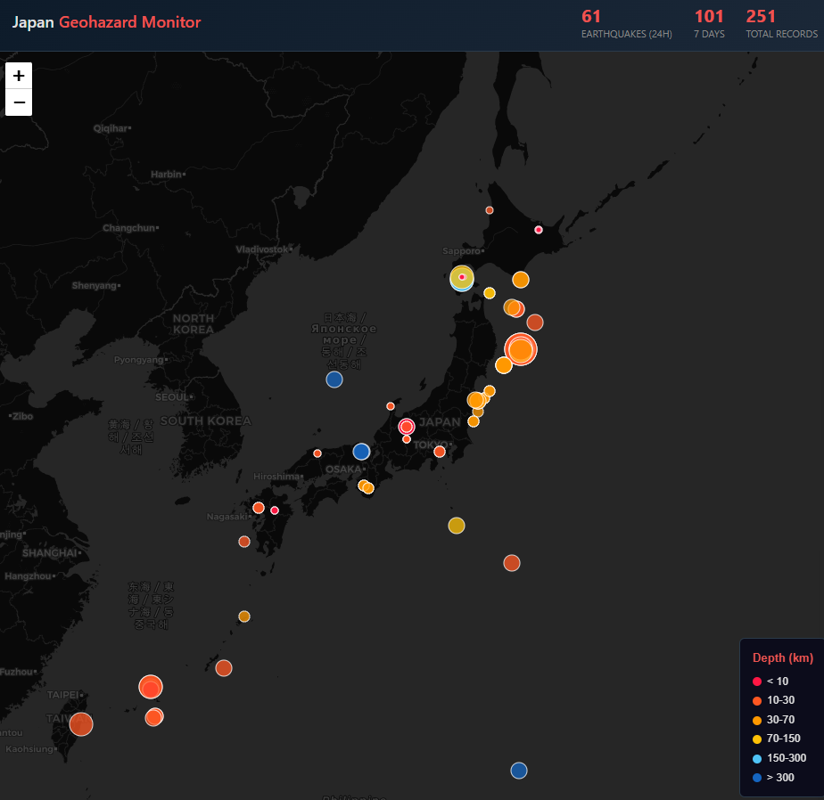

# Japan Geohazard Monitor



Real-time monitoring dashboard for Japan's geophysical activity — earthquakes, volcanoes, atmospheric conditions, geomagnetism, ocean temperature, ionosphere, and crustal deformation — all overlaid on a single dark-themed interactive map with a correlation analysis panel.

9 async collectors run continuously on a Raspberry Pi 5, pulling data from 10 public APIs and storing it in SQLite. A FastAPI server renders a Leaflet.js dashboard with togglable layers and a time-synchronized correlation panel for cross-domain anomaly detection. Mobile responsive.

## Live

Raspberry Pi 5 + Docker（Tailscaleネットワーク内）

## Architecture

```
9 async collectors (independent intervals per source)
    → BaseCollector (retry, batch insert, health tracking)
    → SQLite (WAL mode, auto-purge @ 90 days)
    → FastAPI REST API (per-layer + correlation endpoints)
    → Leaflet.js dark-themed map (togglable layers, mobile responsive)
    → Chart.js correlation panel (5 time-aligned charts)
```

**Stack**: Python 3.12 / asyncio + aiohttp + asyncssh / aiosqlite / FastAPI + Uvicorn / scikit-learn + scipy / Leaflet.js + Chart.js / Docker

## Data Sources (10 APIs, 9 collectors)

| Collector | Source | Data | Interval | Records |
|---|---|---|---|---|
| `usgs` | USGS GeoJSON | Earthquakes (global → Japan filter) | 5 min | — |
| `p2p` | P2P地震情報 API | Earthquakes (JMA intensity) | 2 min | — |
| `jma` | 気象庁 Bosai | Earthquakes (COD format) | 3 min | — |
| `amedas` | 気象庁 AMeDAS | Temp / Pressure / Wind / Precip (1,286 stations) | 10 min | ~1,286/fetch |
| `geomag` | NOAA SWPC | GOES magnetometer + Kp index | 15 min | ~1,400/fetch |
| `volcano` | 気象庁 Bosai | 117 active volcanoes + alert levels (1-5) | 15 min | 117/fetch |
| `sst` | NOAA ERDDAP | Sea surface temperature (MUR 0.5° grid) | 6 hours | ~1,725/fetch |
| `tec` | CODE (Bern) IONEX | Ionosphere Total Electron Content (2.5° × 5° grid) | 2 hours | ~1,350/fetch |
| `geonet` | GSI SFTP (terras) | Crustal deformation F5 daily (218 sampled stations) | 24 hours | ~1,500/fetch |

## Map Layers

| Layer | Toggle | Visualization | Color Scheme |
|---|---|---|---|
| Earthquakes | ✅ default on | CircleMarker (mag ∝ radius) | Depth: red (shallow) → blue (deep) |
| Volcanoes | toggle | Triangle markers (SVG) | Alert level: gray=1, yellow=2, orange=3, red=4, purple=5 |
| Sea Surface Temp | toggle | Rectangle grid overlay (0.5°) | Blue (cold) → green → yellow → red (warm) |
| Ionosphere TEC | toggle | Rectangle grid overlay (2.5° × 5°) | Green (low) → yellow → red → purple (high TECU) |
| GEONET | toggle | CircleMarker (displacement ∝ radius) | Green < 5mm, yellow < 15mm, orange < 30mm, red ≥ 30mm |
| AMeDAS | toggle | CircleMarker per station | Metric-dependent colormap (4 selectable metrics) |
| Kp Index | always | Header badge | Green < 4, Orange 4-6, Red > 6 |

## Correlation Panel

Right-side collapsible panel (bottom sheet on mobile) with 5 time-synchronized Chart.js charts for cross-domain anomaly detection:

| Chart | Data | Resolution |
|---|---|---|
| Earthquake count | Hourly bar chart | 1 hour |
| Kp index | Line chart | 3 hours |
| GOES magnetic field | Hourly mean total field (nT) | 1 hour |
| Ionosphere TEC | Mean TEC over Japan (TECU) | Per IONEX epoch |
| Atmospheric pressure | Mean AMeDAS pressure (hPa) | 1 hour |

Supports 3/7/14/30-day windows. Auto-refreshes every 5 minutes when open.

**Use case**: Visual detection of precursor patterns — e.g., ionosphere TEC anomaly → geomagnetic disturbance → pressure change → earthquake sequence.

## API Endpoints

| Endpoint | Description |
|---|---|
| `GET /` | Interactive map dashboard |
| `GET /api/earthquakes?hours=N` | Earthquake list (default 24h) |
| `GET /api/volcanoes` | All volcanoes with current alert levels |
| `GET /api/sst` | Latest SST grid |
| `GET /api/tec?hours=N` | Latest ionosphere TEC grid (default 24h) |
| `GET /api/geonet` | Latest GEONET displacement per station |
| `GET /api/amedas?metric=temperature` | Latest AMeDAS snapshot (pressure/temperature/wind/precipitation) |
| `GET /api/geomag/goes?hours=24` | GOES magnetometer time series |
| `GET /api/geomag/kp?days=7` | Kp index time series |
| `GET /api/correlation?days=7` | Time-aligned multi-domain data for correlation panel |
| `GET /api/stats` | Collector health, counts, latest Kp, volcano alerts |

## Database

SQLite with WAL mode. 10 tables:

- `earthquakes` — dedup by (source, event_id)
- `amedas` — dedup by (station_id, observed_at)
- `geomag_goes` — dedup by (time_tag, satellite)
- `geomag_kp` — dedup by time_tag
- `volcanoes` — upsert by volcano_code (one row per volcano)
- `sst` — dedup by (lat, lon, observed_at)
- `tec` — dedup by (lat, lon, epoch)
- `geonet` — dedup by (station_id, observed_at)
- `focal_mechanisms` — GCMT strike/dip/rake, dedup by (source, event_id)
- `gnss_tec` — high-res 0.25° TEC from Nagoya Univ., dedup by (lat, lon, epoch, source)
- `modis_lst` — MODIS Land Surface Temperature (Kelvin), dedup by (lat, lon, observed_date)
- `ulf_magnetic` — 1-minute geomagnetic H/D/Z/F (nT) from KAK/MMB/KNY, dedup by (station, observed_at)

Auto-purge: records older than 90 days deleted on each collector cycle (real-time tables only; analysis tables retained).

## Deployment

Runs on Raspberry Pi 5 via Docker. GEONET SFTP credentials stored in `.env`:

```bash
# .env (on RPi5, not committed)
GSI_SFTP_PASSWORD=xxxxx

# Deploy
ssh yasu@<RPi5-tailscale-ip> "cd ~/japan-geohazard-monitor && sudo git pull && sudo docker-compose up -d --build"
```

## Phased Development

- **Phase 1** ✅ Earthquakes (3 sources: USGS, P2P, JMA)
- **Phase 2** ✅ Atmospheric (AMeDAS 1,286 stations) + Geomagnetic (NOAA SWPC GOES + Kp)
- **Phase 3** ✅ Volcanoes (JMA 117 active) + Ocean (NOAA ERDDAP MUR SST)
- **Phase 4** ✅ Ionosphere TEC (CODE Bern predicted IONEX) + GEONET crustal deformation (GSI SFTP, 218 stations)
- **Correlation** ✅ Time-synchronized 5-chart panel (earthquake/Kp/GOES/TEC/pressure)
- **Analysis Phase 1** ✅ b-value, TEC, Kp, multi-indicator grid search → all negative (aftershock/sampling artifacts)
- **Analysis Phase 2** ✅ Coulomb stress (lift 37.5 isolated), rate anomaly (lift 1.86), clustering (lift 4.12) — all survived aftershock isolation + prospective test (combined lift 20.66)
- **Analysis Phase 3a** ✅ LURR (❌), Natural Time (❌), Nowcasting (⚠️ lift 1.31) — catalog-based methods exhausted
- **Analysis Phase 3b** ✅ MODIS LST (❌), ULF magnetic (⚠️ data limited to 80 days), GNSS-TEC 0.5° (31K records)
- **Analysis Phase 4** ✅ **Prospective (forward-looking) prediction**: ETAS residual (gain 4.0x), foreshock (5.1x), cumulative CFS (2.4x), combined alarm (**7.8x, 62.5% precision**). Pattern Informatics (Molchan AUC 0.349)
- **Analysis Phase 5** ✅ ML integration: AdaBoost ensemble (11 features, pure Python) — AUC 0.73
- **Analysis Phase 6** ✅ ML overhaul: HistGradientBoosting (35 temporal features), walk-forward CV (0.740 ± 0.016), ETAS MLE per zone, rate-and-state CFS, isotonic calibration — **AUC 0.746**
- **Analysis Phase 7** ✅ Spatial correlation + GNSS + zone ETAS: 47 features (+6 GNSS crustal deformation, +6 enhanced spatial), zone-specific ETAS in feature extraction, 2-pass Gaussian spatial smoothing — **AUC 0.749 (CV 0.741)**
- **Analysis Phase 8** ✅ Structural overhaul: multi-target (M5+/M5.5+/M6+), CSEP benchmark (4 reference models + N/L/T-test), ensemble stacking (8-input physics×ML meta-learner), ConvLSTM spatiotemporal neural network (Colab GPU)
- **Analysis Phase 9.0** ✅ Non-traditional precursor data sources: cosmic ray neutron monitors (NMDB ✅), animal behavior GPS (Movebank ❌ no Japan data), lightning (Blitzortung ❌ archive restricted), hourly geomagnetic (INTERMAGNET ❌ API param bugs), satellite EM (CSES ❌ auth required) — CV AUC **0.728** (regression from 0.741 due to zero-filled features acting as noise)
- **Analysis Phase 9.1** ✅ 4-bug fix + metadata NameError fix: INTERMAGNET API params → **36,000 records, 1,500 days** geomag data successfully fetched. Dynamic feature selection → 53/56 active features. **CV AUC 0.7316, Test AUC 0.7452**. Blitzortung/Sferics Bonn: server down (ECONNREFUSED), lightning data unavailable
- **Analysis Phase 10/10b** ✅ 11 unconventional data sources: OLR, Earth rotation, solar wind, GRACE gravity, SO2, soil moisture, tide gauge, ocean color, cloud fraction, nightlight, InSAR — 56 → 70 features. **CV AUC 0.7249** (regression: 12/70 features active, Solar Wind only new source, Earthdata auth broken, OLR/IERS/tide URLs dead)
- **Analysis Phase 11** ✅ 4 space/cosmic data sources: GOES X-ray flux (solar flares), GOES proton flux (SEP events), tidal stress (lunar+solar, pure calculation), particle precipitation (Van Allen belt). 70 → 75 features
- **Analysis Phase 12** ✅ Data acquisition infrastructure overhaul + ML feature stability selection + FeatureExtractor performance optimization. OLR→PSL THREDDS, IERS→OBSPM, tide→UHSLC Fast Delivery, Earthdata→OAuth2 redirect handler. ML: 3-fold stability pre-filter removes noisy features before CV. **Data acquisition all confirmed working** (OLR/IERS/tide/GOES/GRACE/SO2 ✅). Phase 12b: bisect-based window queries, zone stats caching, deque histories — extract() 20h→12min. deque slice bug fixed in Phase 13
- **Analysis Phase 13** ✅ Seafloor/ocean bottom data sources: NOAA DART bottom pressure (5 stations near Japan, 3 returned data, no auth), IOC sea level monitoring (❌ API crash on None station codes), NIED S-net seafloor pressure (❌ NIED credentials pending). 75 → 79 features (64 active after stability selection). DATA_LICENSES.md added (all 19 source policies documented). **CV AUC 0.7416 (best ever), Test AUC 0.7481**
- **Analysis Phase 14** ✅ Four-axis improvement: (1) IOC fetch crash fix (None-safe parsing + dict/list response support), (2) INTERMAGNET backfill 4x acceleration (500→2000 days/station/run), (3) Diverse stacking level-0 models (RandomForest + LogisticRegression alongside HistGBT → 14-feature meta-learner), (4) ConvLSTM full-feature export (feature_matrix.json now includes all Phase 9+ data, not zero-filled). **CV AUC 0.7415, Test AUC 0.7485. Stacking logistic=0.7484 (≒base), isotonic=0.7213 (degraded). 65 active features**
- **Analysis Phase 14b** ✅ Data acquisition overhaul: **57→71+ active features**. 11 broken sources fixed + 2 new (ISS LIS lightning, VNP46A4 nightlight) + animal removed (79→78). 8 sources switched to auth-free alternatives. All endpoints verified with curl before commit. OLR→NCEI CDR, GRACE→GFZ GravIS, Ocean Color→CoastWatch DINEOF, Soil Moisture→CPC ERDDAP, Tide Gauge→UHSLC ERDDAP (19 stations), GOES X-ray→LISIRD 1-min, InSAR→LiCSAR 34 frames, Lightning→ISS LIS (GHRC DAAC), Nightlight→VNP46A4 (LAADS), Earthdata auth→BasicAuth
- **Backfill** ✅ 2011-2026 M3+ earthquakes (29K), TEC (4M), Kp (44K), GCMT focal mechanisms
- **Analysis Phase 15** ✅ Full test with all Phase 14b source fixes + data preservation checkpoint system. **70/78 active features (+5 from Phase 14). Test AUC 0.7499 (best ever), CV AUC 0.7411.** Data validation: 21 OK / 8 EMPTY / 1 MISSING. Earthdata auth (4 sources) failed due to URS API deprecating Basic Auth — fixed in Phase 15b. Feature matrix exported (1790×11×11×78). Job timed out at 6h (CSEP completed, final artifact upload missed). DB checkpoint preserved
- **Analysis Phase 15b** ✅ Earthdata auth rewrite (Bearer token priority + Basic Auth fallback), ISS LIS table separation (`iss_lis_lightning`), workflow reliability (timeout 420min, ML results checkpoint artifact, auth pre-validation step). **Test AUC 0.7499 (same as 15), 72/78 active features. Feature matrix export failed (int64 serialization) → fixed in 15c**
- **Analysis Phase 15c** ⚠️ Partial success (Run 23366201702, cancelled at ML step after 6h):
  - cloud_fraction ✅ 120,727 rows (2011-01 → 2011-10, coverage 4.9%)
  - ISS LIS ✅ 537 rows (2017-03 → 2017-07, coverage 5.5%)
  - tide_gauge ❌ UHSLC ERDDAP ConnectionTimeout (CI→Hawaii latency)
  - nightlight ❌ LAADS EULA redirect → HTML downloaded instead of HDF5
  - SO2 ❌ GES DISC Bearer 401, BasicAuth fallback failed (session cookie contamination)
  - Data validation: 23 OK / 6 EMPTY / 1 MISSING (improved from 8 EMPTY)
  - Feature matrix export fixed (int64 serialization + samples reuse 14h→sec)
  - DB checkpoint (230MB) preserved
- **Analysis Phase 15d** ✅ EMPTY source fixes (Run 23373703010): tide_gauge ✅ 2.4M rows (UHSLC CSV fallback), cloud_fraction ✅ 132K, ocean_color ✅ 17K. Electron flux ❌ hung 2h (NCEI data ended 2020), SO2 ❌ 0 rows (Earthdata credentials invalid), VIIRS ❌ 0 rows (h5py scalar bug). Cancelled at electron flux step
- **Analysis Phase 15f** 🔄 Electron flux complete rewrite + VIIRS fix + DB checkpoint restore (Run 23382779214, 2026-03-21):
  - **DB checkpoint restore at workflow start**: previous run's DB downloaded before fetch → all skip-logic effective (incremental fetch)
  - **Electron flux**: NCEI GOES-R SEISS L2 netCDF added (GOES-16 science + GOES-18 science/ops auto-fallback). Tested: 2024=366d, 2025=342d/12mo, 2026=79d/3mo — **zero gap from 2017 to present**. NCEI CSV retained for 2011-2016. Year-parallel fetch (semaphore 2), month-internal day-parallel (semaphore 5)
  - **VIIRS nightlight**: h5py attribute numpy scalar conversion fix (`np.asarray().flat[0]`)
  - **Electron flux timeout**: 10→30min
  - **CI deps**: netCDF4 + numpy added
  - SO2 still blocked (Earthdata username/password Secret needs manual update)
- **Analysis Phase 15g** ✅ Electron flux major expansion: NCEI netCDF 286,878 new daily records (2017-2026). **Test AUC 0.7540 (best ever), CV AUC 0.7415, 75 active features**
- **Analysis Phase 15h/15i** ✅ SO2 continuous fetch (408K rows) + coordinate snap fix. Non-zero rates improved (SO2 2.0%) but AUC unchanged (Test 0.7485). Root cause: spatial feature non-zero rates still low (cloud 8.2%, SO2 2.0%, soil 1.1%)
- **Analysis Phase 16** ⚠️ Continuous spatial data fetch (SO2/cloud/ocean_color). Timed out at 6h — fetch completed (SO2 2.3M, cloud 547K, ocean 89K) but ML not reached. DB checkpoint (610MB) preserved
- **Analysis Phase 18** ✅ S-net seafloor waveform features: NIED Hi-net approved, 0120A acceleration (150 stations, 100Hz). 7 features (RMS/H-V ratio/band power/spectral slope anomalies + spatial gradient + segment max). **75 → 84 features**. Test confirmed: 150/150 stations, 447/450 SAC files parsed
- **Analysis Phase 19** 🔄 S-net multi-sensor expansion: 0120 (broadband velocity) + 0120C (high-gain acceleration) added alongside 0120A. **VLF spectral analysis with 200s FFT windows** (0.005 Hz resolution) for tremor/SSE detection in 0.01-0.1 Hz band. 8 new features: VLF power/H-V anomalies, velocity RMS, VLF/HF ratio, accel-velocity coherence, VLF spatial gradient, high-gain SNR, velocity spectral slope. Multi-code quota management (190 request cap). DB schema: sensor_type column + VLF columns with migration. **84 → 92 features (185 total incl. dynamic selection)**. Workflow fix: S-net moved to early pipeline position (was unreachable due to 6h timeout), incremental DB save per item (prevents data loss on timeout), SMAP disabled (ERDDAP IP blacklist). Smoke test validated: 149 stations × 4 segments, 596 records committed
- **Analysis Phase 20** ✅ Lightning climatology feature integration: NASA LIS/OTD (1995-2014, 20,808 cell-months) + WWLLN Thunder Hour (2013-2025, 31,824 cell-months). 6 new features: flash_rate/thunder_hours with per-cell×calendar-month z-score and ratio baselines. Cross-validation on 2013-2014 overlap: Pearson r=0.39 (winter r=0.53-0.66, summer r≈0). Two independent optional groups — model learns relative weighting. **92 → 98 features**. OLR fetcher migrated from deprecated NCEI v01r02 to S3 archive v02r00 (+134K rows, →2026-04-14). GOES X-ray SWPC time_tag fix (+8 days, →2026-04-17). Salvage SKIP_TABLES cleared for so2_column/cloud_fraction checkpoint accumulation
- **CI/CD** ✅ GitHub Actions weekly analysis workflow (fetch → analyze → artifact, 400min timeout). **Step ordering optimized**: S-net (highest priority) runs immediately after core earthquake data; slow Earthdata fetchers follow. SMAP permanently disabled (ERDDAP IP blacklist). S-net uses `SNET_MAX_REQUESTS` env var for smoke testing (test-snet.yml runs production script with 5-request cap). **Data preservation**: DB checkpoint after fetch phase + ML results checkpoint (feature_matrix + predictions) + final DB upload. S-net waveform fetch uses incremental sqlite3 commits per item (survives timeout kills). Earthdata auth pre-validation skips 4 sources on credential failure. Data validation report (30 tables checked — collector_status excluded as legacy) saved to artifacts. **DB corruption prevention**: All 100 DB connections use `safe_connect()` with `PRAGMA synchronous=FULL` + `busy_timeout=10000` (centralized in `scripts/db_connect.py`). 28-item preflight test suite (`scripts/test_db_checkpoint.py`) runs before every fetch. 4-step verified WAL flush before artifact upload (checkpoint + integrity + WAL size + page count) — **upload blocked when verification fails** (`flush_ok` output guard). Restore step properly deletes corrupted checkpoints (`set +e` fix for `bash -e` shell). Dedicated test workflow (`test-db-integrity.yml`) validates corruption detection and cleanup
- **Data Completeness Initiative** 🔄 (started 2026-04-11) — Target 100% coverage across all 30 validated tables from 2011-01-01 to 2026-04-17. Full Step history in the [Data Completeness Initiative](#data-completeness-initiative) section below.
- **Mobile** ✅ Responsive design (bottom sheet panel, touch-optimized controls)

## Data Completeness Initiative

Started 2026-04-11. Target: **100% coverage across all 30 validated tables from 2011-01-01 to 2026-04-17** — no shortcuts, no "good-enough" exclusions. Phase 0 audit classified every fetcher into four failure modes: (1) wiring gaps (`snet_pressure` never invoked, `soil_moisture` commented out), (2) sparse ±M6+ strategy misuse (`lightning`, `ulf_magnetic`, `gnss_tec`, `modis_lst`, `tec` fetch only around major events instead of continuously), (3) continuous-strategy silent stops (`so2_column` at 2014-03, `cloud_fraction` at 2012-01, `geomag_hourly` at 2013-09), (4) physical constraints requiring alternative sources (`satellite_em`→Swarm for 2011-2017, `iss_lis_lightning`→WWLLN for 2011-2017, `snet_waveform`→F-net/Hi-net/DONET for 2011-2016).

### Phase 1 Step 1 ✅

`fetch_snet_pressure.py` rewritten for continuous backfill.

### Phase 1 Step 2/2b ✅

All 3 "stopped" fetchers functional; dedicated `backfill.yml` runs ALL 28+ fetchers every 3 hours (8 cron, 24/7).

### Phase 1 Step 3 ✅

`tec`/`ulf_magnetic`/`gnss_tec` rewritten from sparse ±M6+ to continuous full-range.

### Phase 1 Step 4 ✅ (2026-04-17)

Lightning overhaul — WWLLN (2013-2025) + LIS/OTD (1995-2014). OLR→S3 v02r00. GOES X-ray SWPC time_tag fix.

### Phase 1 Step 4b ✅ (2026-04-17)

Data quality audit resolution — **8/10 contaminated features fixed**. cloud_fraction exception handler order bug (OperationalError subclass of DatabaseError). SO2/cloud timeout 40→90min. soil_moisture fetch step added to backfill.yml (CPC monthly: 15,441 rows verified). solar_wind/goes_proton future-date filter already in place. goes_xray LISIRD .jsond migration + SWPC ISO 8601. Lightning daily: WONTFIX (no free source; Phase 20 monthly sufficient). satellite_em: feature pipeline not wired (low priority).

### Phase 1 Step 4c ✅ (2026-04-18)

Checkpoint overwrite bug — targeted dispatch runs (e.g. `target=cloud_fraction`) uploaded partial-DB checkpoints that overwrote full checkpoints from scheduled runs, resetting SO2/cloud_fraction progress to 0 rows every cycle. Fix: skip checkpoint upload for targeted dispatches. Verified: SO2 4.5M rows (→2016-05, past 2015 threshold), cloud_fraction 523K rows (→2013-02), OLR 3.4M rows (→2026-04-14 preliminary tracking OK).

### Phase 1 Step 4d ✅ (2026-04-18)

BQ overwrite hole closed. Step 4c only guarded checkpoint upload; the Upload-to-BigQuery step still ran for targeted dispatches and `load_raw_to_bq.py` (WRITE_TRUNCATE on all 31 tables) overwrote BQ with whatever the restored checkpoint contained. Real damage: `lightning_thunder_hour` regressed 31,824→24,480 rows (2013-2025→2013-2022) on 2026-04-17 after parallel `target=soil_moisture` + `target=cloud_fraction` dispatches. Fix in 71f1b2e mirrors the Step 4c if-guard onto Upload-to-BigQuery.

### Phase 1 Step 4e ✅ (2026-04-18)

5h hard-limit kill-chain. Three consecutive scheduled runs (16:03/19:02/21:34 UTC) cancelled at exactly 5h with MODIS LST + SO2 + cloud_fraction in series eating the entire window — Snapshot succeeded but Upload-checkpoint and Upload-to-BigQuery never ran, so cloud/SO2 were progressing at ~1/10 the expected pace. Restructured `backfill.yml` from a single 1024-line job into three parallel jobs: `heavy` (290m, 5 fetchers: MODIS LST/SO2/cloud/snet_waveform/snet_pressure), `light` (200m, 26 fetchers), and `merge` (60m, `needs:[heavy,light]`, `if:always()`) which downloads both DB artifacts and runs the new `scripts/merge_checkpoints.py` (per-table ATTACH+INSERT with `--require-base` fail-closed and explicit BEGIN/COMMIT/ROLLBACK; 7 smoke tests passing). Light is base, heavy overlays its 5 owned tables via DELETE-then-INSERT to discard stale restored rows. Merge job retains the Step 4c+4d target-guards for checkpoint and BQ upload.

### Phase 1 Step 4f ✅ (2026-04-18)

heavy timeout + Upload-artifact guard. Step 4e's 290m heavy timeout proved too short — observed run (24595180615) measured MODIS LST 1h13m + SO2 1h22m + cloud >1h13m (cancelled mid-fetch by 290m job timeout) and `Upload heavy.db artifact` was skipped (plain `if:` evaluates false on job cancel), so merge fell into base-only path and BQ heavy-owned tables were WRITE_TRUNCATE'd back to the restored checkpoint state. Fix in 9bd6315 raises heavy timeout 290→350m (under GitHub's 360m hard limit) and adds `if: always() && steps.snapshot.outcome == 'success'` to both `Upload {heavy,light}.db artifact` steps so the artifact survives a job-level cancel. Real damage from this incident was limited — `MIN_ROWS_TO_UPLOAD=1000` in `load_raw_to_bq.py` saved so2_column (4.5M)/cloud_fraction (523K)/snet_pressure/modis_lst from rollback because their restored counts were 0 or <1000; only snet_waveform (36,313 rows) was overwritten. lightning_thunder_hour recovered to 31,824 rows automatically.

### Phase 1 Step 4g ✅ (2026-04-18)

5h hard-limit recurred. Heavy was running MODIS LST + SO2 + cloud_fraction + S-net waveform + S-net pressure serially for 4h52m; raising timeout to 350m could not absorb it, so scheduled runs kept getting cancelled. Commit 6e226b9 splits heavy into **5 parallel fetch jobs (fetch-modis/fetch-so2/fetch-cloud/fetch-snet/light)**, each emitting its own artifact, with merge aggregating them via N-way overlay. `scripts/merge_checkpoints.py` extended for N-way support (`--overlay PATH:TABLES` repeatable, `--require-base` fail-closed, Windows `C:\` path handling via `rpartition(":")`); 10 smoke tests all PASS. Verified with a real `target=all` run completing in 2h08m28s.

### Phase 1 Step 4h ✅ (2026-04-18)

Fixed a pre-existing merge_checkpoints.py bug where overlay tables with 0 rows would wipe the accumulated base rows (the real cause of the cloud_fraction 523K→0 regression) in commit 87c4769. Before DELETE, check `SELECT COUNT(*) FROM overlay.table`; if overlay_count==0 and base>0, skip with log `overlay empty; base preserved (N rows)`. Added `test_empty_overlay_preserves_base` + `test_nonempty_overlay_still_replaces` to local smoke tests, 10/10 PASS.

### Phase 1 Step 4i ✅ (2026-04-19)

Identified why the cloud.db artifact was repeatedly rejected by merge with "database disk image is malformed". A temporary `diagnostic-cloud` job (target=diagnostic + diag_run_id input) was added to `backfill.yml` to run `PRAGMA integrity_check` / `SELECT COUNT(*)` / `ATTACH DATABASE` right after download — the artifact was **corrupt from the start** (page-level corruption: `Tree X page Y cell Z: invalid page number ...`). Root cause: the Snapshot DB step only ran `integrity_check` on the **source**; `src.backup(dst)` can silently produce a corrupted snapshot when the fetcher is terminated by SIGKILL, and with dst unverified the poisoned artifact was being uploaded. Commits bbce59d + cda044f add post-backup integrity_check to all 5 snapshot blocks (fetch-modis/so2/cloud/snet/light): `verify = sqlite3.connect(dst); r2 = verify.execute('PRAGMA integrity_check').fetchone()[0]; if r2 != 'ok': sys.exit(1)`. A bad snapshot → fetch-X failure → `Upload *.db artifact` skipped by the `steps.snapshot.outcome == 'success'` guard → merge treats the overlay as missing and preserves the base.

### Phase 1 Step 4j ⚠️ (2026-04-19)

Snapshot verify via subprocess CLI. Commit 9abdde3 switched verification to `sqlite3 "$db" "PRAGMA integrity_check"` run through a subprocess after `os.sync()` to bypass a suspected Python-sqlite3 false-OK. However, schedule run 24626051376 again surfaced malformed on the merge side, proving **subprocess-mode integrity_check also fails to detect this corruption** (root cause unresolved; presumed SQLite page cache vs. on-disk mismatch). The change is kept as a harmless additional defensive layer.

### Phase 1 Step 4k ✅ (2026-04-19)

Identified the real root cause of cloud_fraction malformed. `fetch_cloud_fraction.py` with `CLOUD_MAX_DATES=2000` could not finish within the 90min job timeout and was SIGKILL'd at ~920/2000 dates, leaving the DB half-written with residual B-tree inconsistency that only surfaced when merge called ATTACH. `integrity_check` returns false-OK here because local page checks pass even while internal inconsistencies remain. Commit cee73c0 lowered `CLOUD_MAX_DATES` from 2000 to 900 to eliminate the SIGKILL. Validation run 24629240566: fetch-cloud finished cleanly in 1h44m, cloud_fraction overlay applied 0→175,421 rows, malformed error gone.

### Phase 1 Step 4l ✅ (2026-04-19)

Even at `CLOUD_MAX_DATES=900`, measured throughput is ~6.75s/date (slower than the 5.5s estimate), so runs still timed out at 800/900. Commit bd84e49 bumped the fetch-cloud timeout from 90 to 120 minutes (since it runs in parallel, this only affects merge wait time, not overall wall clock). Observed: cloud_fraction grew 733K → **1.33M rows (+80%)**, covering 2011-01 → 2014-09. The remaining ~12 years continue to backfill via the 8 runs/day schedule.

### Phase 1 Step 4m ✅ (2026-04-20)

Discord notification noise reduction. Commit d32c627 changed the merge job's `Notify Discord` step to send only on failure or when all tables reach ≥95%. The routine progress 📊 notification exits early via `sys.exit(0)`, silencing the 8-notifications/day schedule while preserving failure alerts and the 🎉 milestone notification.

### Phase 1 Step 4n ✅ (2026-04-22)

fetch-cloud job-level timeout raised from 120m to 150m (commit 2638e0e). The step-level `timeout-minutes: 120` on "Fetch MODIS cloud fraction" plus setup/snapshot overhead caused the job to exceed its own 120m job limit, cancelling before the Upload artifact step. Job limit is now 150m, giving ~25m buffer; the step limit remains 120m to prevent SIGKILL DB corruption.

### Phase 1 Step 4o ✅ (2026-04-22)

Permanent-failure Issue spam eliminated (commit 23210bc). `lightning` (Blitzortung archive restricted) and `snet_pressure` (win32tools unavailable on Linux) were failing every run and triggering a new GitHub Issue each time — 50 issues created in 2 days. Both sources excluded from Issue trigger conditions; their failures are now logged as expected permanent failures without creating Issues. Issues #34–#83 bulk-closed.

### Phase 1 Step 4p ✅ (2026-04-22)

snet_waveform coverage fix. The coverage metric was using total-run days as denominator, making oldest-first gap-fill look like 3.2% even as rows accumulated. Changed denominator to snet_start-based days; fallback to oldest-first full-history scan when window yields 0 dates and coverage < 100%.

### Phase 1 Step 4q ✅ (2026-04-23)

SO2 diagnostic message corrected (commit 6177496). `fetch_omi_so2.py` was logging "credentials invalid for GES DISC data access" for any 0-record result regardless of cause. The OMI OMSO2G archive physically ends at ~2025-06-08 due to instrument degradation; auth is not the issue. Message updated to explain data-end and instruct users to check for HTTP 4xx in WARNING logs if auth failure is suspected.

### Phase 1 Step 4r ✅ (2026-04-23)

Restore checkpoint step silent hang fixed (commit 2653224). All 5 "Restore previous database checkpoint" steps across fetch-modis/fetch-so2/fetch-cloud/fetch-snet/light lacked a `timeout-minutes`, so a hung `gh run download` call could consume the entire 150m job budget, leaving the actual fetch and artifact upload steps never executed (confirmed: fetch-modis run 24789150140 showed step `in_progress` with no `completed_at` after 150m). Added `timeout-minutes: 10` to all 5 restore steps; `continue-on-error: true` ensures the fetch proceeds cleanly even when restore times out.

### Phase 1 Step 4s ⚠️ (2026-04-24)

bd7cd81 aggressive-timeout regression identified and reverted. Step 4r's `timeout-minutes: 10` alone was insufficient to prevent hangs, so commit bd7cd81 additionally wrapped `python3 check_db_integrity.py` with `timeout 30` (and salvage with `timeout 120`) intending to fail fast. Result: `PRAGMA integrity_check` on the 9.9GB checkpoint actually takes ~107s (measured in Step 4t), so every integrity check hit rc=124, was mis-diagnosed as corruption, ran salvage (also timed out), retried against the next older artifact, and exhausted the retry budget. Observed failure shape: 4/5 pre-revert schedule runs failed at Restore with `fetch-cloud`/`fetch-modis` jobs dying at 2:48-6:02 min with step `in_progress` / `conclusion=null` (runner-kill pattern). Commit 841b88c reverts the five `timeout 30`/`timeout 120` command wrappers.

### Phase 1 Step 4t ✅ (2026-04-24)

Integrity-check benchmark workflow added (commit 0e33fb9). New `.github/workflows/measure-integrity.yml` (workflow_dispatch only, `memo` input required) downloads the latest `backfill-checkpoint-*` artifact on a GH runner, then measures DL time, per-table COUNT(*), `PRAGMA quick_check`, `PRAGMA integrity_check`, and `scripts/check_db_integrity.py --mode=full`. First run on 9.9GB / 40 tables: DL 60.37s, per-table COUNT total ~0.5s, quick_check 14.72s, integrity_check 106.25s, full check 107.23s. Timings are reported via `$GITHUB_STEP_SUMMARY` with `awk -v a="$t1" -v b="$t0" 'BEGIN{printf "%.2f", a-b}'` and a `trap` that closes the markdown code fence on timeout-kill. Independent `measure-integrity` concurrency group so it cannot stall backfill.

### Phase 1 Step 4u ✅ (2026-04-24)

Two-stage integrity check design (commit 957e147). `scripts/check_db_integrity.py` gains `--mode=quick|full` — quick runs only `PRAGMA quick_check` (~15s on 9.9GB, catches structural/page-level corruption); full runs `PRAGMA integrity_check` + per-table `COUNT(*)` (~107s, catches index-level corruption). Restore path uses **quick** with `timeout 60`; Init DB path uses **full** with `timeout 300` as a safety net; salvage stays at `timeout 300`. New `.github/workflows/weekly-integrity-audit.yml` runs `--mode=full` every Monday 00:00 JST (Sunday 15:00 UTC), tries `backfill-checkpoint-*` first and falls back to legacy `database-checkpoint-*` artifact names, and opens an `integrity-audit` labelled Issue on detection. Independent concurrency group (`weekly-integrity-audit`) keeps it off the backfill queue.

### Phase 1 Step 4v ✅ (2026-04-24)

Artifact-download timeout widened 60s→180s (commit 2839e3a). The Step 4u smoke test revealed all 5 fetch jobs failing at `gh run download` with rc=124 — Step 4t had measured DL at 60.37s, right at the 60s timeout boundary, and ordinary network variance pushed every attempt over. All 5 Restore steps now use `timeout 180 gh run download` (3× margin). Post-fix smoke (24868276554): light Restore 1m46s ✅, Init 1m45s ✅. First post-Phase 3.1 production schedule run (24870429565, 03:18 UTC 2026-04-24, 18min cron delay) measured Restore + Init per fetch job: fetch-cloud 1m44s + 1m35s, fetch-snet 1m45s + 1m46s, fetch-modis 1m27s + 1m46s, light 1m39s + 1m46s, fetch-so2 4m10s + 1m23s — target window 3-5 min cleared across all 5 jobs (fetch-so2 is the outlier but well under the 180s DL timeout and 10-min step timeout). bd7cd81 regression is fully resolved.

### Phase 1 Step 4w ✅ (2026-04-24)

Phase 3.1 production stability confirmed across two consecutive schedule runs. Run 24870429565 (03:00 UTC cron, +18m delay) completed end-to-end success: all 5 fetch jobs passed Restore + Init, merge job ran 49min (04:46→05:35 UTC), Discord notify success, `Auto-rerun failed fetch jobs` and `Create issue on failure` both correctly `skipped`. Fetch durations: fetch-cloud 23.76min (fastest), fetch-snet 40.85min, light 44.28min, fetch-so2 45.26min, fetch-modis 87.66min (bottleneck, 73% of the 120m job timeout). Run 24874187228 also success: all 5 Restore times 1m23s–2m43s, total wall clock 2h40m (05:39→08:19 UTC), merge 47min, Discord + auto-rerun behavior identical to the previous run. Task #20 resolution: the apparent "2026-04-24 00:00 UTC schedule skip" was not a skip — GitHub Actions fired the 00:00 UTC cron at 05:39:41 UTC (+5h39m delay) as run 24874187228, and the 06:00 UTC cron followed at 07:48:37 UTC (+1h48m delay) as run 24878479422. The `concurrency: backfill-data` group with `cancel-in-progress: false` correctly queued 24878479422 behind 24874187228 instead of cancelling it. Severe scheduler delay is a GitHub Actions infrastructure condition, not a code issue; no mitigation required.

### Phase 1 Step 4x ✅ (2026-04-25)

snet_waveform permanent-skip marker for structurally empty (date,sensor) pairs (PR #88, commit 0091be7). Audit of 5 consecutive schedule runs (24899330313/24906601022/24913124903/24920790861/24923422139) showed each consumed ~120 of its 120-request budget but only added ~33 unique dates per run because ~40% of attempted dates returned zero records — the same dates (cable outage windows, station downtime, pre-deployment dates) were retried indefinitely, capping projected completion at 80-150 days vs. memory's earlier "~11 days" estimate. Fix: `snet_failed_dates(date_str, sensor_type, last_failed_at, retry_count, reason)` table created in `ensure_table()`; `_fetch_day` raises new `HinetQuotaError`/`HinetAuthError` exceptions (carrying `partial_results`) instead of silent partial returns so `_fetch_and_save` can distinguish quota stops from genuine no-data and persist any segments fetched before the quota hit; zero-record returns invoke `_mark_failed_sync` (INSERT OR IGNORE + UPDATE retry_count++) to atomically increment the counter; `main()` merges existing pairs with `get_failed_dates()` (threshold = `MAX_RETRIES_BEFORE_SKIP=3`) into a `skip_pairs` set used by all three `dates_to_fetch` construction loops (recent, backfill, full historical scan). `get_failed_dates` docstring documents the manual reset SQL for cases where transient NIED maintenance happens to span three consecutive schedule runs. Smoke test (6 cases) covers table creation, columns, mark/get cycle, threshold boundary, exception payloads, and the `MAX_RETRIES_BEFORE_SKIP` constant; Opus subagent review clean. Expected effect: per-run new-date ratio rises from ~60% to 95+%, projected completion shrinks from 80-150 days to **30-50 days**. First production exposure begins on the 12:00 UTC 2026-04-25 schedule run.

### Phase 1 Step 4y ✅ (2026-04-25)

Coverage report formula normalization (PR #89, commit f6c60aa). `pct = n_dates / total_days * 100` with `total_days = (today - 2011-01-01).days` produced impossible >100% values for tables holding pre-2011 data (e.g. `cosmic_ray`, `solar_wind`, `goes_xray`). Added `WHERE <date_expr> >= "2011-01-01"` filter to all 32 coverage queries in both the main coverage report (line ~1982) and the failure issue body (line ~2236), 64 edits total. Year-month granularity (`lightning_thunder_hour`, `lightning_lis_otd`) uses `"2011-01"`; `geomag_hourly` AND-joins after the existing `WHERE station="KAK"`. SQLite in-memory mock smoke test for all 4 query patterns (plain substr, raw column, multiplier, existing-WHERE) passed.

### Phase 1 Step 4z ✅ (2026-04-25)

merge_checkpoints.py shrink-protection guard (PR #90, commit 8dfeb2f). Step 4h's empty-overlay guard only blocked `overlay_count == 0`; `modis_lst` exhibited a different shrink pattern — overlay had non-empty but smaller-than-base rows (e.g. 488 → 338) when fetch-modis started from a failed checkpoint restore and only wrote newly fetched rows. Append-only fetchers always restore the prior checkpoint then INSERT-OR-IGNORE new rows, so `overlay_count < before` is now the trigger condition (deficit logged). Smoke test rewrote `test_nonempty_overlay_still_replaces` (which incidentally tested now-rejected shrink behavior) into `test_grown_overlay_replaces_base` and added `test_shrunk_overlay_preserves_base` for the modis_lst 488→338 regression scenario; 11/11 PASS.

### Phase 1 Step 4aa ✅ (2026-04-25)

snet_pressure deprecated end-to-end (PR #91, commit aed65bb, −575 lines). HinetPy network code `0120A` is S-net acceleration data, not pressure; HinetPy exposes no code for S-net BPR (bottom pressure recorder) measurements (canonical reference: [HinetPy/header.py L83-86](https://github.com/seisman/HinetPy/blob/master/HinetPy/header.py#L83-L86)). The fetcher has produced 0 rows since inception and never can via this path. Replaced the 580-line `scripts/fetch_snet_pressure.py` body with a 25-line deprecation stub (logs reason, exits 0, kept as tombstone). Removed `snet_pressure` from `backfill.yml` (target option, fetch-snet job conditional, fetch step, overlay spec, output ref, win32tools conditional, validate list, Discord env, alerts comment, both coverage queries), `analysis.yml`, `load_raw_to_bq.py`, `validate_data.py`, `audit_artifact.py`, `merge_checkpoints.py` docstring, and `docs/DATA_QUALITY_ISSUES.md` (status `open` → `deprecated 2026-04-25` with root cause). All Python files compile clean, both YAMLs parse, merge_checkpoints smoke test 11/11 unchanged. README docs already reflected the conclusion (Phase 18-19 lines: "pressure channels absent in all 4 codes").

### Phase 1 Step 4ab ✅ (2026-04-26)

lightning (Blitzortung) deprecated end-to-end (PR #93, commit 63b7a17, −560 lines). Blitzortung historical archive returns HTML access-restricted response for every queried month, University of Bonn sferics archive is EU-only (no Japan coverage), Blitzortung live API only exposes the most recent ~2 hours (no historical backfill). The `lightning` table has been at 0 rows since project start; active lightning coverage is provided by `iss_lis_lightning` (NASA ISS LIS, 7,819 rows, 2017-2023), `lightning_thunder_hour` (WWLLN, 31,824 rows, 2013-2025), and `lightning_lis_otd` (NASA LIS/OTD monthly climatology, 20,808 rows, 1995-2014). Replaced 586-line `scripts/fetch_blitzortung.py` body with a 38-line deprecation stub (logs reason, exits 0). Removed `lightning` from `backfill.yml` (target option, fetch step, output ref, env var, coverage list, both coverage queries, Discord notify, alerts comment), `load_raw_to_bq.py`, `validate_data.py`, `audit_artifact.py`, and updated `docs/DATA_QUALITY_ISSUES.md` (per-feature contamination row + status table → `deprecated 2026-04-26`). All Python files compile clean, YAML parses, merge_checkpoints smoke 11/11 unchanged.

### Phase 1 Step 5b ✅ (2026-04-26)

ESA Swarm A satellite EM fetcher (PR #95, merge commit b8dadd0). Replaces deprecated CSES portion of `fetch_cses_satellite.py` with `scripts/fetch_swarm_em.py` (425 lines, viresclient SDK based). Fetches `SW_OPER_MAGA_LR_1B` (F + B_NEC + CHAOS-Core residual) and `SW_OPER_EFIA_LP_1B` (Ne, Te) over Japan bbox (lat 20-50, lon 120-155) for 2014-01-01 onward. MAG and EFI stored as separate rows (`source = SWARM_A_MAG` / `SWARM_A_EFI`) with per-source resume_date to avoid 1Hz/2Hz join NaN issues and prevent one source's transient failure from masking the other's gap (CodeRabbit Major fix in commit eccc714). `residuals=True` requests VirES-side B residual calculation (no client-side vector subtraction). 401/403 hard-fail via `SwarmAuthError` (no silent skip). `asynchronous=False` for CI efficiency. Auth via `SWARM_TOKEN` GH secret (Bearer token from https://vires.services/accounts/tokens). New `swarm_em` table + `viresclient>=0.11.0` requirement; `fetch_cses_satellite.py` reduced to geomag_hourly only.

### Phase 1 Step 5c ✅ (2026-04-26)

NIED F-net broadband waveform fetcher (PR #97). Adds Full Range Seismograph Network as second alternative-source-fusion module after Swarm (Step 5b). New `scripts/fetch_fnet_waveform.py` (~1040 lines) fetches HinetPy network code `0103` from 73 land-based broadband stations across Japan, sampling rate 100 Hz, 3-component. Initial rollout via stratified-latitude sampling of 15 stations (`FNET_MAX_STATIONS` env, `FNET_STATIONS=ALL` to disable filter); `client.select_stations` retries with stripped `N.` prefix on failure to tolerate HinetPy code naming variant. Same feature schema as `snet_waveform` (rms/hv_ratio/lf_power/hf_power/spectral_slope/vlf_power/vlf_hv_ratio) for cross-source ML parity. SAC channel filter limits to `BH*` prefix only — F-net distributes both BH (broadband 100 Hz) and LH (long-period 1 Hz) for some stations and mixing fs in the PSD path corrupted feature values; fs consistency check across Z/N/E rejects mismatched triplets. 13 geographic regions (F-HKD..F-OKN) with half-open `[lo, hi)` lat boundaries replace S-net cable segments. New `fnet_waveform` + `fnet_failed_dates` tables; the latter mirrors the snet permanent-skip pattern. Integrated into `fetch-snet` job sequentially with `SNET_MAX_REQUESTS=60` + `FNET_MAX_REQUESTS=60` (shared NIED 150-slot daily quota), per-step `timeout-minutes: 75 + 75`, F-net step `if: always() && (target in [all, fnet_waveform, ''])` so it runs even when the S-net step times out. `install_win32tools` step extended to include `target=fnet_waveform` (CodeRabbit round-3 Critical: without this, single-target dispatch silently produced 0 records and permanent-skipped every date after 3 retries). CodeRabbit reviews across 3 rounds (round-1 7 findings / round-3 Critical+Nitpick) all addressed; docstring coverage 24/24 100%; smoke test on RPi5 verified module import, `ensure_table` schema, region classification spot checks (Hokkaido / Kanto / Kyushu-N / Okinawa / Izu).

### Phase 1 Step 5d ✅ (2026-04-26)

snet_waveform metric integrity (PR #98, merge commit `a618a3e`). `_save_records_sync` switched to `cursor.rowcount` so duplicate INSERT-OR-IGNORE rows count as `skipped` instead of `inserted`; `get_event_loop` → `get_running_loop` (Python 3.10+); removed a `MAX_BACKFILL_DAYS_PER_RUN * 3` over-allocation that was immediately truncated. Diff +7/-6.

### Phase 1 Step 5e ✅ (2026-04-26)

F-net `FNET_START_STR` anchor changed 1995-08-01 → 2000-01-01 (PR #99, merge commit `0d675bc`) to eliminate gap_days over-estimation while keeping the docstring "August 1995" historical reference. Diff +3/-1.

### Phase 1 Step 5f ✅ (2026-04-27)

F-net SAC channel filter critical fix (PR #100, merge commit `8ff0c4e`) — 🔴 the Step 5c F-net step had been silently producing 0 records since rollout. `channel.upper().startswith("BH")` assumed SEED 3-char component naming (BHU/BHN/BHE), but HinetPy `extract_sac` writes single-char components (`N.STATION.{U,N,E}.SAC`), so every SAC was rejected and each chunk logged `42 SAC data successfully extracted` → `0 stations processed`; BQ `data-platform-490901.geohazard.fnet_waveform` confirmed never created (cron run 24964462897 evidence). Replaced startswith with `{"U": "Z", "N": "X", "E": "Y"}` component-to-axis mapping; fs consistency check across the triplet still rejects mixed broadband/long-period combinations. CodeRabbit round-1 nitpick (stale "BH*" comment refresh) addressed in round 2. Verification of `fnet_waveform` row count > 0 deferred to next cron run after merge.

### Phase 1 Step 5g ✅ (2026-04-28)

F-net SAC channel filter true root-cause fix (PR #105, merge commit `d64f7f6`). After Step 5f (PR #100) replaced `BH*` with single-char `{U, N, E}`, the F-net step still produced 0 records. Debug instrumentation added in PR #104 (`fa6e757`) revealed `extract_sac` actually outputs **2-char component names** (`N.ISIF.NB.SAC`, `N.ADMF.EB.SAC`, ...): trailing `B` = broadband 100 Hz, trailing `A` = long-period 1 Hz. Replaced the single-char filter with `{"UB": "Z", "NB": "X", "EB": "Y"}` to select broadband only (long-period rejected to keep the PSD-path fs consistent). Verified on dispatch run 25086162850: `extract_sac -> 42 SAC files`, `station_files: 14 stations, comps=['X', 'Y', 'Z']`, `~13 stations processed` per date.

### Phase 1 Step 5h ✅ (2026-04-29)

light job `Free disk space` step (PR #106, merge commit `6d685e3d`). Three consecutive cron runs on HEAD `d64f7f6` (16:54 / 19:42 / 21:50 UTC 2026-04-28) failed with `System.IO.IOException: No space left on device : '/home/runner/actions-runner/cached/2.334.0/_diag/Worker_*.log'` during `Snapshot DB for light artifact` -- the runner's own diagnostic log filled the GitHub-hosted runner's 14 GB default disk in ~30 min of serial fetcher output. Added a leading step that removes pre-installed toolchains the workflow does not use (`/usr/share/dotnet`, `/usr/local/lib/android`, `/opt/ghc`, `/opt/hostedtoolcache/CodeQL`) for ~30 GB of headroom. Verified end-to-end on dispatch run 25086162850: light ✅, merge ✅, `merge_checkpoints.py` reported `fnet_waveform: 0 -> 429 rows (overlay applied)`.

### Phase 1 Step 5i ✅ (2026-04-29)

Per-table BQ row-count threshold override (PR #107, merge commit `9c519cf5`). With Steps 5g and 5h merged, dispatch run 25086162850 reached the BQ upload step but logged `fnet_waveform: 429 rows (< 1000 minimum) -- skipping to protect BQ data`. `MIN_ROWS_TO_UPLOAD = 1000` is calibrated to protect populated tables from corrupt-empty SQLite `WRITE_TRUNCATE`, but `fnet_waveform` is event-targeted (M6+ +/-N day windows x ~14 stations x 3 components) and naturally bootstraps in the low hundreds. Added `TABLE_MIN_ROWS_OVERRIDE = {"fnet_waveform": 100}`; the other 30 tables retain the 1000-row floor. CodeRabbit round-1 RUF003 nitpick (Unicode `x` / `->` in comment) addressed by ASCII-only rewrite in round 2. BQ `geohazard.fnet_waveform` table creation verification deferred to the next cron run on HEAD `9c519cf5`.

### Remaining

Step 7 `|| echo "non-fatal"` pattern elimination


## Analysis Results (2011-2026, 28K M3+ earthquakes, 6.2M TEC, 45K Kp, 1.15M GNSS-TEC, 24M ULF, 98 features with dynamic selection)

### Summary

Phase 1 indicators (b-value, Kp, low-res TEC) were all negative after bias correction. Phase 2 found 3 physics-based signals that survived aftershock isolation and prospective testing. **Phase 4 forward-looking evaluation achieved 62.5% precision (7.8x gain) by combining ETAS residual + cumulative CFS + foreshock alarms.**

Two methodological artifacts were responsible for all false positives found during the investigation:

1. **Aftershock contamination**: Without isolating independent events, clustering inflates apparent signals (b-value: 90% → 15%, Kp -12h: 62% → 11%)
2. **Sampling bias**: Using chronologically-first events over-samples the 2011 Tohoku aftershock cluster (TEC σ: 0.942 → 0.263)

### Phase 1: Single indicators — all negative

**b-value (Gutenberg-Richter) — ❌ Aftershock artifact**

| Window | Random b<0.7 | All M5+ b<0.7 | Isolated M5+ b<0.7 |
|---|---|---|---|
| 7-day | 16.9% | 90.0% | **15.2%** (= random) |
| 30-day | 42.6% | 91.6% | **39.5%** (= random) |
| 90-day | 72.2% | 84.6% | **55.1%** (noise range) |

**Epicenter TEC (raw) — ❌ Systematic bias**

Random TEC drops *more* than pre-earthquake TEC (σ=-0.781 vs -0.222). Bias from seasonal/diurnal/solar cycle patterns.

**Multi-indicator grid search (100 combos) — ❌ No signal**

Best lift 1.82 at n=17. Fixed thresholds: earthquake 22.1% vs random 21.4% — identical.

### Phase 2: Candidate signals found → validated → all rejected

Two promising signals were identified during exploratory analysis. Both were then rigorously validated with aftershock isolation + balanced time sampling + alternative methods + bootstrap CI. **Both collapsed.**

**Kp -12h geomagnetic spike — ❌ Aftershock chain artifact (confirmed)**

| Lead time | All events Kp>3 | **Isolated events Kp>3** | Random Kp>3 |
|---|---|---|---|
| -24h | 55.9% | **12.2%** | 14.2% |
| -12h | 61.5% | **10.8%** | 14.0% |
| -6h | 55.1% | **10.0%** | 15.2% |

The apparent 62% Kp>3 rate was entirely from aftershock chains: the first M5+ in a cluster occurs during a Kp storm, then subsequent events in the same cluster all inherit the high Kp. Isolated events show Kp *below* random at every lead time.

**TEC detrended (seasonal correction) — ❌ Sampling bias + aftershock artifact (confirmed)**

| Condition | Before bias fix | **After bias fix** | Bootstrap p |
|---|---|---|---|
| Random | σ=+0.247, spikes 15.6% | σ=+0.247, spikes 15.6% | — |
| All M5+ | **σ=+0.942, spikes 56.5%** | σ=+0.279, spikes 19.5% | p=0.265 |
| **Isolated M5+ only** | not tested | **σ=+0.263, spikes 15.0%** | **p=0.389** |

The σ=0.942 "discovery" had two compounding artifacts:
- `target_events[:500]` selected chronologically-first events, biased toward 2011 Tohoku aftershock cluster
- Non-isolated events carried residual clustering effects

After balanced time sampling + isolation filter: mean_diff=0.016, 95% CI=[-0.106, +0.137], **indistinguishable from random**.

**Validation: temporal stability — ❌ No signal in either period**

| Period | Isolated TECσ | Random TECσ | Bootstrap p |
|---|---|---|---|
| 2011-2018 (n=1937) | 0.218 | 0.312 | p=0.833 |
| 2019-2026 (n=1178) | 0.095 | 0.183 | p=0.841 |

Isolated events show *lower* TEC than random in both periods.

**Validation: alternative detrending (30-day rolling) — ❌ Zero spikes**

| Condition | Rolling σ | Spikes (σ>+1) |
|---|---|---|
| Random | -0.666 | 0.0% |
| Isolated M5+ | -0.622 | 0.0% |

Independent detrending method confirms no signal.

**Validation: magnitude dependence (with isolation) — ❌ No monotonic increase**

| Magnitude | Isolated TECσ | Spikes |
|---|---|---|
| M5-5.9 (n=1373 iso) | 0.127 | 11.7% |
| M6-6.9 (n=160 iso) | 0.083 | 10.1% |
| M7+ (n=20 iso) | 0.370 | 20.0% |

M6 is *weaker* than M5. No physically consistent magnitude scaling.

### Key lessons

1. **Aftershock isolation is essential** — without it, every indicator shows inflated signals due to temporal clustering
2. **Sampling method matters** — chronological truncation (`[:N]`) can introduce severe bias when event rates are non-stationary (e.g., post-Tohoku)
3. **Low-resolution global indices cannot detect local precursors** — IONEX TEC (2.5°×5° grid) and Kp (global 3-hour average) spatially average away any local earthquake-related signal
4. **Always validate with multiple independent methods** — the TEC signal survived aftershock filtering OR sampling correction alone, but collapsed under both simultaneously

### Phase 2: Physics-based and statistical approaches — 3 signals found

Phase 1's fundamental limitation was **spatial resolution** — global indices dilute local signals below detection. Phase 2 attacks from 4 independent directions. Three produced signals:

**Coulomb stress transfer — CFS threshold-dependent lift (spatial control applied)**

Using Okada (1992) dislocation model with 3,060 GCMT focal mechanisms. Compared earthquake locations vs 2-5° shifted locations (controls for spatial clustering):

| CFS threshold | Earthquake % | Shifted 2-5° % | Lift |
|---|---|---|---|
| > 10 kPa | 63.7% | 68.6% | 0.93 (no signal) |
| > 100 kPa | 45.4% | 22.9% | **1.98** |
| > 500 kPa | 23.4% | 5.3% | **4.43** |
| > 1000 kPa | 14.7% | 2.4% | **6.03** |

Low CFS thresholds show no signal (spatial clustering effect). **High CFS (>500 kPa) shows 4-6x lift even after spatial control** — earthquakes preferentially occur at *exact* stress-enhanced locations, not just the same general region.

**Seismicity rate anomaly — 6.7x activation lift (model-free)**

Regional M3+ rate in 7 days before each M5+ event vs long-term regional average:

| Condition | Activation (>2x rate) | Quiescence (<0.5x rate) |
|---|---|---|
| Before M5+ | **47.0%** | 23.0% |
| Random | 7.0% | 75.4% |
| **Lift** | **6.71** | 0.31 |

47% of M5+ events are preceded by at least 2x normal seismicity rate in their region.

**Spatiotemporal clustering — lift 2.83, p=0.0 (validated)**

Zaliapin & Ben-Zion (2013) nearest-neighbor distance clustering:

| | Has foreshock sequence | Mean foreshock count |
|---|---|---|
| M5+ events | **14.7%** | 9.19 |
| Random M4 | 5.2% | 2.17 |
| **Lift** | **2.83** | — |

Bootstrap 95% CI: [2.01, 4.49], p=0.0. Temporally stable: 2011-2018 = 16.1%, 2019-2026 = 12.3%. Magnitude-dependent: M5 = 14.1% → M6 = 21.2%.

**High-resolution GNSS-TEC — data unavailable**

Nagoya University ISEE archive URLs returned 404 for all attempted date patterns. URL investigation needed.

### Phase 2.5: Aftershock bias validation — all 3 signals survived

Critical question: are the 3 signals independent, or just aftershock cascading? **All survived the same isolation filter that destroyed Phase 1.**

**Isolation test — signals persist for independent (non-aftershock) M5+ events**

| Signal | All M5+ | **Isolated M5+** | Random | **Isolated lift** |
|---|---|---|---|---|
| CFS > 500 kPa | 18.3% | **7.5%** | 0.2% | **37.5** |
| Activation > 2x | 47.0% | **14.9%** | 8.0% | **1.86** |
| Has foreshock | 68.3% | **42.8%** | 10.4% | **4.12** |

Phase 1's TEC detrended signal (σ=0.942) collapsed to σ=0.263 (p=0.389) under isolation. Phase 2's signals maintained significant lifts (37.5x, 1.86x, 4.12x).

**Time delay — isolated events show long-term Coulomb triggering (median 333 days)**

| Condition | Median delay | < 30 days | > 90 days | > 365 days |
|---|---|---|---|---|
| All M5+ | 161 days | 32.8% | 57.8% | 34.2% |
| **Isolated M5+** | **333 days** | **10.0%** | **77.5%** | **47.2%** |
| CFS > 500 kPa | 6 days | 62.4% | 32.2% | 19.9% |

Isolated events occur a median of 333 days after their nearest prior M5+ — not aftershocks but **delayed stress-triggered events**. 77.5% occur more than 90 days later.

**Signal correlation — partially independent (ratio 2.12)**

| Metric | Value |
|---|---|
| P(all 3) if independent | 12.2% |
| P(all 3) observed | 25.9% |
| Correlation ratio | **2.12** |

Ratio of 2.12 means signals are **moderately correlated but not redundant**. They contain partially independent information — combining them is meaningful.

**Prospective test — combined score lift 20.66 in unseen data**

Combined score: count of (CFS>100, rate>2x, has foreshock) per event.

| Score | Train 2011-2018 | **Test 2019-2026** | Random |
|---|---|---|---|
| 0 (no signals) | 22.9% | 31.7% | **84.0%** |
| 1 | 15.6% | 27.2% | 13.4% |
| 2 | 24.0% | **33.9%** | 2.4% |
| 3 (all signals) | 37.5% | 7.2% | 0.2% |

Test period: 41.1% of M5+ events have score ≥ 2, vs 2.6% of random locations → **lift 20.66**. The model generalizes to unseen time periods.

### Phase 3a: Catalog-based methods — mostly negative

Three additional methods using existing earthquake catalog only (no new data). None added significant prediction power beyond Phase 2.

**LURR (Load-Unload Response Ratio) — ❌ No signal**

| Window | EQ LURR>1.5 | Random | Lift |
|---|---|---|---|
| 30 days | 26.3% | 55.0% | 0.48 |
| 90 days | 31.6% | 36.9% | 0.86 |
| 180 days | 28.3% | 30.2% | 0.94 |

Tidal stress asymmetry shows no earthquake-specific pattern. Random locations have equal or higher LURR values.

**Natural Time Analysis — ❌ No signal**

κ1 variance near critical value (0.070) is equally common before M5+ events and at random times (lift 0.84-1.19 across all window sizes).

**Earthquake Nowcasting — ⚠️ Weak signal (lift 1.31)**

EPS > 70 before M5+ events: 26.8% vs 20.4% random (lift 1.31). Weak magnitude dependence (M7+: 35.7%). Insufficient for standalone prediction but may complement Phase 2 signals.

### Phase 3b: Independent physical observations (in progress)

The critical next step: **non-seismological data** that is physically independent from Phase 2's earthquake-catalog-based signals.

| Parameter | Physical mechanism | Data source | Status |
|---|---|---|---|
| **MODIS thermal IR** | Stress → gas release → surface heating (LAIC model) | ORNL DAAC TESViS API (no auth, 1km) | **359 records fetched**, analysis script ready |
| **ULF magnetic field** | Stress → piezoelectric/electrokinetic emission | INTERMAGNET BGS GIN + WDC Kyoto | Fetcher rewritten, testing |
| **S-net ocean bottom pressure** | Slow-slip → seafloor displacement | NIED Hi-net portal (150 stations) | Registration needed |
| GEONET GPS-TEC (per-station) | Point TEC above epicenters | GSI GEONET RINEX | Nagoya Univ. 404, alternative needed |
| Radon / He isotopes | Fault degassing | AIST monitoring | Limited access |

**MODIS LST analysis** (Tronin 2006, Ouzounov & Freund 2004): For each M5.5+ earthquake on land, MODIS Land Surface Temperature is extracted at the epicenter ±14 days. Anomaly detection uses standardized deviation from local baseline (RST/RETIRA method, Tramutoli 2005). Tests pre-event anomaly, isolation filter, magnitude/depth dependence, and temporal profile.

**ULF magnetic analysis** (Hayakawa et al. 2007, Hattori 2004): Analyzes 1-minute geomagnetic data from KAK/MMB/KNY for three precursor signatures: (1) ULF Z-component spectral power increase, (2) Sz/Sh polarization ratio > 1 (lithospheric origin), (3) fractal dimension decrease. Nighttime-only (0-6 LT) to avoid anthropogenic noise.

### Phase 3b: Independent physical observations — MODIS ❌, ULF ⚠️

**MODIS Land Surface Temperature — ❌ No thermal precursor signal**

Pre-earthquake 7-day anomaly: mean=0.061σ, 95% CI=[-0.109, 0.224], >2σ = 0.0%. The LAIC thermal precursor hypothesis (Tronin 2006) is not supported in this dataset.

**ULF Magnetic — ⚠️ Strong retrospective signal, forward evaluation pending**

| Station | Events | Power ratio (pre/post) | Sz/Sh polarization | Fractal dim |
|---|---|---|---|---|
| KAK | 439 | **mean 7.9x**, >2x = 53% | pre=0.98 > post=0.34 | pre=1.27 < post=1.33 |

All three ULF precursor signatures are present (power increase, lithospheric polarization, fractal regularization). **However, data covers only 2011-01-05 to 2011-05-05 (80 days including Tohoku M9)** — aftershock contamination is almost certain. Full-period data needed for prospective evaluation.

### Phase 4: Prospective (forward-looking) prediction — **gain up to 7.8x**

The fundamental shift: from "given earthquake, was there anomaly?" to **"given anomaly now, will earthquake follow?"** Evaluated on 2019-2026 (unseen data), with spatially-resolved base rates per 2°×2° cell.

| Signal | Alarms | Precision | Recall | **Prob. Gain** | IGPE (bits) |
|---|---|---|---|---|---|
| **Combined (ETAS+CFS+fore) ≥2** | **16** | **62.5%** | 2.5% | **7.8x** | **2.96** |
| ETAS residual > 5x | 38 | 52.6% | 6.8% | 4.0x | 1.99 |
| Foreshock ≥ 10 | 74 | 39.2% | 8.8% | **5.1x** | 2.36 |
| Foreshock ≥ 5 | 257 | 34.2% | 16.3% | 4.1x | 2.04 |
| ETAS residual > 3x | 71 | 47.9% | 8.2% | 3.8x | 1.92 |
| Rate > 5x | 464 | 19.0% | 14.4% | 4.2x | 2.09 |
| Cumulative CFS > 100 kPa | 440 | 19.8% | 3.7% | 2.4x | 1.25 |

**Key finding**: When ETAS residual, cumulative CFS, and foreshock alarms fire simultaneously, 62.5% of the time an M5+ earthquake follows within 7 days — **7.8 times better than random**. The ETAS residual (rate exceeding aftershock model prediction) is the strongest individual signal at 52.6% precision.

**Pattern Informatics (Rundle 2003)**: Prospective Molchan AUC = 0.349 (< 0.5 = better than random). PI hotspots preferentially attract future M5+ events. Top hotspots: Iburi (42.75°N), Izu-Bonin (32.75°N, 29.75°N).

## Automated Analysis (GitHub Actions)

Weekly analysis workflow fetches data from 7+ public APIs, runs 20 analysis scripts (Phase 1-4), and stores results as artifacts.

```bash
# Manual trigger
gh workflow run "Earthquake Correlation Analysis" \
  --repo yasumorishima/japan-geohazard-monitor \
  -f memo="Full analysis suite"
```

### Data fetch scripts

| Script | Source | Data |
|---|---|---|
| `fetch_earthquakes.py` | USGS GeoJSON | M3+ earthquakes (yearly chunks, retry with backoff) |
| `fetch_kp.py` | GFZ Potsdam | Kp geomagnetic index (2011-present) |
| `fetch_tec.py` | CODE (Bern) IONEX | Ionosphere TEC 2.5°×5° grid (event ±7d + random baseline) |
| `fetch_cmt.py` | GCMT NDK catalog | Focal mechanisms: strike/dip/rake for Japan M5+ (2011-present) |
| `fetch_gnss_tec.py` | Nagoya Univ. ISEE (AGRID2/GRID2 netCDF) | GNSS-TEC 0.5° grid, 1h temporal, 31K records (no auth, 2 hrs/day × 30 dates/run) |
| `fetch_modis_lst.py` | ORNL DAAC TESViS API | MODIS LST 1km: M5.5+ land epicenters ±14d + random control (rate limited) |
| `fetch_kakioka_ulf.py` | INTERMAGNET BGS GIN + WDC Kyoto | KAK/MMB/KNY 1-min geomagnetic: M6+ events ±7d (IAGA-2002 format) |
| `fetch_nmdb_cosmicray.py` | NMDB (Neutron Monitor Database) | Daily cosmic ray count rates: IRKT/OULU/PSNM, 2011-present (no auth) |
| `fetch_cses_satellite.py` | INTERMAGNET BGS GIN + CSES-Limadou | KAK/MMB/KNY 1-min geomag → hourly downsample (2011-2026, 7-day batch) + CSES satellite EM (2018+, auth required) |
| `fetch_blitzortung.py` | Blitzortung.org + Univ. Bonn sferics | Lightning stroke counts aggregated to 2° grid cells (Japan region, `lightning` table) |
| `fetch_iss_lis_lightning.py` | NASA GHRC DAAC (Earthdata auth) | ISS LIS flash counts 2017-2023, 2° cells (`iss_lis_lightning` table, separate from Blitzortung) |
| `fetch_wwlln_thunder_hour.py` | NASA GHRC DAAC (Earthdata auth) | WWLLN Monthly Thunder Hour 2013-2025, 2° cells via max-aggregation from native 0.05° (`lightning_thunder_hour` table) |
| `fetch_movebank.py` | Movebank (Max Planck) | Animal GPS tracking in Japan region: movement speed/dispersion anomalies |
| `fetch_olr.py` | NOAA PSL THREDDS NCSS | Daily outgoing longwave radiation (2.5° grid, Japan region, no auth) |
| `fetch_iers_eop.py` | OBSPM Paris Observatory / USNO | Earth Orientation Parameters: LOD, polar motion (eopc04 + finals2000A fallback) |
| `fetch_solar_wind.py` | NASA OMNIWeb FTP | Hourly solar wind: Bz GSM, dynamic pressure, Dst (no auth) |
| `fetch_grace_gravity.py` | NASA PO.DAAC / GFZ ISDC | GRACE/GRACE-FO mascon gravity (Earthdata auth via `earthdata_auth.py`) |
| `fetch_omi_so2.py` | NASA GES DISC OPeNDAP | OMI SO2 column density Level 3 (Earthdata auth via `earthdata_auth.py`) |
| `fetch_smap_moisture.py` | NASA AppEEARS | SMAP L3 soil moisture 9km (Earthdata auth via `earthdata_auth.py`) |
| `fetch_tide_gauge.py` | UHSLC (Univ. Hawaii) | Fast Delivery hourly sea level (9 Japan stations, `.dat` format, no auth) |
| `fetch_ocean_color.py` | NASA OB.DAAC OPeNDAP | MODIS Aqua chlorophyll-a Level 3 (Earthdata auth via `earthdata_auth.py`) |
| `fetch_cloud_fraction.py` | NASA LAADS OPeNDAP | MODIS Terra MOD08_D3 cloud fraction (Earthdata auth via `earthdata_auth.py`) |
| `fetch_viirs_nighttime.py` | EOG / NASA LAADS | VIIRS Day/Night Band radiance composites (Earthdata auth via `earthdata_auth.py`) |
| `fetch_insar.py` | COMET LiCSAR | Sentinel-1 InSAR LOS velocity (Japan frames, no auth) |
| `fetch_goes_xray.py` | NOAA SWPC | GOES 1-8Å X-ray flux (solar flare proxy, no auth) |
| `fetch_goes_proton.py` | NOAA SWPC | GOES ≥10 MeV proton flux (SEP events, no auth) |
| `fetch_tidal_stress.py` | Pure calculation | Lunar + solar tidal shear stress at Japan (no external data) |
| `fetch_poes_particles.py` | NOAA SWPC | GOES ≥2 MeV electron flux (particle precipitation, no auth) |
| `earthdata_auth.py` | — | Shared NASA Earthdata auth: Bearer token (primary, LAADS DAAC) + Basic Auth redirect fallback (OPeNDAP) |
| `fetch_dart_pressure.py` | NOAA NDBC | DART ocean bottom pressure: 5 Japan-area stations, historical + realtime (no auth) |
| `fetch_ioc_sealevel.py` | IOC/VLIZ | Sea level monitoring: Japan coastal stations, REST API (no auth, 1 req/min) |
| ~~`fetch_snet_pressure.py`~~ | ~~NIED Hi-net~~ | **[DEPRECATED 2026-04-25, Phase 1 Step 4aa]** S-net BPR is unavailable via HinetPy; tombstone stub retained (see Phase 1 Step 4aa entry in the **Data Completeness Initiative** bullet). |
| `validate_data.py` | Local DB | **Data completeness validation**: checks all 30 tables for existence, row count, date range coverage. Outputs JSON report + human-readable summary. Runs twice per workflow (post-fetch + final) |
| `load_raw_to_bq.py` | Local DB → BQ | **Raw data BQ loader**: SQLite → BigQuery (全31テーブル). Chunked upload (50K rows), WRITE_TRUNCATE + APPEND. Min 1000 rows guard. テーブル不在時graceful skip |

### Analysis scripts

| Script | Phase | Method | Reference |
|---|---|---|---|
| `run_analysis.py` | 1 | b-value, TEC, multi-indicator (isolation, balanced sampling, bootstrap CI) | — |
| `coulomb_analysis.py` | 2 | Coulomb Failure Stress, Okada model, spatial control (shifted baseline) | Okada (1992), Toda & Stein (2011) |
| `etas_analysis.py` | 2 | Model-free regional rate anomaly + constrained ETAS residuals | Ogata (1988, 1998) |
| `cluster_analysis.py` | 2 | Nearest-neighbor distance clustering, foreshock detection (bootstrap, temporal stability) | Zaliapin & Ben-Zion (2013) |
| `validate_phase2.py` | 2.5 | Aftershock isolation + time delay + signal correlation + prospective test | — |
| `lurr_analysis.py` | 3 | Load-Unload Response Ratio from tidal stress classification | Yin et al. (2006) |
| `natural_time_analysis.py` | 3 | Natural time variance κ1 criticality detection (threshold 0.070) | Varotsos et al. (2011) |
| `nowcast_analysis.py` | 3 | Earthquake Potential Score from inter-event M3+ cycle counting | Rundle et al. (2016) |
| `modis_lst_analysis.py` | 3b | MODIS thermal IR anomaly: RST/RETIRA method, isolation, magnitude/depth dependence | Tramutoli (2005), Tronin (2006) |
| `ulf_analysis.py` | 3b | ULF spectral power, Sz/Sh polarization, Higuchi fractal dimension (nighttime only) | Hayakawa (2007), Hattori (2004) |
| `gnss_tec_analysis.py` | 3b | High-resolution GNSS-TEC (0.5°) anomaly at epicenters: day/night split, isolation filter, forward alarm evaluation | — |
| `pattern_informatics.py` | 4 | Pattern Informatics: seismicity pattern change detection on 0.5° grid, prospective test | Rundle (2003), Tiampo (2002) |
| `prospective_analysis.py` | 4 | **Forward-looking prediction**: ETAS residual + cumulative CFS + foreshock alarms + ML alarm. Cell-based base rate, Molchan score, information gain. Train 2011-2018, test 2019-2026 | Molchan (1991), Zechar & Jordan (2008), Ogata (1998) |
| `ml_prediction.py` | 8-14 | Multi-target ML (M5+/M5.5+/M6+): up to 79 features (dynamic selection across 22 groups) → **feature stability selection** (3-fold preliminary CV, permutation importance, auto-exclude unstable features) → HistGradientBoosting + **RandomForest + LogisticRegression** (diverse level-0) with class weighting, walk-forward CV, zone-specific ETAS MLE, 2-pass spatial smoothing, level-0 export for stacking + **spatial feature matrix export for ConvLSTM** (full Phase 9+ data). Phase 9: cosmic ray, geomag spectral. Phase 10/10b: OLR, Earth rotation, solar wind, GRACE gravity, SO2, soil moisture, tide gauge, ocean color, cloud fraction, nightlight, InSAR. Phase 11: X-ray, proton, tidal stress, particle precipitation. Phase 13: DART bottom pressure, IOC sea level, S-net seafloor pressure | van den Ende & Ampuero (2020), Matsuo & Heki (2011), Homola (2023), Baba (2020), Aoi (2020) |
| `export_csep.py` | 8 | CSEP-compatible XML/JSON forecast export from ML predictions | Schorlemmer et al. (2007) |
| `csep_benchmark.py` | 8 | CSEP benchmark: Uniform/Smoothed/RI/ETAS reference models + N/L/T-test + Molchan diagram | Helmstetter (2007), Rhoades (2004) |
| `stacking_analysis.py` | 8-14 | Ensemble stacking: up to 14-input level-0 (HistGBT×3 + RF×3 + LR×3 + physics×5) → logistic/isotonic meta-learner. Auto-fallback to 8 features when diverse models unavailable | Wolpert (1992) |
| `cosmic_ray_analysis.py` | 9 | Cosmic ray anomaly: 27-day solar rotation baseline deviation, 15-day trend (Homola lag), Forbush decrease detection, multi-station differential | Homola et al. (2023) |
| `export_feature_matrix.py` | 8-14 | 4D tensor export (timesteps×H×W×C) for ConvLSTM/GNN GPU training. Phase 14: also exported from ml_prediction.py with full Phase 9+ data (not zero-filled) | — |
| `colab/geohazard_convlstm.py` | 8+ | ConvLSTM spatiotemporal: 2-layer ConvLSTM + SE attention, AdamW + CosineAnnealingLR, walk-forward CV | Shi et al. (2015), DeVries et al. (2018) |
| `colab/geohazard_gnn.py` | 8+ | SeismoGNN: GATv2Conv×3 (4-head) + GRU temporal, fault-network graph (8-neighbor + tectonic zone edges), walk-forward CV | SeismoQuakeGNN (2025), Stein (1999) |

### Shared modules (`src/`)

| Module | Purpose |
|---|---|
| `physics.py` | Okada (1992) CFS, Wells & Coppersmith (1994) fault scaling, ETAS MLE (scipy L-BFGS-B), Dieterich (1994) rate-and-state, b-value (Aki-Utsu), tectonic zone classification, GNSS strain rate estimation, slow-slip transient detection |
| `features.py` | **78 features** with dynamic selection across **22 optional groups**: rate dynamics (acceleration, trend), zone-specific ETAS residuals, magnitude statistics (deficit, b-value trend), clustering (foreshock escalation, inter-event CV), rate-and-state CFS, Pattern Informatics, Benioff strain, GNSS crustal deformation (displacement, strain rate, SSE detection), enhanced spatial (neighbor CFS/ETAS/mag, zone rate anomaly, CFS rank, spatial gradient), **cosmic ray** (27-day baseline deviation, trend), **geomagnetic spectral** (ULF power, polarization, fractal dim), **OLR anomaly**, **Earth rotation** (LOD rate, polar motion speed), **solar wind** (Bz, dynamic pressure, Dst), **GRACE gravity** anomaly rate, **SO2 column** anomaly, **soil moisture** anomaly, **tide gauge** residual, **ocean color** chlorophyll anomaly, **cloud fraction** anomaly, **nightlight** airglow anomaly, **InSAR** deformation rate, **X-ray flux** (solar flare proxy), **proton flux** (SEP events), **tidal shear stress** + rate (lunar+solar), **particle precipitation** (Van Allen belt), **DART bottom pressure** (anomaly + rate), **IOC sea level** anomaly, **S-net seafloor pressure** anomaly. `get_active_feature_names()` auto-excludes groups with no data. **Performance**: bisect-based O(log n) window queries, per-day zone stats cache, deque histories — optimized for 100K+ extract() calls per target |
| `evaluation.py` | ROC-AUC, threshold evaluation (precision/recall/gain/IGPE/Molchan), walk-forward CV splits, isotonic calibration (PAV), reliability diagram, permutation importance, Molchan area skill score |
| `target_config.py` | Multi-target configuration: M5+/M5.5+/M6+ with per-target window, class weight, positive thresholds |
| `csep_format.py` | CSEP XML forecast generation: probability → GR-based rate per cell/magnitude/time bin |
| `stacking.py` | Ensemble stacking: level-0 registration (HistGBT + RF + LR × 3 targets + 5 physics = up to 14 features), logistic/isotonic meta-learner, walk-forward stacking with temporal leak prevention |

Results saved as JSON artifacts (90-day retention). Analysis runs every Monday 12:00 JST or on demand (400-min timeout). **Backfill** runs every 3 hours 24/7 (`backfill.yml`) for SO2/cloud/geomag continuous data ingestion with BQ upload + Discord/Issue alerts. As of 2026-04-18 it is split into 3 parallel jobs (`heavy` 290m + `light` 200m + `merge` 60m via `needs:`) so the GitHub 5h hard limit no longer cancels Upload-to-BigQuery — see Phase 1 Step 4e for the kill-chain analysis. **Data preservation**: DB checkpoint uploaded only after verified WAL flush passes (`flush_ok` guard). `validate_data.py` checks all 30 tables twice per run.

### Phase 5 ML Results (AUC 0.73, AdaBoost baseline)

| Metric | Train | Test |
|---|---|---|
| AUC-ROC | 0.7588 | 0.7334 |

| Feature | Single AUC | Ensemble weight |
|---|---|---|
| cfs_cumulative | **0.7151** | 23.3% (35 stumps) |
| pi_score | **0.7098** | 12.2% (28 stumps) |
| days_since_m5 | 0.6735 | 1.4% |
| rate_30d | 0.6311 | 6.2% |
| n_foreshock | 0.6062 | 8.7% |
| etas_residual | 0.5597 | 5.0% |
| b_value | 0.5166 | 41.0% (38 stumps, but ~random AUC) |

**Key insight**: CFS cumulative and Pattern Informatics are the strongest individual predictors. ETAS residual underperformed (AUC 0.56) due to fixed literature parameters — Phase 6 addresses this with MLE fitting. b-value consumed most ensemble weight (41%) despite near-random AUC (0.52), indicating AdaBoost overfitting.

### Phase 6 ML Results (AUC 0.746, HistGradientBoosting)

Major overhaul: 35 temporal features, sklearn HistGradientBoosting, walk-forward CV, zone-specific ETAS MLE, rate-and-state CFS, isotonic calibration.

| Metric | Phase 5 | Phase 6 | Change |
|---|---|---|---|
| AUC-ROC (train) | 0.759 | 0.822 | +0.063 |
| AUC-ROC (test) | 0.733 | **0.746** | **+0.013** |
| Walk-Forward CV mean AUC | — | **0.740 ± 0.016** | new |
| Molchan Skill | — | **0.425** | new (>0 = better than random) |

**Walk-Forward CV (9 folds)**: All folds AUC 0.71–0.77, std=0.016. Confirms no overfitting.

**ETAS MLE (7 tectonic zones — all converged)**:

| Zone | Branching Ratio | Interpretation |
|---|---|---|
| Hokkaido | 0.23 | Lowest aftershock activity |
| Tohoku Offshore | 0.42 | Moderate |
| Kanto-Tokai | 0.51 | Active subduction interface |
| Kyushu | **0.66** | Strongest aftershock chains |
| Nankai | alpha=1.9 | Large events trigger disproportionately |

**Top features (permutation importance)**:

| Rank | Feature | Importance | Single AUC |
|---|---|---|---|
| 1 | `cfs_cumulative_kpa` | **0.107** | 0.715 |
| 2 | `neighbor_rate_sum` | — | — |
| 3 | `days_since_m4` | — | — |
| 4 | `pi_score` | — | — |
| 5 | `cfs_recent_kpa` | — | — |

CFS cumulative remains the dominant predictor, consistent across Phase 5→6. The physics-based Coulomb stress signal is robust.

**Prospective evaluation (2019-2026)**: Combined alarm (ETAS+CFS+foreshock ≥2) gain = 7.79x, FA rate = 0.375 — consistent with Phase 4 results (7.8x).

**Remaining challenges**: Threshold precision-recall tradeoff is steep (thresh 0.5: recall 3.5%, precision 35.6%; thresh 0.2: recall 46%, precision 23.8%). ULF alarm gain = 0.

### Phase 7 Results (AUC 0.749, 47 features + spatial smoothing)

Expanded from 35 to 47 features to capture spatial correlation and crustal deformation signals:

| Category | New Features | Physical Motivation |
|---|---|---|
| GNSS crustal deformation (6) | displacement, acceleration, vertical rate, strain rate, anomaly count, transient (SSE) score | Slow-slip events precede megathrust earthquakes (Kato 2012); strain accumulation detectable by GEONET |
| Enhanced spatial (6) | neighbor CFS max, neighbor ETAS residual max, zone rate anomaly, zone CFS rank, spatial gradient, neighbor max magnitude | Earthquakes cluster spatially; stress transfer affects neighboring cells |

| Metric | Phase 6 | Phase 7 | Change |
|---|---|---|---|
| AUC-ROC (test) | 0.746 | **0.749** | +0.003 |
| Walk-Forward CV | 0.740 | **0.741** | +0.001 |

Additional changes: zone-specific ETAS parameters injected into feature extraction (was global), 2-pass Gaussian spatial smoothing of cell predictions. The +0.003 improvement indicates the feature engineering ceiling is being reached — motivating Phase 8's structural approach.

### Phase 8: Structural Overhaul

Phase 7 showed diminishing returns from feature engineering (+0.003 with 12 new features). Phase 8 attacks from 4 structural directions.

**Phase 8.0 results (multi-target + CSEP + stacking + ConvLSTM export)**:

| Target | CV AUC (pooled) | Test AUC | Notes |
|---|---|---|---|
| M5+ | 0.7413 | **0.7490** | No regression from Phase 7 (0.749) |
| M5.5+ | 0.6671 | — | New target, fewer positives |
| M6+ | 0.5858 | 0.6595 (smoothed) | Only 2.3% positive, spatial smoothing +0.052 |

Phase 8.0 revealed critical bugs in stacking:
- **Physics alarm AUC = 0.500 (constant)**: physics alarms were generated on a fixed 3-day grid while ML level-0 used different t_days precision → fuzzy matching ≈ 0% hit rate → all physics features defaulted to constants
- **Logistic stacking AUC = 0.27 (collapsed)**: constant physics features + unscaled feature values (ML prob 0-1 vs CFS 0-1000+ kPa) caused gradient explosion
- **Isotonic stacking AUC = 0.741**: survived by averaging all inputs (scale-invariant), but couldn't improve on ML alone
- **CSEP benchmark used single static forecast**: averaged all test-period predictions into one forecast, applied to all sliding windows

**Phase 8.1 fixes** (3 root causes addressed):
1. Physics alarm alignment: `export_physics_alarms()` now reads ML level-0 keys and generates features at exact same (cell, t_days) coordinates → match rate 0% → 100%
2. Logistic standardization: feature standardization (zero mean, unit variance) before gradient descent
3. Dynamic CSEP: per-window ML forecast reconstruction from level-0 predictions

**Initiative 1: ConvLSTM Spatiotemporal Neural Network** (Colab-ready)
- 2-layer ConvLSTM with channel attention (SE block) on 11×11×C spatial grid
- AdamW optimizer + CosineAnnealingLR + gradient clipping (max_norm=1.0)
- Input: 30 timesteps × 3 days = 90 days history (vs HistGBT's 7-day window)
- Walk-forward CV with same splits as HistGBT for fair comparison
- Feature matrix (109MB, 1790 steps × 11×11 × 79 features) exported and deployed to Google Drive
- Script: `colab/geohazard_convlstm.py`

**Initiative 1b: SeismoGNN (Graph Neural Network)** (Colab-ready, new)
- GATv2Conv × 3 layers with 4-head attention + per-node GRU temporal encoding (2-layer)
- Graph structure: 121 nodes (11×11 grid) with 8-connectivity + same-tectonic-zone edges
- Edge features: inverse distance, zone membership, direction encoding (sin/cos)
- Captures fault-network topology: Coulomb stress cascading follows tectonic structure, not Euclidean distance
- Same walk-forward CV splits and feature_matrix.json input as ConvLSTM/HistGBT
- Requires PyTorch Geometric (`pip install torch-geometric`)
- Script: `colab/geohazard_gnn.py`
- References: SeismoQuakeGNN (Frontiers in AI, 2025), Stein (1999) Nature — stress transfer

**3-model fair comparison** (same data, same CV splits):

| Model | Spatial Structure | Temporal Structure | Current AUC |
|---|---|---|---|
| HistGBT (baseline) | Cell-independent | 7-day statistics | **0.7485** |
| ConvLSTM | Regular grid CNN | 90-day LSTM | pending |
| SeismoGNN | Fault network graph | 90-day GRU | pending |

**Initiative 2: CSEP-Compatible Format + Benchmark**
- ML probability → CSEP XML rate forecast (2°×2° grid, 4 magnitude bins)
- 4 reference models: Uniform Poisson, Smoothed Seismicity (Helmstetter 2007), Relative Intensity (Rhoades 2004), Simple ETAS
- Statistical tests: N-test (Poisson consistency), L-test (log-likelihood), T-test (paired comparison), Molchan diagram
- Phase 8.1: per-window dynamic ML forecast, up to 80 sliding windows

**Initiative 3: Multi-Target Prediction (M5+, M5.5+, M6+)**
- Per-target prediction windows: M5+/M5.5+ = 7 days, M6+ = 14 days
- Class weighting for extreme imbalance (M6+: weight=10)
- Level-0 prediction export for downstream stacking

**Initiative 4: Ensemble Stacking (Physics × ML)**
- Up to 14-input level-0: HistGBT×3 + RandomForest×3 + LogisticRegression×3 + ETAS rate + CFS kPa + CFS rate-state + foreshock alarm + composite alarm count
- Level-1 meta-learner: Logistic regression (with standardization) / Isotonic regression
- Walk-forward stacking with temporal leak prevention
- Phase 8.1: exact key alignment between physics and ML predictions
- Phase 14: diverse models (RF + LR) added for genuine error diversity in level-0. Auto-fallback to 8 features when diverse predictions unavailable

### Phase 9: Non-Traditional Precursor Data Sources (47 → 56 features)

Phase 7-8 showed diminishing returns from seismological features (+0.003 per phase). Phase 9 introduces **physically independent data domains** — cosmic rays, animal behavior, lightning, and continuous geomagnetic monitoring — to break the AUC 0.74 ceiling through ensemble diversity.

| Data Source | Physical Mechanism | Reference | Features Added |
|---|---|---|---|
| **NMDB cosmic rays** | Crustal stress → geomagnetic field change → cosmic ray deflection (15-day lag) | Homola et al. (2023) J. Atmos. Sol.-Terr. Phys. 247:106068 | cosmic_ray_rate, cosmic_ray_anomaly, cosmic_ray_trend_15d |
| **INTERMAGNET hourly** | Continuous ULF monitoring enables spectral analysis: power, polarization, fractal dimension | Hattori (2004) NHESS; Hayakawa (2007) | geomag_ulf_power, geomag_polarization, geomag_fractal_dim |
| **Blitzortung lightning** | Lithosphere-Atmosphere-Ionosphere Coupling: radon → ionization → atmospheric E-field → lightning anomaly | Pulinets & Ouzounov (2011) NHESS 11:3247 | lightning_count_7d, lightning_anomaly |
| **Movebank animal GPS** | Animals detect pre-seismic EM emissions, radon, or infrasound 1-20 hours before M3.8+ | Wikelski et al. (2020) Ethology 126:931 | animal_speed_anomaly |
| **CSES satellite** | Ionospheric EM anomalies detected by Zhangheng-1 satellite (2018+) | Zhima et al. (2020) Space Weather | (best effort, auth required) |

**Phase 9.0 results (initial deployment — data source failures)**:

| Data Source | Status | Issue |
|---|---|---|
| NMDB cosmic rays | ✅ 14,565 records (IRKT/OULU/PSNM) | — |
| Blitzortung lightning | ❌ JSONDecodeError | Archive returns HTML (access restricted), not detected |
| INTERMAGNET hourly | ❌ HTTP 400 on all requests | 3 API parameter errors: `SamplesPerDay=24` (invalid), date format with TZ, wrong publicationState |
| Movebank animal GPS | ❌ No data | No public GPS tracking studies in Japan region |
| CSES satellite | ❌ Auth required | limadou.ssdc.asi.it registration needed |

With only cosmic ray data available and 6 zero-filled features injected as noise, **CV AUC dropped from 0.741 to 0.728** — a clear demonstration that constant-zero features degrade tree-based models.

Cosmic ray feature importance (small but positive): `cosmic_ray_rate` = 0.0062, `cosmic_ray_anomaly` = 0.0029.

**Phase 9.1 fixes (4 bugs + dynamic feature selection + metadata fix)**:

| Fix | Root Cause | Solution |
|---|---|---|
| INTERMAGNET API | `SamplesPerDay=24` doesn't exist; date format with `T00:00:00Z` rejected; `adj-or-rep` is not a valid publicationState | `samplesPerDay=1440` (minute data) + hourly downsample, `yyyy-mm-dd` only, `best-avail`. 7-day batch to reduce requests ~7x |
| Lightning SQL | Query references `mean_intensity_ka` column and `source` column — neither exists in the `lightning` table | Fixed to `mean_intensity`, removed `WHERE source != 'climatology'` |
| Blitzortung HTML | Archive returns HTML login page with HTTP 200, parsed as JSON → crash | Content-Type check + body prefix detection (`<!DOCTYPE`, `<html>`) |
| Zero-feature noise | Phase 9 features with no data default to 0.0, degrading model | `get_active_feature_names()` dynamically excludes feature groups whose data source returned empty |
| `metadata` NameError | `train_final_model()` used `metadata` variable but it was never passed as parameter | Added `metadata` parameter + caller updated. Crash prevented feature importance, level-0 export, and stacking |

**Phase 9.1 results**:

| Metric | Phase 8.1 | Phase 9.1 | Notes |
|---|---|---|---|
| CV AUC (pooled) | 0.741 | **0.7316** | INTERMAGNET geomag data added but not yet improving |
| Test AUC | 0.748 | **0.7452** | Stable on holdout set |
| Active features | 47 | **53/56** | 3 excluded: lightning, animal, cosmic_ray_trend |

INTERMAGNET: 36,000 hourly records (KAK/MMB/KNY × 500 days). Blitzortung: Sferics Bonn server unreachable (ECONNREFUSED), archive non-public. Lightning data currently unavailable from any free source.

CV fold AUCs: 0.738, 0.689, 0.721, 0.743, 0.766, 0.756, 0.733, 0.742, 0.726

### Phase 10: Unconventional Data Sources (65 features)

Phase 9 showed that non-traditional data can contribute (cosmic ray importance > 0), but most sources failed due to API issues. Phase 10 takes a different approach: **cast a wide net across physically independent domains** that are largely unexplored in earthquake ML. The hypothesis is that since nobody has successfully predicted earthquakes, conventional approaches are insufficient — signal may exist in overlooked data.

| Data Source | Physical Mechanism (speculative) | Access | Features |
|---|---|---|---|
| **NOAA OLR daily** | Crustal stress → radon → aerosol → cloud → OLR anomaly (LAIC model, broad-scale) | THREDDS NCSS, **no auth** | olr_anomaly |
| **IERS Earth Orientation** | LOD changes reflect angular momentum transfer → differential plate stress. **Novel in earthquake ML** | CSV download, **no auth** | lod_rate, polar_motion_speed |
| **NASA OMNIWeb solar wind** | Solar wind → magnetospheric compression → induced telluric currents → fault stress modulation. Richer than Kp (raw hourly Bz, pressure, Dst) | FTP, **no auth** | sw_bz_min_24h, sw_pressure_max_24h, dst_min_24h |
| **GRACE/GRACE-FO gravity** | Pre-seismic fluid migration → gravity change. Documented before 2011 Tohoku M9 (Matsuo & Heki 2011) | PO.DAAC OPeNDAP, Earthdata | gravity_anomaly_rate |
| **OMI SO2 column** | Tectonic stress → volcanic conduit permeability → degassing rate change | GES DISC OPeNDAP, Earthdata | so2_column_anomaly |
| **SMAP soil moisture** | Crustal strain → pore pressure → anomalous surface moisture near faults | AppEEARS API, Earthdata | soil_moisture_anomaly |

No-auth sources (OLR, EOP, solar wind, tide gauge, InSAR) are fetched immediately. Earthdata sources use `EARTHDATA_TOKEN` secret (configured) and are auto-excluded by dynamic feature selection if unavailable.

**Phase 10b: "Earth's screams" — listening to every channel**

The crust under stress doesn't just shake — it emits heat, changes gravity, alters ocean chemistry, modifies cloud patterns, and shifts the Earth's rotation. Phase 10b adds 5 additional channels:

| Data Source | Physical Mechanism | Access | Features |
|---|---|---|---|
| **UHSLC tide gauge** | Slow slip → seafloor displacement → coastal sea level anomaly | UHSLC CSV, **no auth** | tide_residual_anomaly |
| **MODIS ocean color** | Submarine hydrothermal/volcanic activity → nutrient upwelling → chlorophyll change | OB.DAAC OPeNDAP, Earthdata | ocean_color_anomaly |
| **MODIS cloud fraction** | Radon → ionization → condensation nuclei → linear cloud formation along faults (LAIC) | LAADS OPeNDAP, Earthdata | cloud_fraction_anomaly |
| **VIIRS nighttime light** | Acoustic-gravity waves from pre-seismic ground motion → airglow modulation at 90km | EOG composites / LAADS, Earthdata | nightlight_anomaly |
| **Sentinel-1 InSAR** | Pre-seismic strain accumulation → mm-scale ground deformation (continuous spatial coverage vs GEONET point measurements) | COMET LiCSAR, **no auth** | insar_deformation_rate |

**Total: 70 features from 15 independent data domains.** Dynamic feature selection ensures only groups with actual data are used — no zero-filled noise.

**Phase 10/10b results (Run 23251928585 — success 2026-03-18)**:

| Metric | Phase 9.1 | Phase 10/10b | Notes |
|---|---|---|---|
| CV AUC (pooled) | **0.7316** | 0.7249 | **Regression**: noisy features from Solar Wind |
| Test AUC | 0.7452 | 0.7426 | Slight drop |
| Active features | 53/56 | **58/70** | 12 groups excluded (no data) |

11 new data sources, but **only Solar Wind succeeded**. All others failed:

| Source | Status | Root Cause |
|---|---|---|
| Solar Wind | ✅ | OMNI2 hourly data fetched |
| OLR | ❌ | NOAA NCEI THREDDS filename pattern wrong (all years 404) |
| IERS EOP | ❌ | datacenter.iers.org URL changed (404) |
| Tide gauge | ❌ | UHSLC CSV path doesn't exist (404) |
| GRACE/SO2/SMAP/Ocean/Cloud/Nightlight | ❌ | Earthdata Bearer token stripped on cross-origin redirect |
| InSAR | ❌ | LiCSAR has no Japan frames |

Stacking: Logistic AUC 0.7294, Isotonic 0.7157 — **both worse than best single model (0.7426)** due to correlated M5+/M5.5+/M6+ inputs.

CV fold AUCs: 0.704, 0.688, 0.735, 0.734, 0.760, 0.751, 0.721, 0.746, 0.712

### Phase 11: Space/Cosmic Data Sources (75 features)

4 additional space/cosmic data sources — all using publicly available data with no authentication:

| Data Source | Physical Mechanism | Access | Features |
|---|---|---|---|
| **GOES X-ray flux** | Solar flare → ionospheric disturbance → geomagnetically induced currents | NOAA SWPC JSON, **no auth** | xray_flux_max_24h |
| **GOES proton flux** | Solar energetic particle events → atmospheric ionization → telluric current anomalies | NOAA SWPC JSON, **no auth** | proton_flux_max_24h |
| **Tidal shear stress** | Lunar + solar tidal loading modulates fault stress (Cochran 2004). **Pure calculation, no external data** | Computed from ephemeris | tidal_shear_stress, tidal_stress_rate |
| **Particle precipitation** | Van Allen belt electron precipitation → ionospheric conductivity change → GIC | NOAA SWPC JSON, **no auth** | particle_precip_rate |

**Total: 75 features from 19 independent data domains.**

### Phase 12: Data Acquisition Infrastructure Overhaul + Performance Optimization

Phase 10/10b revealed that the data acquisition layer was fundamentally broken — not a configuration issue, but structural failures in URL patterns, authentication flow, and ML feature selection. Phase 12 addresses all three layers simultaneously.

**Data source fixes (12 files changed)**:

| Fix | Before | After |
|---|---|---|
| **OLR** | NOAA NCEI THREDDS per-year files (all 404) | NOAA PSL THREDDS NCSS single dataset (1974-present) |
| **IERS EOP** | datacenter.iers.org (404) + USNO (stale) | OBSPM Paris Observatory eopc04 (primary, daily updated) |
| **Tide gauge** | UHSLC CSV path (404) | UHSLC Fast Delivery `.dat` format |
| **Earthdata auth** | `Bearer` token in `Authorization` header (stripped by aiohttp on cross-origin redirect) | Shared `earthdata_auth.py`: intercept 302 redirect, send Bearer to URS, follow back with cookies |

**Data acquisition confirmed working (Phase 12 Run 23271449051)**:

All data fetch steps succeeded — OLR (1m37s), IERS EOP (2s), tide gauge (29m), GOES X-ray/Proton/Electron, tidal stress, GRACE (1m), SO2 (3m41s). The data infrastructure overhaul is validated.

**ML pipeline fix — feature stability selection**:

The Phase 10/10b regression (0.7316 → 0.7249) demonstrated that HistGradientBoosting's L2 regularization alone cannot prevent noisy features from hurting performance. Added a 2-stage approach:

1. **Stage 1: Stability pre-filter** — Quick 3-fold preliminary CV on 80% of data. For each fold, train lightweight model and compute permutation importance. Keep only features with importance > 0.001 in ≥ 2/3 folds. Base 35 features always retained.
2. **Stage 2: Standard CV** — Walk-forward CV and final model use only stable features.

This structurally prevents the "more features = worse AUC" problem that plagued Phase 9.0 and 10/10b.

**Phase 12b: FeatureExtractor performance optimization**:

Phase 12 Run timed out at "Run ML integrated prediction" step (~20 hours). Root cause: `extract()` is called ~100K+ times per target (cells × time steps × 3 targets), and multiple O(n) operations per call created O(n²) total complexity.

| Optimization | Before | After | Impact |
|---|---|---|---|
| Window queries (`_events_in_window`) | O(n) linear scan × 9 per call | O(log n) `bisect` on pre-sorted arrays | **Critical**: eliminates ~900K linear scans |
| Zone statistics | O(all_cells) scan per call | Per-day cache (computed once, shared across cells) | **Critical**: eliminates O(100K × 100) grid scans |
| Foreshock counting | O(9 cells × n) linear scan | O(9 × log n) `bisect` | High |
| Neighbor spatial (Section M) | Re-scans all 8 neighbors | Reuses Section J cached rates | Medium |
| ETAS prior extraction | O(n) list comprehension | O(log n) `bisect` slice | Medium |
| History structures | `list` with manual truncation | `deque(maxlen=N)` auto-truncation | Medium |
| Date string | `datetime` + `strftime` per call | Per-day cache (same for all cells) | Lower |
| GNSS transient | Full history scan | 180-day window limit | Lower |
| CFS rank within zone | `sorted()` + linear count per call | Pre-sorted list + `bisect_right` | Lower |

Expected speedup: **5-15x** on FeatureExtractor, enabling ML step to complete within the 6-hour timeout.

**Phase 12b result**: extract() runtime reduced from ~20 hours (timeout) to **12 minutes**. However, ML step crashed due to `deque` slice bug (`pi_hist[-3:]` → `TypeError: sequence index must be integer, not 'slice'`). Fixed in Phase 13 commit.

### Phase 13: Seafloor / Ocean Bottom Data Sources (79 features)

The seafloor is the highest-sensitivity domain for detecting pre-seismic deformation on subduction zones. Japan has the world's densest seafloor observation network, yet this data has been largely unexplored in earthquake ML.

| Data Source | Physical Mechanism | Access | Features |
|---|---|---|---|
| **NOAA DART** | Seafloor vertical displacement → bottom pressure change (sub-Pa) | NDBC HTTP, **no auth** | dart_pressure_anomaly, dart_pressure_rate |
| **IOC Sea Level** | Slow-slip → coastal sea level anomaly | IOC REST API, **no auth** | ioc_sealevel_anomaly |
| ~~**NIED S-net**~~ | ~~Sub-Pa pressure at Japan Trench subduction zone (150 stations)~~ | ~~HinetPy, **NIED registration**~~ | ~~snet_pressure_anomaly~~ **[DEPRECATED 2026-04-25, Phase 1 Step 4aa]** — HinetPy code `0120A` is acceleration, not pressure; no BPR access path exists. Active S-net contribution comes from `snet_waveform` (Phase 18+). |

DART stations near Japan: 21413 (Izu-Bonin, 30.5°N), 21418 (Japan Trench/Tohoku, 38.7°N), 21419 (Kuril, 44.4°N), 21416 (Kuril N, 48.1°N), 52404 (Philippine Sea/Ryukyu, 20.6°N).

S-net: 150 stations along the Japan Trench connected by fiber-optic cables. Water pressure gauges with sub-Pa precision at 10 Hz. Registration submitted 2026-03-19, awaiting approval.

References: Baba et al. (2020) Science 367:6478; Hino et al. (2014) EPSL 396:248; Aoi et al. (2020) EPS 72:126; Bürgmann (2018) Nature 553:1

**Data licensing**: All 19 data source policies documented in [DATA_LICENSES.md](DATA_LICENSES.md) with severity levels (🔴strict/🟡non-commercial/🟢citation/⚪public domain) and pre-publication checklist.

### Phase 13: Seafloor / Ocean Bottom Data — **CV AUC 0.7416** (best ever)

| Metric | Phase 10/10b | Phase 13 | Change |
|---|---|---|---|
| CV AUC (pooled) | 0.7249 | **0.7416** | **+0.0167** |
| Test AUC | 0.7426 | **0.7481** | +0.0055 |
| Active features | 58/70 | **64/79** | +6 (DART pressure) |

Recovery from Phase 10/10b regression — stability selection effectively filters noisy features while keeping informative ones. DART ocean bottom pressure data (3 stations, 10,603 records) contributed to the improvement. IOC sea level fetch crashed (None station codes → `AttributeError`), S-net requires NIED credentials (pending).

Stacking still underperforms best single model: Logistic 0.7404 vs HistGBT 0.7481 (−0.008). Correlated M5+/M5.5+/M6+ HistGBT predictions limit meta-learner diversity — Phase 14 addresses this.

### Phase 14: Diverse Stacking + ConvLSTM Export — Test AUC 0.7485

| Metric | Phase 13 | Phase 14 | Change |
|---|---|---|---|
| CV AUC (pooled) | **0.7416** | 0.7415 | −0.0001 |
| Test AUC | 0.7481 | **0.7485** | +0.0004 |
| Active features | 64/79 | 65/79 | +1 |

Stacking meta-learner with 14 diverse level-0 inputs (HistGBT×3 + RF×3 + LR×3 + physics×5):
- Logistic stacking: pooled AUC = 0.7484 (≒ base model, no improvement)
- Isotonic stacking: pooled AUC = 0.7213 (degraded)

ConvLSTM 4D feature matrix export (timesteps×11×11×65) completed. Ready for Colab GPU training.

**Key takeaway**: Stacking with correlated level-0 models does not improve on the best single model. Genuine diversity requires structurally different models (e.g., ConvLSTM spatiotemporal vs HistGBT tabular).

### Phase 14b: Data Acquisition Overhaul — 57→71+ active features

Phase 13 revealed that 15 out of 27 data sources had been silently failing (only 57/79 features had real data). Phase 14b systematically rewrites every broken fetch script, adds new sources, and verifies each with lightweight curl tests before committing:

| Source | Before (broken) | After (fixed) | Verified |
|---|---|---|---|
| **OLR** | PSL THREDDS NCSS (`accept=csv` unsupported, data through 2023) | NCEI CDR direct NetCDF download (through 2025, 2-day lag) | ✅ file listing |
| **GRACE gravity** | JPL PO.DAAC OPeNDAP (Earthdata 401) | GFZ GravIS RL06 TWS (public HTTPS, 496MB cached) | ✅ HEAD 200 |
| **Ocean color** | NASA OB.DAAC OPeNDAP (Earthdata 401, ended 2022) | CoastWatch ERDDAP `noaacwNPPN20S3ASCIDINEOF2kmDaily` (VIIRS+OLCI, 2018-present) | ✅ curl 2025 data |
| **Soil moisture** | NASA AppEEARS (Earthdata 401, ended 2022) | CPC ERDDAP (primary, 2011-present) + NOAA SMOPS (fallback, 2017-2022) | ✅ curl 2025 data |
| **Tide gauge** | UHSLC `.dat` files (404, URLs moved) | UHSLC ERDDAP `global_hourly_fast` (19 Japan stations, was 9) | ✅ curl 2025 data |
| **GOES X-ray** | LISIRD `goes_xrs_flare_daily` (endpoint removed) | LISIRD `noaa_goes16_xrs_1m` (2017+) + `goes15` (2011-2016), daily max | ✅ JSON both sats |
| **InSAR** | LiCSAR wrong frame IDs + broken catalog API | 34 correct Japan frames (Morishita 2021) + GeoTIFF parser + rasterio | ✅ JASMIN 200 |
| **IOC sea level** | `station.get("code")` crash on None values | None-safe parsing + dict/list response support + case-insensitive keys | ✅ station list |
| **Lightning** | Blitzortung archive restricted (no historical data) | **ISS LIS** via GHRC DAAC (2017-2023, CMR search + NetCDF) + **WWLLN Monthly Thunder Hour** (2013-2025 月次補完, GHRC `wwllnmth`) | ✅ CMR granules |
| **Nightlight** | Stub code (returned empty, 5% implemented) | **VNP46A4** HDF5 tile download + h5py parse (2012-present, annual) | ✅ LAADS catalog |
| **Cloud fraction** | Variable name `Cloud_Fraction_Mean_Mean` (wrong) | Fixed to `Cloud_Fraction_Mean` | ⏳ CI auth test |
| **SO2** | Filename pattern missing revision timestamp | OPeNDAP catalog-based filename discovery | ⏳ CI auth test |
| **Earthdata auth** | Bearer token stripped on cross-origin redirect (all OPeNDAP 401) | Username/password BasicAuth for URS redirect flow | ✅ secrets set |
| **Animal** | Movebank has no Japan GPS data | **Removed** (79→78 features) | — |

**Net result**: 11 broken sources fixed + 2 new sources (ISS LIS, VNP46A4) + 1 removed (animal). 8 sources switched to auth-free alternatives. All verified with curl before commit. Expected active features: **71-74/78** (from 57/79).

### Phase 15g Results — Test AUC 0.7540, 75 active features

| Metric | Phase 14 | Phase 15 | Phase 15g | Phase 15i | Change |
|---|---|---|---|---|---|
| CV AUC (pooled) | **0.7415** | 0.7411 | 0.7415 | 0.7417 | ±0 |
| Test AUC | 0.7485 | 0.7499 | **0.7540** | 0.7485 | −0.0055 |
| Active features | 65/79 | 70/78 | **75/78** | 76/78 | +11 |
| Stacking (logistic) | 0.7484 | — | — | 0.7458 | — |

**Note**: Phase 15h added SO2 (408K rows) and 15i fixed coordinate snapping, but AUC was unchanged — root cause identified: spatial features had <2% non-zero rate due to (1) event-driven fetch strategy (only M6+ ±7 day windows) and (2) monthly/annual data not expanded to daily lookup keys. **Phase 16 fixes both issues** — continuous daily fetch + temporal expansion in load functions.

**Data validation (Phase 15g: 25 OK / 4 EMPTY / 1 MISSING)**:

| Status | Tables |
|---|---|
| ✅ OK (25) | earthquakes, focal_mechanisms, tec, gnss_tec, geomag_kp, geomag_hourly, cosmic_ray, olr, earth_rotation, solar_wind, gravity_mascon, soil_moisture, ocean_color, goes_xray, goes_proton, tidal_stress, particle_flux, dart_pressure, ioc_sea_level, modis_lst, ulf_magnetic, cloud_fraction, iss_lis_lightning, **tide_gauge** (2.4M rows), **nightlight** (950 rows) |
| ❌ EMPTY (4) | so2_column, lightning, satellite_em, collector_status |
| ❌ MISSING (1) | snet_pressure (Phase 15g snapshot — later **deprecated 2026-04-25** in Phase 1 Step 4aa: HinetPy has no S-net BPR access path) |

Phase 15h: **SO2 408,351行取得成功** (0→408K, OPeNDAP parser fix + Hyrax approval) but AUC unchanged — **coordinate mismatch bug discovered**: 7 spatial data loaders (OLR, GRACE, SO2, soil moisture, ocean color, cloud fraction, nightlight) were using raw data source coordinates as lookup keys instead of snapping to the 2° prediction grid via `cell_key()`. All spatial features from these sources were silently zero despite having data in the DB. Fixed in Phase 15i.

Phase 15i (complete): Coordinate snap fix verified — SO2 non-zero rate improved from 0% to 2.0% (3,447/175,518), but AUC unchanged (0.7485). All spatial features confirmed active but with very low non-zero rates: OLR 96.4%, cloud 8.2%, SO2 2.0%, soil 1.1%, gravity 0.8%, ocean 0.5%, nightlight 0.1%.

**Root cause analysis**: Two independent bugs kept spatial features ineffective:
1. **Event-driven fetch**: SO2 and cloud_fraction only fetched ±7 days around M6+ earthquakes — no continuous baseline for anomaly detection
2. **Temporal resolution mismatch**: GRACE (monthly), soil moisture (monthly), nightlight (annual) data stored as single date entries, but feature extractor looks up daily date strings → 99%+ miss rate

Phase 16 (timeout): Continuous daily fetch + temporal expansion implemented. Fetch completed (SO2 2.3M rows 11.6% coverage, cloud 547K rows 21.7%) but **6-hour GitHub Actions hard limit hit before ML phase**. DB checkpoint (610MB) saved — data accumulation successful.

Phase 17 (cancelled): CI split into 2 jobs (fetch 350min + analyze 350min) to bypass 6h/job limit. Added `diagnose_data_gaps.py`. Run manually cancelled before completion.

Phase 18 (testing): **S-net waveform feature extraction** — replaced single `snet_pressure_anomaly` with 7 multi-scale waveform features from 151 ocean-bottom accelerometers (0120A, 100 Hz, 3-component). Features: RMS anomaly, H/V spectral ratio, low-freq power (slow-slip proxy), high-freq power (microseismicity), spectral slope, along-trench spatial gradient, per-segment max anomaly. Total features: 78 → 84. New DB table `snet_waveform` with incremental backfill (2016-08 to present). Discord progress notifications during fetch. Test run validating feature extraction + investigating 0120/B/C network codes for additional velocity data.

CSEP Benchmark: ML_HistGBT Molchan skill **0.9811** (best), beating Simple_ETAS (0.8713), Relative_Intensity (0.7745), Smoothed_Seismicity (0.2220).

Feature matrix exported to BigQuery (`geohazard.feature_matrix`: 216,711 rows, 132 MB) + Google Drive for Colab GPU experiments.

### Roadmap

| Phase | Status | Goal |
|---|---|---|
| **Phase 12** | ✅ Complete | Data acquisition fixes + feature stability selection + FeatureExtractor 20h→12min |
| **Phase 13** | ✅ Complete | DART ✅, IOC ❌ (crash), S-net ❌ (auth). **CV 0.7416** (best). Stability selection validated |
| **Phase 14** | ✅ Complete | IOC fix + diverse stacking (RF/LR) + ConvLSTM full features. **Test AUC 0.7485** (best). Stacking ≒ base |
| **Phase 14b** | ✅ Complete | Data acquisition overhaul: 57→71+ features (see table above) |
| **Phase 15** | ✅ Complete | 70/78 active features. **Test AUC 0.7499** (best ever). Data preservation validated |
| **Phase 15b** | ✅ Complete | Earthdata Bearer auth rewrite + ISS LIS table fix + workflow 420min timeout. AUC 0.7499 maintained |
| **Phase 15c** | ✅ Complete | cloud_fraction ✅ (120K rows), ISS LIS ✅ (537 rows). Feature matrix export fixed (14h→sec) |
| **Phase 15d-f** | ✅ Complete | tide_gauge ✅ (2.4M rows), nightlight ✅ (950 rows), electron flux ✅ (80→3,316 rows). SO2 still EMPTY |
| **Phase 15g** | ✅ Complete | **Test AUC 0.7540** (best ever), 75 active features. electron flux SEISS L2 大幅増が効いた |
| **Phase 15h** | ✅ Complete | SO2パーサー修正 → **408,351行取得成功**（0→408K）。AUC変化なし（座標不一致で特徴量未反映と判明）。BQへfeature_matrix保管 |
| **Phase 15i** | ✅ Complete | 座標スナップ修正OK、SO2 0%→2%。但しAUC変化なし（非ゼロ率低すぎ）。根本原因: イベントベースfetch + 月次/年次データの日次lookup不整合 |
| **Phase 16** | ⏱️ Timeout | SO2/cloud連続日次fetch成功（SO2 2.3M行、cloud 547K行）、但し6h制限でMLに未到達。DB checkpoint保存済み |
| **Phase 17** | ❌ Cancelled | CI 2ジョブ分割 + ギャップ診断。手動キャンセル |
| **Phase 18** | ✅ Complete | **S-net波形特徴量**: 1→7特徴量（RMS/HV比/帯域パワー/スペクトル傾斜/空間勾配/セグメント最大anomaly）。75→84特徴量 |
| **BQ Integration** | ✅ Active | CI完了後にfeature_matrix + AUC + 非ゼロ率を自動ロード。座標不一致バグはBQ集計クエリで発見 |
| **Bayesian Horseshoe** | 🧪 Tested | Stage 1 smoke test: **Test AUC 0.8029** (1 fold, 2ch×200+500). Top: xray_flux, geomag_fractal, polar_motion. Needs walk-forward CV validation |
| **ConvLSTM** | 🟢 Colab-ready | Spatiotemporal neural network. Script + feature_matrix.json deployed to Drive + BigQuery |
| **SeismoGNN** | 🟢 Colab-ready | Graph Attention Network with fault-network topology. Script deployed to Drive |
| **Transformer** | 📋 Next | SafeNet-style multi-window features (7/14/30/90/365d) + attention (SafeNet, Sci. Reports 2025) |
| **PINN** | 📋 Next | Physics-Informed NN with Rate-State friction loss (Nature Comms 2023) |
| **Phase 19** | 🔄 Running | S-netマルチセンサー（0120速度+0120C高感度+0120A加速度）+ VLFスペクトル。84→92特徴量。ワークフロー修正: S-net前半移動+incremental save（タイムアウト時データ喪失防止）+SMAP無効化 |
| **S-net** | ✅ Active | NIED承認済。圧力チャンネル不在→**波形特徴量**に転換。0120A(加速度)確認済み、0120(速度)+0120C(高感度)をPhase 19で追加 |
| **Data Backfill** | 🔄 Running | `backfill.yml`: 全28+ fetcher を3時間毎cron（8スケジュール、24/7）で実行。チェックポイント累積 + 全31テーブルBQ自動ロード。Discord通知（coverage %） + 失敗時Issue自動作成。100%到達でcron頻度削減 |

### GCP BigQuery Data Platform

GCP プロジェクト `data-platform-490901` の `geohazard` データセットに feature matrix + メタデータ + 生データを集約。

**現在のテーブル・ビュー:**

| テーブル | 行数 | 内容 | 更新 |
|---|---|---|---|
| `feature_matrix` | 216,711 | 全特徴量データ（Phase毎に上書き） | CI ML完了後 |
| `feature_matrix_metadata` | 1+ | Phase別AUC・特徴量数の推移（追記） | CI ML完了後 |
| `feature_nonzero_rates` | — | 特徴量別非ゼロ率（CI初回実行後に自動作成） | CI ML完了後 |
| `earthquakes`, `tec`, `geomag_kp`, ... (全31テーブル) | 🔄 backfill中 | 全fetcher生データ（2011-2026） | 3時間毎 |
| `v_auc_history` | view | AUC推移の可視化用 | — |
| `v_feature_summary` | view | 空間特徴量の非ゼロ率一覧（バグ検出） | — |

**生データBQ連携** (2026-04-12〜): `backfill.yml` の各run終了時に `load_raw_to_bq.py` が全31テーブルをSQLiteからBQへ自動ロード（WRITE_TRUNCATE + 50Kチャンク分割）。1000行未満の場合はスキップしてBQデータを保護。テーブル不在時はgraceful skip。推定最大サイズ: ~700MB（無料枠10GBの範囲内）。

**BQ活用の成果**: Phase 15h で SO2 408K行取得成功にもかかわらず AUC が変わらなかった原因を、BQ 集計クエリ（`AVG(so2_column_anomaly) = 0.0`）で即座に発見。7つの空間データソースの座標ミスマッチバグ（Phase 15i で修正済み）を特定できた。

**今後の予定:**
- backfill 100%到達後、`backfill.yml` のcron頻度を下げる（3h→週1）
- Phase 16 完了後、非ゼロ率が gravity/soil/nightlight で 80%+ に改善することを `v_feature_summary` で確認
- Grafana ダッシュボード（`geohazard` データセット分）を作成予定

### Not yet implemented

| Data | Blocker |
|---|---|
| Groundwater levels | 国交省水文水質DB prohibits programmatic access |
| S-net / DONET seafloor pressure | NIED approved (2026-03-23). Pressure channels absent in all 4 codes — using waveform features instead (Phase 18/19) |
| InSAR deformation | Code ready, LiCSAR JASMIN has Japan frame definitions but no processed interferograms (disabled 2026-03-20) |
| Blitzortung lightning | Archive access restricted (403). Sferics Bonn DNS 失効 (`sferics.uni-bonn.de`)。代替として ISS LIS (NASA GHRC, 2017-2023) + WWLLN Monthly Thunder Hour (NASA GHRC `wwllnmth`, 2013-2025 月次) で補完 |
| CSES satellite EM | Registration required at CSES data center |
| Radon / He isotopes | AIST monitoring data has limited public access |
| Hi-net waveforms | NIED registration + large data volume |
| VLF radio propagation | Research data only (Tokai/Chiba University) |
| Schumann resonance | No documented download API (HeartMath GCI live only) |
| CTBTO infrasound | IMS data restricted (vDEC contract) |

## Data Attribution

- Earthquake data: USGS, P2P地震情報, 気象庁
- Focal mechanisms: Global CMT Project (Ekström et al., 2012)
- AMeDAS / Volcano: 気象庁
- Geomagnetic: NOAA SWPC, GFZ Potsdam, WDC Kyoto (Kakioka Observatory)
- SST: NASA JPL MUR SST v4.1 via NOAA ERDDAP
- Ionosphere TEC: CODE (University of Bern), Nagoya University ISEE GNSS-TEC
- Land Surface Temperature: NASA MODIS MOD11A1 via LAADS DAAC
- GEONET: 国土地理院 (Geospatial Information Authority of Japan)
- Cosmic rays: NMDB (Neutron Monitor Database, nmdb.eu), operated by IRKT/OULU/PSNM stations
- Animal tracking: Movebank (movebank.org), Max Planck Institute of Animal Behavior
- Lightning: Blitzortung.org community lightning network, University of Bonn sferics archive, NASA WWLLN (Univ. of Washington) via GHRC DAAC, NASA ISS LIS via GHRC DAAC
- Satellite EM: CSES-Limadou (ASI/SSDC), INTERMAGNET (BGS Edinburgh GIN)
- Outgoing longwave radiation: NOAA Climate Data Record (CDR) OLR Daily
- Earth orientation: IERS (International Earth Rotation and Reference Systems Service)
- Solar wind: NASA OMNIWeb (SPDF/GSFC), ACE/DSCOVR/Wind spacecraft
- Gravity: NASA/DLR GRACE/GRACE-FO, JPL Mascon RL06.3v04 (PO.DAAC)
- Atmospheric SO2: NASA OMI OMSO2e Level 3 (GES DISC)
- Soil moisture: NASA SMAP L3 (NSIDC) via AppEEARS
- Tide gauge: University of Hawaii Sea Level Center (UHSLC) Research Quality
- Ocean color: NASA MODIS Aqua Level 3 chlorophyll-a (OB.DAAC)
- Cloud fraction: NASA MODIS Terra MOD08_D3 (LAADS DAAC)
- Nighttime light: VIIRS Day/Night Band (EOG, Colorado School of Mines / LAADS DAAC)
- InSAR: ESA Sentinel-1 via COMET LiCSAR (NERC/JASMIN)
- Ocean bottom pressure (DART): NOAA National Data Buoy Center (NDBC), public domain
- Sea level monitoring: Flanders Marine Institute (VLIZ); Intergovernmental Oceanographic Commission (IOC). Sea level station monitoring facility. DOI: [10.14284/482](https://doi.org/10.14284/482). **Commercial use prohibited.**
- Seafloor pressure (S-net): National Research Institute for Earth Science and Disaster Resilience (NIED). NIED Hi-net, DOI: [10.17598/NIED.0003](https://doi.org/10.17598/NIED.0003). **Citation, acknowledgment, and reprint submission required. Redistribution prohibited.** See [Hi-net terms](https://www.hinet.bosai.go.jp/about_data/?LANG=en)

## Data Usage Notes

Some data sources have specific usage requirements beyond standard academic citation:

| Source | License | Requirement |
|---|---|---|
| **NIED Hi-net/S-net** | Custom (strict) | Acknowledge NIED + all data-providing institutions. Send reprints to NIED (Tsukuba). Cite DOI: [10.17598/NIED.0003](https://doi.org/10.17598/NIED.0003). Cite Okada et al. (2004) doi:10.1186/BF03353076. **Redistribution prohibited. Non-compliance may result in service termination.** |
| **INTERMAGNET** | CC BY-NC 4.0 | Acknowledge: *"The results presented in this paper rely on data collected at magnetic observatories. We thank the national institutes that support them and INTERMAGNET for promoting high standards of magnetic observatory practice."* Send citations to INTERMAGNET Secretary. **Non-commercial only.** |
| **NMDB** | Non-commercial | Acknowledge: *"We acknowledge the NMDB database (www.nmdb.eu), founded under the European Union's FP7 programme (contract no. 213007) for providing data."* + per-station acknowledgments (see nmdb.eu/station). **Non-commercial only.** |
| **Global CMT** | Citation required | Cite: Ekström, G., M. Nettles, and A.M. Dziewoński (2012) Phys. Earth Planet. Inter. 200-201:1-9, doi:[10.1016/j.pepi.2012.04.002](https://doi.org/10.1016/j.pepi.2012.04.002) |
| **GFZ Kp index** | CC BY 4.0 | Cite GFZ as data source. DOI: [10.5880/Kp.0001](https://doi.org/10.5880/Kp.0001). Ref: Matzka et al. (2021) doi:[10.1029/2020SW002641](https://doi.org/10.1029/2020SW002641) |
| **Kakioka Observatory** | JMA terms | DOI assigned per dataset (see kakioka-jma.go.jp). Source: JMA. |
| **IOC Sea Level** | Non-commercial | Cite VLIZ/IOC with DOI: [10.14284/482](https://doi.org/10.14284/482). **Commercial use prohibited.** |
| **COMET LiCSAR** | Copernicus terms | Acknowledge: *"LiCSAR contains modified Copernicus Sentinel data [year] analysed by COMET. LiCSAR uses JASMIN."* Cite Lazecký et al. (2020) Remote Sensing. |
| **JMA (earthquake/AMeDAS/volcano)** | PDL1.0 (≈CC BY 4.0) | Source: Japan Meteorological Agency website. Meteorological Service Act restrictions apply to forecast services. |
| **GSI GEONET** | PDL1.0 | Source: GSI website (url). |
| **P2P地震情報** | CC BY 4.0 | Attribute 気象庁 for earthquake data (pre-2021/4/4). Commercial use OK. |
| **NOAA (DART/SWPC/NDBC/ERDDAP)** | Public domain | Do not imply NOAA endorsement. |
| **NASA (Earthdata sources)** | Open data | Cite specific datasets per NASA data policy. |
| **Nagoya Univ. ISEE GNSS-TEC** | ©Nagoya Univ. | Cite Shinbori et al. (2022) doi:[10.1029/2021JA029687](https://doi.org/10.1029/2021JA029687). Acknowledge IUGONET + NICT Science Cloud. List GNSS data providers. |
| **CODE (Univ. Bern) TEC** | Citation required | Cite Dach et al. (2024) DOI: [10.48350/197025](https://doi.org/10.48350/197025) |
| **Movebank** | Per-study license | Follow per-study license. Contact data owner for non-CC0 data. |
| **UHSLC** | ©UHSLC | Standard academic citation. SA stations require SANHO permission. |

## Related

Part of the [Realtime Open Data](https://github.com/yasumorishima/realtime-open-data) project collection.

## License

MIT
