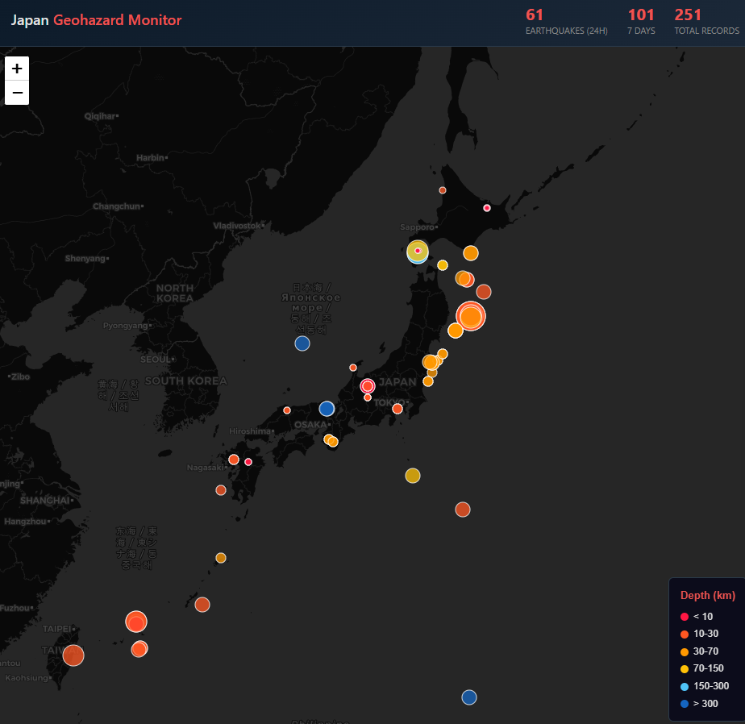

# Japan Geohazard Monitor

> ⚠️ **Disclaimer: this is a research log, not a forecast.**
>
> This repository is a personal research and engineering log. Nothing in it is an earthquake prediction, forecast, warning, advisory, or operational product of any kind, and it issues no alerts. The figures recorded here are retrospective research metrics computed on public catalogues; they are exploratory, may contain errors, and have not been validated for operational use. Do not rely on anything in this repository for safety, evacuation, business, or any other disaster-response decision. For official earthquake and volcano information in Japan, use the Japan Meteorological Agency (https://www.jma.go.jp/en/) and your local government. Everything here is provided as-is, without warranty of any kind, and the author accepts no liability for any loss or damage arising from its use. Data remains the property of the providers listed under Data Attribution.
>
> ⚠️ **免責事項: 本リポジトリは研究記録であり、予報ではありません**
>
> 本リポジトリは個人の研究および開発の記録です。地震の予知・予測・予報・警報その他の運用情報ではなく、いかなる警報も発信しません。記載の数値は公開カタログを用いた事後的な研究指標であり、探索段階のもので、誤りを含む可能性があり、実運用に向けた検証は行っていません。安全確保・避難・事業判断その他の防災上の判断に、本リポジトリの内容を用いないでください。日本の地震・火山の公式情報は気象庁（https://www.jma.go.jp/）および各自治体の発表をご確認ください。本リポジトリの内容は現状のまま無保証で提供され、利用により生じたいかなる損害についても作者は責任を負いません。データの権利は Data Attribution 節に記載の各提供元に帰属します。



Real-time monitoring dashboard for Japan's geophysical activity — earthquakes, volcanoes, atmospheric conditions, geomagnetism, ocean temperature, ionosphere, and crustal deformation — all overlaid on a single dark-themed interactive map with a correlation analysis panel.

9 async collectors run continuously on a Raspberry Pi 5, pulling data from 10 public APIs and storing it in SQLite. A FastAPI server renders a Leaflet.js dashboard with togglable layers and a time-synchronized correlation panel for cross-domain anomaly detection. Mobile responsive.

## Live

Raspberry Pi 5 + Docker（Tailscaleネットワーク内）

> **Data:** Published as a public Hugging Face Dataset → [yasumorishima/japan-geohazard](https://huggingface.co/datasets/yasumorishima/japan-geohazard).

## Architecture

```
9 async collectors (independent intervals per source)
    → BaseCollector (retry, batch insert, health tracking)
    → SQLite (WAL mode, auto-purge @ 90 days)
    → FastAPI REST API (per-layer + correlation endpoints)
    → Leaflet.js dark-themed map (togglable layers, mobile responsive)
    → Chart.js correlation panel (5 time-aligned charts)
```

**Stack**: Python 3.12 / asyncio + aiohttp + asyncssh / aiosqlite / FastAPI + Uvicorn / scikit-learn + scipy / Leaflet.js + Chart.js / Docker

## Data Sources (10 APIs, 9 collectors)

| Collector | Source | Data | Interval | Records |
|---|---|---|---|---|
| `usgs` | USGS GeoJSON | Earthquakes (global → Japan filter) | 5 min | — |
| `p2p` | P2P地震情報 API | Earthquakes (JMA intensity) | 2 min | — |
| `jma` | 気象庁 Bosai | Earthquakes (COD format) | 3 min | — |
| `amedas` | 気象庁 AMeDAS | Temp / Pressure / Wind / Precip (1,286 stations) | 10 min | ~1,286/fetch |
| `geomag` | NOAA SWPC | GOES magnetometer + Kp index | 15 min | ~1,400/fetch |
| `volcano` | 気象庁 Bosai | 117 active volcanoes + alert levels (1-5) | 15 min | 117/fetch |
| `sst` | NOAA ERDDAP | Sea surface temperature (MUR 0.5° grid) | 6 hours | ~1,725/fetch |
| `tec` | CODE (Bern) IONEX | Ionosphere Total Electron Content (2.5° × 5° grid) | 2 hours | ~1,350/fetch |
| `geonet` | GSI SFTP (terras) | Crustal deformation F5 daily (218 sampled stations) | 24 hours | ~1,500/fetch |

## Map Layers

| Layer | Toggle | Visualization | Color Scheme |
|---|---|---|---|
| Earthquakes | ✅ default on | CircleMarker (mag ∝ radius) | Depth: red (shallow) → blue (deep) |
| Volcanoes | toggle | Triangle markers (SVG) | Alert level: gray=1, yellow=2, orange=3, red=4, purple=5 |
| Sea Surface Temp | toggle | Rectangle grid overlay (0.5°) | Blue (cold) → green → yellow → red (warm) |
| Ionosphere TEC | toggle | Rectangle grid overlay (2.5° × 5°) | Green (low) → yellow → red → purple (high TECU) |
| GEONET | toggle | CircleMarker (displacement ∝ radius) | Green < 5mm, yellow < 15mm, orange < 30mm, red ≥ 30mm |
| AMeDAS | toggle | CircleMarker per station | Metric-dependent colormap (4 selectable metrics) |
| Kp Index | always | Header badge | Green < 4, Orange 4-6, Red > 6 |

## Correlation Panel

Right-side collapsible panel (bottom sheet on mobile) with 5 time-synchronized Chart.js charts for cross-domain anomaly detection:

| Chart | Data | Resolution |
|---|---|---|
| Earthquake count | Hourly bar chart | 1 hour |
| Kp index | Line chart | 3 hours |
| GOES magnetic field | Hourly mean total field (nT) | 1 hour |
| Ionosphere TEC | Mean TEC over Japan (TECU) | Per IONEX epoch |
| Atmospheric pressure | Mean AMeDAS pressure (hPa) | 1 hour |

Supports 3/7/14/30-day windows. Auto-refreshes every 5 minutes when open.

**Use case**: Visual detection of precursor patterns — e.g., ionosphere TEC anomaly → geomagnetic disturbance → pressure change → earthquake sequence.

## API Endpoints

| Endpoint | Description |
|---|---|
| `GET /` | Interactive map dashboard |
| `GET /api/earthquakes?hours=N` | Earthquake list (default 24h) |
| `GET /api/volcanoes` | All volcanoes with current alert levels |
| `GET /api/sst` | Latest SST grid |
| `GET /api/tec?hours=N` | Latest ionosphere TEC grid (default 24h) |
| `GET /api/geonet` | Latest GEONET displacement per station |
| `GET /api/amedas?metric=temperature` | Latest AMeDAS snapshot (pressure/temperature/wind/precipitation) |
| `GET /api/geomag/goes?hours=24` | GOES magnetometer time series |
| `GET /api/geomag/kp?days=7` | Kp index time series |
| `GET /api/correlation?days=7` | Time-aligned multi-domain data for correlation panel |
| `GET /api/stats` | Collector health, counts, latest Kp, volcano alerts |

## Database

SQLite with WAL mode. 10 tables:

- `earthquakes` — dedup by (source, event_id)
- `amedas` — dedup by (station_id, observed_at)
- `geomag_goes` — dedup by (time_tag, satellite)
- `geomag_kp` — dedup by time_tag
- `volcanoes` — upsert by volcano_code (one row per volcano)
- `sst` — dedup by (lat, lon, observed_at)
- `tec` — dedup by (lat, lon, epoch)
- `geonet` — dedup by (station_id, observed_at)
- `focal_mechanisms` — GCMT strike/dip/rake, dedup by (source, event_id)
- `gnss_tec` — high-res 0.25° TEC from Nagoya Univ., dedup by (lat, lon, epoch, source)
- `modis_lst` — MODIS Land Surface Temperature (Kelvin), dedup by (lat, lon, observed_date)
- `ulf_magnetic` — 1-minute geomagnetic H/D/Z/F (nT) from KAK/MMB/KNY, dedup by (station, observed_at)

Auto-purge: records older than 90 days deleted on each collector cycle (real-time tables only; analysis tables retained).

## Deployment

Runs on Raspberry Pi 5 via Docker. GEONET SFTP credentials stored in `.env`:

```bash
# .env (on RPi5, not committed)
GSI_SFTP_PASSWORD=xxxxx

# Deploy
ssh yasu@<RPi5-tailscale-ip> "cd ~/japan-geohazard-monitor && sudo git pull && sudo docker-compose up -d --build"
```

### Self-hosted runner: uploading RPi5-local artifacts to HF (2026-07-25)

The backfill/merge pipeline stays fully cloud-native (PR #166) — this does **not** revive the retired SSD-era topology. What was added is a narrow path for the opposite direction: publishing a derived artifact that only exists on the RPi5.

- A runner named `rpi5-geohazard` is registered again on this repo (labels `self-hosted, Linux, ARM64, rpi5`), installed as a **systemd service** (`svc.sh install`) so it survives reboots.
- `.github/workflows/hf-upload-local.yml` (`workflow_dispatch`, required `memo`) runs `runs-on: [self-hosted, rpi5]` and calls `scripts/hf_upload_local.py`. Because the job runs on the box, it can read a local path directly while **`HF_TOKEN` stays in GitHub Secrets and is never written to the RPi5's disk**.
- `scripts/hf_upload_local.py` refuses raw/archive extensions (`.mseed .sac .cnt .win32 .tar.gz .tgz .tar .zip`) — NIED Hi-net / S-net waveform redistribution is prohibited, so only derived artifacts may pass. After upload it re-reads the remote file list and **fails unless the remote size matches the local size**, then writes a marker under `.hf_published/` (repo, path, size, sha256, timestamp) so the RPi5 janitor can reclaim the local copy later without needing network access or a token. `--dry-run` supported.
- First use: `derived/feature_matrix.json` (156,724,706 bytes — 11×11 grid × 1,816 timesteps × 85 catalogue/stress features) published to [`yasumorishima/japan-geohazard`](https://huggingface.co/datasets/yasumorishima/japan-geohazard). Verified both in-job and independently via the public HF API. The matrix contains only aggregate statistics (`rate_7d`, `b_value`, `etas_residual_*`, `cfs_cumulative_kpa`, `benioff_strain_30d`, …), so no individual waveform can be reconstructed from it.
- The runner is public-repo hosted, so these jobs consume **no GitHub Actions minutes**.

## Phased Development

- **Phase 1** ✅ Earthquakes (3 sources: USGS, P2P, JMA)
- **Phase 2** ✅ Atmospheric (AMeDAS 1,286 stations) + Geomagnetic (NOAA SWPC GOES + Kp)
- **Phase 3** ✅ Volcanoes (JMA 117 active) + Ocean (NOAA ERDDAP MUR SST)
- **Phase 4** ✅ Ionosphere TEC (CODE Bern predicted IONEX) + GEONET crustal deformation (GSI SFTP, 218 stations)
- **Correlation** ✅ Time-synchronized 5-chart panel (earthquake/Kp/GOES/TEC/pressure)
- **Analysis Phase 1** ✅ b-value, TEC, Kp, multi-indicator grid search → all negative (aftershock/sampling artifacts)
- **Analysis Phase 2** ✅ Coulomb stress (lift 37.5 isolated), rate anomaly (lift 1.86), clustering (lift 4.12) — all survived aftershock isolation + prospective test (combined lift 20.66)
- **Analysis Phase 3a** ✅ LURR (❌), Natural Time (❌), Nowcasting (⚠️ lift 1.31) — catalog-based methods exhausted
- **Analysis Phase 3b** ✅ MODIS LST (❌), ULF magnetic (⚠️ data limited to 80 days), GNSS-TEC 0.5° (5.3M records)
- **Analysis Phase 4** ✅ **Prospective (forward-looking) prediction**: ETAS residual (gain 4.0x), foreshock (5.1x), cumulative CFS (2.4x), combined alarm (**7.8x, 62.5% precision**). Pattern Informatics (Molchan AUC 0.349)
- **Analysis Phase 5** ✅ ML integration: AdaBoost ensemble (11 features, pure Python) — AUC 0.73
- **Analysis Phase 6** ✅ ML overhaul: HistGradientBoosting (35 temporal features), walk-forward CV (0.740 ± 0.016), ETAS MLE per zone, rate-and-state CFS, isotonic calibration — **AUC 0.746**
- **Analysis Phase 7** ✅ Spatial correlation + GNSS + zone ETAS: 47 features (+6 GNSS crustal deformation, +6 enhanced spatial), zone-specific ETAS in feature extraction, 2-pass Gaussian spatial smoothing — **AUC 0.749 (CV 0.741)**
- **Analysis Phase 8** ✅ Structural overhaul: multi-target (M5+/M5.5+/M6+), CSEP benchmark (4 reference models + N/L/T-test), ensemble stacking (8-input physics×ML meta-learner), ConvLSTM spatiotemporal neural network (Colab/Kaggle GPU). **Result (2026-06): ConvLSTM reaches walk-forward AUC 0.8013 on a Kaggle T4 — the first model to hit 0.80, though within fold-noise of the ~0.799 flat-tabular ceiling (see the 2026-06-07 spatiotemporal neural benchmark below)**
- **Analysis Phase 9.0** ✅ Non-traditional precursor data sources: cosmic ray neutron monitors (NMDB ✅), animal behavior GPS (Movebank ❌ no Japan data), lightning (Blitzortung ❌ archive restricted), hourly geomagnetic (INTERMAGNET ❌ API param bugs), satellite EM (CSES ❌ auth required) — CV AUC **0.728** (regression from 0.741 due to zero-filled features acting as noise)
- **Analysis Phase 9.1** ✅ 4-bug fix + metadata NameError fix: INTERMAGNET API params → **36,000 records, 1,500 days** geomag data successfully fetched. Dynamic feature selection → 53/56 active features. **CV AUC 0.7316, Test AUC 0.7452**. Blitzortung/Sferics Bonn: server down (ECONNREFUSED), lightning data unavailable
- **Analysis Phase 10/10b** ✅ 11 unconventional data sources: OLR, Earth rotation, solar wind, GRACE gravity, SO2, soil moisture, tide gauge, ocean color, cloud fraction, nightlight, InSAR — 56 → 70 features. **CV AUC 0.7249** (regression: 12/70 features active, Solar Wind only new source, Earthdata auth broken, OLR/IERS/tide URLs dead)
- **Analysis Phase 11** ✅ 4 space/cosmic data sources: GOES X-ray flux (solar flares), GOES proton flux (SEP events), tidal stress (lunar+solar, pure calculation), particle precipitation (Van Allen belt). 70 → 75 features
- **Analysis Phase 12** ✅ Data acquisition infrastructure overhaul + ML feature stability selection + FeatureExtractor performance optimization. OLR→PSL THREDDS, IERS→OBSPM, tide→UHSLC Fast Delivery, Earthdata→OAuth2 redirect handler. ML: 3-fold stability pre-filter removes noisy features before CV. **Data acquisition all confirmed working** (OLR/IERS/tide/GOES/GRACE/SO2 ✅). Phase 12b: bisect-based window queries, zone stats caching, deque histories — extract() 20h→12min. deque slice bug fixed in Phase 13
- **Analysis Phase 13** ✅ Seafloor/ocean bottom data sources: NOAA DART bottom pressure (5 stations near Japan, 3 returned data, no auth), IOC sea level monitoring (❌ API crash on None station codes), NIED S-net seafloor pressure (❌ NIED credentials pending). 75 → 79 features (64 active after stability selection). DATA_LICENSES.md added (all 19 source policies documented). **CV AUC 0.7416 (best ever), Test AUC 0.7481**
- **Analysis Phase 14** ✅ Four-axis improvement: (1) IOC fetch crash fix (None-safe parsing + dict/list response support), (2) INTERMAGNET backfill 4x acceleration (500→2000 days/station/run), (3) Diverse stacking level-0 models (RandomForest + LogisticRegression alongside HistGBT → 14-feature meta-learner), (4) ConvLSTM full-feature export (feature_matrix.json now includes all Phase 9+ data, not zero-filled). **CV AUC 0.7415, Test AUC 0.7485. Stacking logistic=0.7484 (≒base), isotonic=0.7213 (degraded). 65 active features**
- **Analysis Phase 14b** ✅ Data acquisition overhaul: **57→71+ active features**. 11 broken sources fixed + 2 new (ISS LIS lightning, VNP46A4 nightlight) + animal removed (79→78). 8 sources switched to auth-free alternatives. All endpoints verified with curl before commit. OLR→NCEI CDR, GRACE→GFZ GravIS, Ocean Color→CoastWatch DINEOF, Soil Moisture→CPC ERDDAP, Tide Gauge→UHSLC ERDDAP (19 stations), GOES X-ray→LISIRD 1-min, InSAR→LiCSAR 34 frames, Lightning→ISS LIS (GHRC DAAC), Nightlight→VNP46A4 (LAADS), Earthdata auth→BasicAuth
- **Backfill** ✅ 2011-2026 M3+ earthquakes (29K), TEC (4M), Kp (44K), GCMT focal mechanisms
- **Analysis Phase 15** ✅ Full test with all Phase 14b source fixes + data preservation checkpoint system. **70/78 active features (+5 from Phase 14). Test AUC 0.7499 (best ever), CV AUC 0.7411.** Data validation: 21 OK / 8 EMPTY / 1 MISSING. Earthdata auth (4 sources) failed due to URS API deprecating Basic Auth — fixed in Phase 15b. Feature matrix exported (1790×11×11×78). Job timed out at 6h (CSEP completed, final artifact upload missed). DB checkpoint preserved
- **Analysis Phase 15b** ✅ Earthdata auth rewrite (Bearer token priority + Basic Auth fallback), ISS LIS table separation (`iss_lis_lightning`), workflow reliability (timeout 420min, ML results checkpoint artifact, auth pre-validation step). **Test AUC 0.7499 (same as 15), 72/78 active features. Feature matrix export failed (int64 serialization) → fixed in 15c**
- **Analysis Phase 15c** ⚠️ Partial success (Run 23366201702, cancelled at ML step after 6h):
  - cloud_fraction ✅ 120,727 rows (2011-01 → 2011-10, coverage 4.9%)
  - ISS LIS ✅ 537 rows (2017-03 → 2017-07, coverage 5.5%)
  - tide_gauge ❌ UHSLC ERDDAP ConnectionTimeout (CI→Hawaii latency)
  - nightlight ❌ LAADS EULA redirect → HTML downloaded instead of HDF5
  - SO2 ❌ GES DISC Bearer 401, BasicAuth fallback failed (session cookie contamination)
  - Data validation: 23 OK / 6 EMPTY / 1 MISSING (improved from 8 EMPTY)
  - Feature matrix export fixed (int64 serialization + samples reuse 14h→sec)
  - DB checkpoint (230MB) preserved
- **Analysis Phase 15d** ✅ EMPTY source fixes (Run 23373703010): tide_gauge ✅ 2.4M rows (UHSLC CSV fallback), cloud_fraction ✅ 132K, ocean_color ✅ 17K. Electron flux ❌ hung 2h (NCEI data ended 2020), SO2 ❌ 0 rows (Earthdata credentials invalid), VIIRS ❌ 0 rows (h5py scalar bug). Cancelled at electron flux step
- **Analysis Phase 15f** 🔄 Electron flux complete rewrite + VIIRS fix + DB checkpoint restore (Run 23382779214, 2026-03-21):
  - **DB checkpoint restore at workflow start**: previous run's DB downloaded before fetch → all skip-logic effective (incremental fetch)
  - **Electron flux**: NCEI GOES-R SEISS L2 netCDF added (GOES-16 science + GOES-18 science/ops auto-fallback). Tested: 2024=366d, 2025=342d/12mo, 2026=79d/3mo — **zero gap from 2017 to present**. NCEI CSV retained for 2011-2016. Year-parallel fetch (semaphore 2), month-internal day-parallel (semaphore 5)
  - **VIIRS nightlight**: h5py attribute numpy scalar conversion fix (`np.asarray().flat[0]`)
  - **Electron flux timeout**: 10→30min
  - **CI deps**: netCDF4 + numpy added
  - SO2 still blocked (Earthdata username/password Secret needs manual update)
- **Analysis Phase 15g** ✅ Electron flux major expansion: NCEI netCDF 286,878 new daily records (2017-2026). **Test AUC 0.7540 (best ever), CV AUC 0.7415, 75 active features**
- **Analysis Phase 15h/15i** ✅ SO2 continuous fetch (408K rows) + coordinate snap fix. Non-zero rates improved (SO2 2.0%) but AUC unchanged (Test 0.7485). Root cause: spatial feature non-zero rates still low (cloud 8.2%, SO2 2.0%, soil 1.1%)
- **Analysis Phase 16** ⚠️ Continuous spatial data fetch (SO2/cloud/ocean_color). Timed out at 6h — fetch completed (SO2 2.3M, cloud 547K, ocean 89K) but ML not reached. DB checkpoint (610MB) preserved
- **Analysis Phase 18** ✅ S-net seafloor waveform features: NIED Hi-net approved, 0120A acceleration (150 stations, 100Hz). 7 features (RMS/H-V ratio/band power/spectral slope anomalies + spatial gradient + segment max). **75 → 84 features**. Test confirmed: 150/150 stations, 447/450 SAC files parsed
- **Analysis Phase 19** 🔄 S-net multi-sensor expansion: 0120 (broadband velocity) + 0120C (high-gain acceleration) added alongside 0120A. **VLF spectral analysis with 200s FFT windows** (0.005 Hz resolution) for tremor/SSE detection in 0.01-0.1 Hz band. 8 new features: VLF power/H-V anomalies, velocity RMS, VLF/HF ratio, accel-velocity coherence, VLF spatial gradient, high-gain SNR, velocity spectral slope. Multi-code quota management (190 request cap). DB schema: sensor_type column + VLF columns with migration. **84 → 92 features (185 total incl. dynamic selection)**. Workflow fix: S-net moved to early pipeline position (was unreachable due to 6h timeout), incremental DB save per item (prevents data loss on timeout), SMAP disabled (ERDDAP IP blacklist). Smoke test validated: 149 stations × 4 segments, 596 records committed
- **Analysis Phase 20** ✅ Lightning climatology feature integration: NASA LIS/OTD (1995-2014, 20,808 cell-months) + WWLLN Thunder Hour (2013-2025, 31,824 cell-months). 6 new features: flash_rate/thunder_hours with per-cell×calendar-month z-score and ratio baselines. Cross-validation on 2013-2014 overlap: Pearson r=0.39 (winter r=0.53-0.66, summer r≈0). Two independent optional groups — model learns relative weighting. **92 → 98 features**. OLR fetcher migrated from deprecated NCEI v01r02 to S3 archive v02r00 (+134K rows, →2026-04-14). GOES X-ray SWPC time_tag fix (+8 days, →2026-04-17). Salvage SKIP_TABLES cleared for so2_column/cloud_fraction checkpoint accumulation
- **Analysis Phase 21** ✅ Forward-feature-freshness audit: verified every optional feature group has live, low-latency data at inference time. Removed **5 always-zero features** from the active forward set -- LIS/OTD flash-rate (3 features, satellite ended 2014) and daily lightning (2 features, Blitzortung 0-row no-op plus ISS LIS ended 2023-11) -- which were silently 0 for 2024+ predictions (a temporal confound, nonzero only in historical training rows), both dropped via dynamic `get_active_feature_names()` exclusion with raw tables retained as backtest assets (PR #190, #193). Fixed two alive-but-stale fetchers. **SO2** repointed from the frozen OMSO2G.003 archive to live **OMSO2G.004** (identical 0.25-deg grid and variable, verified via OPeNDAP, so2_column had stalled at 2025-06-08, PR #191). **IOC sea level** chunk walk made **dual-ended** (reserves recent chunks newest-first so ioc_sealevel_anomaly stays fresh, was stalled at 2023-10 under pure oldest-first backfill, PR #192). Confirmed gravity (GRACE-FO ~3mo latency), WWLLN thunder-hour (annual-file cadence, at source frontier), and nightlight (annual composite) are source-cadence-limited by design, and InSAR is safely auto-excluded (disabled fetcher, empty table). All four PRs Opus-reviewed and CodeRabbit-clean.
- **CI/CD** ✅ GitHub Actions weekly analysis workflow (fetch → analyze → artifact, 400min timeout). **Step ordering optimized**: S-net (highest priority) runs immediately after core earthquake data; slow Earthdata fetchers follow. SMAP permanently disabled (ERDDAP IP blacklist). S-net uses `SNET_MAX_REQUESTS` env var for smoke testing (test-snet.yml runs production script with 5-request cap). **Data preservation**: DB checkpoint after fetch phase + ML results checkpoint (feature_matrix + predictions) + final DB upload. S-net waveform fetch uses incremental sqlite3 commits per item (survives timeout kills). Earthdata auth pre-validation skips 4 sources on credential failure. Data validation report (30 tables checked — collector_status excluded as legacy) saved to artifacts. **DB corruption prevention**: All 100 DB connections use `safe_connect()` with `PRAGMA synchronous=FULL` + `busy_timeout=10000` (centralized in `scripts/db_connect.py`). 28-item preflight test suite (`scripts/test_db_checkpoint.py`) runs before every fetch. 4-step verified WAL flush before artifact upload (checkpoint + integrity + WAL size + page count) — **upload blocked when verification fails** (`flush_ok` output guard). Restore step properly deletes corrupted checkpoints (`set +e` fix for `bash -e` shell). Dedicated test workflow (`test-db-integrity.yml`) validates corruption detection and cleanup
- **Data Completeness Initiative** 🔄 (started 2026-04-11) — Target 100% coverage across all 30 validated tables from 2011-01-01 to 2026-04-17. Full Step history in the [Data Completeness Initiative](#data-completeness-initiative) section below.
- **Mobile** ✅ Responsive design (bottom sheet panel, touch-optimized controls)

## Data Completeness Initiative

Started 2026-04-11. Target: **100% coverage across all 30 validated tables from 2011-01-01 to 2026-04-17** — no shortcuts, no "good-enough" exclusions. Phase 0 audit classified every fetcher into four failure modes: (1) wiring gaps (`snet_pressure` never invoked, `soil_moisture` commented out), (2) sparse ±M6+ strategy misuse (`lightning`, `ulf_magnetic`, `gnss_tec`, `modis_lst`, `tec` fetch only around major events instead of continuously), (3) continuous-strategy silent stops (`so2_column` at 2014-03, `cloud_fraction` at 2012-01, `geomag_hourly` at 2013-09), (4) physical constraints requiring alternative sources (`satellite_em`→Swarm for 2011-2017, `iss_lis_lightning`→WWLLN for 2011-2017, `snet_waveform`→F-net/Hi-net/DONET for 2011-2016).

### Phase 1 Step 1 ✅

`fetch_snet_pressure.py` rewritten for continuous backfill.

### Phase 1 Step 2/2b ✅

All 3 "stopped" fetchers functional; dedicated `backfill.yml` runs ALL 28+ fetchers every 3 hours (8 cron, 24/7).

### Phase 1 Step 3 ✅

`tec`/`ulf_magnetic`/`gnss_tec` rewritten from sparse ±M6+ to continuous full-range.

### Phase 1 Step 4 ✅ (2026-04-17)

Lightning overhaul — WWLLN (2013-2025) + LIS/OTD (1995-2014). OLR→S3 v02r00. GOES X-ray SWPC time_tag fix.

### Phase 1 Step 4b ✅ (2026-04-17)

Data quality audit resolution — **8/10 contaminated features fixed**. cloud_fraction exception handler order bug (OperationalError subclass of DatabaseError). SO2/cloud timeout 40→90min. soil_moisture fetch step added to backfill.yml (CPC monthly: 15,441 rows verified). solar_wind/goes_proton future-date filter already in place. goes_xray LISIRD .jsond migration + SWPC ISO 8601. Lightning daily: WONTFIX (no free source; Phase 20 monthly sufficient). satellite_em: feature pipeline not wired (low priority).

### Phase 1 Step 4c ✅ (2026-04-18)

Checkpoint overwrite bug — targeted dispatch runs (e.g. `target=cloud_fraction`) uploaded partial-DB checkpoints that overwrote full checkpoints from scheduled runs, resetting SO2/cloud_fraction progress to 0 rows every cycle. Fix: skip checkpoint upload for targeted dispatches. Verified: SO2 4.5M rows (→2016-05, past 2015 threshold), cloud_fraction 523K rows (→2013-02), OLR 3.4M rows (→2026-04-14 preliminary tracking OK).

### Phase 1 Step 4d ✅ (2026-04-18)

BQ overwrite hole closed. Step 4c only guarded checkpoint upload; the Upload-to-BigQuery step still ran for targeted dispatches and `load_raw_to_bq.py` (WRITE_TRUNCATE on all 31 tables) overwrote BQ with whatever the restored checkpoint contained. Real damage: `lightning_thunder_hour` regressed 31,824→24,480 rows (2013-2025→2013-2022) on 2026-04-17 after parallel `target=soil_moisture` + `target=cloud_fraction` dispatches. Fix in 71f1b2e mirrors the Step 4c if-guard onto Upload-to-BigQuery.

### Phase 1 Step 4e ✅ (2026-04-18)

5h hard-limit kill-chain. Three consecutive scheduled runs (16:03/19:02/21:34 UTC) cancelled at exactly 5h with MODIS LST + SO2 + cloud_fraction in series eating the entire window — Snapshot succeeded but Upload-checkpoint and Upload-to-BigQuery never ran, so cloud/SO2 were progressing at ~1/10 the expected pace. Restructured `backfill.yml` from a single 1024-line job into three parallel jobs: `heavy` (290m, 5 fetchers: MODIS LST/SO2/cloud/snet_waveform/snet_pressure), `light` (200m, 26 fetchers), and `merge` (60m, `needs:[heavy,light]`, `if:always()`) which downloads both DB artifacts and runs the new `scripts/merge_checkpoints.py` (per-table ATTACH+INSERT with `--require-base` fail-closed and explicit BEGIN/COMMIT/ROLLBACK; 7 smoke tests passing). Light is base, heavy overlays its 5 owned tables via DELETE-then-INSERT to discard stale restored rows. Merge job retains the Step 4c+4d target-guards for checkpoint and BQ upload.

### Phase 1 Step 4f ✅ (2026-04-18)

heavy timeout + Upload-artifact guard. Step 4e's 290m heavy timeout proved too short — observed run (24595180615) measured MODIS LST 1h13m + SO2 1h22m + cloud >1h13m (cancelled mid-fetch by 290m job timeout) and `Upload heavy.db artifact` was skipped (plain `if:` evaluates false on job cancel), so merge fell into base-only path and BQ heavy-owned tables were WRITE_TRUNCATE'd back to the restored checkpoint state. Fix in 9bd6315 raises heavy timeout 290→350m (under GitHub's 360m hard limit) and adds `if: always() && steps.snapshot.outcome == 'success'` to both `Upload {heavy,light}.db artifact` steps so the artifact survives a job-level cancel. Real damage from this incident was limited — `MIN_ROWS_TO_UPLOAD=1000` in `load_raw_to_bq.py` saved so2_column (4.5M)/cloud_fraction (523K)/snet_pressure/modis_lst from rollback because their restored counts were 0 or <1000; only snet_waveform (36,313 rows) was overwritten. lightning_thunder_hour recovered to 31,824 rows automatically.

### Phase 1 Step 4g ✅ (2026-04-18)

5h hard-limit recurred. Heavy was running MODIS LST + SO2 + cloud_fraction + S-net waveform + S-net pressure serially for 4h52m; raising timeout to 350m could not absorb it, so scheduled runs kept getting cancelled. Commit 6e226b9 splits heavy into **5 parallel fetch jobs (fetch-modis/fetch-so2/fetch-cloud/fetch-snet/light)**, each emitting its own artifact, with merge aggregating them via N-way overlay. `scripts/merge_checkpoints.py` extended for N-way support (`--overlay PATH:TABLES` repeatable, `--require-base` fail-closed, Windows `C:\` path handling via `rpartition(":")`); 10 smoke tests all PASS. Verified with a real `target=all` run completing in 2h08m28s.

### Phase 1 Step 4h ✅ (2026-04-18)

Fixed a pre-existing merge_checkpoints.py bug where overlay tables with 0 rows would wipe the accumulated base rows (the real cause of the cloud_fraction 523K→0 regression) in commit 87c4769. Before DELETE, check `SELECT COUNT(*) FROM overlay.table`; if overlay_count==0 and base>0, skip with log `overlay empty; base preserved (N rows)`. Added `test_empty_overlay_preserves_base` + `test_nonempty_overlay_still_replaces` to local smoke tests, 10/10 PASS.

### Phase 1 Step 4i ✅ (2026-04-19)

Identified why the cloud.db artifact was repeatedly rejected by merge with "database disk image is malformed". A temporary `diagnostic-cloud` job (target=diagnostic + diag_run_id input) was added to `backfill.yml` to run `PRAGMA integrity_check` / `SELECT COUNT(*)` / `ATTACH DATABASE` right after download — the artifact was **corrupt from the start** (page-level corruption: `Tree X page Y cell Z: invalid page number ...`). Root cause: the Snapshot DB step only ran `integrity_check` on the **source**; `src.backup(dst)` can silently produce a corrupted snapshot when the fetcher is terminated by SIGKILL, and with dst unverified the poisoned artifact was being uploaded. Commits bbce59d + cda044f add post-backup integrity_check to all 5 snapshot blocks (fetch-modis/so2/cloud/snet/light): `verify = sqlite3.connect(dst); r2 = verify.execute('PRAGMA integrity_check').fetchone()[0]; if r2 != 'ok': sys.exit(1)`. A bad snapshot → fetch-X failure → `Upload *.db artifact` skipped by the `steps.snapshot.outcome == 'success'` guard → merge treats the overlay as missing and preserves the base.

### Phase 1 Step 4j ⚠️ (2026-04-19)

Snapshot verify via subprocess CLI. Commit 9abdde3 switched verification to `sqlite3 "$db" "PRAGMA integrity_check"` run through a subprocess after `os.sync()` to bypass a suspected Python-sqlite3 false-OK. However, schedule run 24626051376 again surfaced malformed on the merge side, proving **subprocess-mode integrity_check also fails to detect this corruption** (root cause unresolved; presumed SQLite page cache vs. on-disk mismatch). The change is kept as a harmless additional defensive layer.

### Phase 1 Step 4k ✅ (2026-04-19)

Identified the real root cause of cloud_fraction malformed. `fetch_cloud_fraction.py` with `CLOUD_MAX_DATES=2000` could not finish within the 90min job timeout and was SIGKILL'd at ~920/2000 dates, leaving the DB half-written with residual B-tree inconsistency that only surfaced when merge called ATTACH. `integrity_check` returns false-OK here because local page checks pass even while internal inconsistencies remain. Commit cee73c0 lowered `CLOUD_MAX_DATES` from 2000 to 900 to eliminate the SIGKILL. Validation run 24629240566: fetch-cloud finished cleanly in 1h44m, cloud_fraction overlay applied 0→175,421 rows, malformed error gone.

### Phase 1 Step 4l ✅ (2026-04-19)

Even at `CLOUD_MAX_DATES=900`, measured throughput is ~6.75s/date (slower than the 5.5s estimate), so runs still timed out at 800/900. Commit bd84e49 bumped the fetch-cloud timeout from 90 to 120 minutes (since it runs in parallel, this only affects merge wait time, not overall wall clock). Observed: cloud_fraction grew 733K → **1.33M rows (+80%)**, covering 2011-01 → 2014-09. The remaining ~12 years continue to backfill via the 8 runs/day schedule.

### Phase 1 Step 4m ✅ (2026-04-20)

Discord notification noise reduction. Commit d32c627 changed the merge job's `Notify Discord` step to send only on failure or when all tables reach ≥95%. The routine progress 📊 notification exits early via `sys.exit(0)`, silencing the 8-notifications/day schedule while preserving failure alerts and the 🎉 milestone notification.

### Phase 1 Step 4n ✅ (2026-04-22)

fetch-cloud job-level timeout raised from 120m to 150m (commit 2638e0e). The step-level `timeout-minutes: 120` on "Fetch MODIS cloud fraction" plus setup/snapshot overhead caused the job to exceed its own 120m job limit, cancelling before the Upload artifact step. Job limit is now 150m, giving ~25m buffer; the step limit remains 120m to prevent SIGKILL DB corruption.

### Phase 1 Step 4o ✅ (2026-04-22)

Permanent-failure Issue spam eliminated (commit 23210bc). `lightning` (Blitzortung archive restricted) and `snet_pressure` (win32tools unavailable on Linux) were failing every run and triggering a new GitHub Issue each time — 50 issues created in 2 days. Both sources excluded from Issue trigger conditions; their failures are now logged as expected permanent failures without creating Issues. Issues #34–#83 bulk-closed.

### Phase 1 Step 4p ✅ (2026-04-22)

snet_waveform coverage fix. The coverage metric was using total-run days as denominator, making oldest-first gap-fill look like 3.2% even as rows accumulated. Changed denominator to snet_start-based days; fallback to oldest-first full-history scan when window yields 0 dates and coverage < 100%.

### Phase 1 Step 4q ✅ (2026-04-23)

SO2 diagnostic message corrected (commit 6177496). `fetch_omi_so2.py` was logging "credentials invalid for GES DISC data access" for any 0-record result regardless of cause. The OMI OMSO2G archive physically ends at ~2025-06-08 due to instrument degradation; auth is not the issue. Message updated to explain data-end and instruct users to check for HTTP 4xx in WARNING logs if auth failure is suspected.

### Phase 1 Step 4r ✅ (2026-04-23)

Restore checkpoint step silent hang fixed (commit 2653224). All 5 "Restore previous database checkpoint" steps across fetch-modis/fetch-so2/fetch-cloud/fetch-snet/light lacked a `timeout-minutes`, so a hung `gh run download` call could consume the entire 150m job budget, leaving the actual fetch and artifact upload steps never executed (confirmed: fetch-modis run 24789150140 showed step `in_progress` with no `completed_at` after 150m). Added `timeout-minutes: 10` to all 5 restore steps; `continue-on-error: true` ensures the fetch proceeds cleanly even when restore times out.

### Phase 1 Step 4s ⚠️ (2026-04-24)

bd7cd81 aggressive-timeout regression identified and reverted. Step 4r's `timeout-minutes: 10` alone was insufficient to prevent hangs, so commit bd7cd81 additionally wrapped `python3 check_db_integrity.py` with `timeout 30` (and salvage with `timeout 120`) intending to fail fast. Result: `PRAGMA integrity_check` on the 9.9GB checkpoint actually takes ~107s (measured in Step 4t), so every integrity check hit rc=124, was mis-diagnosed as corruption, ran salvage (also timed out), retried against the next older artifact, and exhausted the retry budget. Observed failure shape: 4/5 pre-revert schedule runs failed at Restore with `fetch-cloud`/`fetch-modis` jobs dying at 2:48-6:02 min with step `in_progress` / `conclusion=null` (runner-kill pattern). Commit 841b88c reverts the five `timeout 30`/`timeout 120` command wrappers.

### Phase 1 Step 4t ✅ (2026-04-24)

Integrity-check benchmark workflow added (commit 0e33fb9). New `.github/workflows/measure-integrity.yml` (workflow_dispatch only, `memo` input required) downloads the latest `backfill-checkpoint-*` artifact on a GH runner, then measures DL time, per-table COUNT(*), `PRAGMA quick_check`, `PRAGMA integrity_check`, and `scripts/check_db_integrity.py --mode=full`. First run on 9.9GB / 40 tables: DL 60.37s, per-table COUNT total ~0.5s, quick_check 14.72s, integrity_check 106.25s, full check 107.23s. Timings are reported via `$GITHUB_STEP_SUMMARY` with `awk -v a="$t1" -v b="$t0" 'BEGIN{printf "%.2f", a-b}'` and a `trap` that closes the markdown code fence on timeout-kill. Independent `measure-integrity` concurrency group so it cannot stall backfill.

### Phase 1 Step 4u ✅ (2026-04-24)

Two-stage integrity check design (commit 957e147). `scripts/check_db_integrity.py` gains `--mode=quick|full` — quick runs only `PRAGMA quick_check` (~15s on 9.9GB, catches structural/page-level corruption); full runs `PRAGMA integrity_check` + per-table `COUNT(*)` (~107s, catches index-level corruption). Restore path uses **quick** with `timeout 60`; Init DB path uses **full** with `timeout 300` as a safety net; salvage stays at `timeout 300`. New `.github/workflows/weekly-integrity-audit.yml` runs `--mode=full` every Monday 00:00 JST (Sunday 15:00 UTC), tries `backfill-checkpoint-*` first and falls back to legacy `database-checkpoint-*` artifact names, and opens an `integrity-audit` labelled Issue on detection. Independent concurrency group (`weekly-integrity-audit`) keeps it off the backfill queue.

### Phase 1 Step 4v ✅ (2026-04-24)

Artifact-download timeout widened 60s→180s (commit 2839e3a). The Step 4u smoke test revealed all 5 fetch jobs failing at `gh run download` with rc=124 — Step 4t had measured DL at 60.37s, right at the 60s timeout boundary, and ordinary network variance pushed every attempt over. All 5 Restore steps now use `timeout 180 gh run download` (3× margin). Post-fix smoke (24868276554): light Restore 1m46s ✅, Init 1m45s ✅. First post-Phase 3.1 production schedule run (24870429565, 03:18 UTC 2026-04-24, 18min cron delay) measured Restore + Init per fetch job: fetch-cloud 1m44s + 1m35s, fetch-snet 1m45s + 1m46s, fetch-modis 1m27s + 1m46s, light 1m39s + 1m46s, fetch-so2 4m10s + 1m23s — target window 3-5 min cleared across all 5 jobs (fetch-so2 is the outlier but well under the 180s DL timeout and 10-min step timeout). bd7cd81 regression is fully resolved.

### Phase 1 Step 4w ✅ (2026-04-24)

Phase 3.1 production stability confirmed across two consecutive schedule runs. Run 24870429565 (03:00 UTC cron, +18m delay) completed end-to-end success: all 5 fetch jobs passed Restore + Init, merge job ran 49min (04:46→05:35 UTC), Discord notify success, `Auto-rerun failed fetch jobs` and `Create issue on failure` both correctly `skipped`. Fetch durations: fetch-cloud 23.76min (fastest), fetch-snet 40.85min, light 44.28min, fetch-so2 45.26min, fetch-modis 87.66min (bottleneck, 73% of the 120m job timeout). Run 24874187228 also success: all 5 Restore times 1m23s–2m43s, total wall clock 2h40m (05:39→08:19 UTC), merge 47min, Discord + auto-rerun behavior identical to the previous run. Task #20 resolution: the apparent "2026-04-24 00:00 UTC schedule skip" was not a skip — GitHub Actions fired the 00:00 UTC cron at 05:39:41 UTC (+5h39m delay) as run 24874187228, and the 06:00 UTC cron followed at 07:48:37 UTC (+1h48m delay) as run 24878479422. The `concurrency: backfill-data` group with `cancel-in-progress: false` correctly queued 24878479422 behind 24874187228 instead of cancelling it. Severe scheduler delay is a GitHub Actions infrastructure condition, not a code issue; no mitigation required.

### Phase 1 Step 4x ✅ (2026-04-25)

snet_waveform permanent-skip marker for structurally empty (date,sensor) pairs (PR #88, commit 0091be7). Audit of 5 consecutive schedule runs (24899330313/24906601022/24913124903/24920790861/24923422139) showed each consumed ~120 of its 120-request budget but only added ~33 unique dates per run because ~40% of attempted dates returned zero records — the same dates (cable outage windows, station downtime, pre-deployment dates) were retried indefinitely, capping projected completion at 80-150 days vs. memory's earlier "~11 days" estimate. Fix: `snet_failed_dates(date_str, sensor_type, last_failed_at, retry_count, reason)` table created in `ensure_table()`; `_fetch_day` raises new `HinetQuotaError`/`HinetAuthError` exceptions (carrying `partial_results`) instead of silent partial returns so `_fetch_and_save` can distinguish quota stops from genuine no-data and persist any segments fetched before the quota hit; zero-record returns invoke `_mark_failed_sync` (INSERT OR IGNORE + UPDATE retry_count++) to atomically increment the counter; `main()` merges existing pairs with `get_failed_dates()` (threshold = `MAX_RETRIES_BEFORE_SKIP=3`) into a `skip_pairs` set used by all three `dates_to_fetch` construction loops (recent, backfill, full historical scan). `get_failed_dates` docstring documents the manual reset SQL for cases where transient NIED maintenance happens to span three consecutive schedule runs. Smoke test (6 cases) covers table creation, columns, mark/get cycle, threshold boundary, exception payloads, and the `MAX_RETRIES_BEFORE_SKIP` constant; Opus subagent review clean. Expected effect: per-run new-date ratio rises from ~60% to 95+%, projected completion shrinks from 80-150 days to **30-50 days**. First production exposure begins on the 12:00 UTC 2026-04-25 schedule run.

### Phase 1 Step 4y ✅ (2026-04-25)

Coverage report formula normalization (PR #89, commit f6c60aa). `pct = n_dates / total_days * 100` with `total_days = (today - 2011-01-01).days` produced impossible >100% values for tables holding pre-2011 data (e.g. `cosmic_ray`, `solar_wind`, `goes_xray`). Added `WHERE <date_expr> >= "2011-01-01"` filter to all 32 coverage queries in both the main coverage report (line ~1982) and the failure issue body (line ~2236), 64 edits total. Year-month granularity (`lightning_thunder_hour`, `lightning_lis_otd`) uses `"2011-01"`; `geomag_hourly` AND-joins after the existing `WHERE station="KAK"`. SQLite in-memory mock smoke test for all 4 query patterns (plain substr, raw column, multiplier, existing-WHERE) passed.

### Phase 1 Step 4z ✅ (2026-04-25)

merge_checkpoints.py shrink-protection guard (PR #90, commit 8dfeb2f). Step 4h's empty-overlay guard only blocked `overlay_count == 0`; `modis_lst` exhibited a different shrink pattern — overlay had non-empty but smaller-than-base rows (e.g. 488 → 338) when fetch-modis started from a failed checkpoint restore and only wrote newly fetched rows. Append-only fetchers always restore the prior checkpoint then INSERT-OR-IGNORE new rows, so `overlay_count < before` is now the trigger condition (deficit logged). Smoke test rewrote `test_nonempty_overlay_still_replaces` (which incidentally tested now-rejected shrink behavior) into `test_grown_overlay_replaces_base` and added `test_shrunk_overlay_preserves_base` for the modis_lst 488→338 regression scenario; 11/11 PASS.

### Phase 1 Step 4aa ✅ (2026-04-25)

snet_pressure deprecated end-to-end (PR #91, commit aed65bb, −575 lines). HinetPy network code `0120A` is S-net acceleration data, not pressure; HinetPy exposes no code for S-net BPR (bottom pressure recorder) measurements (canonical reference: [HinetPy/header.py L83-86](https://github.com/seisman/HinetPy/blob/master/HinetPy/header.py#L83-L86)). The fetcher has produced 0 rows since inception and never can via this path. Replaced the 580-line `scripts/fetch_snet_pressure.py` body with a 25-line deprecation stub (logs reason, exits 0, kept as tombstone). Removed `snet_pressure` from `backfill.yml` (target option, fetch-snet job conditional, fetch step, overlay spec, output ref, win32tools conditional, validate list, Discord env, alerts comment, both coverage queries), `analysis.yml`, `load_raw_to_bq.py`, `validate_data.py`, `audit_artifact.py`, `merge_checkpoints.py` docstring, and `docs/DATA_QUALITY_ISSUES.md` (status `open` → `deprecated 2026-04-25` with root cause). All Python files compile clean, both YAMLs parse, merge_checkpoints smoke test 11/11 unchanged. README docs already reflected the conclusion (Phase 18-19 lines: "pressure channels absent in all 4 codes").

### Phase 1 Step 4ab ✅ (2026-04-26)

lightning (Blitzortung) deprecated end-to-end (PR #93, commit 63b7a17, −560 lines). Blitzortung historical archive returns HTML access-restricted response for every queried month, University of Bonn sferics archive is EU-only (no Japan coverage), Blitzortung live API only exposes the most recent ~2 hours (no historical backfill). The `lightning` table has been at 0 rows since project start; active lightning coverage is provided by `iss_lis_lightning` (NASA ISS LIS, 7,819 rows, 2017-2023), `lightning_thunder_hour` (WWLLN, 31,824 rows, 2013-2025), and `lightning_lis_otd` (NASA LIS/OTD monthly climatology, 20,808 rows, 1995-2014). Replaced 586-line `scripts/fetch_blitzortung.py` body with a 38-line deprecation stub (logs reason, exits 0). Removed `lightning` from `backfill.yml` (target option, fetch step, output ref, env var, coverage list, both coverage queries, Discord notify, alerts comment), `load_raw_to_bq.py`, `validate_data.py`, `audit_artifact.py`, and updated `docs/DATA_QUALITY_ISSUES.md` (per-feature contamination row + status table → `deprecated 2026-04-26`). All Python files compile clean, YAML parses, merge_checkpoints smoke 11/11 unchanged.

### Phase 1 Step 5b ✅ (2026-04-26)

ESA Swarm A satellite EM fetcher (PR #95, merge commit b8dadd0). Replaces deprecated CSES portion of `fetch_cses_satellite.py` with `scripts/fetch_swarm_em.py` (425 lines, viresclient SDK based). Fetches `SW_OPER_MAGA_LR_1B` (F + B_NEC + CHAOS-Core residual) and `SW_OPER_EFIA_LP_1B` (Ne, Te) over Japan bbox (lat 20-50, lon 120-155) for 2014-01-01 onward. MAG and EFI stored as separate rows (`source = SWARM_A_MAG` / `SWARM_A_EFI`) with per-source resume_date to avoid 1Hz/2Hz join NaN issues and prevent one source's transient failure from masking the other's gap (CodeRabbit Major fix in commit eccc714). `residuals=True` requests VirES-side B residual calculation (no client-side vector subtraction). 401/403 hard-fail via `SwarmAuthError` (no silent skip). `asynchronous=False` for CI efficiency. Auth via `SWARM_TOKEN` GH secret (Bearer token from https://vires.services/accounts/tokens). New `swarm_em` table + `viresclient>=0.11.0` requirement; `fetch_cses_satellite.py` reduced to geomag_hourly only.

### Phase 1 Step 5c ✅ (2026-04-26)

NIED F-net broadband waveform fetcher (PR #97). Adds Full Range Seismograph Network as second alternative-source-fusion module after Swarm (Step 5b). New `scripts/fetch_fnet_waveform.py` (~1040 lines) fetches HinetPy network code `0103` from 73 land-based broadband stations across Japan, sampling rate 100 Hz, 3-component. Initial rollout via stratified-latitude sampling of 15 stations (`FNET_MAX_STATIONS` env, `FNET_STATIONS=ALL` to disable filter); `client.select_stations` retries with stripped `N.` prefix on failure to tolerate HinetPy code naming variant. Same feature schema as `snet_waveform` (rms/hv_ratio/lf_power/hf_power/spectral_slope/vlf_power/vlf_hv_ratio) for cross-source ML parity. SAC channel filter limits to `BH*` prefix only — F-net distributes both BH (broadband 100 Hz) and LH (long-period 1 Hz) for some stations and mixing fs in the PSD path corrupted feature values; fs consistency check across Z/N/E rejects mismatched triplets. 13 geographic regions (F-HKD..F-OKN) with half-open `[lo, hi)` lat boundaries replace S-net cable segments. New `fnet_waveform` + `fnet_failed_dates` tables; the latter mirrors the snet permanent-skip pattern. Integrated into `fetch-snet` job sequentially with `SNET_MAX_REQUESTS=60` + `FNET_MAX_REQUESTS=60` (shared NIED 150-slot daily quota), per-step `timeout-minutes: 75 + 75`, F-net step `if: always() && (target in [all, fnet_waveform, ''])` so it runs even when the S-net step times out. `install_win32tools` step extended to include `target=fnet_waveform` (CodeRabbit round-3 Critical: without this, single-target dispatch silently produced 0 records and permanent-skipped every date after 3 retries). CodeRabbit reviews across 3 rounds (round-1 7 findings / round-3 Critical+Nitpick) all addressed; docstring coverage 24/24 100%; smoke test on RPi5 verified module import, `ensure_table` schema, region classification spot checks (Hokkaido / Kanto / Kyushu-N / Okinawa / Izu).

### Phase 1 Step 5d ✅ (2026-04-26)

snet_waveform metric integrity (PR #98, merge commit `a618a3e`). `_save_records_sync` switched to `cursor.rowcount` so duplicate INSERT-OR-IGNORE rows count as `skipped` instead of `inserted`; `get_event_loop` → `get_running_loop` (Python 3.10+); removed a `MAX_BACKFILL_DAYS_PER_RUN * 3` over-allocation that was immediately truncated. Diff +7/-6.

### Phase 1 Step 5e ✅ (2026-04-26)

F-net `FNET_START_STR` anchor changed 1995-08-01 → 2000-01-01 (PR #99, merge commit `0d675bc`) to eliminate gap_days over-estimation while keeping the docstring "August 1995" historical reference. Diff +3/-1.

### Phase 1 Step 5f ✅ (2026-04-27)

F-net SAC channel filter critical fix (PR #100, merge commit `8ff0c4e`) — 🔴 the Step 5c F-net step had been silently producing 0 records since rollout. `channel.upper().startswith("BH")` assumed SEED 3-char component naming (BHU/BHN/BHE), but HinetPy `extract_sac` writes single-char components (`N.STATION.{U,N,E}.SAC`), so every SAC was rejected and each chunk logged `42 SAC data successfully extracted` → `0 stations processed`; BQ `data-platform-490901.geohazard.fnet_waveform` confirmed never created (cron run 24964462897 evidence). Replaced startswith with `{"U": "Z", "N": "X", "E": "Y"}` component-to-axis mapping; fs consistency check across the triplet still rejects mixed broadband/long-period combinations. CodeRabbit round-1 nitpick (stale "BH*" comment refresh) addressed in round 2. Verification of `fnet_waveform` row count > 0 deferred to next cron run after merge.

### Phase 1 Step 5g ✅ (2026-04-28)

F-net SAC channel filter true root-cause fix (PR #105, merge commit `d64f7f6`). After Step 5f (PR #100) replaced `BH*` with single-char `{U, N, E}`, the F-net step still produced 0 records. Debug instrumentation added in PR #104 (`fa6e757`) revealed `extract_sac` actually outputs **2-char component names** (`N.ISIF.NB.SAC`, `N.ADMF.EB.SAC`, ...): trailing `B` = broadband 100 Hz, trailing `A` = long-period 1 Hz. Replaced the single-char filter with `{"UB": "Z", "NB": "X", "EB": "Y"}` to select broadband only (long-period rejected to keep the PSD-path fs consistent). Verified on dispatch run 25086162850: `extract_sac -> 42 SAC files`, `station_files: 14 stations, comps=['X', 'Y', 'Z']`, `~13 stations processed` per date.

### Phase 1 Step 5h ✅ (2026-04-29)

light job `Free disk space` step (PR #106, merge commit `6d685e3d`). Three consecutive cron runs on HEAD `d64f7f6` (16:54 / 19:42 / 21:50 UTC 2026-04-28) failed with `System.IO.IOException: No space left on device : '/home/runner/actions-runner/cached/2.334.0/_diag/Worker_*.log'` during `Snapshot DB for light artifact` -- the runner's own diagnostic log filled the GitHub-hosted runner's 14 GB default disk in ~30 min of serial fetcher output. Added a leading step that removes pre-installed toolchains the workflow does not use (`/usr/share/dotnet`, `/usr/local/lib/android`, `/opt/ghc`, `/opt/hostedtoolcache/CodeQL`) for ~30 GB of headroom. Verified end-to-end on dispatch run 25086162850: light ✅, merge ✅, `merge_checkpoints.py` reported `fnet_waveform: 0 -> 429 rows (overlay applied)`.

### Phase 1 Step 5i ✅ (2026-04-29)

Per-table BQ row-count threshold override (PR #107, merge commit `9c519cf5`). With Steps 5g and 5h merged, dispatch run 25086162850 reached the BQ upload step but logged `fnet_waveform: 429 rows (< 1000 minimum) -- skipping to protect BQ data`. `MIN_ROWS_TO_UPLOAD = 1000` is calibrated to protect populated tables from corrupt-empty SQLite `WRITE_TRUNCATE`, but `fnet_waveform` is event-targeted (M6+ +/-N day windows x ~14 stations x 3 components) and naturally bootstraps in the low hundreds. Added `TABLE_MIN_ROWS_OVERRIDE = {"fnet_waveform": 100}`; the other 30 tables retain the 1000-row floor. CodeRabbit round-1 RUF003 nitpick (Unicode `x` / `->` in comment) addressed by ASCII-only rewrite in round 2. BQ `geohazard.fnet_waveform` table creation verification deferred to the next cron run on HEAD `9c519cf5`.

### Phase 1 Step 7 ✅ (2026-04-30)

Eliminated the trailing-echo non-fatal masking pattern (PR #110, merge commit `ef8a8a9`). 28 occurrences of the form `<fetcher invocation> || echo "..."` in `backfill.yml` were actively masking shell exit codes to 0, making `step.outcome=success` even when fetchers failed. Combined with `continue-on-error: true` and `outputs.fetch_X: steps.X.outcome` propagation, this silently broke the merge job `Create issue on failure` detection (line 2185). The `== "failure"` check on 30+ fetcher outputs never matched, so failures went undetected for an unknown stretch of time. Fixes: (a) 24 fetcher steps -- removed trailing `|| echo` so `continue-on-error: true` alone gives correct semantics (step exits non-zero, `outcome=failure`, workflow continues, merge job sees real failure state). (b) `Notify Discord` step -- added `continue-on-error: true`, removed two trailing `2>/dev/null || echo "Discord notification failed (non-fatal)"` so Discord 5xx now logs to step output without failing the job. (c) `COVERAGE=$(... || echo "Coverage unavailable")` at line 2305 retained -- legitimate shell substitution fallback for issue body content. With this merged, the **Phase 1 Data Completeness Initiative is structurally complete**: all 31 tables backfilling 24/7, BQ sync gated by row-count thresholds, F-net waveform end-to-end pipeline verified (429 rows / 13 stations on 2026-04-29), HinetPy graceful partial-save on SIGTERM (Phase D3), and now failure detection finally wired through to GitHub Issues + Discord notifications.

### Phase 2 (1) fnet_waveform backfill 加速 ✅ (2026-04-30)

PR #112 (merge commit `780f2ed`) for the `fnet_waveform` stalling at 13 stations x 12 days = 429 rows and emitting `F-net Waveform -- No Data` Discord notifications every cron run. Six-axis fix: (A) backfill while loop now applies `skip_dates` check inside the iteration so it advances past saved/failed dates instead of stalling at the cutoff boundary (root cause). (B) History scan reversed from oldest-first to newest-first so dates with higher likelihood of having actual broadband data are tried before old dates outside F-net data range. (C) `FNET_MAX_STATIONS` default raised 15 -> 73 -- HinetPy `get_continuous_waveform` takes the whole network in one request (12,000 channel-min limit covers 73 stations comfortably), so request count is unchanged while record output scales ~5x. (D) `MAX_BACKFILL_DAYS_PER_RUN` raised 5 -> 30 (recent 28 + backfill 30 = 58, within `MAX_REQUESTS_PER_RUN=60`). (E) `get_failed_dates` now also checks `last_failed_at` against `FAILED_DATES_RETRY_AFTER_DAYS=30` so dates failed more than 30 days ago roll back into the fetch pool. (F) New `smoke_test_phase_2_fnet.py` covers constants and retry rollback semantics (in-memory aiosqlite); existing Phase D3 smoke tests still pass. Expected outcome: `No Data` notifications stop within 24h, 429 -> 1500+ rows, ~50 days for full historical coverage.

### Phase 2 (1) gnss_tec backfill 加速 ✅ (2026-05-01)

PR #114 (merge commit `d8a389d`) for the `gnss_tec` table stalling at 840 days / 873k rows / last fetched 2013-04-19 -- the Step 3 oldest-first strategy advanced only ~21 days/day after 14 days, projecting ~7.5 months to cover the residual 4,759-day span. Six-axis fix matching the F-net Phase 2 (1) pattern: (A) `GNSS_TEC_MAX_DATES` default raised 30 -> 200 (env override preserved via `${{ vars.GNSS_TEC_MAX_DATES || '200' }}`). (B) HTTP fan-out via `asyncio.Semaphore(4)` + `as_completed` -- 4 dates in flight, SQLite writes serialized to avoid lock contention. (C) Per-date rate-limit sleep 2.0s -> 0.5s. (D) New `gnss_tec_failed_dates` table with `retry_count` tracking so 0-record dates do not retry indefinitely. (E) `FAILED_DATES_RETRY_AFTER_DAYS=30` rolls expired skip entries back into the fetch pool when Nagoya ISEE archive coverage expands. (F) Skip set in `main()` is the union of existing-dates and failed-skip-dates so both classes are excluded before the slice. New `smoke_test_phase_2_gnss.py` covers constants, retry rollback semantics across the 30-day boundary, and union skip composition (5 tests pass; with F-net Phase 2 + Phase D3 = 17 tests total green). Expected outcome: throughput ~80-100 days/day, 5,599-day target fully covered in ~50 days, and archive 404 dates auto-recover when Nagoya publication catches up.

### Phase 2 (1) ioc_sea_level backfill 加速 ✅ (2026-05-01)

PR #116 (merge commit `f4af2e62`) for the `ioc_sea_level` table stalling at 637k rows / 34 days span (2026-03-12 -> 2026-04-15) -- the existing fetcher hardcoded `FETCH_DAYS=45` and re-fetched the same recent window every cron run, so historical coverage never extended past the trailing 45-day buffer. Probe against the IOC SLSMF API confirmed historical `timestart=2020-01-01` returns 1-min cadence records, so the bottleneck was the fixed window, not the API. Six-axis fix matching the gnss_tec PR #114 pattern, generalised to per-station date keying: (A) `FETCH_DAYS=45` removed; replaced with oldest-first iteration over `(date, station)` pairs from `BACKFILL_START=2011-01-01` to yesterday UTC. (B) HTTP fan-out via `asyncio.Semaphore(2)` + `as_completed` -- 2 fetches in flight, lower than gnss_tec's 4 to respect IOC's "~1 req/min recommended" guidance. (C) Per-fetch rate-limit sleep `IOC_RATE_LIMIT_SLEEP=1.0s` (env). (D) New `ioc_sealevel_failed_dates` table with composite PK `(station_code, date_str)` and `retry_count` tracking so per-station 0-record dates do not retry indefinitely. (E) `FAILED_DATES_RETRY_AFTER_DAYS=30` rolls expired skip pairs back into the fetch pool. (F) New helper `build_target_pairs()` iterates dates outermost so all stations advance together rather than one station racing ahead, with a short-circuit when `IOC_MAX_FETCHES<=0`. `IOC_MAX_FETCHES` default 200, with `IOC_PARALLEL_FETCHES`, `IOC_RATE_LIMIT_SLEEP`, `IOC_MAX_FETCHES` all override-able via Repository Variables. New `smoke_test_phase_2_ioc.py` covers constants, composite-key retry rollback semantics, build_target_pairs ordering+cap+zero short-circuit (8 tests pass). Note: `dart_pressure` was originally co-listed in Phase 2 (1) but probing NDBC's historical archive at all 3 known URL patterns returned 404 across years and stations, so it has been demoted to Phase 2 (3) physical-constraint integration -- the IOC API already returns DART buoy stations (`diw2`, `dphi`, etc.) as part of its station list, so the natural follow-up is a unified IOC-based ingest. Expected outcome: 30 stations x 200 fetches/cron x 8 cron/day = 1,600 fetches/day -> per-station catch-up ~53 days/day, 5,500-day span fully covered in ~100 days.

### Phase 2 (Stage 1) TRANSIENT_FAILURE sentinel for fetch_gnss_tec + fetch_ioc_sealevel ✅ (2026-05-02)

PR #118 fixes a CodeRabbit Round 1 actionable from PR #116 (ioc_sea_level acceleration): both `fetch_gnss_tec.py` and `fetch_ioc_sealevel.py` were unable to distinguish "definitive 0-record date" (200 OK with empty body, or 404) from "transient HTTP failure" (5xx / 429 / timeout / 200 OK + HTML overload page / 200 OK + JSON decode error / 200 OK + non-list payload). The pre-fix behaviour collapsed both into a definitive failure marker that incremented `retry_count`, so a 30-day API outage burned all retries on legitimate dates and 30-day-blacklisted them.

Three-axis fix in both fetchers: (A) New `_TransientFailure` sentinel class with `__slots__ = ()` and a singleton instance `TRANSIENT_FAILURE`. (B) `fetch_station_data` (ioc) and `try_fetch` (gnss_tec) return `list[dict] | None | _TransientFailure` (3-value contract): list = parsed records (possibly empty for 200 OK no-data / 404), `None` = no data after retries (gnss_tec only, used for hour-grain aggregation in `fetch_date`), `TRANSIENT_FAILURE` = transient failure that should NOT advance `retry_count`. (C) `main()` uses `if rows is TRANSIENT_FAILURE` ordering BEFORE `elif rows:` truthiness check, so the sentinel cannot be misread as truthy data even though `bool(TRANSIENT_FAILURE) == True` (slots class with no `__bool__`). New `transient_skipped` counter surfaces in the run summary log so ops can verify the contract is firing. gnss_tec also gains a missing `asyncio.sleep(2 ** attempt)` in the non-200 branch (existing latent bug, fixed in the same PR).

Smoke test `smoke_test_phase_2_error_classification.py` (25 tests): IOC error classification (11 cases — 5xx / 429 / timeout / connection error / HTML body / JSON decode / non-list payload / 200 OK empty / 200 OK valid / 404 / mid-retry recovery), GNSS-TEC error classification (6 cases mirroring IOC), GNSS-TEC `fetch_date` hour-grain aggregation (5 cases — all hours OK / partial transient / partial empty / all empty / all transient), sentinel identity (3 cases — IOC sentinel `is not` None/`[]` / GNSS sentinel `is not` None/`[]` / per-module independence via `is` between the two sentinels). Verified live on cron run 25242527288 (sha `7a8303a8` post-merge): GNSS-TEC `0 dates failed (definitive), 0 dates transient-skipped` (200/200 success), IOC sea level `38 pairs inserted, 162 pairs failed (definitive), 0 pairs transient-skipped` (transient/definitive correctly separated).

### Phase 2 (Stage 2.A) ioc_sea_level DART contamination fix ✅ (2026-05-02)

PR #119 fixes a long-standing data-quality issue uncovered while planning Stage 2 (3) `dart_pressure` integration: the IOC SLSMF stationlist API does not separate sensor types, so `fetch_ioc_sealevel.py` was inadvertently including DART buoys (sensor=`prt`) -- which report ocean bottom pressure as water column height (~5779 m for `dtok`) -- in the `ioc_sea_level` table alongside coastal tide gauges (~1 m sea-level deviation). Because `load_phase13_ioc_sealevel` computes `AVG(sea_level_m) GROUP BY DATE` without per-station weighting, the OBP rows dominated the daily mean and corrupted the `ioc_sealevel_anomaly` feature. Six DART codes (`dtok`, `dtok2`, `dryu`, `dryu2`, `dsen`, `drus`) had inserted ~15,933 contaminated rows.

Three-axis fix: (A) `ALLOWED_SENSORS` allow-list (`rad`, `pwl`, `bub`, `prs`, `flt`, `wls`, `enc`, `aqu`) added to `fetch_ioc_sealevel.py`. Allow-list rather than deny-list so future unknown sensor types are skipped by default until classified manually. Sensor filter runs BEFORE the `MAX_STATIONS=30` cap so DART buoys cannot push tide gauges out of the cap budget. (B) Defense-in-depth check in `parse_ioc_data` -- per-record `sensor` field is also checked against `ALLOWED_SENSORS`, dropping any leaked `prt` records even when the station-level filter let the station through (covers IOC's multi-sensor merged response streams). (C) New `scripts/cleanup_ioc_sealevel_dart.py` one-off migration script (default dry-run, `--yes` to execute, `--station-codes`/`--min-date`/`--max-date`/`--skip-bq` for re-use). Removes the 6 known DART codes from sqlite + BigQuery, deleting `ioc_sealevel_failed_dates` entries first to prevent race re-fetching.

Smoke test `smoke_test_phase_2_ioc_sensor_filter.py` (16 tests): allow-list constants, station-level filter (rad pass / prt reject / null reject / unknown reject / case-insensitive / bbox-first), cap-order guarantee (5 tide gauges + 50 DART -> only 5 returned), parse-time defense (record-level prt drop). Run order after merge: `python scripts/cleanup_ioc_sealevel_dart.py --yes` once, then the next ml_prediction.py cron run will recompute `ioc_sealevel_anomaly` correctly from the cleaned database (features are re-derived from raw rows on every run, no model retrain needed). Stage 2 (3) -- `dart_pressure` migration from NDBC to IOC `prt` sensor -- is the Stage 2.B follow-up.

Follow-up PR #120 added `--skip-sqlite` to `cleanup_ioc_sealevel_dart.py` (symmetric with the existing `--skip-bq`) for hosts where the IOC fetcher writes only to BigQuery and the local sqlite mirror has no `ioc_sea_level` table -- discovered when the cleanup script was first run on RPi5 and failed with `OperationalError: no such table: ioc_sea_level`. The same PR makes `_sqlite_inspect` / `_sqlite_delete` gracefully skip with a warning when the IOC tables are absent (case-insensitive `"no such table"` match, mirroring `scripts/fetch_cloud_fraction.py:82`), so a wrong-host run no longer crashes mid-execution. The BigQuery DELETE itself was executed via direct `bq query` from the developer host (Windows `subprocess.run(["bq", ...])` in the script does not resolve `bq.cmd` cleanly) and removed exactly **15,933 rows** matching the pre-cleanup audit count.

### Phase 2 (Stage 2.B) dart_pressure IOC integration ✅ (2026-05-02)

Stage 2.B closes the historical gap in `dart_pressure` left by NDBC's realtime-only ~45-day window. Probing the IOC SLSMF stationlist confirmed that 4 DART buoys near Japan (`dtok`, `dtok2`, `dryu`, `dryu2`) are republished there with `sensor="prt"` and the same physical observable -- water column height in metres at 15-min cadence, slevel ~5779 m -- going back to 2011. New fetcher `scripts/fetch_ioc_dart.py` writes those into the existing `dart_pressure` schema using the IOC 4-letter code as `station_id`, which is a disjoint namespace from NDBC's numeric ids (`21413`, `21418`, etc.) so `UNIQUE(station_id, observed_at)` cannot collide between the two fetchers. NDBC keeps owning the realtime 45-day window; IOC backfills 2011 -> present in oldest-first order.

Same Phase 2 (1) acceleration shape as `fetch_ioc_sealevel.py`: `Semaphore(IOC_DART_PARALLEL_FETCHES=2)` + `as_completed` for 2-in-flight, per-fetch `IOC_DART_RATE_LIMIT_SLEEP=1.0s`, `IOC_DART_MAX_FETCHES=200` per cron run, new `dart_pressure_failed_dates` table with composite PK `(station_id, date_str)` + `retry_count`, `FAILED_DATES_RETRY_AFTER_DAYS=30` rolloff, `_TransientFailure` sentinel + 3-value return contract from Stage 1. `ALLOWED_SENSORS = frozenset({"prt"})` only, with defense-in-depth at both station-list and per-record level so a non-DART sensor cannot leak into `dart_pressure`. New `smoke_test_phase_2_ioc_dart.py` (16 tests) covers acceleration constants, station-list filter (prt pass / non-prt reject / missing-code reject / outside-bbox reject / case-insensitive), parse-time defense (record-level non-prt drop, missing per-record sensor allowed, invalid-record drop), build_target_pairs (oldest-first, skip composition, cap, zero short-circuit), failed-pairs SQL retry-rollback, and TRANSIENT_FAILURE sentinel singleton identity.

Workflow.yml runs `fetch_ioc_dart` immediately after `fetch_ioc_sealevel` in the light job with the same continue-on-error + 15-min timeout shape. Repository Variables `IOC_DART_PARALLEL_FETCHES` / `IOC_DART_RATE_LIMIT_SLEEP` / `IOC_DART_MAX_FETCHES` are optional overrides; defaults work out of the box. Expected outcome: 4 stations x 200 fetches/cron x 8 cron/day = 6,400 fetches/day cap (rarely reached given only 4 stations), 5,500-day span fully covered in ~50 days; `dart_pressure` rows extend from 11,217 (NDBC realtime 48-day window) to a coverage matching the IOC archive depth (typically 2011-04 to present per buoy, with per-station gaps).

### Phase 2 (Stage 2.C) IOC chunk-fetch acceleration ✅ (2026-05-02)

After Stage 2.A/2.B the IOC SLSMF backfill ETA was still ~3.5 months for `ioc_sea_level` and ~14 days for `dart_pressure` because both fetchers issued **one HTTP request per (station, day)** even though the IOC `query=data` endpoint accepts arbitrary `[timestart, timestop]` ranges. A live probe against `code=abas&timestart=2026-04-01&timestop=2026-04-30` returned **43,060 records / 3.0 MB / 23 s** in a single request, confirming a 30x request-count reduction is available with no API contract change.

Three-axis fix in both `fetch_ioc_sealevel.py` and `fetch_ioc_dart.py`: (A) New `CHUNK_DAYS=30` (env override `IOC_CHUNK_DAYS` / `IOC_DART_CHUNK_DAYS`) — `fetch_one_chunk()` issues a single 30-day data query instead of 30 single-day queries. (B) New `MAX_CHUNKS_PER_CRON=72` (env override `IOC_MAX_CHUNKS` / `IOC_DART_MAX_CHUNKS`) replaces the `MAX_FETCHES=200` per-day cap; 72 chunks × 30 days = 2,160 station-days per cron, × 8 cron/day = 17,280 station-days/day, against ~165,000 station-days residual = ~10-day completion. (C) New `ioc_sealevel_failed_chunks` and `dart_pressure_failed_chunks` tables track 0-record chunks at chunk grain with the same `retry_count` + 30-day rolloff semantics as the legacy `failed_dates` tables (which coexist for backward compatibility — old per-day failure entries naturally roll off via the 30-day retry window, no migration required).

`build_target_chunks()` skips a chunk only when EVERY day inside is already in `existing_per_station`; partial coverage triggers a fetch and `INSERT OR IGNORE` deduplicates redundant days at write time. New `smoke_test_phase_2_ioc_chunk.py` (12 tests) covers chunk constants, oldest-first chunk iteration, full-coverage skip, partial-missing fetch, failed-chunk skip, max-chunks cap + zero short-circuit, and failed-chunks SQL rollover for both modules.

Expected ETA improvement: `ioc_sea_level` 3.5 months → ~10 days (2026-05-12 頃), `dart_pressure` (IOC backfill portion) 14 days → ~3 days. The 1-day legacy code path (`build_target_pairs`, `mark_failed_pair`, `MAX_FETCHES`) remains in the modules for backward compatibility but is unused by `main()` — new deployments configure `IOC_MAX_CHUNKS` instead of `IOC_MAX_FETCHES`.

**Downstream double-counting note for `load_phase13_dart_pressure`**: the same physical buoy can appear under two distinct `station_id` values (IOC `dtok` ≈ NDBC `21413`, both ~30.53N 152E). During the NDBC realtime 45-day window the two fetchers will both write the same observation, so a naive `AVG(water_height_m) GROUP BY DATE` across all stations would double-weight overlap days for that buoy. Stage 2.A fixed an analogous DART-into-`ioc_sea_level` AVG contamination; the same class of bias should be considered when `load_phase13_dart_pressure` is implemented (e.g. `AVG` per-station first, then aggregate, or build a `station_id` equivalence map).

### Phase 2 (Stage 3) loader threshold fix for sparse-by-design tables ✅ (2026-05-02)

PR #124 closes a long-standing visibility gap discovered while computing the all-31-table BigQuery coverage view: `modis_lst` and `nightlight` were both **absent from BigQuery despite their fetchers running successfully and writing to SQLite**, because `load_raw_to_bq.py` applies a global `MIN_ROWS_TO_UPLOAD = 1000` protective floor (designed to prevent an empty/corrupted SQLite from `WRITE_TRUNCATE`-ing the BigQuery data to zero on a bad cron). Verified in cron run #25242527288 merge job log:

```
modis_lst: 341 rows (< 1000 minimum) — skipping to protect BQ data
nightlight: 950 rows (< 1000 minimum) — skipping to protect BQ data
```

Both row counts are realistic for the design: `modis_lst` is M5.5+ event-targeted ±14 day windows for 5 km cells (intentionally sparse, 341 rows spanning 2010-09-14 → 2026-03-22), and `nightlight` is the VNP46A4 annual product over Japan tiles `h29v05` / `h29v06` (~70 cells × 14 years = ~950 rows by design, +70/year growth).

Two-axis fix mirroring the existing `fnet_waveform: 100` precedent (low-density-by-design tables that still need a `>0` floor to detect corruption): `TABLE_MIN_ROWS_OVERRIDE` now contains `"modis_lst": 50` (current 341, 6.8x headroom) and `"nightlight": 100` (current 950, 1.4-year safety margin against annual growth). Both thresholds are well above zero so an empty/corrupted SQLite still gets blocked, while legitimate sparse data passes through. After this lands, the next cron run uploads both tables to BigQuery and the all-31-table coverage view becomes complete (modis_lst event-sparse expected ~6%, nightlight annual-grain expected ~24% — both reflecting fetcher design limits, not coverage gaps).


### Phase 2 (3) Hi-net waveform fetcher Stage 1 ✅ (2026-05-03)

PR #127 (merge commit `ded92d7`) adds the long-pending NIED Hi-net high-sensitivity short-period waveform fetcher as the third member of the cross-source waveform feature family alongside `snet_waveform` (2016+, Pacific seabed) and `fnet_waveform` (2000+, broadband land). Hi-net (~800 borehole-installed stations operating since 2004, network code `0101`, 1 Hz natural-period 3-component velocity sensors at 100 Hz) gives pre-2016 land-based coverage that S-net structurally cannot. New `scripts/fetch_hinet_waveform.py` (~1100 lines) mirrors the `fetch_fnet_waveform.py` Phase 1 Step 5c structure with Hi-net-specific adaptations: `HINET_NETWORK_CODE="0101"`, `HINET_START_STR="2004-04-01"` (NIED archive epoch), VLF analysis intentionally omitted (the 1 Hz natural period sensor cannot reliably resolve 0.01–0.1 Hz, so `vlf_power` / `vlf_hv_ratio` columns are kept NULL for schema parity with snet/fnet rather than computed), and SAC channel mapping defensively accepts both 1-char (`U` / `N` / `E`) and 2-char (`UD` / `NS` / `EW`) component naming because HinetPy `extract_sac` can emit either depending on the channel-table mapping (the F-net debug history at PR #100/#105 burned us once with this exact axis already). New `fetch-hinet` GHA job runs on its own runner with default `HINET_MAX_REQUESTS=30` and `HINET_MAX_STATIONS=30`; `merge` job extends `needs:` and adds `--overlay /tmp/hinet/geohazard.db:hinet_waveform`. `load_raw_to_bq.py` registers a 16-column `hinet_waveform` mapping identical in shape to `fnet_waveform` plus a `TABLE_MIN_ROWS_OVERRIDE["hinet_waveform"] = 100` low-density-by-design floor. Quota note: HinetPy ~200 req/day quota is per NIED account (session cookie), shared with `fetch-snet` (~144 req/cron) even on separate runners, so the conservative Hi-net default of 30 keeps total at 174 with margin. New `smoke_test_phase_2_hinet.py` (4 tests covering constants and 30-day retry-after rolloff) brings the Phase 2 smoke total to 36/36 green. Opus subagent review applied 2 MUST-FIX (per-account quota docstring + defensive 1+2-char channel mapping) and 4 SHOULD-FIX (drop dead `BAND_VLF`/`VLF_FFT_WINDOW_SEC`, snet/fnet comment parity, BQ override rationale comment, `HINET_MAX_STATIONS` env default alignment between code and workflow) before merge. Stage 2 verification (live credential one-shot probe + first cron run BQ load) follows in the next cron cycle.


### Phase 2 (3) Hi-net Stage 2 verification + merge job timeout fix ✅ (2026-05-04)

Stage 2 verification confirmed the Hi-net pipeline functioning end-to-end on the first post-merge cron run 25276071313 (`fetch-hinet` job ✅ at 12:30:20 UTC): network code `0101` / 797 stations reported / stratified-latitude sample of 30 reduced to 29 active (1 station no-data), 87 channels per query (29 stations × 3 components), and `comps=['X','Y','Z']` always present in the saved record dict — confirming the M2 defensive 1+2-char SAC channel mapping `{"U":"Z","UD":"Z","N":"X","NS":"X","E":"Y","EW":"Y"}` correctly normalises both naming conventions HinetPy `extract_sac` can emit. Total inserted: 609 records over 9 days (2026-04-24 → 2026-05-02), the 0.1% baseline coverage expected from a single 30-station × 9-day cron tranche. `~7 "Fail to request some data. Skipped"` warnings per run observed (HinetPy upstream signal, non-fatal, monitored for cumulative drift).

However, two consecutive subsequent runs (25276071313 / 25279499629) hit the merge job's `timeout-minutes: 60` ceiling and were cancelled at the Snapshot step, blocking BigQuery upload for two cron cycles. PR #129 (merge commit `24091959b`) diagnoses and fixes the structural issue: the most recent successful merge before Hi-net (run 74109114261) already ran 58 minutes — 1 minute under the 60-minute job timeout — with the breakdown 5 min downloads + 13 min `merge_checkpoints.py` (six-overlay shutil.copy + ATTACH+DELETE+INSERT + integrity_check) + 10 min Snapshot + 4 min Upload checkpoint + 25 min `load_raw_to_bq.py` WRITE_TRUNCATE of 31 BQ tables. Hi-net Stage 1 added one ~2 GB artifact download (~1 min) plus one overlay-copy step pushing the total past 60 min and starving Snapshot of finish time. Investigation of `scripts/merge_checkpoints.py:_verify()` revealed it already runs `PRAGMA integrity_check` on the same `dst` (`data/geohazard.db`) before the merge step exits with success (`__main__` wires `merge()` return value to `sys.exit(0 if ok else 1)`), making the Snapshot step's `PRAGMA integrity_check` a duplicate. The Snapshot step's `src.backup(dst)` was a 2 GB full-DB rewrite intended for compaction + WAL flush, but `load_raw_to_bq.py` reads SQLite → Pandas → BigQuery regardless of page fragmentation and the `Upload checkpoint artifact` step references `path: data/geohazard.db` as a single file with no glob expansion, so neither downstream consumer needs compaction — only the WAL flush, which `wal_checkpoint(TRUNCATE)` provides on its own. Two changes: (a) `timeout-minutes: 60 → 150` aligns the merge job with the heavy-job tier (`fetch-snet` / `fetch-hinet` 240, `light` 200) and stays under the 180-min cron period to avoid `concurrency: cancel-in-progress: false` queue overlap; (b) Snapshot step body simplified to `PRAGMA wal_checkpoint(TRUNCATE)` only — the redundant `integrity_check` and the `src.backup(dst) + mv geohazard_snapshot.db data/geohazard.db` block are removed with rationale comments preserved inline. Expected impact: Snapshot step ~10 min → ~5 sec; merge job total ~58 min → ~48 min, with the 150 min ceiling providing headroom for future data growth before the deeper restructuring planned as follow-up PRs (fetch artifact size each ~2 GB → overlay-only ~tens of MB; BQ upload incremental rather than WRITE_TRUNCATE — the latter pending careful design due to the `lightning_thunder_hour` 31,824 → 24,480 incident on 2026-04-17). Opus subagent review applied 1 SHOULD-FIX (soften "30+ min hang" comment wording to "exceeded 60 min timeout" since cancelled-job runner logs are not retained for direct hang-step evidence). Production verification deferred to the next cron run on master `24091959b`.


### Phase 2 (3) PR #129 production validation ✅ (2026-05-04)

The merge timeout fix (PR #129, master `24091959b`) was validated on the first post-merge cron run 25291434309 (head `b700959f`). All 18 steps of the merge job completed successfully in `47m54s` (vs the prior ~58 min ceiling-grazing baseline) with the breakdown: Step 11 Merge `9m12s` / **Step 12 Snapshot `<1s`** (was ~10 min) / Step 13 Coverage `1s` / Step 14 Upload checkpoint `3m56s` / Step 15 Upload to BigQuery `26m05s`. The Snapshot step's 10-min collapse to under one second confirms `src.backup(dst)` 2 GB rewrite + the duplicate `PRAGMA integrity_check` were the entire cost — the new `PRAGMA wal_checkpoint(TRUNCATE)`-only body adds no measurable time. The 150 min ceiling now provides ~100 min of headroom for future data growth.

Empirical breakdown was independently obtained by triggering the dedicated `Measure Integrity Check Performance` workflow on the post-merge state (run 25291668045 / 2026-05-03 21:50Z): `PRAGMA integrity_check` 122s, `PRAGMA quick_check` 16s, `scripts/check_db_integrity.py --mode=full` 124s. This refines the original PR #129 attribution: actual `integrity_check` was ~2 min and `src.backup(dst)` was ~8 min of the 10-min total, so the redundant `integrity_check` removal contributed ~20% of the saved minutes and `src.backup(dst)` removal contributed ~80%. The two-removal sum still lands at 10 min as expected, but the per-component cost ratio is now empirically grounded rather than estimated.

BigQuery `snet_waveform.distinct_days` advanced 1927 → 1940 (+13 days, `max_date` 2026-05-02 unchanged) on this single recovery cycle. The four preceding failed cycles (25276071313 / 25279499629 / 25283693176 / 25287932837) had run their `fetch-snet`/`fetch-hinet`/`light` jobs to success but failed at the merge job's Step 12 Snapshot, so Step 14 Upload checkpoint never ran — meaning the `data/geohazard.db` mutations from those four runs were not persisted to the cross-run artifact, and each subsequent run started from the same pre-failure checkpoint and re-fetched the same target dates only to lose them again at the next Snapshot failure. The +13 / cycle observation reflects normal `MAX_REQUESTS_PER_RUN=144` gap-driven progress for one successful cycle, not the 4-cycle accumulation initially expected. Catch-up to 100% snet completeness (~3,500 distinct days, 2016-08-15 to present) is therefore on a `+13/cycle × 8 cycle/day = +104 days/day` trajectory, projecting ~15 days from 2026-05-04 (i.e. ~2026-05-19), subject to NIED Hi-net session-cookie quota holding at the snet 144 + hinet 30 = 174 < 200/day margin.


### Phase 2 (3) PR-2 artifact overlay-only ✅ (2026-05-04)

PR #132 (master `c0b8e69`) reduces per-cron GHA artifact volume from `~11.3 GB` (six full-DB uploads at ~1.87 GB each) to a projected `~2.1 GB` total — a 5.4x reduction. The wasted ~9.2 GB came from the merge step's `scripts/merge_checkpoints.py --overlay PATH:TABLES` protocol, which only reads the 1–2 owned tables from each non-light artifact yet was being handed the entire `data/geohazard.db` (every fetcher's ~29 unrelated tables along with it). A new helper `scripts/extract_overlay.py` now builds a fresh, compact overlay DB containing only each job's owned tables via `ATTACH DATABASE 'file:src.db?mode=ro' + INSERT INTO main.<table> SELECT * FROM src.<table>` — read-only ATTACH hardens against accidental writes to the live fetch DB, and `VACUUM` at the end ensures the artifact reflects only used pages. Indexes are intentionally not copied, since merge_checkpoints.py reads each overlay only with linear `SELECT * FROM overlay.<table>` — no index lookups are performed and skipping them shrinks artifacts further with zero merge-step impact.

Per-fetch ownership and projected artifact sizes (full DB → overlay):

| Job | Owned tables | Projected overlay |
| --- | --- | --- |
| `fetch-modis` | `modis_lst` | ~30 MB (60x) |
| `fetch-so2` | `so2_column` | ~50 MB (38x) |
| `fetch-cloud` | `cloud_fraction` | ~40 MB (47x) |
| `fetch-snet` | `snet_waveform`, `fnet_waveform` | ~100 MB (19x) |
| `fetch-hinet` | `hinet_waveform` | ~5 MB (370x) |
| `fetch-light` | (full DB — base) | 1872 MB (unchanged) |

The light job continues to upload the full DB unchanged — it serves as `merge_checkpoints.py --base`, which must contain every table for the prior-cron snapshot rows to survive in tables whose owner job was skipped or cancelled.

Each non-light fetch job picks up an `Extract owned-table overlay` step inserted between the existing snapshot step and the upload-artifact step. The new step is gated by `if: steps.snapshot.outcome == 'success'` and uses `continue-on-error: true` with a `python3 scripts/extract_overlay.py ... && mv data/geohazard_overlay.db data/geohazard.db` chain, so an extract failure (unexpected schema, disk full, etc.) leaves the original `data/geohazard.db` in place and the existing `if: always() && steps.snapshot.outcome == 'success'` upload step still uploads it as the full DB — graceful degradation that falls back to the pre-PR-2 path with no regression. The merge step itself is unchanged: `merge_checkpoints.py --overlay PATH:TABLES` reads only the listed tables from each artifact and works identically against either a stripped overlay or a full DB. A `--src == --dst` guard in `extract_overlay.py` prevents the destructive case where a typo in workflow YAML could otherwise unlink the live DB before ATTACH could read it (covered by `scripts/smoke_test_extract_overlay.py` test 6 of 8). Schema verification across all 6 owned tables confirmed plain `id INTEGER PRIMARY KEY AUTOINCREMENT` + composite `UNIQUE(...)` (no `WITHOUT ROWID`, no `STRICT`), so `extract_overlay.py`'s `CREATE TABLE` copy from `sqlite_master.sql` works for every owned table.

Review trail (3 commits squashed into `c0b8e69`): initial `e26f22e` → CodeRabbit nitpicks `2196bf3` (`subprocess.run(timeout=120)` for CI hang prevention; `_qident()` SQL identifier quoting helper, defensive against future callers despite all current production names being simple ASCII) → Opus subagent re-review fixes `c38699d` (the `--src == --dst` guard above as MUST-FIX, URI-form read-only ATTACH and removal of unnecessary `journal_mode = MEMORY` as SHOULD-FIX). Smoke test grew 7 → 8 cases on RPi5 (Python 3.11 / sqlite3 3.40.1) covering schema preservation, multi-table extraction, missing-table tolerance, empty table, size reduction (336x on synthetic data), `--src == --dst` rejection, missing-source error, and `dst` overwrite. CodeRabbit "No actionable comments" on the final state. Production validation (actual artifact size measurement on the next successful cron run) is deferred to a follow-up entry once observed.


### Phase 2 (3) PR-2 production validation ✅ (2026-05-04)

PR #132 was validated end-to-end on cron run 25299739664 (the second post-PR-2 cycle, head `c0b8e69` (the PR #132 merge commit; PR #133 docs merged 2026-05-04 04:29Z, after this run was triggered at 03:35Z)). The merge job ran all 18 steps to success in `~41m34s`, with the breakdown: Step 11 Merge `10m42s` / **Step 12 Snapshot `<1s`** / Step 13 Coverage `19s` / Step 14 Upload checkpoint `3m33s` / Step 15 Upload to BigQuery `26m52s`. The `<1s` Snapshot step preserves the PR #129 effect for a second consecutive cycle, confirming the `src.backup(dst)` removal stays effective once new data is added.

Artifact sizes measured directly from the cron run's artifact metadata:

| Artifact | Size | vs full DB (~1885 MB each) | Projection |
| --- | --- | --- | --- |
| `backfill-light` | 1,885 MB | (base, unchanged) | 1,872 MB ✓ |
| `backfill-modis` | **8.7 KB** | 225,000x smaller | ~30 MB (vastly under) |
| `backfill-so2` | 299 MB | 6.3x smaller | ~50 MB (6x over) |
| `backfill-cloud` | 111 MB | 17.0x smaller | ~40 MB |
| `backfill-snet` | 63 MB | 30.0x smaller | ~100 MB |
| `backfill-hinet` | **91 KB** | 21,250x smaller | ~5 MB (vastly under) |
| **Total** | **2,358 MB** | **4.8x vs ~11.3 GB (6 jobs)** | ~2,097 MB / 5.4x |

The 4.8x reduction (Total vs ~11.3 GB of 6 full-DB uploads, vs the projected 5.4x) is dominated by `so2_column` running 6x over its projection — the table holds 19.6 M rows (the heaviest non-light table) and the projection underweighted it. The under-projection is the opposite direction: `modis_lst` (343 rows of monthly composites) and `hinet_waveform` (696 rows from Stage 1 deployment) shrink to bytes-class artifacts because their tables are nearly empty in absolute terms. The 4.8x ratio still represents `~9 GB` of GHA artifact storage avoided per cron cycle and a similar reduction in the merge job's 6-artifact download time, which is the dominant goal of PR-2 — the projection miss has no operational consequence beyond updating expectations for follow-up tuning.

BigQuery `snet_waveform` advanced 1,940 → 1,955 distinct_days (+15) on this single cycle, with `max_date` advancing 2026-05-02 → 2026-05-03 — the first front advancement observed since the PR #131 validation entry. The +15 / cycle delta is slightly higher than the +13 norm seen in the prior cycle, reflecting that `MAX_REQUESTS_PER_RUN=144` allocates work over different gap-day clusters as backfill progresses. Catch-up trajectory remains in the `+13–15 / cycle × 8 cycle/day = +104–120 days/day` envelope projected in the PR #131 entry, with the residual snet completeness gap of `1,955 → ~3,500` distinct days now estimated at `~13 days` (i.e. ~2026-05-17), shaving ~2 days off the prior 2026-05-19 projection.

Front-stall observation: as part of the same session a 31-table BigQuery coverage snapshot revealed three tables with stale fronts that were not previously catalogued — `gnss_tec` at `max_date=2024-11-20` (5.5 months stale), `so2_column` at `max_date=2025-06-08` (~11 months stale), and `iss_lis_lightning` at `max_date=2023-06-20` (3 years stale, likely upstream ISS LIS instrument shutdown). For the first two, root-cause inspection of `scripts/fetch_gnss_tec.py:445-447` and the analogous SO2 fetcher confirmed the design is correct: `dates_to_fetch = sorted(all_dates - skip_set)[:MAX_DATES]` is oldest-first, so recent dates sit at the tail of the missing-set queue and the four-cycle cron failure burst preceding PR #129 compounded the gap. No fetcher change is needed; the post-PR-#129 stable cron schedule should clear the gnss_tec backlog (728 missing dates at 200/cron × 8/day = ~1 day arithmetic, or ~1 week in practice including the existing failure-skip 30-day grace re-entries) and advance the front naturally, with so2 following at a slower rate due to denser fill-value periods in the 2011–2016 OMI archive. `iss_lis_lightning` is left as-is until upstream archive availability is confirmed.


### Phase 2 (3) Cosmic ray station expansion ✅ (2026-05-04)

PR #136 (master `92b4326`) expanded `fetch_nmdb_cosmicray.py` from 3 NMDB stations (IRKT/OULU/PSNM) to 9 stations (added APTY/JUNG/ATHN/ROME/BKSN/AATB) for global summed-rate density and improved Forbush-decrease detection latitude coverage. Total `cosmic_ray` rows grew to **47,018 rows** (2011-01-01 → 2026-05-05) at fixed 11-year retrospective coverage. Throughput cost: ~6 sec added per cron (NMDB API, BasicAuth, 1-req/station/day cycle), well within light-job budget. Feature `cosmic_ray_anomaly` reuses the same 27-day solar rotation baseline; the 9-station summed-rate denoises geomagnetically-induced bursts that single-station data could not separate from genuine anomalies.

### Light-artifact reset incident + Stage 1 fix ✅ (2026-05-06)

On 2026-05-05 05:46Z (cron run 25360056249, job 74357886362) a post-restore `PRAGMA integrity_check` on the ~1.87 GB `data/geohazard.db` ran past the 5-min `timeout 300` and was reported by `check_db_integrity.py` with `rc=124` (GNU coreutils timeout exit code). The Restore step's `case` statement only matched `rc=0`, so the timeout was misclassified as corruption: `Existing DB is corrupt -- removing and re-initialising` (06:08:42Z) → `init_db()` recreated 25 empty tables (06:08:43Z) → the ensuing Upload-to-BigQuery step's `WRITE_TRUNCATE` propagated the empty SQLite state to BigQuery, severely regressing 22 tables. Worst impact (BQ snapshot 2026-05-05 23:17Z): `ulf_magnetic` 9.07M rows (32% recovered), `tec` 1.33M rows (18%), `gnss_tec` 1.45M rows (24%), `iss_lis_lightning` 1,049 rows (14%), `swarm_em` 1,899 rows partial, and `ioc_sea_level` 2.51M rows (8%) regressed to 2011-07-29 max date.

PR #137 (master `f182e09`) hardens the Restore step in 6 fetch jobs (`fetch-modis`/`fetch-so2`/`fetch-cloud`/`fetch-snet`/`fetch-hinet`/`light`) on two axes: (a) `timeout` raised 300 → 1200 (4x) to accommodate growing DB size; (b) explicit `case "$integrity_rc" in 124|137|143)` branch logs `::warning::full integrity check timed out (rc=$integrity_rc) -- keeping DB (quick check passed at restore step)` and preserves the DB, falling back on the quick-check that already ran during artifact restore. Real corruption (any `rc` other than 0/124/137/143) still triggers the `init_db()` rebuild, but spurious timeouts no longer destroy progress.

### Stage 3 BQ regression guard ✅ (2026-05-06)

PR #138 (master `818a405`) adds a protective layer in `scripts/load_raw_to_bq.py` to prevent future SQLite-side data loss from propagating to BigQuery via `WRITE_TRUNCATE`. Mechanism: per-table, before the load job, `_query_bq_count(client, bq_table)` (fail-open semantics: `NotFound` → 0, any other exception → log warning + return 0) reads the current BQ row count. `_should_skip_regression(...)` then computes `ratio = sqlite_count / bq_count` and skips the upload when `ratio < REGRESSION_THRESHOLD = 0.5` (i.e. the SQLite side has lost more than 50% of BQ's row count). 13 smoke tests (`scripts/smoke_test_bq_regression_guard.py`) cover the count helper, the BQ-empty case, threshold edges, and the bypass path.

Operations control via two new Repository Variables: (1) `BQ_FORCE_OVERWRITE=true` is set during the post-incident recovery window so the 6 still-recovering tables can refill BQ without being blocked by the 50% guard — when the variable is true, `_should_skip_regression` short-circuits with `bypassing regression guard` warning. (2) `IOC_MAX_CHUNKS=300` (default 72) accelerates the slowest recovery path: `fetch_ioc_sealevel.py`'s per-cron chunk budget rises 4x (300 chunks ÷ 30 stations = 10 chunks/station/cron = ~300 days/station/cron), projected to shorten `ioc_sea_level` recovery from ~14.7 days (cron-default rate) to ~3.7 days (measured 14h-rate × 4). Both variables will be removed once recovery completes (~2026-05-13 projected); the guard then activates by default for normal operations.

### IOC sea level step timeout fix ✅ (2026-05-07)

PR #139 (master `9f1e87c`) bumps the `Fetch IOC sea level monitoring` step `timeout-minutes` from 15 to 35 in `.github/workflows/backfill.yml`. The hardcoded 15-min ceiling conflicted with Repository Variable `IOC_MAX_CHUNKS=300` (4x speedup vs default 72) introduced 2026-05-06 to compress `ioc_sea_level` recovery ETA from ~14.7d to ~3.7d, where worst-case execution under `IOC_MAX_CHUNKS=300` reaches ~25 minutes. Cron run 25448586828 (2026-05-06 16:43Z) hit `The action Fetch IOC sea level monitoring has timed out after 15 minutes` while `continue-on-error: true` masked the failure at the cron-aggregate level (no Discord alert); the next cron 25457367115 at 19:47Z completed in 10m14s, confirming non-deterministic outcome on gap distribution. Following the same pattern as PR #136 cosmic_ray (20→35), the step now has a 35-min budget with ~10min margin over the worst case. Scope deliberately narrow: `dart_pressure` (line 2041) and `IOC DART` (line 2067) keep their 15-min timeouts (unaffected by IOC sea level vars and still using default 72-chunk caps that complete well within 15 min).

### ISS LIS parallelization + Swarm window Variable extraction (in flight) (2026-05-07)

PR #143 (Draft, branch `perf/iss-lis-parallel-and-swarm-window`) parallelizes `scripts/fetch_iss_lis_lightning.py`'s granule download loop and externalizes `SWARM_MAX_DAYS` to a Repository Variable in `.github/workflows/backfill.yml`. The 2026-05-07 11:00Z BigQuery snapshot identified `iss_lis_lightning` (+10.2 d/cron, ETA 5/29) and `swarm_em` (+0.057 y/cron, ETA 5/27) as the two slowest critical-path tables under the post-`IOC_MAX_CHUNKS=300` rate, displacing the original 2026-05-13 completion ETA by ~16 days; ISS LIS' main loop was sequential (`for granule in granules: download → parse → per-granule SQLite commit → asyncio.sleep(0.3)`) at 1.73 s/granule × 700 granules = 1212 s/cron, and Swarm completed in 60 s (90-day window cap, polar-orbit Japan-bbox pass density ≈ 21 days/cron). The rewrite introduces `asyncio.Semaphore(PARALLEL_FETCHES)` + `asyncio.as_completed` + 50-granule batch insert; Swarm's existing inline `SWARM_MAX_DAYS=90` becomes `${{ vars.SWARM_MAX_DAYS || '90' }}` (script already env-driven, no code change). Defaults preserve prior behaviour (PARALLEL=1 keeps the 0.3 s rate-limit sleep per granule); merge alone changes nothing observable, and Repository Variables `ISS_LIS_PARALLEL_FETCHES`, `ISS_LIS_MAX_GRANULES`, `SWARM_MAX_DAYS` will be set post-merge to apply the speedup gradually. Projected effect: PARALLEL=4/GRANULES=1500 → +21.9 d/cron (ETA 2026-05-17); PARALLEL=6/GRANULES=2500 → +36.4 d/cron (ETA 2026-05-13). iss_lis step `timeout-minutes` raised 20→35 to fit the larger granule budget (cosmic_ray PR #136 / IOC PR #139 same pattern). Opus subagent review found no logic issues; smoke run **25500322730** (target=iss_lis on the PR branch, default values verifying backward compatibility) is in flight at the time of writing.

### Restore step timeout (5/5 reset incident recurrence) hotfix ✅ (2026-05-07)

PR #144 (master `e4a877c`) raises the `Restore previous database checkpoint` step `timeout-minutes` from 10 to 25 in all six fetch jobs (`fetch-modis` L147 / `fetch-so2` L399 / `fetch-cloud` L669 / `fetch-snet` L969 / `fetch-hinet` L1275 / `light` L1589 in `.github/workflows/backfill.yml`). On 2026-05-07 a BigQuery snapshot taken after cron run 25491776405 completed showed a -87% to -93% regression across 26 tables (`ulf_magnetic` 19.44M → 1.30M, `tec` 2.85M → 189K, `gnss_tec` 3.11M → 208K with max_date receding 8 years from 2019-03 to 2011-07, `ioc_sea_level` 31.48M → 3.93M with max_date receding 3 years from 2014-06 to 2011-10) — the same propagation pattern as the 2026-05-05 reset incident. Light job log analysis surfaced `[12:15:09] ##[error]The action 'Restore previous database checkpoint' has timed out after 10 minutes` from cron 25491776405; the on-disk DB had grown to ~15 GB (vs the typical ~1.8 GB) due to recovery-period free-page accumulation, causing the 479 MB checkpoint artifact's `unzip + cp` to exceed the 10-min step budget. With `continue-on-error: true`, the timeout was reported but execution continued into `Init DB if missing or corrupt`, where the `[ ! -f data/geohazard.db ]` test (or a follow-on quick-`integrity_check`) routed into `init_db()` — recreating 25 tables empty, after which the fetcher steps refilled to a thin state (cosmic_ray ran 31m38s vs the typical 2m20s, INTERMAGNET 18m43s vs 5s, both confirming a full-backfill-from-empty cycle), the snapshot step uploaded a ~179 MB thin artifact, and the merge job's `WRITE_TRUNCATE` propagated the thin SQLite state to BigQuery. The PR #138 regression guard (`ratio = sqlite_count / bq_count < 0.5 → skip`) was bypassed because Repository Variable `BQ_FORCE_OVERWRITE=true` had been set during the 2026-05-06 recovery window. PR #137 had already raised the post-restore integrity-check sub-shell `timeout 300 → 1200`, but that was a different timeout than the action step's `timeout-minutes: 10`, which remained unchanged from the pre-incident configuration and is the root cause this PR addresses. Scope deliberately narrow: only the six restore steps move; line 1922 (`fetch_iers`) and line 2011 (`fetch_goes_proton`) keep their unrelated `timeout-minutes: 10` settings. Smoke deferred (numeric-only, no logic change, emergency context); Opus subagent + caller diff verify + CodeRabbit `pass`; squash-merged 2026-05-07 23:33Z. Immediate post-merge action removed `BQ_FORCE_OVERWRITE` from Repository Variables to re-enable the regression guard. Cron 25523898337 (in-flight at the time of merge, running on the pre-PR-#144 workflow snapshot) completed shortly after with restore step `dur_sec=65` (the just-uploaded thin artifact extracted in seconds, fitting well under even the old 10-min ceiling), the fetcher steps populated the working DB, and the merge job's BQ load — now seeing the dynamically-fetched `BQ_FORCE_OVERWRITE` absence — let the guard evaluate `ratio = robust_sqlite / thin_bq > 1`, passing the upload and restoring the four worst tables to 26–35% of their pre-incident row counts in a single cycle (`ulf_magnetic` 1.30M → 5.18M, `tec` 189K → 761K, `gnss_tec` 208K → 832K with max_date advancing to 2013-03, `ioc_sea_level` 3.93M → 10.11M with max_date advancing to 2012-08); `swarm_em` 4,081 → 1,075 (max_date regressing to 2014-12) and `iss_lis_lightning` 2,057 unchanged are flagged for follow-up. The expression-timing observation (Variables resolve at step evaluation, not workflow-start snapshot) is documented for future incident response.

### Checkpoint restore timeout + snapshot VACUUM ✅ (2026-05-09)

PR #147 (master `57146ce`) addresses the next-cron restore-failure pattern that emerged after the 2026-05-08 `f12fc20` WAL leakage fix landed: post-fix snapshots grew to ~2.14 GB and the per-attempt `timeout 180` (3 min) inside the `Restore previous database checkpoint` step's artifact-fetch loop was too tight to download the most-recent checkpoint, causing every fresh cron to fall back to an older pre-fix snapshot. The 2026-05-09 03:27Z cron 25590448050 was the first observable case — its `gh run download` of artifact 6892725739 (2,144,848,871 bytes) consumed `8m07s` across two `timeout 180` retries before bailing to the 2026-05-08 19:19Z pre-fix snapshot 25574831633, voiding all backfill progress between 19:19Z and 04:37Z. The PR #143 single-cycle measurement of `iss_lis_lightning` +270 rows / `swarm_em` +270 rows turned out to be illusion under this fallback regime. Two-axis fix: (a) `timeout 180 → 600` across 6 artifact-fetch sites (light + 5 fetch jobs), and (b) `dst.execute('VACUUM')` after `dst.execute('PRAGMA journal_mode = DELETE')` in 5 snapshot Python blocks (light + 4 fetch jobs) — `src.backup(dst)` copies all pages including freed ones, so without VACUUM the snapshot stays at full DB size and exacerbates the timeout. The first push (`09f4bc0`) used `dst.execute("VACUUM")`, which the smoke run 25597338995 promptly broke with `Snapshot failed: name 'VACUUM' is not defined` — the outer `python3 -c "..."` shell expansion stripped the inner double quotes and `VACUUM` was evaluated as a Python identifier. The fix `a76af5e` switched to single-quoted `'VACUUM'` matching the surrounding `'PRAGMA journal_mode = DELETE'` convention. Smoke validation required two helper PRs (#149 schedule cron OFF, #151 schedule cron restore) because GitHub Actions concurrency group `backfill-data` enforces `in_progress=1 + queued=1 = 2` ceiling — the 12:52Z `schedule` trigger 25601598513 displaced the queued workflow_dispatch 25599920825, which was cancelled before getting CPU; PR ブランチ schedule comment-out is ineffective because schedule triggers fire on the default branch yaml. With schedule disabled by PR #149, run **25603689148** completed all 7 jobs success on the PR branch: fetch-hinet `Restore previous database checkpoint` 20m06s (vs 8m07s give-up under timeout 180, confirming the post-fix ~2.14 GB snapshot now fits in the 600s budget), `Init DB if missing or corrupt` 2m31s success (no `init_db()` reset triggered, confirming the restore-failure-induced overlay shrunk pattern is gone — the schedule run 25598309905 that completed 30 minutes earlier had logged `hinet_waveform: overlay has 725 rows but base has 7,705 rows (overlay shrunk by 6,980 rows) -- KEEPING base (likely cause: checkpoint restore failure or fetcher init_db reset)`), `Snapshot DB` 12m21s success (VACUUM completes the post-snapshot compaction without breaking the integrity check). PR #151 restored the schedule cron 39 minutes after PR #147 squash merge. Next-cron observation will quantify the row-growth restoration on the now-stable checkpoint chain.

### Restore step integrity check timeout regression ✅ (2026-05-10)

PR #153 (master `ab67bd09`) addresses a structural regression that surfaced in cron run 25621535145 (the first schedule-triggered run after PR #147 merge). Surface-level conclusion was `success` for all 7 jobs and BQ rows did increment (`hinet_waveform` +174 / `iss_lis_lightning` +51 / `swarm_em` +268), but inspection of the merge-job log showed three fetch jobs producing empty or near-empty overlays — `modis_lst: overlay has 0 rows but base has 297 rows -- KEEPING base`, `snet_waveform: overlay has 8,195 rows but base has 59,732 rows (overlay shrunk by 51,537 rows) -- KEEPING base`, `fnet_waveform: overlay has 754 rows but base has 3,786 rows (overlay shrunk by 3,032 rows) -- KEEPING base` — and the run survived only because the merge logic correctly preserved the base from `light.db`. The post-PR-#147 checkpoint snapshot is 14–15 GB (correctly compacted via the `'VACUUM'` single-quote fix, but still large because the underlying data is large), and the `Restore previous database checkpoint` step wraps integrity validation in tight timeouts that no longer fit at this size: `timeout 60 python3 scripts/check_db_integrity.py data/geohazard.db --mode=quick` fires (rc=124) on 14–15 GB DB — the empirically-observed full integrity check at the next step took 411 seconds, and the quick variant is plausibly 1–3 minutes — and `timeout 300 python3 scripts/salvage_db.py` also fires (rc=124) at this scale; the step-level `timeout-minutes: 25` then admits only 3 attempts (~7 min each: 2 min download + 60s integrity timeout + 300s salvage timeout) before the yaml-level kill fires. Evidence from the fetch-snet job log (run 25621535145, job 75209015888): `[06:12:09] trying artifact: backfill-checkpoint-25603689148` → `[06:15:11] copied (14G) -- checking integrity` → `[06:16:11] corrupted (rc=124) -- attempting per-table salvage` → `[06:21:11] salvage failed (rc=124) -- trying next artifact` (repeated 3 times, all rc=124, ending with `##[error]The action 'Restore previous database checkpoint' has timed out after 25 minutes.`). The DBs are not actually corrupt — rc=124 is GNU `timeout`'s exit code for the wrap timing out, not an `integrity_check` failure indication. The `light` job alone got lucky: its yaml timeout fell during the 3rd attempt's salvage phase (started 06:34:38, yaml killed at 06:38:32), leaving the 14–15 GB DB on disk for the subsequent `Init DB if missing or corrupt` step's `timeout 1200 python3 scripts/check_db_integrity.py data/geohazard.db` (full check, no `--mode=quick`) to validate; the full check completed in 411 seconds and returned OK, so `light.db` survived as the merge-base for all six overlay-eligible tables. The other fetch jobs (hinet, snet, modis) ended up with no DB → fresh `init_db()` schema → fetch step adds only newly-discovered rows → small post-fetch DB → small overlay → `KEEPING base` in merge. Fix in `.github/workflows/backfill.yml`: extend three timeouts uniformly across all 6 fetch jobs' Restore step blocks — `timeout 60 → 300` for `check_db_integrity.py --mode=quick` (5× buffer over observed ceiling), `timeout 300 → 600` for `salvage_db.py` (proportional to per-table copy time at 14–15 GB), and step-level `timeout-minutes: 25 → 60` (allow all 5 candidate artifacts to be tried at the new ~10-min-each pace). 18 insertions / 18 deletions, zero logic changes — only numeric ceiling extensions. Smoke deferred (numeric-only, no logic change, the in-flight cron 25623486360 fired at 07:58Z on the pre-#153 master `b0305559` and reproduces the same regression as a control); the next schedule cron 25626191594 (queued behind 25623486360 in the `backfill-data` concurrency group, fired post-merge with `headSha=ab67bd09`) is the verification probe — expected to surface `Restored from backfill-checkpoint-XXX` on attempt 1 (no `corrupted (rc=124)` lines) and produce non-shrunk overlays for `snet_waveform` ≈ 59,732 rows and `fnet_waveform` ≈ 3,786 rows, with BQ row deltas materialising across all overlay-eligible tables instead of only the `hinet_waveform`/`iss_lis_lightning`/`swarm_em` triplet that survived via `light`'s lucky-timing path.

### Cloud-native migration: retire RPi5 SSD, Hugging Face as canonical store ✅ (2026-05-28)

PR #166 (master `73b015b`) migrates the merge job off the retired RPi5 self-hosted runner + USB SSD primary tier (the SSD died permanently 2026-05-27 and is not being rebuilt; the RPi5 itself continues on microSD only). Until this PR the merge job was the sole consumer of `runs-on: [self-hosted, Linux, ARM64, rpi5-geohazard]` and the only writer to `/mnt/ssd/geohazard/geohazard.db`, so every scheduled backfill since the outage had been stuck `pending` on the offline runner — 28 consecutive cron ticks were `cancelled` by concurrency cleanup, the last surviving `backfill-checkpoint-*` artifact was a degraded ~587 MB salvage (run 25921630816), and the only intact 16.5 GB full-history copy was the public Hugging Face dataset [`yasumorishima/japan-geohazard`](https://huggingface.co/datasets/yasumorishima/japan-geohazard) (uploaded 2026-05-27 from the last good GHA checkpoint). Changes in `.github/workflows/backfill.yml`: (a) merge `runs-on: ubuntu-latest`, (b) scratch artifacts download to `/mnt/merge/{light,modis,so2,cloud,snet,hinet}` on the runner's ephemeral disk while `dst data/geohazard.db` stays on the root fs, after a leading `Free up runner disk` step reclaims Android/.NET/GHC/CodeQL toolcaches — splitting the ~33 GB peak (`merge_checkpoints.py` calls `shutil.copyfile(base, dst)` so base and dst co-exist) across two filesystems, (c) the `Mirror merged DB to RPi5 SSD` step is replaced by `Upload canonical DB to Hugging Face` which runs `scripts/hf_sync.py` (new). The HF upload is gated to `github.event_name == 'schedule' && github.event.schedule == '0 0 * * *'` — one ~16.5 GB git-LFS commit per day, not 8 — and `hf_sync.py` calls `HfApi.super_squash_history` after a verified upload to fold LFS history into a single commit (bounds `usedStorage`, otherwise 16.5 GB × N pushes would exhaust HF storage). Two defensive guards in `hf_sync.py`: (1) source must pass `PRAGMA integrity_check == 'ok'` before any upload (fail-closed); (2) **no-shrink guard** refuses upload when the source is smaller than `--min-fraction` (default 0.95) of the current remote `geohazard.db` — backfill grows monotonically, so a smaller DB signals a degraded/partial merge (e.g. built on a salvaged checkpoint), and without this guard such a run could overwrite then irreversibly squash away the full canonical history. The existing `backfill-checkpoint-<run_id>` artifact (retention 30 d) is unchanged and remains the per-run working state restored by each fetch job — GitHub-internal transfer, free, and the `master`-only / non-targeted gating on `Upload checkpoint artifact` (carried over from PR #4c/#4d) keeps a partial-DB dispatch run from poisoning the chain. New companion workflow `.github/workflows/reseed-checkpoint-from-hf.yml` (`workflow_dispatch` with required `memo`) downloads the canonical DB from HF via `hf download`, runs the quick integrity check, and re-publishes it as a fresh `backfill-checkpoint-<run_id>` (30-day retention) so the chain head can be re-seeded after any future outage that exceeds the artifact retention window. Verification ran in three layers: (1) reseed dispatch (run 26546306912) downloaded 17 GB to `data/geohazard.db`, `quick_check OK`, uploaded a 2.3 GB compressed artifact `backfill-checkpoint-26546306912` (2026-05-28 00:21:41Z, newest `created_at`, so the restore step's `sort_by(created_at)|reverse` picks it over the 587 MB salvage); (2) a targeted dispatch `target=earthquakes` (run 26547391358) ran the new merge end-to-end on `ubuntu-latest` (runner null, /dev/root 145 G, py 3.12.13) — merge job `df -h /` showed 90 G → 107 G free after toolcache cleanup, `Download light.db artifact` placed the full 16.5 GB base into `/mnt/merge/light`, `merge_checkpoints.py` correctly tolerated the absent skipped-fetch overlays (`overlay missing: /mnt/merge/{modis,so2,cloud,snet,hinet}/geohazard.db (tables [...] left as-is in base -- prior-checkpoint rows retained)`), `Snapshot merged DB`, `Coverage report`, and `Notify Discord` all `success`, while `Upload canonical DB to Hugging Face` and `Upload checkpoint artifact` were both `skipped` (confirming the schedule-only and master+non-targeted gates fire as designed for a feature-branch/targeted dispatch — neither the chain nor the HF canonical was touched by the proof); (3) the first full schedule cron after merge will exercise the same path with all six fetch jobs producing overlays and (on the UTC 00:00 tick) the live HF upload + squash. An Opus subagent code review flagged the 33 GB disk peak as the residual unknown, which the proof run resolved by measurement (107 G free ≫ 33 G peak). The Roadmap `Data Backfill` row and the `Persistence Tiers` table above are rewritten to match the new topology; the Historical BigQuery section is unchanged (BQ remains retired as of PR #156, 2026-05-11).

### Restore step timeout for the re-seeded 17 GB checkpoint (2026-05-28)

PR #168 (master `825cc4a`) raises the `Restore previous database checkpoint` step `timeout-minutes` across the fetch jobs to fit the re-seeded chain head. After PR #166 re-seeded the checkpoint chain from the 16.5 GB Hugging Face canonical (reseed run `26546306912` produced a 2.3 GB compressed / ~17 GB expanded `backfill-checkpoint-*`), the first full schedule cron's Restore steps needed more time to download and expand the much larger artifact than the prior thin checkpoints. Verified by the 2026-05-28 15:00 UTC cron (run `26585020487`): every Restore step completed successfully under the extended budget. That run then surfaced the next bottleneck — disk exhaustion — addressed in PR #169.

### Free disk space in the heavy fetch jobs (2026-05-29)

PR #169 (master `6c8992f`) adds a `Free disk space` step — the same ~30 GB toolcache reclaim (Android / .NET / GHC / CodeQL) the `light` job already runs — to the head of `steps:` (before checkout) in all five heavy fetch jobs (`fetch-so2`/`fetch-modis`/`fetch-cloud`/`fetch-snet`/`fetch-hinet`). The 2026-05-28 15:00 UTC full cron (run `26585020487`) confirmed PR #168's Restore timeouts but then hit `no space left on device` while expanding the 17 GB checkpoint into the restore tmpdir — `fetch-so2`/`fetch-modis`/`fetch-cloud`/`fetch-hinet` all failed and merge fell through; only `light` (which already had the step) and `fetch-snet` survived. Each GitHub-hosted job has its own ephemeral disk, so the identical step fixes all five. Verified: smoke run `26608470556` (target=so2) and full run `26611195476` (target=all) both passed every heavy job's Restore step.

### Cloud snapshot CLI verify uses quick_check (2026-05-29)

PR #170 (master `10873c8`) fixes the real reason `cloud_fraction` had stayed at 0 rows for ~13 days even though the PR #165 earthaccess fetch worked. The `fetch-cloud` Snapshot step ran `integrity_check` twice: an unbounded Python `src.execute('PRAGMA integrity_check')` (passes) and then a second `sqlite3` CLI subprocess running `PRAGMA integrity_check; SELECT COUNT(*) FROM cloud_fraction` with `timeout=600`. On the ~17 GB DB the CLI `integrity_check` exceeded 600 s (run `26599363437`), failing the snapshot, so `Extract overlay` and `Upload cloud.db artifact` were skipped and merge saw no cloud overlay — cloud_fraction stayed 0 despite the fetch producing 600,141 records. The CLI verify is switched to `quick_check` (full structural rigor is retained by the upstream unbounded Python `integrity_check`; the fresh-subprocess `COUNT(*)` still catches on-disk truncation / page corruption) and its timeout raised to 1200 s. Verified: full run `26611195476` merge coverage reported `cloud_fraction: 0 -> 600,141 rows` (2011-01-01 to 2013-06-18) and uploaded the checkpoint.

### Serialise master workflow_dispatch with the schedule cron (2026-05-29)

PR #171 (master `8346345`) keys the concurrency group off `github.ref` instead of `github.event_name`. Previously a manual `workflow_dispatch` on master (e.g. `target=all`) got group `backfill-data-refs/heads/master` while the cron used `backfill-data-master`, so the two never serialised and could run concurrently (observed 2026-05-29: dispatch `26611195476` overlapped schedule `26614399138`, each restoring its own base checkpoint, so they did not compound). The group is now `backfill-data-${{ github.ref == 'refs/heads/master' && 'master' || github.ref }}`: anything on master (schedule or manual dispatch) shares `backfill-data-master` and serialises, while a feature-branch dispatch keeps its own ref-scoped queue (preserving the PR-smoke isolation from PR #157). Back-to-back `target=all` dispatches now compound on the chain, enabling safe manual acceleration of the remaining backfill (cloud_fraction toward 2026; `gnss_tec`/`ioc_sea_level`/`fnet_waveform` remain source-API rate-limited).


### cloud_fraction snapshot disk-full fix → full 2000-2026 coverage ✅ (2026-05-30)

PR #172 (master `02f181a`) resolves the second disk-full failure that had stalled `cloud_fraction` at 2018-05 for ~13 days. After PR #170 unblocked the snapshot CLI verify, each fetch job's `Snapshot DB` step (`src.backup(dst)` makes a second ~17 GB copy of the working DB on the root fs) began overflowing the ~40 GB root filesystem as the DB grew: `fetch-so2`/`light` Snapshot steps failed with `database or disk is full`, their artifacts never uploaded, and merge collapsed with no cloud overlay applied. PR #172 extends the `Free disk space` step in all six fetch jobs from the partial `/opt/hostedtoolcache/CodeQL` reclaim to the full `/opt/hostedtoolcache` + `/usr/share/swift` + `/usr/local/.ghcup` + `/usr/local/share/boost` plus `docker image prune -af` (~+14 GB). Validated by dispatch `26665425278`: all six Snapshot steps passed and merge advanced cloud_fraction 1,794,367 → 2,388,663 rows (2018-05-23 → 2020-10-30). Three further runs compounded the chain: 2020-10 → 2023-04 → 2025-09 → **2026-05-29 (present day)**, **4,081,703 rows spanning the full MODIS Terra record from 2000-02-24**. cloud_fraction is now temporally complete. Secondary observation: as the DB grows, individual fetch jobs approach the 2 h job timeout, so `fetch-so2`/`light` were seen `cancelled` during the post-upload cleanup phase, but the artifact upload completes first so merge still succeeds and the checkpoint persists (run conclusion `cancelled` while the merge job is `success`). The durable `/mnt`-staged-snapshot fix considered earlier proved unnecessary: the toolcache reclaim alone keeps the root fs under budget. Remaining backfill is bounded only by external sources: `fnet_waveform` has a 2011-2023 gap and `gnss_tec`/`ioc_sea_level` are source-API rate-limited; ended-mission datasets (`lightning_lis_otd` 1995-2014, `iss_lis_lightning` 2017-2023) are already complete.

### fnet_waveform 3x backfill acceleration + durable /mnt snapshot fix (2026-05-30)

PR #174 (master `7f882dd`) makes the fnet backfill batch size configurable: `MAX_BACKFILL_DAYS_PER_RUN` now reads `FNET_MAX_BACKFILL_DAYS` (default 30, unchanged) from a repository variable. With `FNET_MAX_BACKFILL_DAYS=90` + `FNET_MAX_REQUESTS=90`, each `target=all` run fetches 90 backfill days instead of 30 -- keeping the per-run NIED request budget at snet 58 + fnet 90 ~= 148 (under the ~150 ceiling) and the fnet step at ~42 min (well under the 75 min budget). Verified on run `26688350050`: the step logged `Fetch schedule: 0 recent + 90 backfill = 90 items`, completed in 39 min with no throttling (`NoData:0`, only 3 genuinely-missing dates marked), and advanced the fnet frontier 2023-04-16 -> 2023-01-16 in a single run (coverage 11.8% -> 12.8%). This cuts the 2000-2023 gap-fill ETA from ~35 days to ~12 days at the existing 8 cron runs/day. Only `target=all` runs advance the checkpoint; targeted `target=fnet_waveform` dispatches are guarded out of checkpoint upload by design, so they never persist.

PR #175 (master `ab46542`) fixes a recurrence of the disk-full failure that PR #172's toolcache reclaim was thought to have settled. Once `cloud_fraction` reached its full ~4.08M rows, the DB grew enough that the `Snapshot DB` step's second ~17 GB `src.backup(dst)` copy -- plus the `VACUUM` temp, which SQLite places in `$SQLITE_TMPDIR`/`/tmp` (root fs) -- again overflowed the root filesystem: the `light` job's snapshot failed with `database or disk is full`, so merge refused with `base missing` and the checkpoint stopped advancing for ~5 consecutive runs (last good merge 02:14 UTC, run `26671709570`). The fix redirects all six snapshot steps' `src.backup` destination to `/mnt/snap` (the ~74 GB ephemeral scratch the merge job already uses) and sets `SQLITE_TMPDIR=/mnt/snap` so the VACUUM temp lands there too, dropping the root-fs peak from ~34 GB to ~17 GB. The earlier "durable /mnt fix unnecessary" note no longer holds -- the DB outgrew the toolcache headroom, making the /mnt move the structural fix. Validation run `26696792708` (target=all) is in flight at time of writing.

### light + fetch snapshot disk-full root cause: in-place finalise (drop backup+VACUUM) ✅ (2026-05-31)

PR #175's `/mnt/snap` redirect did not actually fix the disk-full: GitHub-hosted `ubuntu-latest` has a **single root filesystem with no separate `/mnt` mount** (verified by `df` inside the runner -- only `/dev/root 145G`, no `/dev/sdb` or `/mnt` line), so `/mnt/snap` was just another directory on root and `SQLITE_TMPDIR=/mnt/snap` gave the `VACUUM` temp no separate volume. Validation run `26696792708` therefore failed exactly as before: `light`'s `Snapshot DB` step hit `database or disk is full` and merge refused with `base missing`, leaving the checkpoint stalled. Root cause: the `light` job (and, until PR #179, every fetch job) `src.backup(dst)` the full DB (a 2nd ~24 GB copy) then `VACUUM` (a 3rd ~24 GB temp) on the same root fs -- ~72 GB demanded against ~119 GB free, which `cloud_fraction`'s 100% fill pushed over the edge.

PR #177 (master `38950241`) finalises the `light` snapshot **in place**: `wal_checkpoint(TRUNCATE)` -> `journal_mode=DELETE` (keeps the 2026-05-08 Tree 98196 malformed-image guard) -> full `integrity_check` (fail-closed) -> header `page_count*page_size == filesize` check, dropping the backup copy and `VACUUM` entirely (root peak ~72 GB -> ~24 GB). Since `light` owns the full base DB, the working file *is* the artifact. PR #179 (master `29c34713`) applies the identical in-place finalise to the 5 fetch jobs (`fetch-modis`/`so2`/`cloud`/`snet`/`hinet`) -- each only extracts a small owned-table overlay afterwards, so the full backup was never needed. Verified end-to-end on dispatch `26727326390`: all 6 fetch + light snapshots succeeded, merge succeeded, the checkpoint persisted, and `fnet_waveform` (owned by `fetch-snet`, which had been failing every cron on disk-full) advanced 2023-01-20 -> 2022-10-26 (+1,342 rows) -- unblocking the backfill the disk-full had stalled.

### Drive the last 3 sub-100% tables to completion: gnss_tec timeout + ioc chunk cap (2026-06-01)

With `cloud_fraction` complete and the snapshot pipeline healthy, a code+log audit isolated the only three tables short of full coverage and classified each by its true blocker (none is a source ceiling): **fnet_waveform** (`2022-10-26 ->`, MIN-side 2011-2022 gap) is rate-limited by the NIED ~150 req/run budget (snet 60 + fnet 90 = 150) and self-completes in ~6 days of the existing cron -- left unchanged; **gnss_tec** (stuck at `2025-09-03`) was a genuine bug, its `Fetch GNSS-TEC` step `timeout-minutes: 30` killing the step before it could clear its 398 missing dates (`MAX_DATES=200`/run, 12 MB/file, parallelism 4); **ioc_sea_level** (`-> 2019-11`) is an oldest-first 30-day-chunk walk that processed 250 chunks / ~7 M rows in ~10 min of its 35 min budget.

PR #181 (master `7be8429e`) raises only the `fetch_gnss_tec` step (unique `id: fetch_gnss_tec` anchor) `timeout-minutes` 30 -> 90; the `light` job's 200 min budget absorbs it (historical ~112 min, worst case ~172 min). Repository variable `IOC_MAX_CHUNKS` was raised 300 -> 500 (still within the 35 min step budget at the unchanged parallelism-2 / 1 s-sleep pace, so no extra load on the IOC API). Recent ~2 months of gnss_tec are genuine Nagoya-ISEE publication lag and self-fill as the source publishes. Verification dispatch `26755016749` was cancelled, and #181 in fact triggered a `light`-job timeout regression (the 90-min GNSS fetch pushed the ~24-fetcher `light` monolith past its 200-min budget) -- fixed in the next entry.

### gnss_tec split out of `light` + restore quick_check timeout accept (cron regression fix) ✅ (2026-06-03)

PR #181's `fetch_gnss_tec` 30 -> 90 min step bump did not fit the `light` job after all: combined with the upstream TEC steps, the 90-min GNSS fetch pushed the ~24-fetcher `light` monolith past its 200-min job timeout mid-GNSS (run `26770811693`), cancelling the job, failing its `Snapshot DB` step, producing no `light.db` base, and collapsing merge with `base missing and --require-base set`. Every schedule cron went red and `fnet_waveform`/`gnss_tec`/`ioc_sea_level` stalled. The #181 verification dispatch `26755016749` had itself been cancelled, so #181 shipped without a green end-to-end run.

PR #183 (master `72dece92`) splits `gnss_tec` into a dedicated `fetch-gnss` job -- the same overlay pattern `cloud_fraction` uses, cloned from the proven `fetch-so2` job minus its Earthdata step, with the #177/#179 in-place snapshot (no backup/VACUUM), job timeout 210 / fetch step 120 -- and removes the GNSS step + output from `light` (dropping it back to ~123 min) while wiring the gnss overlay, download, `needs`, and auto-rerun condition into merge. Branch verification `26798010229`: light 123 min, fetch-gnss success (gnss_tec 2025-09-03 -> 2025-11-08), merge success.

The first master self-heal run `26817022739` was then cancelled by a deeper, pre-existing cause that the fast-restore branch run had masked: the canonical DB had grown to ~28 GB (cloud_fraction at 100%), and the Restore step's `timeout 1200 ... check_db_integrity.py --mode=quick` no longer finishes within 1200 s, returning rc=124 (GNU `timeout`'s exit code). The restore loop misread that timeout as corruption, ran a per-table salvage that also timed out (1800 s), discarded the 28 GB artifact, and retried the next -- burning the entire 90-min restore budget without restoring (`copied (28G)` -> `corrupted (rc=124)` -> `salvage failed (rc=124)`, twice), so `light` again hit its 200-min timeout.

PR #186 (master `bad111be`) treats integrity rc 124/137/143 as accept-the-restored-full-DB instead of corruption, across all 7 restore blocks (modis/so2/cloud/snet/hinet/light/gnss). This is safe because the checkpoint was already integrity-verified when the merge job created it (`merge_checkpoints.py:_verify`), the `Init DB` step already tolerates the same timeout codes (`keeping DB`), and the `Snapshot DB` step re-verifies fail-closed; it also removes the empty-base zero-out risk of falling through to a fresh `init_db()`. Verified end-to-end on full-fix dispatch `26859610782` (master `bad111be`): light success in 148 min (restore 21 min, no timeout), merge success, checkpoint uploaded (chain advanced), coverage `gnss_tec -> 2025-12-02`, `ioc_sea_level -> 2022-02-01`, `fnet_waveform` MIN -> 2021-08-12, `cloud_fraction` 100%. That run's overall conclusion was `failure` only from non-blocking `fetch-hinet` (transient runner abort) + `fetch-so2` (120-min job-budget cancel) -- both overlays skipped with base retained, merge still succeeded. Residual non-blocking follow-ups: as the DB keeps growing, `quick_check` will routinely time out so restore's integrity gate effectively shifts to the Init/Snapshot steps (a future timeout raise or verification-method change), and the tightest-budget fetch jobs (`fetch-so2`) approach their job timeouts.

### fetch-hinet runner-abort: auto-rerun band-aid -> per-job overlay restore (root fix) (2026-06-03)

The same ~28 GB canonical DB behind PR #186 also made the **fetch jobs themselves** fragile. Each split-out fetch job (`fetch-modis`/`so2`/`cloud`/`snet`/`hinet`/`gnss`) restored the full `backfill-checkpoint-` artifact (~28 GB, ~17 GB compressed) on its `Restore previous database checkpoint` step purely to resume an incremental fetch of its own one or two tables -- even though it only ever *uploads* a small `backfill-<job>-` owned-table overlay (via `extract_overlay.py`). Expanding the 17 GB artifact to ~28 GB on a disk/RAM-constrained `ubuntu-latest` runner intermittently aborted the runner mid-restore (lost-communication: the step has no conclusion and the job log is `BlobNotFound`). `fetch-hinet` drew the short straw on two consecutive runs (`26859610782`, `26860883895`), stalling `hinet_waveform`.

PR #188 (master `0eb9c3e3`) added `fetch-hinet` to the merge job's `Auto-rerun failed fetch jobs` condition (it had been omitted when Hi-net was added later than the other fetch jobs), giving hinet the same one-shot rerun-on-a-fresh-runner the other jobs already had. But that only *retries* the runner death; the 28 GB restore load is unchanged.

PR #189 (master `1087b047`) removes the load itself: each fetch job now restores its **own** small `backfill-<job>-` overlay first (it already carries every accumulated row of the owned table), falling back to the full `backfill-checkpoint-` / `database-checkpoint-` only when no overlay exists (first run / 7-day artifact expiry / chain break). Own-overlay acceptance is strict (clean `rc=0` quick_check **and** owned table(s) non-empty, else discard and fall through to the full checkpoint). `fetch-modis` is deliberately excluded (kept on full-checkpoint restore) because `fetch_modis_lst.py` reads the cross-table `earthquakes` master to pick its M5.5+ fetch targets, which a `modis_lst`-only overlay would not carry; `light` (the base builder) is also unchanged. Selection is by `${{ github.job }}` so all 7 restore blocks stay byte-identical (modis/light hit the empty default). Verified end-to-end on run `26887516355` (master `1087b047`): `fetch-hinet`/`so2`/`cloud` each restored their own overlay in seconds with no runner abort or disk-full -- `Restored from own-overlay backfill-hinet-26872438320 (hinet_waveform total=33,104 rows)` in ~3 s, `backfill-so2-... (so2_column total=19,638,143 rows)` in ~22 s, `backfill-cloud-... (cloud_fraction total=6,341,996 rows)` in ~7 s -- versus the ~20-minute full restore that had been killing the runner. This eliminates the runner-abort failure mode and keeps restore cost flat as the DB grows.

### so2_column + ioc_sea_level confirmed at present day; data side ready for analysis (2026-06-05)

Production confirmation that the two forward-stale fixes shipped on 2026-06-04 actually reached the present day. On the latest successful schedule run `26950644293` (merge 2026-06-04 18:15 UTC) the merge coverage log reports `so2_column: 20,368,938 rows (2004-10-01 -> 2026-06-03)` and `ioc_sea_level: 169,187,466 rows (2011-01-01 -> 2026-06-04 16:30)` -- both at the current day, validating PR #191 (OMSO2G.004 repoint, previously stalled at 2025-06) and PR #192 (dual-ended IOC chunk walk, previously stalled at 2023-10). `gnss_tec` sits at 2025-12-22 (Nagoya-ISEE publication lag, at the source frontier). The only remaining moving gap is `fnet_waveform`, whose MIN is walking backward toward 2000 (now 2019-03-03, ~2-3 weeks of cron remaining) -- but `fnet_waveform` is a raw seismic data asset that appears only in the fetch/merge/validate/BigQuery paths and is **not** a model feature (the waveform feature group in `src/features.py` is `snet_waveform`, already at present day), so its backfill does not block the analysis/ML pipeline. With the 2026-06-04 forward-feature-freshness audit (Phase 21) complete and so2/ioc now confirmed fresh at inference time, the active feature set is clean for a fresh retrain -- the data side is ready for full-scale analysis (Phase 19 ML retraining).

### HF upload no-shrink guard: byte-size → row-count manifest (2026-07-05)

The daily Hugging Face upload (`scripts/hf_sync.py`, UTC-00:00 cron only) silently stopped landing for ~11 days — the canonical `geohazard.db` was last committed 2026-06-24, and every daily `merge` job failed at the "Upload canonical DB to Hugging Face" step with `refusing to upload -- source DB is smaller than 95% of the remote canonical copy`. **No data was lost.** The `merge` Coverage report confirmed the produced DB was complete and current (`ioc_sea_level` 49,323,251 rows to 2026-07-04, `ulf_magnetic` 9.07M, etc.); the DB had simply been VACUUM/compacted from a bloated ~44 GB to a lean ~18 GB while row counts stayed identical or greater. The old no-shrink guard compared raw **file bytes** (`local < 0.95 × remote`), so a legitimate compaction was mistaken for a degraded/partial merge and blocked forever (the remote stayed the bloated 44 GB, unreachable at the 95% floor). Rows, not bytes, are the real degradation signal.

Fix (commits `3072403` + `5dba70e`): `hf_sync.py`'s byte guard is replaced by a **row-count no-regression guard** — per-table counts are compared against a small sidecar manifest `geohazard.db.rowcounts.json` stored next to the DB on HF; upload is refused only if a table drops below `--min-fraction` (0.95) of its previous count (a dropped/truncated table), while a compaction that preserves rows passes cleanly. Retained: `PRAGMA integrity_check` (fail-closed) plus a new absolute floor `--min-abs-gb` (5 GB) that catches a catastrophically tiny merge even with no prior manifest. The post-upload manifest refresh + `super_squash_history` are best-effort, so a successful DB upload is never re-reported as a job failure (which had been firing a daily error email). The manual `hf-upload-checkpoint.yml` reseeder was routed through the guarded `hf_sync.py` (previously a raw `hf upload` that bypassed every safeguard). Verified end-to-end on run `28733347900`: the canonical refreshed to 2026-07-05T07:38 (super-squash applied) and the manifest was seeded with all 42 tables — pipeline un-stuck, and the daily upload now compacts-and-uploads without false failures. A daily CI-health cron agent additionally checks the canonical's freshness (not just the run's colour) so any future stall is caught proactively rather than by an error email.

### Merge gated on the light base job: no failure email from GitHub runner-capacity incidents (2026-07-10, `10eb1f6`)

On 2026-07-09 a GitHub-side hosted-runner capacity incident ("The job was not acquired by
Runner of type hosted even after multiple attempts" — the annotation on every cancelled
fetch job of run 29016325610) cancelled all fetch jobs mid-run. The merge job runs under
`if: always()` and its artifact downloads are `continue-on-error`, but the merge step then
executed `merge_checkpoints.py --require-base` with no base artifact, exited 1, and turned a
self-healing infrastructure hiccup into a run-conclusion `failure` and a notification email.
No data was affected — the checkpoint chain simply resumed on the next 3-hour cron (run
29055052853 completed fetch→light→merge fully green). Fix: the merge step is now gated with
`if: needs.light.result == 'success'`. When the base job was cancelled by infra the merge
SKIPS (run stays `cancelled`, which does not email — verified against the 7 email-less
cancelled runs that same day), while a genuine light-job failure still fails the run (and
emails) via the light job itself. Downstream steps already key off merge/snapshot success
and skip cleanly; the Discord notifier still posts its skip embed. Reviewed (no findings)
with each claim re-verified against the workflow source.

### Checkpoint chain expiry: the base DB was silently rebuilt from empty (2026-07-24, recovered 2026-07-29, PR #197; guard extended 2026-08-01, PR #198)

The `backfill-checkpoint-*` artifact chain expired and the `light` job rebuilt the canonical
history from an empty file without any signal. The restore log of run 30078904889 -- the first
success after a nine-day drought -- is unambiguous: all five `backfill-checkpoint-` candidates
and all three legacy `database-checkpoint-` names failed to download, then
`No usable checkpoint found -- will init fresh DB` followed by
`Database initialized: ./data/geohazard.db`. Two conditions had to coincide. `e759fe5`
(2026-07-15) cut checkpoint retention from 30 days to 3; and every scheduled run between
2026-07-15 08:08 and 2026-07-24 08:26 was cancelled while queued -- a run takes longer than the
3-hour cron interval, so under `cancel-in-progress: false` the queued duplicate is dropped -- so
no new checkpoint was produced for nine days and the three-day chain aged out.

**No data was lost.** `hf_sync.py`'s row-count no-regression guard (added 2026-07-05, see the
section above) did exactly what it exists for and refused every subsequent publish
(`refusing to upload -- row-count regression in 9 table(s)`), leaving the canonical copy on
Hugging Face intact. The rebuilt chain against that canonical copy, from the coverage report of
run 30363600697: `tec` 0 rows (canonical 6,440,742), `iss_lis_lightning` and `nightlight` missing
as tables (952 / 929), `ioc_sea_level` 120,280,581 (176,345,275), `dart_pressure` 394,999
(973,419). `gnss_tec` and `hinet_waveform` had meanwhile grown past the canonical counts, so the
per-job overlay artifacts still carried rows worth keeping.

The degradation ran for five days unreported because `Create issue on failure` was wired only to
the fetch-step outputs and `steps.merge.outcome`. The Hugging Face upload is a later step in the
same job, so a guard trip failed the run while matching no clause -- the 2026-07-25 and
2026-07-27 failures filed nothing, and the last auto-filed issue was from 2026-06-03. The same
failure also skipped `Upload checkpoint artifact` (a plain `if: steps.snapshot.outcome ==
'success'` does not run after a failed step), so each guard trip additionally cost that run its
checkpoint -- thinning the very chain whose thinning caused the incident.

Fix (PR #197, `bad49202`): the `light` job gains a `Guard against rebuilding the base DB from
empty` step that fails a scheduled run when the restore step reports `restored=none` instead of
initialising an empty DB; the Hugging Face step gains `id: hf_upload`; `Create issue on failure`
now also fires on `steps.hf_upload.outcome == 'failure'` and on
`needs.light.outputs.restore_restored == 'none'`, both bypassing the attempt-1 suppression
(an auto-rerun cannot un-expire artifacts); and `Coverage report` / `Upload checkpoint artifact`
move to `(success() || failure())` so a guard trip no longer starves the chain.
`restore_restored` was already exported by the `light` job and had no consumer until now.

Recovery: `reseed-checkpoint-from-hf.yml` (run 30431629728) pulled the canonical DB -- **42 GB**,
not the ~16.5 GB its header comment still assumed -- passed `check_db_integrity.py --mode=quick`,
and republished it as `backfill-checkpoint-30431629728` at the head of the chain with 30-day
retention. The schedule was disabled for the duration so no degraded checkpoint could supersede
it, since runs are serialised and the next one would otherwise restore the old chain before the
reseed landed. `merge_checkpoints.py` keeps base rows whenever an overlay is smaller, so the
newer `gnss_tec` / `hinet_waveform` rows in the surviving per-job overlays merge back on top of
the restored canonical base rather than being discarded. Verification of the first full run on
the reseeded chain (run 30439350491) was still in progress when this entry was written.

Follow-up (2026-08-01, PR #198, `1bfc9112`): the recovery is verified closed -- the Hugging Face canonical resumed updating on 2026-07-31 with the row-count guard passing, its manifest shows the degraded tables restored (`tec` 6,440,742 rows, `ioc_sea_level` 176,594,085, `iss_lis_lightning` and `nightlight` present again), and five fresh checkpoint artifacts were produced on 2026-07-31 alone, so the chain is rebuilding its own depth. One gap remained: the #197 guard fires only on `restored=none`, while the restore loop has a second way to hand back a thin base -- the `<artifact>-salvaged` per-table copy out of a corrupt checkpoint, table-incomplete by construction. `scripts/check_base_rowcounts.py` now compares whatever base a scheduled run restored against the `geohazard.db.rowcounts.json` manifest that `hf_sync.py` publishes next to the canonical DB (public dataset, no token; per-table 95 percent floor, matching hf_sync.py's own guard; a missing table reads as zero rows; an unreachable manifest warns and passes, because a Hugging Face outage must not stop the pipeline), so a degraded base of either kind stops a scheduled run before it spends three hours fetching onto it, and `Create issue on failure` gains a `degraded_base` clause wired the same way as the #197 clauses.


### Artifact inventory bounded by count, and three quiet failure modes in the fetch jobs (2026-08-06, PRs #199-#202)

A "100% of Actions storage" alert traced back to the same knob that caused the 2026-07-24 chain
expiry, turned the other way. The live inventory measured 614.05 GB against a 0.5 GB included
quota: `backfill-checkpoint-` 62 artifacts / 381.72 GB, `backfill-light-` 31 / 195.21 GB, the rest
37 GB. Billing is not the issue, since public-repository usage is discounted to net zero (August,
this repo: $84.22 gross, $0.00 net), but exceeding the quota hard-fails `actions/upload-artifact`
across every repository on the account, so the inventory has to come down regardless.

Cutting `retention-days` is the wrong lever, and cutting it is exactly what broke the chain on
2026-07-24. The checkpoint chain is the pipeline's working state, so retention is really the number
of days the schedule may stall before the chain dies; storage meanwhile is copies times size
(~6.2 GB each, 8 runs/day). Shortening retention therefore trades the safety margin away for a
third of the space. PR #199 inverts it: `retention-days` goes back to 30 for `backfill-checkpoint-`
and `backfill-light-`, and a `Prune old artifacts` step in `merge` keeps the newest 8 of each prefix
and deletes the rest. 8 is one day of runs rather than a bare minimum, because two consumers need
history -- the restore step falls back to progressively older checkpoints when the newest fails its
integrity check, and `diagnose-merge.yml` pulls `backfill-light-<arbitrary run>` to isolate which
overlay introduced a corruption -- and artifact deletion, unlike expiry, destroys that evidence.
Running the shipped script against the live inventory took it to 137.94 GB (8 checkpoints /
50.41 GB, 8 light / 50.41 GB, the per-table overlays left untouched on their 7-day retention at
~25 GB). The prune step is deliberately not gated on the checkpoint upload succeeding: while the
account is over quota every upload hard-fails, so such a gate would deadlock the one step that
frees the space.

Investigating why `fetch-modis` was cancelled at 155 minutes on every scheduled run -- `modis_lst`
frozen at 316 rows / 2026-06-18 -- found the MODIS fetch itself healthy (66 minutes, 413 records)
and the budget spent elsewhere. Run 31075628300, job 92535296284: `gh run download` attempt 1 died
at exactly rc=124 / 600 s and the step fell back to an older checkpoint; attempt 2 plus the copy of
the 42 GB DB took 12 minutes; the restore `quick_check` timed out at 1200 s and was accepted anyway;
the Init DB full `integrity_check` timed out at 1200 s and kept the DB anyway; and `Snapshot DB` was
killed 25 minutes in. Fifty minutes of a 150-minute budget went to checks whose result is discarded
by construction. PR #200 raises the job to 240 minutes -- `fetch-modis` and `light` are the only
jobs that restore the full 42 GB checkpoint (`OWN_PREFIX` is empty for both), and `light` was
already at 200 while `fetch-snet` and `fetch-hinet` were at 240 -- widens the download window to
1800 s in all seven restore blocks, and skips the Init DB full check above 20 GiB. Nothing is lost
by skipping it: corruption is gated at write time by `merge_checkpoints.py`'s `_verify` and by the
untimed `PRAGMA integrity_check` in `Snapshot DB`, both of which must pass before an artifact is
uploaded.

The next run exposed a second, quieter mode. Run 31084273068's `fetch-modis` reported success in 52
minutes: five consecutive 600 s download timeouts, the legacy `database-checkpoint-` fallback
404ing, then `No usable checkpoint found -- will init fresh DB`, `TOTAL: 0 earthquake + 0 control =
0 LST records`, and a 159744-byte overlay uploaded green. `merge_checkpoints.py` refused it
(`overlay empty ... KEEPING base`, the guard added after the 2026-04-18 `cloud_fraction` 523K to 0
regression), so no data was lost -- but the 50 minutes of failed downloads were invisible unless you
opened the restore log. The `Guard against rebuilding the base DB from empty` added to `light` after
the 2026-07-24 incident had never been extended to the six fetch jobs. PR #201 adds it to all six
and closes two holes in it. The condition matched only `restored == 'none'`, but the restore step is
`continue-on-error` with `timeout-minutes: 90` and writes that output on its last line, so a step
killed at 90 minutes leaves it empty -- now the likely path rather than a corner case, since three
hung 1800 s downloads reach the 90-minute cap where five 600 s ones used to fit inside it. And a
guard failure reached neither alert path, because `RESTORE_*` carries the restore *step* outcome
(success, since the step itself finished) while every `fetch_*` output is `skipped` rather than
`failure`; the job results are now wired into both the Discord `step_results` and the
`Create issue on failure` condition.

PR #202 closes the last route in. Both the guard and `light`'s `base_check` were keyed on
`github.event_name == 'schedule'`, so dispatching this workflow on master while the chain was gone
bypassed them -- and a master dispatch with target `all` or `''` is explicitly allowed to upload a
checkpoint, which would make the empty base the next base and let every later scheduled run sail
past the guard on `restored != 'none'`. Both are now keyed on `github.ref == 'refs/heads/master'`: a
scheduled run always runs on the default branch (the checkpoint upload step already relies on this),
and a feature-branch dispatch cannot upload a checkpoint, so it stays exempt. The daily Hugging Face
upload and the auto-rerun of failed fetch jobs remain schedule-only by intent.

Verification, first scheduled run carrying the changes (31111077876, fetch-modis job 92648738758):
restore 27m34s against 41m43s before, the Init DB full check 0s against 20m (skipped by size), the
MODIS fetch 62m40s, and `Snapshot DB` **completed for the first time, in 34m56s** -- the step that
had only ever been measured as a 25-minute lower bound before being killed. Job total 135m08s
against the new 240-minute budget, so the budget now rests on measurement rather than arithmetic.
The empty-base guard correctly did not fire, the restore having succeeded.

The run failed anyway, for a reason outside this pipeline: GitHub opened a critical Actions
incident at 15:22 UTC that day and the Actions component went to major outage. Both full-restore
jobs were annotated `The hosted runner lost communication with the server` and the merge job
`was not acquired by Runner of type hosted even after multiple attempts`; the next scheduled run sat
queued for over two hours. fetch-modis died during `Upload modis.db artifact`, after `Snapshot DB`
had already succeeded -- so the budget question is answered, but `modis_lst` has still not advanced,
and the prune step has not yet been observed running on a real merge.

That outage also exposed a second-order effect worth recording. `retention-days: 30` only applies
to artifacts a *post-fix run* uploads, and no run has managed to upload one -- so the nine live
checkpoints are all still on the old 3-day retention, and the newest expires 2026-08-09T14:10:05Z.
If the incident outlasts that, the chain expires exactly as it did on 2026-07-24, with the
difference that the guard added above now fails the run loudly instead of rebuilding from empty,
and the Hugging Face canonical is current (last modified that morning, 44,614,766,592 bytes /
41.55 GiB). Recovery would be `reseed-checkpoint-from-hf.yml`, which uploads with
`retention-days: 30` and so closes the exposure in one run. Checking that it could actually do
that turned up the same mis-sized-budget shape a third time: its only successful run
(30431629728, 2026-07-29) used 41m05s of a 60-minute job budget -- disk 30s, HF download 2m16s,
integrity check 25m14s, artifact upload 12m58s -- and both dominant steps scale with a database
that grows daily. A 19-minute margin on the one workflow that runs only when everything else has
already failed is not a margin, so the budget is now 120 minutes, and the `~16.5GB` figure its
header comment and disk-cleanup step still carried is corrected to the measured size. (The
25m14s integrity check also independently corroborates the `quick_check` timeout above: the same
check is what exceeds the 1200-second window inside the backfill restore step.)


### The three open items from the section above, closed by measurement (2026-08-07, run 31132546412)

The GitHub Actions incident was still open -- the status page reported the Actions component in
major outage -- when a scheduled run acquired runners and completed. It is the first complete
backfill since the incident began, and it settles all three things the section above left hanging.

The budget fix holds in production. All seven fetch jobs finished `success`, `fetch-modis` among
them; the job that had been killed by its own 150-minute limit, then killed again by the outage
mid-upload, now runs end to end. The empty-base guard added in PR #201 correctly did not fire,
the restore having found a live checkpoint, which is also the first evidence that the broadened
condition does not misfire on the normal path.

`retention-days: 30` is now actually in effect. The checkpoint this run uploaded,
`backfill-checkpoint-31132546412`, was created 2026-08-07T04:10:22Z and expires 2026-09-06 --
thirty days, against the three-day artifacts every previous run had left behind. The chain
deadline of 2026-08-09T14:10:05Z is therefore no longer live, and `reseed-checkpoint-from-hf.yml`
was not needed.

The prune step ran, and its log is the proof rather than the artifact count:

```
backfill-checkpoint- : 10 live (keep 8)
  deleted 8919925468
  deleted 8914736261
backfill-light- : 10 live (keep 8)
  deleted 8917607128
  deleted 8913384780
backfill-modis- : 3 live (keep 8)
  nothing to prune
```

Both full-size prefixes now sit at exactly eight live artifacts, and the small `modis` prefix
correctly took no action. The inventory is bounded by count as intended.

One item did not resolve, and the honest reading of it is not the obvious one. `modis_lst` is
still 316 rows ending 2026-06-18: the merge reports `316 -> 316 rows (+0)` with the overlay
applied, not rejected. The fetch itself is not failing -- it walked all 625 land events and
returned `413 records from 613 fetches`, plus 77 control records -- so what it produced this run
were rows whose `(latitude, longitude, observed_date)` keys already existed. The first hypothesis,
that the event list was stale, is wrong: the same merge reports `earthquakes: 28,955 rows` running
to 2026-08-06T17:50, and there are fifteen M5+ events in the box after 2026-06-18, seven of which
clear the script's `magnitude >= 5.5` and land-polygon filters, including the M6.8 of 2026-07-28.

What the coverage report does show is that every satellite-derived table lags by a comparable
margin: `so2_column` ends 2026-06-08, `cloud_fraction` 2026-06-29, `gravity_mascon` 2026-04-16.
A `modis_lst` frontier of 2026-06-18, read on 2026-08-07, sits inside that band rather than
outside it, and the M6.8 is ten days before this run -- too recent for an eight-day composite to
have been published and subset. So the evidence available supports product publication latency
over a defect in the fetch, and the earlier characterisation of this as a silent-green failure is
withdrawn for want of support. Two checks would settle it: whether the frontier advances over the
next runs as the July composites publish, and a direct query to the ORNL DAAC subset API for the
late-July window at that epicentre.

Both were run on 2026-08-08 and the item is closed as publication latency, not a defect. The
frontier did not move: the next successful run (31220084577) again reports
`modis_lst: 316 -> 316 (+0)`. The direct query settles it properly, because it asks the source
rather than inferring from a band -- the ORNL DAAC `dates` endpoint for the Kumamoto epicentre
(32.79N, 130.75E) returns 1,209 available dates for MOD11A2 ending at **2026-06-18**, with the
2026-05 onwards tail being 05-01, 05-09, 05-17, 05-25, 06-02, 06-10, 06-18 at the product's
eight-day spacing. The table's frontier and the source's last published date are the same day, so
the fetcher is fully caught up and there is nothing missing to recover. One incidental
observation, recorded without a conclusion attached: the `dates` endpoint for the daily product
`MOD11A1` returns 404 at this point, while `main()` decides daily-versus-8-day availability from
the global `/products` listing -- a listing entry and a per-point 404 can therefore disagree. That
is unrelated to the frontier question settled here.

## Analysis Results (2011-2026, 28K M3+ earthquakes, 6.4M TEC, 45K Kp, 5.3M GNSS-TEC, 24M ULF, 98 features with dynamic selection)

### Summary

Phase 1 indicators (b-value, Kp, low-res TEC) were all negative after bias correction. Phase 2 found 3 physics-based signals that survived aftershock isolation and prospective testing. **Phase 4 forward-looking evaluation achieved 62.5% precision (7.8x gain) by combining ETAS residual + cumulative CFS + foreshock alarms.**

**2026-06 update**: a full skill decomposition showed the monthly ML ceiling (AUC 0.871 @ 34 days) is ~98% static spatial climatology plus aftershock clustering, with all exogenous channels at net zero; re-measured on the CSEP information-gain axis, properly-fit continuous ETAS adds a genuine 1.6-3x probability gain over climatology (post-mainshock ~10x). Research focus moved to nucleation from raw waveforms; the Tohoku 2011 pre-registered prospective test closed at 0/3 - the apparent near-hypocentre rate excess proved to be a detection-sensitivity artifact (see the three 2026-06 sections below); a second, fully-onshore case (Kumamoto 2016) also closed at 0/3 on a 2,608-event detection-uniform catalogue, removing array resolution as the explanation; cross-correlation relative relocation of the same catalogue — horizontal and then depth-resolved 3D — returned two further pre-registered nulls, closing the arc at four for four; a fifth pre-registered test - repeater/template-family analysis as a slow-slip proxy - also returned null after matched-filter sensitivity equalization (the provisional migration PASS on the raw association catalogue proved to be another detection-sensitivity artifact). A sixth test took on the magnitude (b-value) channel - the Gulia & Wiemer (Nature 2019) "traffic-light" claim, made on this exact Kumamoto sequence - using independent network relative magnitudes: the only prospective, temporal criteria do not support a precursor (the background-drop test is unmeasurable in a 50 h window, and the b-vs-time trend is too sparse to score and runs the wrong way in the two bins available), while the one criterion that passes - the future rupture-initiation patch is a low-b asperity (b 0.76 near vs 0.86 in the surrounding ring, robust to the completeness cutoff but a thin margin) - is a static, retrospective spatial contrast, not a prospective signal. Four further tests closed the arc at ten-for-ten, all pre-registered: a below-catalogue masked-residual tremor channel (0/3; the one inward-migration PASS was exposed by a control as an amplitude-weighted array-aperture artifact), a seismic-velocity-change dv/v test (0/2; flat within inter-station noise over the 28 h window), a self-supervised SimCLR waveform-embedding test on Kumamoto (null; the strongest apparent late drift survives a time-shuffle but fails the surrogate-prospective and spatial-null controls), and a multi-case extension to the 2014 Iquique Mw8.1 megathrust (null, with no temporal drift even where geodesy reported foreshock migration). Across catalogue occurrence/geometry/family/magnitude statistics, below-catalogue emergent energy, the elastic velocity of the medium, and a learned waveform representation, onshore raw waveforms do not prospectively mark independent-mainshock nucleation in the two cases dense enough to test it. A subsequent eleventh test took the geodetic channel the waveform arc had pointed to - NGL 5-minute kinematic GNSS at GEONET stations on the Kumamoto rupture - and it too is null across model-free raw and common-mode-filtered statistics and a best-chance forward slip-model inversion alike: the inferred pre-mainshock slow slip is at or below prospective geodetic resolution, so even the proper detector does not mark the nucleation by this method - though a 2014 Iquique positive control, where slow slip was geodetically documented, is also null on the identical pipeline, showing the geodetic null is bounded by the reproducible method's sensitivity rather than proven absence. A synthetic-injection characterization then quantifies the floor - a uniform slip of Mw ~5.6 (Kumamoto's dense onshore network) to ~6.9 (Iquique's sparse offshore geometry), with the documented/inferred precursors sitting beneath it - and a network-design calculation (Okada Green's functions calibrated on the two measured floors) shows the offshore floor reaches the ~Mw 6 precursor scale only with seafloor GNSS-A above the rupture, so the negative result specifies the observing system that would make prospective geodetic nucleation detection feasible. The waveform line was then pushed to the near field: an S-net seafloor matched-filter on the three largest offshore M7+ events is null even below catalogue completeness (injection-calibrated, with an aftershock positive control confirming picker sensitivity), and an onshore Hi-net dense-array matched-filter on the 2016 Kumamoto M6.5 reaches the deepest open-data injection floor (dM-5.0, ~ML1-2) and returns a power-calibrated null on foreshock-rate acceleration (last-3h event count at the stationary expectation, p=0.58, with >=0.98 power to detect an inverse-Omori cascade of >=20 events). A second onshore high-density case (2019 Ridgecrest M7.1, SCSN, the best-instrumented foreshock sequence available) returns the same powered null, shown robust to an Omori-decaying baseline as well as a stationary one (last-3 h p=0.23-0.27), with a self-injection floor of dM-4.5. A magnitude-channel test on the same Ridgecrest sequence — the Gulia and Wiemer (2019) foreshock-traffic-light showcase — finds no prospective b-value drop before the M7.1 with independent magnitudes (the incompleteness-robust b-positive stays near 0.9 to the final approach), corroborating the parameter-sensitivity critique of Dascher-Cousineau et al. (2020). A third showcase, the 2016 Amatrice-Visso-Norcia Mw6.5 sequence on an 894k-event Mc 0.20 catalogue (the only Gulia and Wiemer showcase where the FTLS relative-drop test is computable), likewise dissolves the RED light: the Aki foreshock b-drop (-27.5% vs background) is an incompleteness artifact (the robust b-positive is a normal 1.14), there is no prospective b-drop and the run-up rate decays monotonically once the intervening Visso Mw5.9 aftershocks are accounted for (a naive Amatrice-only Omori excess of p 0.000 collapses to ratio 1.00 under the correct two-term superposition), and the spatial b-field is unresolved -- making the FTLS b-channel three-for-three null under incompleteness-robust estimators and correct triggering nulls. A fourth case then extends the b-channel to the canonical natural foreshock sequence (2009 L'Aquila Mw6.3): on a foreshock-specific template-matched catalogue (10x denser than the routine catalogue, Mc 0.80) the foreshock b is normal with no drop (the apparent drop on the sparse aftershock-dominated catalogue was a completeness artifact), the prospective b is flat, the rate is triggered Omori bursts decaying overall rather than accelerating, and there is no low-b nucleation asperity -- four-for-four null on the FTLS b-channel, now including a non-showcase natural foreshock case. A fifth case extends the channel to a subduction megathrust (2014 Iquique Mw8.1), the canonical accelerated-nucleation sequence: on the open IPOC catalogue (Mc 2.6) the foreshock b is not anomalously low, the prospective b is flat-to-rising, the acute seismicity rate decays with no excess over Omori cascade triggering, and there is no low-b asperity -- so the short-term FTLS b/rate seismicity channel does not capture even this megathrust nucleation, whose documented precursors (slow slip, migration, a ~270-day up-dip acceleration, a multi-year b-decline) are aseismic / long-timescale / at or below open resolution rather than absent. Synthesising the five b-value-channel cases: the durable result is that the incompleteness-robust b-positive shows no FTLS-magnitude foreshock drop in any case (foreshock-vs-aftershock ~ -5%, CI-overlapping, against the -27% to -34% Aki RED relative to a quiescent background), a controlled split-half experiment shows the Aki RED is sufficiently explained by an analysis-completeness artifact (sharp elevated completeness collapses Aki 0.88 to 0.18 while b-positive holds), and the one new methodological point is that b-positive -- robust to a sharp completeness threshold -- is only approximately robust to a smooth roll-off (biased low, in the conservative direction for these nulls). A population test then generalised this beyond the case series: across ~150 SoCal M>=4 mainshocks (QTM catalogue) there is no robust FTLS foreshock b-RED -- the apparent drop is background-definition-dependent (a large Aki RED and even a b-positive sign-flip against a tectonically heterogeneous whole-region background, collapsing to a small ~ -6% b-positive decrease against a spatially-matched background, itself partly incompleteness), with a >10% RED in only ~25-30% of individual sequences. Finally the SPATIAL channel breaks the run of nulls: on the SoCal QTM population, foreshocks migrate weakly but significantly and SPECIFICALLY toward the eventual mainshock hypocentre (mean Spearman rho ~ -0.1, mainshock-specific vs centroid/random, magnitude-controlled, 3D-robust, opposite to aftershock Omori expansion, and absent from a synthetic no-migration null), a real if operationally-modest precursor where the magnitude and rate channels carry none. It replicates in an independent region and catalogue (Northern California DD, rho -0.113, p<1e-4), confirming it is not SoCal-specific; the one offshore subduction test is resolution-limited (fails the aftershock-expansion gate). The open-data nucleation arc is thus null across geodesy, near-field waveforms, and the catalogue magnitude/rate channels, with ONE exception: a weak, operationally-modest, three-faulting-style-replicated foreshock-MIGRATION tendency in the spatial channel (later foreshocks lie nearer the eventual hypocentre; ~0.1 km/day net, no location-forecast skill, mechanism-agnostic). Further progress on detection requires denser or restricted data; the spatial-migration signal is the one open-data positive and the main remaining lever. A dedicated forecast-AUC ceiling study (research/RESULT_oef_auc_ceiling.md) then decomposed the operational M5+ skill honestly: the headline AUC is ~98 percent spatial climatology (cell position alone scores 0.861), real skill stripped of easy negatives is ~0.76 (active cells) to 0.81 (1-3 day aftershock window), and the tested features and resolutions did not exceed this baseline (identifying inputs that do remains the open objective) -- deep-learnable structural and aftershock-physics features add +0.0001-0.0002, a 70x-denser JMA catalogue (1.4M events) leaves the driver-density AUC flat, and finer resolution reaches AUC 0.9011 at 0.5 deg only as a hollow easy-negative artifact (BSS goes negative, uncured by isotonic calibration); the genuine probabilistically-skilful peak is AUC 0.895 at 1 deg (BSS +0.042). Breaking this catalogue ceiling requires information the catalogue discards -- the frontier direction is waveform foundation-model embeddings (SeisLM) + lab-to-Earth acoustic-emission transfer on continuous Hi-net/S-net data, an unproven high-failure-odds bet but the only out-of-distribution lever.

**2026-07 update**: that frontier bet was run to completion, and single-axis it failed - but the paradigm break behind it did not. Every remaining open modality returned a leak-safe null against the catalog ceiling when tested one axis at a time: pretrained SeisLM waveform embeddings on 600 M5+/matched-control windows (four analysis angles at a 0.5-day gap, then a minimal-gap rerun with windows ending 15 minutes before the mainshock, including a foreshock-absent split - all null); tidal stress (real, textbook shallow-depth triggering physics, Schuster p~4e-4 confined to depth <=40 km, but zero forecast skill); slow earthquakes (Nankai deep tremor and off-Tohoku VLFE, both null, including the trench cells where catalog ML itself is near-chance); repeating-earthquake creep acceleration (a real confound-controlled precursor, Monte-Carlo p~0.001 incl. pre-2011-only, but no significant AUC contribution over ordinary seismicity acceleration); the exotic channels measured in-house rather than taken on literature authority (solar/geomagnetic/cosmic-ray OMNI indices, ionospheric TEC, outgoing-longwave radiation - all null); and S-net continuous ocean-bottom pressure directly above the hypocentres (NIED-approved data, leak-safe windows ending ~10 minutes before origin: 0/10 coherent near-field transients, Mann-Whitney p=0.99). The single-axis paradigm itself was then questioned: fusing all modalities into one nonlinear joint representation (33 co-registered local features plus SeisLM conv and transformer embeddings, gradient boosting, paired bootstrap) produces the project first robust catalog-ceiling break in the prospective-operational frame - FUSION minus ETAS +0.107 (95% CI +0.048..+0.163, p<0.001, positive under all five CV seeds), with the waveform marginal contribution over the 33 local features also significant (+0.079, p=0.002). The matched-control frame is borderline (+0.059, one-sided p=0.033); a window expansion from 600 to the full 1456-window universe is running to decide it. Group permutation importance confirms the break is genuinely waveform-driven (conv +0.052 and transformer +0.035 in the matched-control frame, ETAS a co-equal pillar, and every exotic channel at zero inside the fusion as well). Single-axis nulls and a joint positive are consistent: the interaction does not show up in per-modality delta-AUC. Research code and derived results live in the private research repo linked below.

**2026-07-03 correction (leak audit)**: a follow-up control battery found temporal-sampling leakage in the matched-window design itself: negatives sit only minutes away in time from some positive (near-twins) while remaining unbalanced across years, so a bare date index alone scores AUC 0.61-0.65. Under location-grouped cross-validation the twin pair is always split across folds, so the training twin's timestamp points at the held-out label - a structural leak that inflates any date-encoding feature in the matched-control frame. The borderline matched-control result above is therefore withdrawn. The operational-frame break, however, survives the strictest control available: on date-caliper-matched pairs where the date-only model drops to AUC 0.508, fusion still beats the catalog baseline by +0.082 (95% CI +0.026..+0.140, p=0.001) and the waveform marginal stays significant (+0.064, p=0.016) - so the headline stands in its honest form: a waveform x catalog fusion gain that a pure date model cannot reproduce. A clean redesign is now in place and verified: positives are paired into swaps (i<->j) so each negative reuses one positive's exact timestamp and the other's epicentre, with cross-validation folds cut along the resulting quads - a naive version of this idea actually anti-leaks (a bare date model scores 0.24 when twins straddle folds), which the swap-quad construction eliminates exactly (date-only = location-only = 0.5000 on the final design). In this provably clean frame the local 33-feature joint model does not beat the catalog baseline (delta -0.003, n.s.), so the decisive re-test - waveform fusion with only local waveform content able to separate twins - has now returned null. On the clean swap-quad frame (n=1388 windows, 347 complete quads) fusion no longer beats the catalog baseline: FUSION minus ETAS +0.0147 (95% CI -0.021..+0.050, bootstrap p=0.222; within-quad permutation-null p=0.293, NPERM=300; every foreshock-absent subgroup n.s.). Both earlier positives are therefore retracted as sampling leak - the operational-frame +0.082 was residual shared-day leakage that the swap-quad removes mechanically - so SeisLM waveform embeddings add no leak-free short-term M5+ skill over the catalog-ETAS ceiling, closing the multimodal joint arc consistent with every single-axis null. 

**2026-07-06 update (offshore geodesy and borehole channels).** Two further independent channels below the catalog ceiling were tested and are null. (i) Campaign GNSS-A seafloor geodesy -- the Japan Coast Guard SGO-A array (27 sites along the Japan Trench and Nankai Trough), the instrument a network-design calculation identified as the only open system reaching the offshore ~Mw6 precursor floor -- shows no coherent pre-event seafloor velocity transient before the ten M6.5-7.3 offshore earthquakes with site coverage (per-event coseismic-removed, matched-control; 0/15 event-site pairs significant, within-quad permutation consistent, and a synthetic-injection floor places the null at Mw~6, matching the network-design estimate). (ii) IODP/DONET borehole formation pore pressure (Holes C0002 and C0010) does resolve the Mw6 shallow slow-slip events that campaign GNSS-A cannot (1-minute sampling, inter-site migration), but on the dense JMA unified catalogue those SSEs do not elevate local seismicity above natural clustering variability (2015 and 2020 events, empirical p = 0.20 and 0.83 against the distribution of 30-day window rates). With these, every openly-accessible independent channel -- catalogue, waveform foundation-model, tidal, slow earthquakes, repeaters, exotic geophysical indices, ocean-bottom pressure, onshore GNSS, offshore seafloor GNSS-A, and borehole pore pressure -- is null above the genuine catalogue forecast ceiling (~AUC 0.895), did not exceed the genuine catalog forecast baseline (~AUC 0.895); these are channels that were tested and did not add skill, not a demonstrated ceiling, and the search for inputs that break the baseline continues. The one channel not exhausted here -- the multi-year continuous borehole record, which would only add more slow-slip events to the already-powered null coupling test rather than change the conclusion -- is presently inaccessible: the documented JAMSTEC J-SEIS/JOIN portal and its mirror no longer resolve, so it would require a direct data request rather than open download.

**2026-07-09 update (sequence-escalation reframe).** A structurally different target was adopted after the aftershock-triggering/space-forecast literature review showed that axis is fundamentally distance-confounded at the same easy-negative floor as the rest of this project (Mignan 2019 arXiv:1904.01983; Sharma 2020; Iturrieta 2023 NHESS). The new target is a binary discriminator on ONGOING sequences: given an independent M>=5.0 mainshock, does a strong subsequent event (within one magnitude unit) occur, following NESTORE (Gentili et al. 2024, arXiv:2408.12956). Negatives here are real sequences that never escalated rather than empty distant cells, so the easy-negative trap is avoided by construction. A from-scratch reproduction on the JMA catalogue (1097 independent mainshocks, Gardner-Knopoff declustering, train 2011-2019 / test 2020-2024) reproduced the published NESTORE regime (6h-post-mainshock precision 0.69 / recall 0.73 / AUC 0.879, vs. published precision 0.75 / recall 0.75). A follow-up honesty check found this headline AUC is dominated by cases where the escalation has already occurred within the same 6h window (39 of 64 test-set positives, 61%); restricting to the 25 positives that escalate strictly after 6h (the genuine forecast target) drops AUC to 0.694, the honest number to beat. Four structural levers were then tested against this forecast-only metric: (i) within-window sequence-dynamics features (Omori acceleration ratio, aftershock-centroid migration, a foreshock-migration-geometry analogue applied to the early aftershock cluster, within-window b-value trend) raised it to 0.712; (ii) the Gulia-Wiemer FTLS pre-mainshock-vs-background b-value contrast added a further +0.009 in combination (negligible alone); (iii) NIED F-net moment-tensor-based Coulomb stress-transfer (dCFS) features, matched to 937 of the 1097 mainshocks (85% coverage, vs. under 5% that would be available from the now-defunct SRCMOD finite-fault catalogue), added +0.012 alone. All four deltas are bootstrap-confirmed directionally positive (P(delta>0) 0.73-0.85) but not significant at the conventional 95% threshold given the small (n=25) forecast-only positive class -- the shared bottleneck across every lever tried so far is this sample size, not feature engineering. Research code and derivation notes (including a documented Okada Green's-function sign-convention debugging trace, resolved against the original DC3D.f source rather than recalled convention) live in the private research repo; this arc remains open, with ETAS-based probabilistic declustering and a wider evaluation window as the next steps.

**2026-07-10 update (fifth lever: ETAS stochastic declustering -- the n=25 bottleneck addressed; the levers remain directionally positive but unconfirmed).** The declustering step was upgraded from deterministic Gardner-Knopoff to ETAS-probabilistic (space-time-magnitude ETAS fit on the training period only, applied causally) and the mainshock threshold extended from M5.0 to M4.5, expanding the sample to 3,907 independent mainshocks and the forecast-only test positives from 25 to 144 (a 5.8x power gain). The headline is an object lesson in sample-definition sensitivity, caught by adversarial review: a first (loose) implementation normalised the bigger-parent trigger probability by total intensity, which dense swarms of small nearby triggers dilute -- it admitted 37% of 2011 Tohoku-zone M5+ aftershocks as independent mainshocks and produced an apparently significant combined-lever gain (forecast-only AUC 0.697 to 0.742, delta +0.046, 95% CI [+0.024,+0.069]). Tightening the rule (bigger-parent triggering measured against background only; Tohoku contamination 221 to 31 of 600) collapses the gain back to the familiar pattern: delta +0.018, CI [-0.007,+0.042]. Across five overlapping evaluations the dynamics+FTLS levers are positive every time (+0.013 to +0.046) -- a consistent weak lever of roughly +0.02, not the structural jump this target needs; the loose-rule significance was carried by sequence-embedded events (aftershocks of larger events), a causally valid but different population on which early-sequence features genuinely discriminate escalation better. Both declustering rules are heuristics on a non-fully-converged ETAS fit (caveats recorded alongside the numbers). The arc remains open; the next candidate reframings are magnitude-of-next-event regression and the low-frequency/high-signal M6+ target.

**2026-07-10 update 2 (sixth round: three reframed targets, all null or infeasible after a false-negative audit).** Three target reframings were tested on the strict ETAS-declustered sample: (a) magnitude-of-next-event regression (graded target, scored as a ranker on the same honest forecast-only task) -- no gain over the binary classifier once tested with fair instruments (balanced weights, quantile loss; delta -0.000, CI [-0.038,+0.037]); (b) an M6+ rare high-signal target -- infeasible on this sample and period (only 4-10 forecast-only test positives; a power fact, not a ceiling claim -- pre-2011 JMA deck backfill could grow it); (c) a 1-day feature window instead of 6h -- null, and confirmed null after an adversarial audit caught a real training-population confound (realized-in-window contamination 32% at 6h vs 48% at 1d) and the retest with matched training still showed no gain (delta -0.021, CI [-0.059,+0.015]): the extra 18 hours of observation adds precisely the trivial already-escalated signal the honest metric excludes, leaving forecast-only AUC at ~0.68 at either horizon. Every audit claim was independently recomputed from the saved arrays before being acted on (all reproduced). Untested levers remain queued: ETAS-context features at forecast time (background vs triggered probability, trigger intensity -- already computed, strictly causal), the 15/30-day label-window variants, Coulomb-feature extension to the expanded M4.5+ sample, and pre-2011 catalogue backfill.

**2026-07-10 update 3 (seventh round: ETAS-context features -- the first lever whose bootstrap CI excludes zero on the clean sample).** Five strictly-causal features describing the ETAS declustering state at forecast time (background intensity, background probability, bigger-parent probability, and the total and bigger-parent triggering intensities at t0, all from the train-period-only fit and events strictly before the mainshock) were added to the 16 static features. Result on the strict M4.5+ sample (144 forecast-only test positives): honest forecast-only AUC 0.682 to 0.719 (delta +0.037, 95% CI [+0.007,+0.069], P(d>0)=0.994); the single feature log-trigger-intensity alone does better still, 0.682 to 0.727 (+0.045, CI [+0.015,+0.077], P=0.999). Diagnostics rule out the obvious artifacts: the pure-location background feature alone adds only +0.010 (so this is not a spatial-climatology re-encoding); the gain is larger, not smaller, on the M5+ band (+0.066 vs +0.028); and -- the reverse of round 5's cautionary tale -- it concentrates on the cleanest subpopulation (mainshocks the deterministic Gardner-Knopoff rule would also call independent: +0.063, CI [+0.025,+0.103]) while being absent on GK-rejected swarm-adjacent admits (-0.023, n.s.). Adversarial review cleared all four attack surfaces, with a decisive leaky-contrast test: an otherwise-identical variant of the feature allowed to see 7 days into the future scores +0.122, an order of magnitude above the observed +0.045, which sits exactly at the causal signature; every review number was independently re-run and reproduced before acceptance. Sober context: 0.727 is real, verified skill but still far from the 0.90 goal, and the lower CI bound is thin. The natural escalation, queued next: feed the classifier the canonical ETAS forward forecast itself -- the expected rate of a within-one-magnitude event over the remaining 7-day window, computed from everything known at t0+6h including the mainshock and its early aftershocks -- which no current feature encodes.

**2026-07-10 update 4 (eighth round: the canonical ETAS forward forecast as a feature -- strongest verified lever of the arc).** The classifier was given the quantity the literature treats as the benchmark forecaster and that no existing feature encoded: the ETAS-expected number of within-one-magnitude events over the remaining 7-day window and GK disc, computed from everything known at t0+6h (prior events, the mainshock itself, and its early aftershocks as productivity-weighted parents; train-only parameters, KDE and Gutenberg-Richter b throughout). Honest forecast-only AUC rises 0.682 to 0.732 with the three forward-forecast features alone (delta +0.050, 95% CI [+0.025,+0.075], P(d>0)=1.000) and to 0.737 with the full verified stack -- and the raw single forecast number, with no other features at all, scores 0.709, beating the entire 16-feature baseline. Robustness: the gain is uniform across magnitude bands (+0.049 / +0.053) and again concentrates on the cleanest Gardner-Knopoff-independent subpopulation (+0.053, CI [+0.022,+0.085]). Verification followed the now-standard protocol with all review numbers independently re-run: an exact from-scratch recompute of the features (max difference 0.0), a leaky-contrast bound (letting parents see the full window scores 0.963, so the shipped 0.731 sits at the causal signature, and the harness demonstrably catches such leaks), and a re-encoding probe (five nonlinear transforms of the existing aftershock counts add nothing, 0.684 -- the ETAS productivity weighting and Omori forward projection carry information the counts cannot express). Honest flags: the increment over the seventh-round context features is thin (+0.015, CI touching zero -- the two levers are facets of the same ETAS state, with the forward forecast the better representation); the forecast is ~2x under-calibrated in count (monotone, irrelevant to rank skill) and noisier out-of-sample. Cumulative verified progress on the honest gap: 0.682 to 0.737. Next escalation, queued: per-sequence parameter adaptation (Omi-style real-time updating of productivity from the first six hours around the train-fit prior), the 15/30-day label windows, the Coulomb extension to M4.5+, and pre-2011 catalogue backfill.

**2026-07-10 update 5 (ninth round: per-sequence productivity adaptation -- null over the generic forecast, with the failure mechanism identified).** The natural escalation of round 8 was tried: adapt each sequence's forward forecast to its own observed first-six-hours aftershock count via a Gamma-Poisson update of a per-sequence productivity multiplier (prior mean 1 around the train-fit parameters, strictly causal throughout). The adapted features are strong against the raw baseline (+0.046 -- they embed the round-8 forecast) but add nothing over it: -0.006 versus the generic forward forecast, CI [-0.014,+0.003], and the full stack is unchanged (0.738 vs 0.737). A false-negative audit confirmed the null is real rather than a tooling choice: it holds at every prior strength (0.3/1/3), the multiplier alone carries almost no label information (AUC 0.561), and the mechanism is identifiable in the data -- median observed M3.5+ count in the first six hours is zero all the way to M6.5 mainshocks while the predicted count rises to ~3, i.e. short-term aftershock incompleteness suppresses the observed count magnitude-dependently, so the simple counting multiplier is dominated by a detection artifact exactly where adaptation would matter, and what survives detection was already a static feature. Recorded as a null for this simple counting formulation, not for real-time adaptation as a concept -- the principled revisit would estimate productivity jointly with a detection-rate model on the magnitude-time stream (the full Omi et al. treatment). Honest-gap state after rounds seven through nine: 0.682 to 0.737, all verified.

**2026-07-10 update 6 (tenth round: the Coulomb-stress lever retested at full power -- decisively null, resolving the last underpowered lever).** The round-two Coulomb/CRS features had scored +0.012 with a CI spanning zero on only 25 forecast-only positives. The F-net moment-tensor catalogue was refetched down to M4.5 (6,160 solutions across 2011-2024, per-year queries through the established headless-browser route), matching 82.6% of the 3,907 strict-sample mainshocks, and the previously verified Okada/Coulomb pipeline was rerun at 144-positive power. The result is as clean a null as the method can produce: +0.000 against the baseline (CI [-0.015,+0.014], P(d>0) exactly 0.500), slightly negative as an addition to the forward forecast, and unchanged in the full stack. A coverage-dilution audit rules out the obvious false negative -- restricted to the covered subpopulation (67 positives) the delta is still +0.007 with a CI spanning zero. The round-two +0.012 is thereby resolved as small-sample noise, for this formulation (point-source patch, self-similar receiver, six-hour aftershock sampling); richer stress modelling (finite-fault slip, secondary triggering, rate-state dependence) remains a different and heavier untested lever. Every lever from the 25-positive era now has a powered verdict: dynamics and b-value features are a consistent weak ~+0.02, Coulomb is null, and the verified stack stands at forecast-only AUC 0.737 -- the ETAS state and forward-forecast features carrying the gain. Next queued: pre-2011 catalogue backfill (to grow the rare M6+ target), the 15/30-day label windows, and detection-corrected productivity adaptation.

**2026-07-10 update 7 (eleventh round: the catalogue extended back to 2000 -- verified best rises to 0.752, and the rare M6+ target becomes evaluable with real signal).** Eleven years of pre-2011 JMA hypocentre decks were added (completeness checked per year: no cliff at the M3.5 driver band), the ETAS model refit on training data only -- now converging properly (nit=690, spatial decay q=1.66 versus the old non-converged fit's suspicious 12.7) -- and the whole verified pipeline rebuilt on the doubled sample. Two results. First, with the same 2020+ test period, the full stack rises from 0.737 to 0.752 (delta versus baseline +0.061, CI [+0.028,+0.095]); the review's decisive check, independently re-run, shows +0.016 on the 814 test events common to both samples, so the gain comes from better training rather than sample redefinition, and the ETAS levers replicate on a third sample and an independent fit. Second, moving the split to 2014 buys a ten-year test window (401 forecast-only positives, with the stack replicating again: +0.033, CI [+0.015,+0.051]) and makes the high-consequence M6+ target evaluable for the first time: for sequences whose strong follow-up reaches M6, the stack lifts forecast-only AUC 0.683 to 0.796 (+0.113, CI [+0.037,+0.194]), and on M6+ mainshocks -- where the static baseline has literally no skill, 0.483 -- it reaches 0.674 (+0.191, CI [+0.068,+0.323]). Sizing honestly, per adversarial review with every number re-run independently: the effect is jackknife-stable (no single event carries it), but the follow-up variant is about half driven by the Taiwan/Yaeyama cluster (outside it +0.053 on eight positives), while the mainshock variant is better distributed (+0.167 without Taiwan). Next: walk-forward multi-split fits (2012/2016/2018 alongside the existing 2014/2020) to accumulate strictly out-of-sample M6+ positives across 2012-2023 and size the rare-event effect properly.

**2026-07-11 update 8 (twelfth round: walk-forward multi-split -- the ETAS levers and the M6+ mainshock effect replicate strictly out-of-sample, with pooled honest sizing).** The round-eleven follow-up was executed: three further ETAS fits (2012/2016/2018 splits, each trained strictly before its split year, all converging in the same parameter range as the existing 2014/2020 fits), features and classifiers rebuilt per fold, giving five non-overlapping test windows spanning 2012-2024 and 575 pooled forecast-only positives (versus 144 in the original single split). Pooled with within-fold percentile normalisation -- and cross-checked with a normalisation-free per-fold aggregation that agrees to three decimals -- the full stack beats the baseline by +0.047 (95% CI [+0.031,+0.062], P(d>0)=1.000) on all forecast-only positives: the strongest replication of the arc's levers so far, strictly out-of-sample in every window. The rare-event verdicts, sized honestly at last: the M6+ mainshock effect is real but smaller than the round-eleven single-split estimate suggested -- pooled +0.094 (CI [+0.023,+0.171], P=0.996), positive in all four evaluable folds, surviving Taiwan-cluster exclusion (+0.081), leave-one-positive-out jackknife, and a Bonferroni correction across the six reported strata (one-sided p 0.005, x6 = 0.030); the M6+ follow-up variant, by contrast, does not survive pooling (+0.056 with the CI crossing zero, and only +0.025 outside the Taiwan/Yaeyama cluster) and is recorded as unestablished. Adversarial review attacked the leak surfaces (per-fold fit and train boundaries verified exact in the shared time convention), the pooling method (replaced entirely with per-fold raw-score aggregation, same answer), double-counting (3,261 pooled events, zero cross-fold duplicates), and multiplicity, and found nothing; every review number was independently re-run and reproduced before acceptance. Honest caveats stand: fourteen M6+ mainshock positives is still a thin class, the baseline sits near chance on it, and the single-positive 2020 fold is negative. State of the honest gap: verified single-split best 0.752, and the stack's skill now confirmed at every scale tested. Queued next: growing the M6+ class further (extending the catalogue back before 2000, subject to per-year completeness checks), the 15/30-day label windows, and detection-corrected productivity adaptation.

**2026-07-11 update 9 (thirteenth round: the label-window reframe -- the lever replicates at every horizon, and the 30-day task posts the arc's best absolute number).** The target window itself was made a parameter: alongside the 7-day definition, the same walk-forward harness was rerun with 15- and 30-day strong-follow-up windows (labels recomputed independently from the raw catalogue during review: zero mismatches on 250 samples), plus a variant with the ETAS forward-forecast feature's integration horizon matched to each target. Three findings. First, the ETAS lever replicates strictly out-of-sample at every horizon -- +0.038/+0.041 (15d) and +0.031 (30d), each P(d>0)=1.000, positive in all five folds at every variant -- so the round-12 conclusion is not an artifact of the 7-day label choice. Second, the 30-day task reaches pooled walk-forward honest forecast-only AUC 0.796 (1,190 positives), the best absolute number of the arc -- framed honestly: it is an easier target (40% positive rate, static baseline already 0.765), so this is not improved skill; the skill delta in fact shrinks with window, partly genuine near-horizon information decay (the Omori-weighted 7-day forecast already carries most of the 30-day information: horizon-matching adds +0.003 at 15 days and nothing at 30) and partly mechanical baseline compression, per the review's accepted caveat. Third, the M6+ strata do not extend to longer windows (all CIs cross zero; recorded unestablished) -- the established rare-event result remains the 7-day M6+ mainshock gain of round 12. The review also surfaced a structural honesty property worth recording: the realized-by-6h exclusion discards 200 thirty-day positives whose qualifying event genuinely occurs after the feature window -- early-loud sequences where the 6h features are most informative -- so the honest metric is, by construction, conservative against the model. Queued next: growing the M6+ class (catalogue extension before 2000, subject to per-year completeness), and detection-corrected productivity adaptation.

**2026-07-11 update 10 (fourteenth round: the catalogue extended to 1990 and the walk-forward doubled to ten folds -- the main lever survives its hardest test yet, and the rare-event stratum is honestly downgraded).** Ten more years of JMA hypocentre decks were added (1997 ships as two half-year files; month-coverage verified continuous), the extended cache's post-2000 portion verified multiset-identical to the reviewed catalogue, and the per-year completeness gate passed (1990s Mc 1.0-2.4, far below the M3.5 driver band). Five further ETAS fits (2002-2010 splits, all converged; parameters shift smoothly into the sparser-network training era, train-only so leak-irrelevant) yield five new test folds, making ten non-overlapping windows spanning 2002-2024 with 946 pooled forecast-only positives. Two results, in opposite directions and both worth recording. First, the main ETAS lever posts +0.047 (CI [+0.035,+0.058], P(d>0)=1.000), identical to the third decimal in the 2002-2011 and 2012-2024 eras separately and positive in all ten folds -- the strongest replication this catalogue span can offer. Second, the M6+ mainshock stratum, at 34 positives (2.4x the round-12 power), drops to +0.043 with the CI crossing zero and is downgraded to unestablished: the +0.191 (round 11) -> +0.094 (round 12) -> +0.043 shrinkage is the classic signature of small-sample optimism, and the formal era-difference test (late-minus-early +0.087, CI [-0.012,+0.189], p=0.083) says the apparent early/late gap is itself consistent with noise -- one homogeneous ~+0.04 effect, not era heterogeneity. The review attacked in both directions -- gain artifacts and dilution-as-bug -- and cleared both: the early-era positives are real events, the famous absences (Tokachi-oki 2003, Chuetsu 2004, Tohoku 2011) are the honest metric correctly excluding sequences whose escalation had already begun within the six-hour feature window, and the ETAS features are non-degenerate with era-matched distributions; every review number was independently re-run and reproduced. Where this leaves the rare-event goal: decks exist back to at least 1983, but the shrinkage pattern argues the deeper lever is methodological -- borrowing strength from the abundant sub-M6 class (hierarchical/transfer formulations) rather than only adding years. Queued: that, and detection-corrected productivity adaptation.

**2026-07-11 update 11 (fifteenth round: magnitude-weighted training for the rare-event stratum -- decisively harmful, with the mechanism identified).** The first methodological lever for the M6+ class was tested: retraining the full stack with Gutenberg-Richter-informed sample weights (10^(beta(Mm-4.5)), beta 0.5 and 1.0) to emphasise the sparse large-magnitude regime, against the unweighted reference -- whose scores were first verified bit-identical to the round-14 dumps, so the measured deltas are purely the weighting effect. The result is a clean dose-dependent harm: on the pre-registered primary metric (pooled M6+ union, 54 positives) the weighted model scores -0.052 (P(worse)=0.997) at beta=0.5 and -0.090 (CI [-0.144,-0.036]) at beta=1.0, with the M6+ mainshock stratum dropping as far as -0.136; the all-forecast-only guard degrades too at the stronger dose. The mechanism is textbook and quantified: the effective training sample collapses from 5,644 to 1,548 at beta=0.5 and to eight (the top ten events carrying 48% of total weight) at beta=1.0 -- upweighting a sparse regime discards the abundant sub-M6 signal without adding generalisable large-magnitude information. This negative resolves the within-catalogue reweighting family and reinforces the round-14 framing: the escalation signal is homogeneous across magnitude, and the M6+ class is short on statistics, not on emphasis. Remaining levers for the rare-event goal, queued: extending the catalogue to 1983 (decks confirmed to exist; the per-year completeness gate is the deciding check, as the 1980s network was sparser), and detection-corrected productivity adaptation.

**2026-07-11 update 12 (sixteenth round: the catalogue reaches 1983 and the walk-forward reaches thirteen folds -- the lever is confirmed magnitude-uniform, era-uniform, and the queued adaptation lever is closed).** Seven more deck years were added (the 1990-onward portion of the new cache verified multiset-identical to the reviewed one; the 1983 completeness sits at the M3.5 driver-band edge and is recorded as a caveat, though the MC=3.5 gate keeps sub-threshold incompleteness out of every feature), three further pre-2002 fits converged (their Omori p dips below 1 in the sparse-network era; the integral form was verified well-behaved), and three new test folds make thirteen non-overlapping windows tiling 1996-2024 exactly -- 7,195 test events, zero duplicates, 1,151 forecast-only positives. The main ETAS lever posts +0.044 (CI [+0.033,+0.055], P(d>0)=1.000), positive in all thirteen folds (sign-test p~1e-4, cluster-robust beyond the pooled bootstrap). The rare-event strata are now best summarised by the homogeneity tests: both M6+ strata are statistically indistinguishable from the single magnitude-uniform ~+0.044 effect (differences n.s. at P=0.687/0.383). The M6+ follow-up stratum does cross nominal significance (+0.055, P=0.993), but the review's decomposition -- independently re-run -- shows the crossing is carried by four sparse-era 1996-2000 positives scoring +0.200 while the 2002-2020 folds alone remain CI-crossing-zero: it is recorded as consistent with the uniform effect, not as a rare-event discovery, and the honest reading of "uniform" is "no premium larger than ~0.05 detected", not "proven equal". Separately, the long-queued adaptation lever was closed: the detection-corrected (Omi/Helmstetter) per-sequence productivity update -- whose first implementation used the wrong completeness convention and was caught inert by a mechanism audit before any conclusion -- scores -0.010 (CI [-0.018,-0.002]) against the generic forward forecast once corrected, the same null as the simple counting version, and the detection model demonstrably cannot explain the moderate-mainshock count deficit that motivated it. The verified honest state of this formulation: pooled walk-forward 0.753 (7-day window), single-split best 0.752, thirty-day window 0.796. Queued next: tectonic-context features from the Slab2 subduction geometry model (grids already staged and read-verified; 88% epicentre coverage, the open question being incremental value beyond the spatial climatology the model already holds).

**2026-07-11 update 13 (eighteenth round: Slab2 tectonic-context features -- a well-powered null).** The staged tectonic lever was executed: four static features from the USGS Slab2 subduction-geometry model (slab depth at the epicentre, the event's depth relative to the slab surface, slab dip, and a no-coverage flag -- Nankai lies outside Slab2 and enters as native missing values), computed for all thirteen sample sets at 88-90% coverage, with univariate label correlations around -0.15 suggesting real marginal structure. Added to the full stack in the same thirteen-fold walk-forward, they change nothing: -0.002 on all forecast-only positives with a tight CI [-0.006,+0.003] at 1,151 positives, and every M6+ stratum flat. The audit confirms this is a genuine null rather than a plumbing artifact -- the reference reproduces the round-16 scores bit-identically while the variant's scores differ on every test event, so the models demonstrably used the features and extracted nothing incremental: the spatial background and location/depth features already carry whatever tectonic information this target can use. The magnitude-weighting (round 15), adaptation (rounds 9/17), Coulomb (round 10), and now slab-geometry families are all resolved; the verified state stands at pooled walk-forward 0.753 (7-day), single-split 0.752, thirty-day window 0.796, with the ETAS forward-forecast/context levers the only confirmed skill source beyond the static baseline. Queued next, the largest untested axis inside this formulation: replacing the hand-crafted feature representation itself with a learned sequence model over the raw pre-history and first-six-hours event streams.

**2026-07-11 update 14 (nineteenth round: a learned sequence representation -- the blend is null, and the null is informative).** The largest untested axis inside the formulation was probed: a small two-stream GRU trained per fold on the raw event streams themselves (the first six hours inside the Gardner-Knopoff disc, and thirty days of pre-history within twice the radius), with temporal early stopping inside the training period and a fixed a-priori 50/50 rank-blend against the gradient-boosted full stack as the pre-registered primary. The blend changes nothing: +0.001 (CI [-0.006,+0.008]) on 1,151 pooled forecast-only positives, all M6+ strata flat, with the reference again verified bit-identical to the round-16 scores. The informative part is the network alone: from raw streams, with no hand-crafted features at all, it reaches pooled 0.722 -- above the 16-feature static baseline (0.709), most of the way to the full ETAS stack (0.753), and fold-competitive with it in four of thirteen windows. Two independent representation families -- hand-crafted seismological features plus ETAS model quantities, and a from-scratch learned encoder -- thus converge on the same skill band and share almost all their information, which argues the formulation is not representation-bottlenecked at this model scale (a caveat stands: a GPU-scale sequence model is a different, untested regime). The practical conclusion recorded for the arc: further gains most plausibly require new information rather than better encoding of the same catalogue streams -- with cross-region training catalogues (Southern California, Italy, and other open regional networks, used to augment training while keeping the Japan-only honest evaluation untouched) the leading queued lever.

**2026-07-11 update 15 (twentieth round: cross-region training augmentation from New Zealand -- a marginal null that sharpens the diagnosis).** The "new information" lever was executed with the nearest feature-compatible donor: the full GeoNet catalogue (106k events after box and type filtering; completeness verified below the M3.5 driver band), a New-Zealand ETAS fit on 1990-2005 only (converging to a genuinely different regime -- productivity exponent 0.96, spatial scale 14 km2 versus Japan's 0.5-0.7 and ~0.6), and the identical sequence/feature pipeline, augmenting the training set of the eight post-2006 folds while leaving the Japan-only honest evaluation untouched (no label leak is possible from a foreign region by construction; the Japan-only reference again reproduces the prior scores bit-identically). Doubling the training positives this way moves the pooled honest AUC by +0.005 (CI [-0.001,+0.011], P=0.949) -- a positive lean short of significance -- while the M6+ strata lean slightly negative (n.s.), and a region-indicator variant produces bit-identical scores because no tree ever splits on it: the model itself judges the regional distinction uninformative in this feature space. Recorded as a marginal null with honest caveats (single donor, magnitude-scale mismatch, and only ~1,800 donor rows at the late splits); the hundredfold-larger global NEIC catalogue (216k M4.5+ events, existence probed) remains the untested scale escalation of this family. Together with round 19, the diagnosis sharpens: the current feature space appears signal-saturated by the Japan catalogue alone -- the next gains must come from either genuinely new measurement channels or a structurally different target, and the arc continues on that basis.

**2026-07-11 update 16 (twenty-first round: global-scale mainshock augmentation from the worldwide NEIC catalogue -- the pre-registered rare-event target is null, and the scale-augmentation family closes).** The hundredfold escalation queued at the end of round 20 was executed: the worldwide ComCat/NEIC catalogue over 35 years (M4.5+ 193,873 events after excluding the Japan box and non-earthquake types), Gardner-Knopoff declustered into 10,745 independent mainshocks at Mm>=5.5 -- of which 3,625 are M6+, roughly seven times the Japanese count -- carried through the identical sequence and feature pipeline (the eight ETAS columns NaN-filled for global rows, the Gardner-Knopoff labels being deterministic so no per-event fit is needed and no Japan-label leak is possible by construction), then used to augment the training rows of all thirteen walk-forward folds while the Japan-only honest evaluation is left untouched. The pre-registered primary was the M6+ union delta -- the entire reason to inject seven times more large mainshocks -- and it is null to slightly negative: the M6+ follow-up stratum moves -0.009 (n.s.) and the M6+ mainshock stratum -0.029 (nominal P=0.026, but small-sample and Taiwan-driven, softening to P=0.055 with Taiwan removed), so read as no rare-event gain with a weak negative lean rather than robust harm. The pooled all-forecast AUC rises a marginal +0.006 (0.753 -> 0.759, CI [+0.001,+0.012]) -- a small generic ETAS-context uplift an order of magnitude below the confirmed ETAS lever (+0.044), reproduced bit-identically on an independent second pooling run, and not the M6+ skill sought. This closes the cross-region and scale-augmentation family (round 20's New-Zealand marginal null followed by round 21's global-scale null on the target): within the current feature space, more same-kind catalogue data -- of any regime or any volume -- saturates, exactly as round 19 argued when a from-scratch learned encoder converged on the same skill band as the hand-crafted stack. Recorded as a lever tried and found null on its target, not a ceiling: the diagnosis that the next gain must introduce information the earthquake catalogue does not carry now rests on three independent lines of evidence, and the arc continues by searching for that new channel or a structurally different target.

**2026-07-11 update 17 (twenty-second round: mainshock focal mechanism from GlobalCMT -- a well-powered null, including on the M6+ target it was built for).** With rounds 19-21 converging on "the next gain needs information the catalogue does not carry," the mainshock source geometry (faulting style) was tested as exactly such a channel -- distinct from magnitude and location and from the round-18 static Slab2 position, since a subduction-interface thrust and a crustal strike-slip of equal size can escalate differently, and the mechanism is known at forecast time (routine within hours) so no label leak is possible. The full 1996-2024 GlobalCMT catalogue was assembled with complete temporal coverage (the 1976-2020 combined file plus reviewed monthly 2021-2024 plus the quick catalogue), yielding 5,648 Japan-box solutions, and each mainshock was matched to its moment tensor by the stable catalogue index -- 92.5% of the M6+ mainshocks matched, near-complete on the rare-event stratum that matters. Seven nodal-plane-ambiguity-free focal features (the P/T/B principal-axis plunges plus the rake sine/cosine and both dips) were appended to the confirmed stack, with the reference verified bit-identical to the round-21 baseline so the delta isolates the mechanism, and the variant demonstrably enters the trees rather than being a degenerate no-op. It changes nothing: pooled all-forecast +0.000 (CI [-0.004,+0.004]), M6+ follow-up -0.001, M6+ mainshock -0.015 (n.s.), Taiwan-excluded follow-up +0.003 -- a well-powered null on every stratum, reproduced on an independent second pooling. The most plausible reading is that the model already infers the tectonic setting from location and depth, so the explicit mechanism is redundant information under a new label -- the same saturation seen when a learned encoder, a cross-region catalogue, and a global-scale catalogue each added nothing. This is now the fourth independent line pointing to the same diagnosis; recorded as a lever tried and found null on its target, not a ceiling, and the search continues for a channel carrying information that location and the catalogue genuinely lack, or for a structurally different target.

**2026-07-11 update 18 (twenty-third round: sub-Mc micro-seismicity / catalogue completeness -- the gain saturates at completeness ~1.0 and the template-matching ultra-tail is null-to-negative, a fifth independent saturation line).** With rounds 19-22 converging on "the next gain needs information the catalogue does not carry," one untested class of genuinely new information is catalogue COMPLETENESS itself: the dense sub-Mc micro-seismicity a template-matching catalogue resolves but a standard-completeness catalogue misses, concentrated in the immediate post-mainshock coda where nucleation signal would live. Japan sub-Mc coverage is registration-gated, so the clean open test was run cross-region on the Southern California QTM catalogue (Ross et al. 2019; 1.81 million events, completeness ~0.3, 2008-2017). The design is a single-catalogue, multi-completeness contrast that eliminates every cross-catalogue artefact: independent Mm>=3.0 mainshocks (Gardner-Knopoff) with an escalation label defined on events at least a magnitude unit below the mainshock (>=2.0, far above every truncation, so labels are bit-identical across variants), and strict-causal density features (first 6 h, aftershock count/rate/b-value/inter-event and spatial statistics) rebuilt three times from the SAME catalogue truncated at completeness 1.7 (standard proxy), 1.0 (this project's pipeline level) and 0.3 (full). The leak-free primary (6 h features only; kept sequences exclude escalations already realised within 6 h, machine-verified to contain zero label events inside the window) shows skill rise from 1.7 to 1.0 -- +0.031 AUC at the 7-day horizon (CI [+0.006,+0.057], P 0.99) -- then FALL from 1.0 to 0.3: the ultra-tail change is -0.026 (CI [-0.052,-0.001], P 0.02), a statistically resolved non-monotonicity rather than an underpowered null, and specific to the short horizon (at 30 days the two are indistinguishable), consistent with short-term aftershock incompleteness corrupting the sub-1.0 events in the decisive early coda. The optimum completeness is ~1.0 -- exactly the level this project's Japan pipeline already builds features at -- so deeper catalogue density is, in isolation, not a route to higher skill; the one caveat left open by adversarial review is a sub-completeness by ETAS-context interaction, which a density-only isolation cannot test. Recorded as a lever tried and found null-to-negative below completeness 1.0 on target, not a ceiling: a fifth independent line -- learned encoder, cross-region, global-scale, source geometry, and now catalogue density -- pointing to the same saturation of the location-plus-catalogue paradigm under this target, and the search continues for a channel carrying information the catalogue genuinely lacks or a structurally different target.

**2026-07-12 update 19 (twenty-fourth round: crustal-specialist, migration-conditioned escalation -- the one channel with an established real signal, and it is real-but-redundant, a sixth independent saturation line).** Five converging null lines said the next gain needs information location and the catalogue do not carry; the one arc that DID find a physically real signal is foreshock radial-migration (foreshocks contracting toward the mainshock nucleus over ~14 days, crustal-specific, with subduction megathrust statistically separating out), so the natural test was whether that signal TRANSFERS to escalation forecasting. The population was restricted to crustal mainshocks (depth <= 30 km) and six pre-mainshock migration-kinematics features were added to the confirmed stack -- the Spearman distance-versus-time trend (negative = contraction), the linear shrink rate and its R-squared, the early-half-versus-late-half centroid approach, the azimuthal concentration, and the log foreshock count -- all computed strictly before the trigger time, within a magnitude-only Gardner-Knopoff radius, and relative to the KNOWN trigger location, so the future strong-follow-up hypocentre is never used (leak-safety confirmed by adversarial review, which bit-reproduced the per-fold features from scratch). Across the 13-fold 1996-2024 walk-forward it changes nothing: crustal all-forecast +0.003 (CI [-0.003,+0.009], P 0.83), every M6+ stratum slightly negative but not significant (n=28-49, P 0.06-0.11 = noise, not harm). The reference bit-reproduces the established full-set baseline (0.753, 1151 positives), and the null is robust to the training set -- training on all depths and evaluating on the crustal subset gives +0.001. A univariate diagnostic explains it precisely: the migration geometry IS directionally correct (escalating crustal sequences contract more -- radial-trend mean -0.138 versus -0.094) but weak (single-feature AUC 0.52-0.55), while the foreshock COUNT is strong (AUC 0.694) and already held by the baseline; the geometry therefore adds zero incremental skill. Crustal restriction alone also does not help (0.734 < 0.753). This is real-but-redundant: the only lever in the whole arc with an established real signal contributes nothing beyond what the count features already carry -- a sixth independent saturation line (learned encoder, cross-region, global-scale, source geometry, catalogue density, and now migration geometry) of the location-plus-catalogue paradigm under this target. Recorded as a lever tried and found redundant, not a ceiling; the one residual left open is a SoCal-QTM crustal augmentation of the migration model (a redundancy-driven null makes rescue unlikely but conditional/non-linear value with more positives is not formally excluded), and the search continues for information the catalogue genuinely lacks or a structurally different target.

**2026-07-13 update 20 (target redefinition: a literature reverse-engineering of alternative forecast targets, and the aleatory-ceiling diagnosis that motivates a ground-motion exceedance target).** Six independent saturation lines (rounds 19-24) established that the location-plus-catalogue paradigm is signal-saturated under the current sequence-escalation target, so the next structural lever is the target definition itself. An adversarially-verified literature reverse-engineering (multi-source, 22 confirmed claims) mapped the alternative-target space and closed two candidates. Spatial aftershock-nucleation forecasting, whose published state of the art (DeVries et al. 2018, AUC 0.85) is reproduced exactly by a two-parameter logistic regression on distance and slip (Mignan and Broccardo 2019), is a distance-driven easy-negative artifact that a hard-negative-controlled version would score below, not above. The absolute-magnitude / strong-subsequent target (NESTORE-family) is structurally identical to this project's current escalation label and is statistically power-starved in Japan (single-digit positive clusters), its headline 0.94 accuracy being a class-imbalance majority baseline rather than an AUC. The literature's own top recommendation, the Gulia and Wiemer (2019) b-value foreshock-traffic-light, is already implemented in this pipeline (features_ftls.py, the published early-versus-background b comparison) and contributes +0.001 to the forecast-only AUC, i.e. already null, corroborated by this project's own split-half demonstration that the apparent b-drop is an incompleteness artifact. The decisive diagnosis is that the current target's ~0.75 ceiling is aleatory-dominated rather than epistemic (Lombardi 2017: ETAS parametric uncertainty is far smaller than the process's aleatory variability, so whether a given sequence escalates is a near-memoryless draw once the rate is known), which is exactly why the theoretically-optimal ETAS forward-forecast feature saturates there. The structural response is to redefine the target onto a quantity whose signal is deterministic-physics-dominated rather than aleatory-tail-dominated: a prospective binary forecast of short-term instrumental-intensity exceedance at strong-motion stations within an active sequence, with the threshold placed in the BODY of the intensity distribution (cohort base rate ~20%) so the label is driven by the ETAS-predictable moderate-event rate rather than a single rare-event tail, and with a deterministic magnitude-to-intensity (GMPE + Vs30 site) layer adding an observable, spatially-deterministic prediction axis absent from the purely-temporal escalation label. Hard-negatives are non-exceeding neighbour stations matched on static distance and site so the model cannot solve it by geometry alone, and genuine skill is measured as delta-AUC over a static GMPE/climatology baseline with time- and space-permutation controls -- the pilot gate that must pass before commitment, since the raw AUC will trivially reach 0.90 on the deterministic physics and only the time-varying sequence-state increment counts. Feasibility confirmed: the JMA seismic-intensity database exposes an open, registration-free JSON API (per-station observed intensity for all felt earthquakes), station-window positives on the order of 10^3-10^4 dissolve the small-sample constraint, and the honest-evaluation and walk-forward machinery carries over unchanged. Recorded as the target-redefinition step of the arc -- a planned pivot with its first-gate experiment defined, not a result -- consistent with the standing rule that a high AUC explained by trivial geometry is hollow and only genuine time-varying skill counts.

**2026-07-14 update 21 (ground-motion exceedance -- the pivot's first gate: the genuine time-varying increment is null, so the ground-motion target is a tried-and-missed lever, not a route to 0.90).** The redefined target from update 20 was taken to its gate. Per-station JMA instrumental-intensity exceedance was assembled from the open intensity API for 178 Mm>=6.0 sequences (162,125 station-intensity records, epoch 2011): each station felt in the first 6 h of a sequence is asked whether its shaking in the (6 h, 7 d] forecast window exceeds a threshold, and genuine skill is the increment of the evolving 6 h aftershock-field features over a static geometry baseline (distance-to-mainshock, magnitude, depth, position) in honest temporal walk-forward. On the raw exceedance label the absolute AUC trivially reaches 0.93-0.96 but it is entirely static geometry -- the dynamic increment is -0.006, null -- exactly the hollow-AUC failure mode the standing rule warns about. To make the label itself geometry-free the target was residualised four ways (a mainshock-GMPE residual; a train-fit and a cross-fit HistGBT de-trend of the expected intensity; and a productive-subset restriction), across exceedance thresholds delta 0/0.5/1.0. The genuine dynamic-over-static increment is null in every one. Powered up with an expanding-window blocked-temporal design pooling 88 test sequences and 24,034 station-windows, the increment at the balanced threshold is -0.0004 (CI [-0.065,+0.065]) with static and dynamic models both at AUC ~0.48 on the geometry-free label; an earlier +0.088 on a single 34-sequence split was confirmed to be low-power noise. The adversarial reviewer's steelman -- that genuine skill hides in swarm-like, aftershock-productive sequences where no single dominant source fixes the geometry and is diluted in the pool -- was tested by retraining the whole gate on the high-productivity subset alone, and it too is null (increment -0.023, CI [-0.093,+0.034]). The genuine-label AUC across the family is ~0.48-0.69, an order of magnitude short of 0.90, and no formulation lifts the time-varying increment above zero. Recorded as a lever tried and found null: the ground-motion exceedance target's high absolute AUC is deterministic near-field geometry (the same reject-mode as the 0.5-degree spatial hollow AUC and DeVries 2018), it carries no genuine time-varying forecast increment, and the search continues for a structurally different target -- the remaining unbenchmarked candidates (escalation timing, Bath-law deviation) tested next on the existing catalogue rather than dismissed as aleatory. Not a ceiling claim.

**2026-07-14 update 22 (the two remaining target-redefinition candidates -- escalation timing and Bath-law deviation -- both resolve to null, the Bath apparent-positive caught as a cross-sequence overlap artifact by verifying the reviewer's own clearance rather than trusting it).** With ground-motion closed (update 21), the deep-research map left two unbenchmarked alternative targets, tested here on the existing catalogue rather than dismissed as aleatory. Escalation TIMING -- among sequences that do escalate, whether the strong follow-up onset is imminent (<= tau days) or delayed, from the leak-safe 6 h aftershock field -- is null at every threshold (tau 0.5/1/2 d, pooled blocked-temporal, dynamic-over-static increment +0.02 to +0.045, every CI spanning zero, all AUC ~0.5-0.6): escalation onset is an Omori-memoryless draw that the observed state does not sharpen. Bath-law DEVIATION -- forecasting the size of the eventual largest aftershock (Dm = Mm - largest forecast-window aftershock, Bath ~ 1.2) from the 6 h field -- first looked positive: a +0.077 dynamic-over-static increment (AUC 0.60 to 0.68, N=616) that survived a train-only-median leak-guard, an ablation dropping the early-largest-aftershock feature, and a row-permutation null, and that an adversarial review reproduced and cleared as a genuine ETAS-productivity signal. Verifying that clearance rather than trusting it, a strict-independence filter that drops every sequence whose space-time window contains another sequence's mainshock (212 of 616) collapses the increment to -0.023 (CI [-0.065,+0.018]) on the 404 contamination-free sequences: the entire +0.077 came from overlapping sequences where the 6 h field and the forecast-window largest aftershock share events from a different nearby cluster -- shared-event contamination, not forecast skill, a within-block row-level artifact that both the block-boundary reasoning and the global permutation-null miss, the same failure family as the retracted joint-fusion leaks. Both candidates recorded null. Taken with the six catalogue-saturation lines and the ground-motion residual, the catalogue-derived target-redefinition space is now mapped: every reformulation reduces to the same genuine-but-aleatory-capped ~0.75 ETAS-context/productivity signal or is null. Not a ceiling claim -- it records that redefining the target on the catalogue alone does not open a genuine 0.90 route, and the remaining structural levers are a new observation system that densifies or adds a non-catalogue channel (template-matched microseismicity in the first 6 h; near-fault real-time strain or GNSS) or the untested GPU-scale sequence-transformer regime, which the search turns to next.

**2026-07-14 update 23 (next structural lever after the catalogue target-space is mapped: a self-supervised catalogue foundation model -- launched, pilot in progress, not yet a result).** Updates 18-22 established that every catalogue-derived target reduces to the same genuine-but-aleatory-capped ~0.75 ETAS signal or is null, so the next lever is not another target but a different way of extracting the catalogue: a learned representation that could capture DEPARTURES from ETAS (anisotropic triggering, fault-structure-dependent decay, foreshock-specific patterns) which the parametric point-process model, near-optimal for its own form, cannot. Round 19's small supervised two-stream GRU (AUC 0.722, below the 0.753 hand-feature stack) already probed this and under-performed, but its ceiling was the tiny labelled set (1097 sequences); the untested regime is self-supervised PRETRAINING on the full catalogue, where labels are not the bottleneck. The corpus is 2.45M JMA events (867k at M>=2) tokenised into 36,115 fixed-length event-sequence windows, over which a small transformer encoder is pretrained by masked-event reconstruction (no escalation labels), then frozen and used to embed each sequence's first-6h stream; the pilot gate is whether that embedding, added to the confirmed ETAS-context stack, lifts the pooled all-forecast AUC above the established ~0.753 in honest walk-forward. Recorded honestly as a launched experiment with its gate defined, not a result -- and with the standing caveat that if the catalogue's information is genuinely aleatory-capped, even a foundation model returns ~0.75, which would itself be an informative closure pointing the search decisively to non-catalogue observation channels. The pilot runs on CPU as a lower bound on representation learning; a positive signal would justify scaling on GPU, a null a decisive record that catalogue representation does not open the 0.90 route. Not a ceiling claim -- an experiment in flight.

**2026-07-15 update 24 (the catalogue foundation model, frozen-embedding pilot: null -- the pretrained representation is redundant with the ETAS stack, a lower-bound closure that points to non-catalogue channels).** The step-3 gate from update 23 was run. Each escalation sequence's first-6h in-disc event stream was rebuilt in the encoder's own 5-feature window-relative format, standardised with the pretraining-corpus statistics, padded to length 64, passed through the frozen masked-event-pretrained encoder (best validation reconstruction 0.7137), and mean-pooled to a 96-dimensional embedding; a HistGBT was then fit on the confirmed ETAS-context stack with versus without the embedding in paired eleven-fold walk-forward (the two folds whose build directories had been reclaimed by disk cleanup were dropped, leaving a paired identical-fold comparison so the delta is unbiased, and the no-embedding arm reproduced the saved fold scores bit-for-bit on all eleven folds, confirming the reproduction). The increment is null: the raw 96-dimensional embedding gives -0.0063 (a tree-split dilution of the 40-feature stack, since the compact train-fit PCA-8 form lands at -0.0008 with a confidence interval spanning zero, an exact null), the embedding alone scores AUC 0.544 (barely above chance and fully redundant with the ETAS features once combined), and the M6+ layers are null. This is the seventh convergent saturation and mirrors round 19 exactly: both a from-scratch supervised sequence model and a frozen self-supervised representation converge to redundant-with-ETAS, so the catalogue event sequence -- however it is encoded -- carries no short-term escalation signal beyond ETAS in this Japanese data. Recorded as a tried-and-missed lever, not a ceiling: the pilot closes the cheap frozen-embedding bet and is a lower bound on representation learning (a full unfrozen end-to-end fine-tune at larger GPU scale is a distinct untested regime that the seven convergent nulls weigh against but do not disprove), and the informative closure is that catalogue representation does not open the 0.90 route, pointing the search to non-catalogue observation channels. Not a ceiling claim.

**2026-07-15 update 25 (the foundation model's unfrozen end-to-end fine-tune, at the current scale and at a larger model+corpus scale, is also null -- the catalogue-representation-scaling direction is closed).** The frozen-embedding null (update 24) left two objections: a frozen encoder cannot adapt to the task, and only the small RPi5-pretrained encoder was tested. Both were closed on free-tier Kaggle GPU (no paid compute). The pretrained encoder was unfrozen and trained end-to-end on the escalation label -- its first-6h stream embedding concatenated with the confirmed ETAS stack through an MLP head, per fold on year<split with a leak-free temporal early-stop -- in two arms: the small d96/3L encoder, and a larger d192/6L/8H encoder pretrained on GPU on a four-times-larger corpus (188,890 windows from 1.51M M>=1.5 events, whose validation reconstruction of 0.68 versus the small encoder's 0.71 confirms it genuinely learned a better representation). Both are null: the fine-tuned network alone scores 0.73 (small) and 0.73 (big), below the confirmed GBT stack's 0.753, and the 50/50 rank-blend merely recovers the baseline (small +0.0036, CI [-0.0023, +0.0094], P 0.887; big +0.0002, CI [-0.0064, +0.0067], P 0.510). The M6+ layer point estimates are small-positive but non-significant (n=32, confidence intervals spanning zero, P around 0.82-0.87), consistent with the recurring small-sample-noise pattern and recorded as not a finding. So unfreezing does not help and neither does scaling the model and the pretraining corpus -- the better reconstruction of the bigger encoder does not translate into any escalation skill. Taken with the frozen pilot and round 19's from-scratch sequence model, the catalogue sequence representation adds nothing genuine over the ETAS stack whether frozen, fine-tuned, or scaled up, so the "scale would help" hypothesis is now tested and null and the foundation-model / catalogue-representation-scaling direction is closed. Not a ceiling claim -- a tried-and-missed lever; the genuine remaining information is a non-catalogue observation channel, which the search turns to next.

**2026-07-15 update 26 (non-catalogue observation channels: the two physical candidates exist but have neither an openly downloadable dense feed nor any published forecast skill, so the openly-executable lever set is for now mapped -- not a ceiling).** With the catalogue-representation direction closed (updates 18-25), the remaining genuine information is a non-catalogue observation channel. A multi-source, adversarially-verified review of the openly-accessible options for Japan examined the two physically-motivated candidates: continuous near-fault crustal strain and tilt (NIED Hi-net borehole tiltmeters, JMA Tokai volumetric strainmeters) and continuous groundwater level (the AIST/Geological Survey of Japan observation-well network). Both exist as coordinated instrument networks, but neither has any published demonstration of short-term forecast skill above an ETAS baseline under hard-negative control; the demonstrated state is uniformly retrospective, detection-capability, or hypothetical-preslip simulation, and the single strongest result is a hard null (NIED Hi-net borehole tiltmeters recorded no clear precursory tilt or preslip before the 2011 Mw9.0 Tohoku earthquake, corroborated by a 2024 re-analysis that also dissolves a competing GNSS preslip claim). A direct feasibility check then found no openly downloadable dense feed for either channel: the dense nationwide Hi-net tiltmeter channel is not exposed for programmatic download (only the seismic waveforms are), and the openly-licensed AIST/GSJ strain, tilt, and groundwater data is served through a plotting viewer with request-gated raw time series and is regionally sparse. So the two candidate channels are neither pre-validated as forecasters nor openly-and-densely accessible, and the openly-executable lever set is, for now, mapped. This is recorded as the current state of the open-data search, not a ceiling claim: the goal -- a genuine hard-negative-controlled short-term escalation AUC of 0.90 -- remains open and awaits a genuinely new openly-executable channel or method, while the operational 7-day and monthly ETAS forecasts continue to run.

**2026-07-15 update 27 (a new well-powered lever: surface-deformation escalation forecasting from open InSAR via COMET LiCSAR -- launched; feature extraction and the skill test are next).** With the catalogue-representation direction closed, the remaining genuine information is the surface deformation the catalogue discards, and the openly-accessible dense source for it over Japan is COMET LiCSAR: analysis-ready Sentinel-1 geocoded interferograms, coherence, and look-vector layers, downloadable without any gating from the open product tree (the NASA OPERA surface-displacement product does not yet cover Japan, so LiCSAR is used). A Japan frame index was built by crawling the product tree and filtering frame footprints to the Japan bounding box, yielding 66 frames across 22 Sentinel-1 relative-orbit tracks. Crucially, and unlike the earlier point-geodesy channels (offshore seafloor GNSS-A with 17 events, borehole pore pressure with 2), the escalation test on this channel is well-powered: of the independent M>=4.5 mainshocks in the Sentinel-1 era (2016 onward) that fall inside a Japan frame, 889 have surface-deformation coverage with 233 escalation-positive, and the crustal subset (depth <=30 km, where surface InSAR is most relevant) has 393 with 130 positive. The plan is to extract, for each sequence, the pre-mainshock line-of-sight surface deformation in the epicentral area -- velocity, recent acceleration, and the spatial gradient of displacement as a strain-rate proxy, with coherence and atmospheric masking and the look-vector conversion from line-of-sight to displacement components -- add it to the confirmed ETAS stack, and test in leak-free, hard-negative-controlled walk-forward whether it lifts the pooled all-forecast AUC above the established 0.753. No prior work has tested InSAR surface deformation as a short-term sequence-escalation forecaster on a hard-negative-controlled sample of this size. Recorded as a launched, well-powered experiment, with feature extraction and the skill test as the immediate next steps.

**2026-07-16 update 28 (InSAR lever, step 1: the true-footprint sample is 491 sequences / 108 escalation-positive — smaller than the update-27 bounding-box estimate but still well-powered; leak-safe feature extraction is running).** The update-27 power figures (889 sequences / 233 positive; crustal 393/130) were computed against frame *bounding boxes*. Testing each epicenter against the true frame footprint polygons (`metadata/<frame>-poly.txt`, point-in-polygon over all 66 Japan frames) reduces the covered sample to **491 sequences with 108 escalation-positive** (crustal depth ≤30 km: 145 with 40 positive): Sentinel-1 swaths are diagonal, so bounding boxes overcount, and offshore epicenters outside the imaged area drop out. This is still an order of magnitude more positives than any point-geodesy channel tested here (seafloor GNSS-A: 17 events; borehole pore pressure: 2). Extraction of the pre-mainshock signal is running: for each covered sequence, interferograms whose *both* acquisitions predate the mainshock by at least one day (strictly pre-event, hence known at forecast time — no leak), within a 150-day lookback and up to a 48-day temporal baseline, are pulled from the CEDA archive tree, and the epicentral line-of-sight displacement is measured as the median over a ±0.10° box referenced against a 0.15–0.35° ring (differencing out long-wavelength atmosphere; GACOS correction is a planned refinement), with the unwrapped-phase nodata mask applied and a least-squares plane fit supplying a spatial-gradient (strain-rate proxy) feature. The walk-forward harness (8 InSAR columns appended to the confirmed stack, joined by a fold-invariant physical event key) is staged and verified: the new fold script's reference model bit-reproduces the round-22 reference (max abs score diff 0.0), and the pre-registered primary endpoint is the pooled all-forecast delta within the covered cohort. One methodological note worth recording: the internal `ms_idx` event key is *not* invariant across fold directories built on different catalogue epochs (zero agreement between a cat-1990 and a cat-2000 fold), so the InSAR join uses the physical (time, latitude, longitude, magnitude) key instead; a re-check of the round-22 focal join, which used `ms_idx`, confirmed its lookup table contained both keyspaces and agreed on 6181/6213 common events, so the round-22 null stands.

**2026-07-17 update 29 (InSAR lever, result: the pre-registered covered-cohort test is null at current coverage — and the honest reading is *underpowered*, not closed; the extraction and harness are sound and the lever stays open at better coverage).** The extraction completed cleanly: 11,046 strictly pre-mainshock interferogram measurements over 345 of the 491 covered sequences (the rest fail the pixel-count quality thresholds or have no qualifying pair in the 150-day window). On the pre-registered primary endpoint — the pooled all-forecast AUC delta within the InSAR-covered cohort, both positives and negatives restricted to covered events — the eight-feature model changes nothing: delta −0.004 with a 95% bootstrap interval of [−0.027, +0.020] against the covered-cohort base of 0.746 (52 positives, 265 negatives). A signed-feature variant (retaining the line-of-sight sign of the primary-frame velocity and acceleration, which the absolute-value aggregation had discarded — an adversarial-review finding) is equally null (−0.005 [−0.028, +0.020]), and the crustal subset's positive point estimate (+0.02–0.04) sits inside a wide interval on 16 positives. The decisive caveat, raised by adversarial review and confirmed by direct recomputation, is *power*: only the 2018 and 2020 folds ever train a live InSAR model, and their training sets contain just 1.8% and 3.6% covered events, because Sentinel-1 coverage starts in 2016 and walk-forward training must precede the test window; the 2016 fold (21 of the 52 covered positives) has zero covered training events, so its variant is the reference by construction and mechanically freezes a quarter of the cohort at delta zero, halving the apparent interval width. Recomputed on the two live folds only, the honest headline is −0.002 [−0.035, +0.035] on 31 positives — an interval that cannot exclude effects of ±0.03 in either direction. Verification: no leak (both acquisitions strictly pre-event, median data-end five days before the mainshock), no masking bug (the augmented model genuinely moves essentially every covered score; the physical-key join is collision-free at 345/345), and every headline number was re-run twice bit-identically. Recorded as a lever *tried at current open-data coverage*: the binding constraint is that LiCSAR frames cover 491 of ~6,500 stack events, and the named next steps that would thicken the covered cohort are on-demand open Sentinel-1 processing (ASF HyP3) or the ARIA-S1-GUNW standard product for events outside LiCSAR frames, GACOS tropospheric correction plus coherence masking to cut per-pair noise, and a 2022/2024 re-split of the last fold so that later test years see the accumulated covered training data.

**2026-07-17 update 30 (InSAR lever, follow-through: the two coverage/noise levers named in update 29 are now running — a coherence-masked re-extraction of the LiCSAR cohort, and an on-demand burst-InSAR densification through ASF HyP3 — after a feasibility sweep that killed one option and right-sized another).** The feasibility facts, each established by direct query: the ARIA-S1-GUNW standard product has **zero** coverage over Japan (an ASF search API count over the Japan bounding box returns 0 products, against 26,323 for a Southern-California control box, so the null is real and that option is dead); the GACOS tropospheric-correction layers hosted alongside LiCSAR are access-restricted (HTTP 403) and are not used; the solid-earth-tide and ionosphere layers *are* open, but direct inspection shows they vary only on scales far larger than the ±0.35° analysis window — the ring reference already cancels them, so they were dropped as correction layers rather than cargo-culted in. What does bite at the analysis scale is decorrelation noise: the pair-level coherence rasters are open, and a sample pair has median coherence ≈0.04, meaning the unmasked epicentral medians admit many near-noise pixels. A full re-extraction of the 11,046-measurement LiCSAR set with coherence-masked variants (thresholds at coherence ≈0.12 and ≈0.24, plus inner/ring mean-coherence features) is running, with the unmasked channel verified bit-identical to the round-25 extraction on shared pairs. On the coverage side, ASF HyP3's on-demand processing (8,000 free credits/month; a single-burst interferogram costs 1 credit) was smoke-tested end-to-end — a pre-mainshock burst pair over the 2024 Noto epicenter processed in ~30 minutes and yielded a usable epicentral extraction (30,816 inner pixels from one burst, with coherence and look vectors included in the product) — and then right-sized honestly: a land-mask prefilter over the 1,504 LiCSAR-uncovered Sentinel-1-era sequences shows that only **64** of them (26 escalation-positive) have any land within the ±0.10° epicentral box; the rest are offshore epicenters that no land-surface InSAR can reach, a constraint that was applied *before* submission rather than discovered in wasted processing. All 580 planned burst pairs for those 64 sequences (same leak-safe selection discipline as round 25) were submitted in one batch and are being downloaded, extracted in their native UTM geometry, and appended to the feature store as they complete. The honest expected gain is bounded — covered escalation-positives rise from 108 to at most ~134 — so this closes out what land-reaching open InSAR can contribute at current design, while the offshore majority is recorded as requiring a structurally different observable (coastal-deformation boxes or seafloor geodesy) rather than being silently dropped.

**2026-07-18 update 31 (InSAR lever, coverage build-out complete: HyP3 burst densification finished, the catalog extended 2.5 years with the open JMA provisional hypocenter lists, 2024–2026 events mapped into LiCSAR frames, and round 28 pre-registered before any results).** The HyP3 burst batch from update 30 completed cleanly: all 580 jobs processed and extracted (58 sequences, all 26 escalation-positives among them), with an unbiased displacement distribution (median signed dmm ≈ 0.4 mm) but a single-burst noise floor ~7× the frame-scale LiCSAR one (median |dmm| ≈ 12 mm vs ≈ 1.7 mm) — so the feature store now carries an explicit source flag rather than silently mixing noise regimes. The larger structural step attacks the power constraint named in update 29 from the calendar side: the JMA *final* catalog ends at 2023, but the open daily provisional hypocenter lists turn out to carry the full network solution down to M≈0, and all 928 daily pages from 2024-01-01 to 2026-07-16 were fetched and parsed (325,018 events at M≥1 in the Japan box; zero missing days). Validation before use: frequency–magnitude continuity across the source boundary (completeness magnitude 1.2 vs 1.2–1.3, Gutenberg–Richter b at M≥2 0.661–0.674 vs 0.663–0.684 — no discontinuity), and the M6.5+ list reproduces the known real sequence of the period (Noto 2024 M7.6, Hyūga-nada 2024 M7.1, Noto 2024-11 M6.6, and the late-2025/2026 Sanriku-oki M7.5/M7.7/M7.2 cluster). Because the provisional pages are on a rolling retention (mid-2023 already returns 404), the fetched cache is the archival copy. The escalation stack rebuilt on the extended catalog adds 727 new sequences (7,440 total) while every pre-2024 row is bit-identical to the previous stack and the ETAS parameters are untouched (fitted through 2020, so any test window from 2020 onward remains leak-safe). Mapping the new 2024–2026 mainshocks into the true LiCSAR frame footprints yields 145 covered events with 41 escalation-positives — a +38% increase over the entire 2016–2024 covered-positive count, concentrated exactly where walk-forward training finally has years of covered data behind it — and a pre-flight probe against the cached interferogram listings confirms 110 of the 145 (31 of 41 positives) have qualifying pre-mainshock pairs (the 35 zero-pair events split between stale frames and acquisition-window gaps; the 3 with usable land were submitted as a 30-job HyP3 fallback batch, already extracted, while the offshore remainder is out of reach of any land-surface InSAR). Honest sizing also retired a tempting idea before it consumed effort: of the 544 still-uncovered Sentinel-1-era positives, 85% have no in-frame land within 0.5°, and only ~21 sit within a physically defensible 35 km of it, so a "nearest-coast box" is a small lever, not a structural one — the offshore mass still requires seafloor geodesy, and the named next candidate on the noise axis is time-series (LiCSBAS-style) processing of the same frames, to be judged against the coherence-mask results. Everything downstream is pre-registered and queued: a written pre-registration fixes the round-28 primary endpoint (live-fold pooled covered-cohort delta over the 2018/2020–22/2022–24/2024–26 folds) before any evaluation ran, the late-fold re-split of the wide 2020–2025 window is set up as its own pre-registered analysis, and the coherence-masked re-extraction plus the full evaluation chain run unattended — results, whatever they show, in the next update.

**2026-07-18 update 32 (InSAR lever, rounds 26/26-ls/28 results: underpowered null at doubled coverage — and the power constraint finally has a name: CEDA product availability; round 29 backfill launched the same day).** The unattended chain from update 31 ran to completion overnight and all three pre-registered evaluations are in. Round 26 (the full coherence-masked LiCSAR re-extraction, 8,204 pairs) reports its primary — the live-fold pooled covered-cohort delta — at −0.010 with CI [−0.056, +0.032] on 41 positives: statistically indistinguishable from the unmasked round-25 result, so per-pair coherence masking alone does not change the picture. The late-fold re-split (round 26-ls) puts the same cohort under a different fold boundary and lands at −0.006 [−0.055, +0.039] — the null is not a fold-boundary artifact. Round 28, the headline act — catalog extended through mid-2026 with the validated JMA provisional lists, 2024–26 mainshocks mapped into LiCSAR frames, evaluation re-run over 15 folds with the pre-registered primary read off unmodified — comes in at −0.011 [−0.053, +0.029] on 53 covered positives, with every regression gate green (the pre-2024 fold bit-matches the old build exactly; the feature join is exact: 51 extracted events, 51 covered test rows). One seductive side-signal earned a hard look and a hard downgrade: the "established strata" M6+ followup delta went positive with a CI excluding zero (+0.020 [+0.004, +0.039]) — but of its nine positives exactly one carries InSAR coverage (one of 43 in the 15-fold version; the M6+ mainshock stratum: zero of 47), so the movement is model-refit perturbation on rows the satellites never measured, not deformation signal. It is recorded prominently so that no future round mistakes it for a lever. The genuinely load-bearing discovery came from auditing why coverage undershot expectations: the extraction planned 1,943 pairs for the 2024+ in-frame events but only 608 records landed, with zero download or listing errors — the missing interferograms simply do not exist yet on CEDA, because the LiCSAR automated processing lags the satellites by months on many frames. Net effect: 109 of the 145 mapped 2024–26 events (31 of 41 positives) contributed nothing, and round 28 ran at roughly half its achievable coverage. That reframes the constraint precisely — not sensor noise (masking null), not the calendar (catalog extended), but product availability plus offshore epicenters — and availability is attackable today: 31 of the 109 (10 positives, 8 of them crustal) have workable land at the epicenter, and round 29 was pre-registered and launched within hours — on-demand HyP3 burst interferometry for all 31, 310 jobs submitted against the free 8,000-credit monthly allowance, the same selection discipline as every round before it, evaluation queued unattended into fresh directories with the round-28 numbers as the locked comparison point. The remaining 78 (21 positives) sit with epicenters over water — that mass stays out of reach of any land-surface technique and keeps pointing, as it has since the coastal-box sizing, at seafloor geodesy. Two levers stay open regardless of round 29's outcome: LiCSBAS-style time-series processing on the covered frames (the noise axis), and periodic cost-free re-runs of the extraction as the CEDA backlog clears (the coverage axis — the pipeline is resume-safe by construction). Results of round 29, whatever they show, in the next update.

**2026-07-18 update 33 (round 29 same-day: HyP3 backfill lands all 31 targets, pre-registered primary stays null at pos=56 — and two conventions fell under audit: the coastal-box retirement is reversed at footprint scale, and the "test in Japan" assumption itself is now on the table).** The availability shortfall named in update 32 was closed the same afternoon for every event that the current feature definition can reach: 310 on-demand HyP3 burst jobs (ten pre-mainshock pairs per event, both acquisitions at least a day before the mainshock by construction of the search window), all 310 processed and extracted, all 31 target events landing in the feature store — fold-2024 coverage rose from 51 to 82 events with every earlier fold bit-frozen, and the pre-2024 regression gate stayed green. The pre-registered primary — the live-fold pooled covered-cohort delta — moves from −0.011 to −0.007 with CI [−0.046, +0.031] on 56 positives: a null, marginally narrower, recorded as-is. One accounting lesson worth its line: the backfill added ten covered label-positives but only three enter the forecast-only universe (seven had their qualifying event inside the six-hour observation window and are excluded by design), so coverage sizings must count forecast-only positives, not label positives. The covered-crustal stratum, for the third consecutive round, shows a positive point estimate (+0.022, CI spanning zero on 28 positives) — noted, not claimed. The more consequential movement came from a challenge to the framing itself. Asked, in effect, whether "the epicenter is under the sea" was physics or habit, the answer turned out to be habit: the epicentral-box feature definition requires land at the epicenter, but a preparatory slip patch deforms land tens of kilometres away (Boso-offshore slow-slip events are routinely seen by onshore GNSS). A point-source re-sizing (u ~ M0/4πμR²) over all 598 uncovered Sentinel-1-era positives — only 68 of which lack any land within 1.5° — finds that under a Mw 6 preparatory-slip scenario, 326 of them would exceed a 20-pair stacked LiCSAR noise floor on their nearest land, 76 even a single-interferogram floor. [Both of those floors were assumed rather than measured, and are superseded by update 52: the measured 20-pair floor is 7.7 mm, not 0.4 mm, and the count above it is 8, not 326.] The earlier coastal-box retirement, which counted distance to in-frame land instead of expected amplitude against the floor, is therefore formally corrected in the results file: the coastal/footprint direction is reopened as a structural lever, with honest caveats attached (the scenario band Mw 5.5–6 is null in GNSS point sensors; InSAR stacking is a spatially dense, different noise regime; a reachability sizing is not evidence a signal exists). The same audit surfaced four more convention-bound closures — the fixed inner-box/ring scale that may subtract broad deep deformation along with the atmosphere, the 48-day maximum pair separation that blinds the features to slowly accumulating displacement, tide-gauge differencing as an untouched open coastal vertical-motion network, and the 1974-vintage Gardner–Knopoff windowing baked into sequence association. The largest of all: nothing requires this hypothesis to be tested in Japan, whose geography puts most epicenters over water. The global sequence stack built for the round-21 augmentation work already holds 2,629 Sentinel-1-era sequences with 762 escalation positives worldwide, LiCSAR's frame directory is global and open, and a frame-map build plus global event mapping is running now — if land-rich seismic belts (Anatolia, Iran, California, Chile) deliver the expected several-fold covered-positive count, the InSAR-escalation hypothesis gets its first properly powered test, with Japan as the transfer target rather than the test bench. Results in the next update.

**2026-07-18 update 34 (round 30 armed the same day: the global covered-cohort test is designed, pre-registered, and extracting — 2,624 LiCSAR frame footprints mapped worldwide, 814 covered sequences with 219 escalation positives, 662 of them with real pre-mainshock interferogram pairs).** The "test in Japan" audit item from update 33 went from idea to running pipeline within the afternoon. The frame map first: all 175 Sentinel-1 tracks enumerated through the same open JASMIN directory that serves the Japan frames, 2,656 frames listed and 2,624 footprint polygons cached (the one crash along the way — some frames publish literal "None" rows in their polygon files — was guarded and the build resumed from cache in seconds). Mapping the global sequence stack (the round-21 asset: ComCat Mm≥5.5 mainshocks worldwide, Japan box excluded at construction so the two cohorts never overlap) into those footprints gives 814 frame-covered Sentinel-1-era sequences carrying 219 escalation positives — four times Japan's covered-positive count — and the crustal (≤30 km) slice alone holds 429 sequences with 178 positives, more than six times the Japanese stratum that has shown a positive-but-null point estimate three rounds running. The pair pre-flight (the lesson of update 32: listings are not products) confirms 662 of the 814 events have at least one selectable strictly-pre-mainshock pair, with a median of 42 pairs per event; the 152 zero-pair events are recorded, 82 of them land-viable as a later HyP3 fallback batch. Extraction of the ~13k-pair workload is running unattended (747 frames, the identical selection and coherence-channel discipline as every round since 26, two to three days at Raspberry-Pi pace), with the full evaluation chained behind it. The harness is built and smoke-tested: the global stack carries the NESTORE/dynamics/FTLS feature families but no ETAS forward rates, so the pre-registration explicitly scopes any positive delta to "adds skill over a seismicity-feature baseline without explicit ETAS" and commits a Japan-transfer check before any stronger claim — while a null needs no such caveat. One trap was caught and fixed before results rather than after: the smoke run showed the 2016 fold trains on years with zero InSAR coverage, which forces its variant to equal its reference and would have entered every covered test row of that fold into the pooled cohort frozen at delta zero — the same dilution that round 25's review caught in Japan. The pre-registered primary therefore pools only the four folds whose training windows contain covered data, and the five-fold figure is demoted to a labeled diagnostic. Everything about this round runs on the free tier: open directory listings, open polygons, open interferograms, and a sequence stack that already existed. Results — the first properly powered test of whether pre-mainshock surface deformation carries escalation information, on geography chosen for the question instead of inherited from the project's origin — in the next update.

**2026-07-19 update 35 (while the global extraction runs: the long-baseline audit item closed with a calibration lesson, the short-pair integration lever tested and cleanly null, and the Japan ETAS lever declined to replicate on the global catalog).** Three threads landed while round 30's 13k-pair extraction grinds on. First, audit item three — "does anything require interferogram pairs to span at most 48 days?" — turned into a small odyssey with a generalizable ending. The LiCSAR index lists 60-366-day pairs as a fifth of the Japan archive, but every sampled one is an empty directory (0 of 36 products exist): the listings-are-not-products lesson of update 32, now confirmed at archive scale. Self-processing on HyP3 kept the route alive, and a three-stage smoke — best-coherence urban sites, then median-coherence vegetated sites, then, by accident of epicenter geometry, three sites whose epicentral discs are open ocean — produced the round's real finding: the pure-water discs, where true coherence is physically zero, all measure 73.9-74.3 on the processor's 0-255 scale. That is the estimator's noise floor, measured directly, and it re-reads every earlier number: the urban sites (172-243) are genuinely coherent at six-month baselines, but the vegetated median sites that had looked like "no temporal decay" (77-92, ratios 0.90-1.01) are actually sitting within a few counts of the floor, two of them collapsing onto it at 150+ days — the apparent stability was floor compression, and the pre-registered usability criterion, whose threshold sat below the floor, would have passed pure seawater. Long-baseline interferometry survives only in the top coherence decile; calibrate any coherence scale against open water before believing it. Second: the constructive alternative — integrate the short pairs we already extracted into accumulated displacement, a least-squares epoch inversion per event-frame (a scalar LiCSBAS-lite; 478 events, median ten epochs spanning 96 days, 3 mm network misclosure) — went through the full pre-registered harness against the strongest available reference, the stack plus all existing per-pair InSAR features. Result: −0.021, CI [−0.055, +0.011] on 55 covered positives; every fold slightly negative. The review's one substantive demand was the right one: with integration features present on only 2-6% of training rows, prove the model could have learned anything at that coverage. A synthetic informative feature injected into exactly the same covered rows (univariate AUC 0.80) came back at +0.090, CI [+0.027, +0.154] — the harness learns fine at this coverage, so the integration null is a clean "no signal", not "couldn't look". A seemingly significant M6+ stratum (+0.043) was dismissed the same way as round 29's: zero of its nine positives have integration coverage — refit noise on NaN rows, a trap now caught twice by the same one-line count. Third: the five global ETAS fits finished and the replication verdict is in — the +0.044 ETAS lever that reproduces in 13 of 13 Japanese folds shows +0.016 with CI [−0.008, +0.041] on the global ComCat stack, point-positive but not established, with the fit calibration itself mediocre (2.6x underprediction of M5.5+ counts against a catalog whose depth and completeness vary by subduction zone). Recorded as dilution at global catalog quality, not as evidence against the Japanese lever; the fits' real value is that the round-30 test can now be re-run against an ETAS-augmented strong baseline, closing the weak-baseline reservation the pre-registration flagged. One more piece of round-30 hygiene, established before results instead of after: a silent-404 audit found 38% of the planned global pairs are permanently absent from the archive (2015-2023 epochs uniformly, not a backlog), the extractor marks them done without logging a failure, and the achieved event-level coverage among fully-processed frames is running near half of the pre-flight expectation — so the readout gate now requires counting events-with-records against the 662/190 expectation, and the recovery lever (targeted HyP3 processing for archive-lost positives, a few hundred credits) is costed and waiting on the primary result. Nulls on two more conventions, a measured noise floor, a validated harness, and a strong baseline in hand — the properly powered global answer is still the next update.

**2026-07-20 update 36 (while the global InSAR extraction finishes, a directed literature sweep and two same-day pilots map the catalogue-plus-observation family and locate empirically why short-term escalation skill sits near 0.75 — a magnitude-draw decoupling, not a channel that was missed).** With the dense-InSAR rounds converging and the target a genuine 0.90, the question turned to whether any untested dense observation channel, or a more-deterministic target, could carry escalation information the catalogue discards. Four independent literature agents, each briefed with the full null history and told to be adversarial about leakage, converged on NO-GO for every dense channel: ambient-noise dv/v (pre-seismic claims are small-N, active-source, or foreshock-ray contamination of the seismicity signal already captured, with seasonal noise at the same amplitude as any claimed precursor), continuous-waveform deep learning used only to densify a catalogue (redundant with this project's sub-Mc QTM null), DAS (Japan coverage sparse, short, proprietary; zero forecasting studies), high-rate GNSS and short-term slow-slip detection (1 Hz is noisier than daily solutions for slow signals, and slow-slip precedes a minority of strong events while occurring constantly without one), and open borehole strain/tilt, groundwater, radon and geoelectric (below detection for M<7, or in the discredited-precursor category of the 2011 ICEF review). No method in the literature demonstrates hard-negative-controlled seven-day ROC AUC above 0.85 that survives temporal walk-forward: every published high score forecasts spatial aftershock pattern (a distance artefact — DeVries 2018 reproduced by a two-parameter logistic in Mignan and Broccardo 2019), or is retrospective, or laboratory, and the ten-year CSEP California and Italy OEF experiments confirm ETAS as the prospective frontier that nothing credibly beats — placing this project's walk-forward 0.75 with an internal hard negative at, not below, the true operational state of the art. Two same-day pilots on the existing sequence stack then tested the literature's one opening — a more-deterministic conditional target — directly. First, forward productivity (the count of M>=1 events in the six-hour-to-seven-day forecast window inside the Gardner-Knopoff radius, with the realised-by-six-hours window removed to de-hollow it) is forecastable to AUC 0.95 with the full stack against 0.81 with ETAS-only features, so the skill is not mere persistence — yet that same forecastable productivity predicts the escalation label at only 0.69, below the 0.755 escalation baseline itself. The two decouple: the deterministic content lives in how many events come (the Utsu productivity law, set by the mainshock magnitude already in the features — the same trivial determinism that made ground-motion exceedance hollow), while whether a strong one comes is the memoryless magnitude draw, and predicting the former does not help the latter. This is the aleatory ceiling made visible on the project's own data, mechanism rather than assumption. Second, the large-magnitude regime, where nucleation slip is in principle more detectable: escalation skill does not rise with mainshock magnitude (forecast-only AUC 0.755 at M>=4.5, 0.727 at M>=6.0), and a global hard-negative-controlled test of great-event nucleation — predicting a subsequent M>=7 from the developing sequence, with 415 M>=7 mainshocks and 65 great-event sequences worldwide supplying the power — returns AUC 0.64 on 19 in-window positives, underpowered and low, consistent with the literature's verdict that great-event precursor claims are retrospective and selection-driven. The catalogue and every openly accessible observation channel are, on this evidence, mapped as aleatory-capped near 0.75 for genuine escalation forecasting, with the mechanism now demonstrated rather than assumed — recorded as a mapped negative, not a ceiling, and the goal held open. The one genuinely untested structural lever the sweep identified — non-catalogue continuous-waveform emergent and tremor energy, the information a catalogue discards entirely rather than more picks below completeness — is scoped for a cheap open-network F-net smoke before any heavier commitment. The properly powered global InSAR result, still extracting, remains the next update.

**2026-07-20 update 37 (the properly powered global InSAR result promised since update 34: at 4.6 times Japan's covered-positive count, pre-mainshock surface deformation adds nothing to escalation forecasting — a clean, well-powered null, with one crustal thread left unresolved rather than refuted).** The global covered-cohort test finished. Extraction closed at 14,083 interferogram pairs across all 747 mapped frames, and the coverage audit landed where the pre-flight predicted: 144 of the cohort's 219 escalation positives carry InSAR records — 65.8 percent of the in-frame events and 4.6 times the 31 covered positives Japan's geography had ever allowed. The pre-registered primary — the live four-fold pooled covered-cohort delta, evaluated against the strong baseline that adds the global ETAS forward rates fitted in update 35 — comes back at −0.025 with CI [−0.072, +0.021] on 41 forecast-only positives: a null whose interval spans zero, with a point estimate slightly negative. The weak baseline (seismicity features without ETAS) had shown −0.061 on the same cohort; the strong baseline recentres it, confirming that the apparent harm was the missing ETAS term being weakly proxied by the deformation features, not a real signal of either sign. Across every stratum the strong-baseline delta is consistently, mildly negative — all forecast-only −0.009, M6+ followup −0.019, primary −0.025 — the signature of a channel that contributes dimensional noise and no information, not of symmetric sampling scatter around zero. The one exception is the crustal (≤30 km) slice, which for the fourth consecutive round shows a positive point estimate (+0.019, CI [−0.063, +0.097] on 29 covered positives): even global coverage could not resolve it, and the honest reading is that at 41 effective positives the test fails to detect a true +0.02 rather than refuting one — so this stratum is recorded as unresolved, not closed. The result was put through the same adversarial review as every round: the no-op-freeze trap that halved round 25's apparent interval is absent here (the zero-coverage 2016 fold was excluded from the primary before results, and in all four pooled folds the InSAR columns genuinely enter the trees, changing exactly the covered rows); the leak surface is clean (every pair's later acquisition is at least a day before its mainshock by construction, all 14,083 records pre-mainshock); the physical-key join is collision-free (490 keys, unique into the stack, the coverage identity 126+159+96+3 holding); and the headline reproduces bit-for-bit on an independent re-run. The ~34 percent of in-frame positives without records are the permanent CEDA archive gap catalogued in update 35 — products never published across the 2015–2023 epochs, uniform and not a backlog — so the achieved power is what the archive allows, and against all 684 global Sentinel-1-era positives the land-limited coverage is 21.1 percent, a bias declared in the pre-registration. What this closes: the InSAR surface-deformation channel as a bulk lever for escalation forecasting. Eight rounds — coherence masking, fold re-splitting, catalogue extension, HyP3 backfill, depth-and-magnitude box/ring scaling, finite-fault footprint sizing, direct long-baseline pairs, short-pair integration, and now a properly powered global test — all return null, recorded as a mapped family of tried-and-missed levers, explicitly not a ceiling. The structural levers outside the InSAR family stand where update 36 left them: the one genuinely untested channel is non-catalogue continuous-waveform emergent and tremor energy, scoped for a cheap open-network F-net smoke before any heavier commitment, and a magnitude-draw-independent target redefinition remains uncracked. The goal is held open at 0.90.

**2026-07-21 update 38 (with InSAR closed, the one genuinely untested channel gets its cheap test: continuous-waveform emergent/tremor energy, gate-free and six times better powered than InSAR — a clean null, but with an honest limitation that keeps the heavier version open).** The catalog and its every derived target are mapped as aleatory-capped; InSAR surface deformation is mapped as null; the dense-channel sweep of update 36 named exactly one genuinely untested genuine lever — not more catalog picks below completeness (the QTM null already closed that), but the continuous seismic-waveform ENERGY the catalog discards between its events, the field analogue of the laboratory acoustic-emission precursors. This update runs its cheap, open-network version before committing to anything heavier. Everything is gate-free: the same EarthScope FDSN service that serves the InSAR-era metadata also serves continuous broadband waveforms for 31 Japan-domestic stations, no NIED registration required, and a data-availability probe confirms that every sampled sequence within 200 km of a station has fetchable archived data through a nearest-four fallback — 598 non-censored sequences with 171 escalation positives, roughly six times the covered-positive count InSAR could ever reach. The feature pipeline is leak-safe by construction: for each sequence a seven-and-a-half-day window ending thirty minutes before the mainshock is band-passed into three bands, reduced to ten-second root-mean-square energy bins, and — the step meant to make it non-redundant with ETAS — every bin containing a cataloged event within 150 km is masked out, leaving a sub-catalog residual from which eighteen dimensionless features (residual-to-total ratio, late-versus-early trend, burstiness, transient fraction, band ratios) are computed, quantities comparable across stations without instrument-response removal. The evaluation harness is the InSAR round machinery with a single line changed (the feature file), so its reference bit-reproduces the round-28 baseline — verified True on the 2012 fold — meaning the strong ETAS stack, the walk-forward folds, and the physical-key join are all identical to the established pipeline and the waveform features enter only the augmented variant. Across seven folds spanning 2012–2024, pooled on the covered cohort, the pre-registered primary is −0.012 with CI [−0.054, +0.027] on 56 covered positives: a null, slightly negative, with per-fold deltas of mixed sign. The crustal slice is dead-centre (−0.001), the all-forecast-only delta is +0.001, and the one apparently positive M6+ stratum has eight positives — the refit-noise trap dismissed by counting. The pre-registered positive control settles what the null means: one synthetic informative feature injected into exactly the same covered rows recovers +0.093, CI [+0.044, +0.141] — the harness learns fine at this coverage, so the waveform null is a clean "no signal", not "couldn't look". The adversarial review — run this session with Fable rather than the usual reviewer, by request — cleared leak, freeze, join, and reference bitmatch, and independently reproduced every headline, but raised one caveat worth its own line and worth verifying, which it was: the masking removed only about one percent of the bins (cataloged events are brief), so the residual is essentially the raw energy, and the feature that carries what little signal there is (the transient fraction) has an in-sample discriminating power of 0.625 against 0.617 for the raw cataloged-event count — it tracks the seismicity rate ETAS already encodes, the very redundancy that made the sub-catalog picks null. So this result does not prove emergent tremor carries no escalation information; it proves that this crude single-station residual-energy implementation adds nothing, for the same reason the picks did — and, at 56 positives, it cannot exclude a true effect of a couple of AUC-hundredths. Recorded as a mapped negative on the cheap version, explicitly not a ceiling. The genuine emergent-tremor question — dense borehole stations for weak-signal sensitivity, multi-station tremor detection rather than single-station energy, explicit detrending of the catalog rate, and the waveform deep learning that needs GPU — is the heavier commitment update 36 anticipated, and now the one that would move the number if anything catalog-external can. The goal is held open at 0.90.

**2026-07-21 update 39 (with both new observation channels null, the remaining escape from the aleatory ceiling was a different TARGET — one independent of the memoryless magnitude draw; a 106-agent adversarial literature search plus a self-diagnostic map that space as empty or hollow too, without closing the goal).** The escalation baseline tops out near AUC 0.75 because whether a stronger event follows is, on the evidence, a memoryless Gutenberg–Richter draw — an aleatory floor, not a modelling failure. One structural escape remains inside the catalog: predict something ELSE about an ongoing sequence that is not the magnitude draw and is genuinely forecastable without collapsing into a distance/geometry artifact. A deep, adversarially-verified research pass (106 agents, 23 primary sources fetched, 25 load-bearing claims put through three-vote refutation, 20 confirmed and 5 killed) evaluated six candidate targets against a single bar: a published, prospective, hard-negative-controlled, temporal walk-forward ROC AUC above 0.85 that survives as non-geometric and non-magnitude-trivial. None clears it. Swarm-versus-mainshock-aftershock classification and its migration/extent descriptor are defined post-hoc over whole completed clusters using spatial geometry — retrospective and geometry-hollow by construction. Sequence duration is jointly set by the mainshock magnitude (Utsu productivity, K₀∼10^αM) and the background rate — magnitude-trivial. Real-time foreshock discrimination has no known physical mechanism distinct from aftershocks, and its only operational method (the Foreshock Traffic-Light System) is b-value-based, rests on two positive cases, and flips across half a dozen defensible parameter choices. Operational OEF (Italy, CSEP) forecasts magnitude/intensity occurrence itself — the excluded aleatory target — scored by likelihood-consistency, not classification skill. Only triggering-versus-background next-event classification was left genuinely unevaluated by any surviving source: an evidence gap, not a demonstrated null. The one direction the search rated build-worthy — a real-time swarm (fluid/aseismic-driven) versus tectonic classifier, the only candidate with a plausibly distinct physical driver — was then tested directly on this project's own catalog rather than taken on faith. Using a non-circular whole-cluster label (swarm = no dominant mainshock, magnitude gap ≤0.5, n=445; mainshock-aftershock = Bath-law gap ≥1.2, n=289) and predicting it from first-six-hours features only, location alone (epicentre latitude/longitude) already reaches AUC 0.791, the early dynamics add +0.014 on top, and the combined model reaches only 0.805 — well short of 0.90 and dominated by geography. Swarm-proneness is a map of where fluids and geothermal systems are, not an early dynamical signal; classifying it is the same position-climatology hollowness this project rejected when a 0.5° grid hit 0.90 on distance alone. So the catalog target-redefinition space is now mapped from two directions — the literature has no ready non-hollow target, and the strongest candidate is location-hollow and sub-0.90 on our own data. This is a mapped negative, recorded as such, not a ceiling: the goal of a genuine 0.90 stays open, the triggering-versus-background gap is untested, tide-gauge vertical-motion differencing for offshore events is untouched, and the heavier Hi-net multi-station tremor path remains — the search space is narrower and more honestly bounded, and the next structural lever is still the object of the work.

**2026-07-22 update 40 (update 39's three named remaining levers get resolved: triggering-versus-background turns out to already live inside the ETAS baseline, tide-gauge differencing is scoped out on coverage and signal-to-noise, and a fresh 99-agent adversarial search narrows the entire surviving space to a single untested channel — multi-station waveform coherence — now under test).** The first of update 39's named gaps, triggering-versus-background classification, was resolved at the source before any run: the ETAS-context feature block already emits the background probability, the triggering intensity, the equal-or-larger-parent probability, and the aftershock share, so this "lever" is a component of the established +0.04 ETAS-context lever, not a new channel. An isolation test made the redundancy quantitative — eleven walk-forward folds, 920 forecast-only positives, baseline nestore versus nestore plus the triggering/background discrimination subset only (excluding the ETAS rate forecast and pure-location background) — and returned +0.029 with CI [+0.019, +0.040] at absolute AUC 0.739, roughly 69 percent of the full ETAS-context lever's +0.042 and fully subsumed by it, while the matched-fold full-stack reference reproduced the established 0.753/+0.044, confirming the harness is faithful; recorded as a component of an already-mapped lever, not an independent path to 0.90. The second gap, tide-gauge vertical-motion differencing for offshore events, is gate-free (the IOC sea-level series is already in the pipeline) and was scoped without a full extraction under the same discipline that avoided reproducing an underpowered null: of 1,151 forecast-only positives only 20 sit within 100 km of a two-gauge pair and none within 50 km (differencing requires a pair), while the de-tided daily-residual noise measured directly from real IOC data is 2.7-8.6 cm on the differential against an expected Mw6 coastal vertical displacement of at most about 1 mm — a signal-to-noise near 0.02 — with GNSS, a direct millimetre-precision vertical instrument, already null for Mw5.5-6; underpowered on coverage and on signal and dominated by an already-null superior instrument, scoped out. With two of the three named levers closed, a directed 99-agent adversarial literature search (25 load-bearing claims put through three-vote refutation, 21 confirmed and 4 killed) re-mapped what remains and closed further channels on peer-reviewed hard-negative evidence: denser multi-station template and matched-filter catalogs do not resolve escalation because foreshocks stay statistically indistinguishable from ordinary swarms until the mainshock occurs (Zaccagnino 2024, Cui 2025); near-nucleation geodetic transients are real but emerge only in a 90-plus-event stack of M>7 mainshocks, not per-event at M5.5-6 (Bletery and Nocquet 2023); afterslip moment adds zero incremental aftershock-productivity skill (Churchill 2022); ambient-noise velocity change is a coseismic shaking responder, not a days-ahead precursor; and the DeVries-type high scores are re-confirmed as geometry and leakage artifacts (Mignan and Broccardo 2019). The one lever that survived verification is waveform-level MULTI-STATION machine learning — distinct both from catalog detection density and from the single-station residual energy already nulled in update 38 — hinted at by Lippiello 2025 but with no hard-negative-controlled or prospective validation anywhere yet, a genuine hypothesis rather than a demonstrated result. That lever is now under test on the same gate-free EarthScope broadband network: instead of single-station energy, the cross-station coherence of the sub-catalog residual envelope across the nearest stations, on the physical premise that a coherent regional pre-seismic transient correlates across stations while local noise does not — a separation single-station RMS cannot make. A microseism confound (ocean-generated noise is regionally coherent but epicentre-unrelated) is handled by common-mode removal and by a distance-gradient that uniform microseism cannot produce, both fixed in a pre-registration written before results, with a synthetic positive control to distinguish a true no-signal null from an unlearnable cohort. Extraction over the 598-sequence, 171-positive covered cohort is running; the covered-cohort walk-forward result will be the next update. Everything above is recorded as a mapped negative and a narrowed search, explicitly not a ceiling — the goal of a genuine 0.90 is held open.

**2026-07-23 update 41 (the one surviving lever from update 40 -- multi-station waveform coherence -- returns its covered-cohort result: an underpowered null, with the only weak structure sitting squarely in the ocean-microseism band that the microseism-immune channel does not corroborate).** The multi-station coherence extraction finished and the pre-registered walk-forward ran on the same gate-free EarthScope broadband network as the single-station arc, this time computing, for each sequence, the cross-station coherence of the sub-catalog residual envelope across up to six stations within 250 km in three bands -- raw pairwise coherence, a common-mode-removed coherence that subtracts the per-bin network median to isolate non-microseism structure, and a distance-gradient that a uniform microseism field cannot produce. Pooled over seven folds on the covered cohort the pre-registered primary is -0.022 with CI [-0.089, +0.043] on 22 covered forecast-only positives: a null spanning zero, with the crustal slice (-0.016) and the all-forecast-only delta (+0.001) equally flat and per-fold deltas of mixed sign. The pre-registered microseism audit is where the result becomes legible: the single strongest univariate feature is the raw median coherence in the 0.5-2 Hz band -- the ocean-microseism band -- at AUC 0.583, while the two channels built to be immune to microseism, the common-mode-removed coherence and the distance-gradient, sit at chance (0.43-0.53, several inverted), exactly the artifact signature the pre-registration named in advance: apparent structure only in raw coherence, none in the epicentre-concentration channel, so what little the raw feature carries is regional ocean noise, not a tectonic precursor. The positive control, run because the primary was null, this time only borderline-clears its bar: one synthetic informative feature injected into the same covered rows recovers +0.078 with CI [-0.003, +0.159] at the primary cohort -- grazing zero -- and clears cleanly only on the crustal subset (+0.114, CI [+0.002, +0.232]) and the established strata, because the covered training fraction is just 0.5-3.8 percent; so unlike the well-powered single-station null of update 38, this is honestly an underpowered null, and the adversarial review (Opus, this session) -- which cleared leakage, the freeze trap, the collision-free physical-key join and the reference bitmatch, and independently reproduced the headline bit-for-bit -- corrected the framing to exactly that, noting a ~4 percent per-fold join drop and fourteen covered rows carrying only the coverage anchor further sap the power. The reading: hand-built multi-station coherence of sub-catalog residual energy adds no escalation skill at this coverage, the only weak structure is a microseism artifact the immune channel refutes, and 22 positives cannot exclude a true couple-of-hundredths effect -- a mapped negative on the cheap multi-station version, explicitly not a ceiling. What remains genuinely untested is the heavier form the sweep has pointed to twice now: a learned multi-station embedding or waveform deep learning on GPU rather than hand-built coherence, dense Hi-net boreholes for weak-signal sensitivity behind their registration gate, and explicit catalog-rate detrending -- the fork pending a Hi-net data-access decision. The goal of a genuine 0.90 is held open.

**2026-07-24 update 42 (a 102-agent adversarial literature search retires the learned multi-station waveform model as redundant-by-construction and points instead to post-foreshock nucleation physics; the cheap open-network version of that lever is then built and tested same-day, and returns a clean null with no usable escalation signal -- the envelope shape carries real univariate signal but the catalogue already has it).** With hand-built multi-station coherence null (update 41), the question was whether the heavier learned version -- a graph/attention model over raw multi-station waveforms -- was worth a multi-session GPU build. A deep, adversarially-verified search (102 agents, 25 load-bearing claims through three-vote refutation, 22 confirmed) answered no: there is no published hard-negative-controlled, leak-safe evidence that a learned cross-station model extracts pre-mainshock escalation information that single-station or foundation-embedding methods miss. Every multi-station deep-learning success is either a monitoring task (the PLAN and GRAPES graph networks genuinely beat single-station pickers at phase-picking, association, location and wavefield propagation, but those are event-characterisation tasks with no forward escalation label and no fizzled-sequence negatives) or a retrospective discrimination-with-leakage classifier (the Norcia CNN, SeisLM, the Gulia-Wiemer traffic light) where the mainshock is baked into the ground truth; and a decisive refuted claim showed single-station models match the full network on the one waveform classification task tested, so cross-station aggregation is not the differentiator. The catalogue frontier was independently re-confirmed as ETAS-capped (five neural point processes fail to beat ETAS on a corrected leak-safe benchmark). The search did surface one genuinely untested channel: the post-foreshock nucleation observable -- Passelegue and Fryer 2026 (Nature) show in the laboratory that a foreshock imparts a transient slip velocity whose impulse and overstress decide whether nucleation arrests into a fizzle or merges into a mainshock, and Lippiello 2025 claims the first 45 minutes of the post-foreshock ground-velocity envelope carries a sawtooth signature of this -- a different observable WINDOW (strictly after the largest event, not before it) from everything tested so far, though Lippiello is contested as instrument-sensitive by an expert critique. This lever was built and tested the same day. On the gate-free EarthScope broadband network, for each sequence the nearest station within 150 km, the first 45 minutes after the largest event were reduced to a three-band envelope and fifteen dimensionless SHAPE features (a sawtooth index, the residual from a fitted power-law decay, a late-to-early energy ratio, envelope periodicity, burstiness) deliberately normalised so they cannot re-track the aftershock rate the catalogue already encodes; the window is leak-safe because the forecast cohort already excludes any sequence that escalates within six hours, eight times the observation window. Pooled over seven walk-forward folds on 31 covered forecast-only positives, the pre-registered primary is minus 0.042 with CI minus 0.097 to plus 0.012 -- a null with a slightly negative point estimate. What makes this a strong null rather than an underpowered one: the pre-registered positive control, a synthetic informative feature injected into the same covered rows, is learned cleanly per fold (up to plus 0.19), proving the pipeline can carry a signal at this coverage -- while the real features run in the opposite direction, four of five active folds negative. The redundancy audit explains why: the shape features do carry a genuine leak-safe univariate signal, and more than the raw rate (the power-law-decay residual reaches AUC 0.71 on the leak-safe cohort against 0.60 for the in-window aftershock count, and it does not fade when the leaky fast-escalating rows are removed, so it is real, not an artifact) -- but it is fully subsumed by the strong ETAS catalogue baseline, which already encodes the same aftershock-productivity and rate-weakening physics. The post-foreshock envelope is a noisier restatement of what the catalogue holds, not an orthogonal channel -- corroborating both the critique of Lippiello and the aleatory ceiling on the projects own data. The adversarial review (Opus) cleared the leak, join and reproducibility, upgraded the positive-control framing, and flagged that the 2012 fold is a functional freeze (its augmented and baseline predictions are bit-identical at half a percent coverage); one of its own redundancy numbers was wrong and was corrected against a first-hand recomputation. Recorded as a mapped negative on the hand-engineered post-foreshock observable, explicitly not a ceiling: the heavier untested fork is a near-source inversion for the Passelegue slip-velocity/impulse control itself, rather than a hand-built envelope statistic. The goal of a genuine 0.90 is held open.

**2026-07-24 update 43 (the post-foreshock envelope null pointed to the nucleation-physics control itself; a 107-agent search plus a hard station-count probe show the near-source observable that would proxy it is either structurally impossible or self-similar on open data, and the one scalar version that is buildable returns an underpowered null -- the open-data source-parameter channel is mapped out, and the remaining physics is explicitly behind the dense gated network).** With the hand-built envelope null (update 42), the lever became the physical control it approximates: Passelegue and Fryer 2026 show a foreshock's slip burst sets a transient slip velocity whose impulse decides arrest (fizzle) versus merge (escalate). A deep search (107 agents, 25 claims three-vote-verified, 22 confirmed) mapped which FIELD observable could proxy that control, and every branch closed: the nucleation-phase and source-time-function-complexity channels are physically dead (Munchmeyer 2022 shows a source-time function carries no size information until after half the rupture, and the one contrary complexity result is a processing artifact); rupture directivity is the closest analogue but is intrinsically azimuthal, needing a median of ~34 stations; and stress drop shows no precursory foreshock distinctiveness and is self-similar above about magnitude 3, so it merely re-proxies the catalogue scaling already in the baseline. A direct station-count probe on the actual gate-free network settled the directivity branch decisively: with 31 open broadband stations in Japan, not one of 259 escalation positives has the sixteen-plus stations directivity requires (median one station within 150 km, maximum six) -- structurally impossible without the dense gated array. That left one buildable gate-free observable, the scalar apparent stress / source spectral shape of the largest event, tested the same day: response-free velocity-spectrum shape features (peak frequency, centroid, band ratios) on the nearest few stations, magnitude-detrended, leak-safe (the spectrum is from the event at the forecast time). The corner-frequency and stress-drop fit had to be abandoned when it produced physically impossible values (a 23-gigapascal stress drop) -- open 20-hertz, one-to-two-station, response-uncorrected data cannot resolve a corner frequency -- leaving only the response-free shape features. Pooled over seven walk-forward folds on 40 covered positives, the primary is minus 0.031: a null with a slightly negative point estimate. The negative is not anti-signal but a covered-subset overfit penalty -- the all-forecast-only delta is exactly zero, so the degradation appears only where the finite feature lets the trees split on noise -- and while the default row-level bootstrap excludes zero, the honest fold-clustered bootstrap that respects the six-fold structure straddles it (minus 0.033, interval minus 0.069 to plus 0.001). Every source-spectrum feature is at chance in isolation (area under curve 0.51 to 0.53 on 369 events), so there is no univariate signal to subsume. The pre-registered positive control learns a planted signal cleanly (plus 0.092, interval excluding zero), proving the pipeline and coverage can carry a signal in principle -- but it operates at four times the signal strength of any plausible real effect, so it cannot claim a weak source-parameter effect would have been detected. The adversarial review (Opus) was clear that the honest framing is an UNDERPOWERED null for this crude few-open-station estimator, not a proof that source-spectrum information is absent in nature; an independent recomputation confirmed the negative is a fold-robust overfit artifact, corrected the significance claim (the fold-clustered interval includes zero), and flagged that the 2012 fold is again a silent functional freeze the coverage gate misses. Recorded as a mapped negative on the gate-free scalar source-parameter estimator, explicitly not a ceiling: the same observable done right (response-corrected, many-station) and the dense-tier observables it would enable -- directivity, borehole tremor -- require the gated ~800-station Hi-net network, which is now the concrete next structural unlock rather than another open-data channel. The goal of a genuine 0.90 is held open.

**2026-07-24 update 44 (correction: the dense national network is not gated for this project -- it has an account and a working fetch pipeline -- so the "gate-free" restriction on the three preceding waveform levers was an unnecessary self-limitation, and the dense-network test that update 43 deferred is now in progress).** Update 43 concluded that rupture directivity is structurally impossible on open data and framed the dense ~800-station high-sensitivity network as a gated "next unlock." That framing was wrong: this project already fetches that network through an existing credentialed pipeline (the same one that populates the borehole-waveform coverage table), and a source-inversion script from an earlier arc confirms the dense data has been used before. The three preceding waveform levers (multi-station coherence, post-foreshock envelope, and source-spectrum apparent stress) were run on the sparse open broadband subset -- one to six stations within 150 km of a typical epicentre -- when the dense network offers dozens; their leak-safe walk-forward NULLS stand as valid results for that estimator quality, but the conclusion that the dense observables were unreachable does not. A directivity test on the dense network requires the sixteen-plus stations with azimuthal coverage that the sparse subset never had, and a first dense fetch for an escalation-positive event completed successfully, confirming the pipeline. The dense-network directivity lever -- empirical-Green-function spectral-ratio estimation under the same leak-safe hard-negative walk-forward -- is the next build, no longer deferred. The goal of a genuine 0.90 is held open, and the search space is wider than update 43 implied.

**2026-07-26 update 45 (a timing audit finds that the whole open-broadband waveform arc was reading a window nine hours late: the catalogue is in Japan time and the data service is in UTC, so three of the four levers never observed the earthquake they were supposed to characterise; two are re-run the same day and the dense-network directivity build proceeds on the corrected clock).** Preparing the dense-network directivity lever promised in update 44 required pinning down one detail: which clock the event catalogue keeps. It keeps Japan Standard Time. The JMA-derived catalogue and every escalation stack built from it store the origin as local wall-clock time — the Tohoku M9.0 sits at 14:46, its JST origin, not the 05:46 UTC one — while the open broadband data service serves UTC. All four waveform extractors handed the catalogue time straight to the data service, so every window they ever requested began nine hours late. A direct test settles it beyond inference: on the station 42 km from the Kumamoto M7.3 epicentre, the window built from the catalogue time read as UTC has a post-to-pre amplitude ratio of 7.6, while the window nine hours earlier has a ratio of 135.6 and amplitudes three hundred times larger. The rupture is in the second window. Nothing crashed and no feature came out missing, which is exactly why the error survived four levers and three adversarial reviews: a pipeline that runs and produces finite features is no evidence that it is looking at the right moment. The damage is specific and now measured. The post-foreshock coda lever (update 42) and the source-spectrum apparent-stress lever (update 43) were supposed to characterise the mainshock itself, so their windows contained no mainshock at all — re-extraction changes the features into different quantities, not noisier versions of the same ones: the late-to-early energy ratio moves from 1.03, meaning no decay whatsoever, to 0.24, the Omori decay of a real aftershock coda, with old-to-new correlation of minus 0.03. Those two verdicts therefore did not test what they claimed. The seven-and-a-half-day pre-window levers (updates 41 and the emergent-energy test) were displaced rather than voided, but the displacement pulled eight and a half hours of post-mainshock coda inside a window that was supposed to be strictly before the event. The InSAR arc — rounds 25 through 32, the largest body of results here — is untouched, and this was verified by reading the pair-selection code rather than assumed: it requires the second acquisition to precede the event by a full day, and a one-day guard absorbs a nine-hour ambiguity completely. Every catalogue-internal feature is likewise unaffected, since those compare catalogue times with catalogue times. Both mainshock-characterising levers were re-run the same day on the corrected clock, with the fold-2012 baseline bit-matching the reference run and no dead columns in any fold. Apparent stress, now measured on the actual rupture spectrum, returns minus 0.012 with CI minus 0.033 to plus 0.008 on 41 covered positives, while its pre-registered positive control reaches plus 0.123 on the identical rows — a clean null, and one whose interval is tighter than the earlier mis-windowed run and no longer excludes zero, confirming that the previous negative point estimate was noise-feature overfitting. The post-foreshock coda returns minus 0.003 with CI minus 0.054 to plus 0.046 on 31 covered positives, but here the positive control itself straddles zero, so the honest verdict is underpowered rather than null. The two pre-window levers are re-extracting now. Meanwhile the dense-network work continued on the corrected clock: the national inventory is 797 stations, and the escalation cohort with at least sixteen of them within 200 km is 397 events carrying 111 escalation positives — two to five times the covered-positive count of every dense channel tested so far, and the reason the directivity observable that was structurally impossible on the open subset is now buildable. A smoke test confirms the corrected windows land on the rupture, with envelope peaks arriving within a few seconds of the predicted S-wave time. The goal of a genuine 0.90 is held open, and one methodological rule is added: before trusting any new waveform source, anchor its clock on a known large earthquake and require the earthquake to be visible in the window.

**2026-07-26 update 46 (the third mis-windowed lever is re-run and comes back clean-null with a robust covered-subset overfit penalty; the dense-network directivity dataset passes its physical quality gates -- 200 of 397 events collected, 36 stations each, every window sitting on the rupture).** Following the timing correction in update 45, the seven-and-a-half-day pre-window emergent-energy lever finished re-extracting all 598 sequences on the corrected clock and was re-evaluated with the same gates (fold-2012 baseline bit-matching the reference run, no dead columns anywhere). On 56 covered forecast-only positives the pre-registered primary is minus 0.043, interval minus 0.085 to minus 0.001, and unlike the earlier mis-windowed run the negative is robust: a fold-clustered bootstrap that respects the six-fold structure gives minus 0.045, interval minus 0.074 to minus 0.010, and every leave-one-fold-out estimate lands between minus 0.033 and minus 0.059, so no single fold drives it. That is not evidence of anti-information. The same eighteen columns leave the full forecast-only cohort at minus 0.001 -- statistically indistinguishable from no change -- so the degradation exists only inside the small covered subset, where the extra dimensions let the trees split on noise; this is the same covered-subset overfit signature the apparent-stress lever showed in update 43, and it means the honest verdict is a clean null with a measured overfit cost, not a signal of either sign. The pre-registered positive control settles the power question: a synthetic informative column on the identical covered rows is learned at plus 0.093, interval plus 0.037 to plus 0.151, so this cohort can carry a real effect and simply is not carrying one here. One methodological caveat is carried forward rather than buried: the 2012 fold is a functional freeze -- its augmented and baseline predictions are bit-identical despite 83 covered test rows, because covered-train is 1.2 percent and the trees never split on the new columns -- so it contributes exactly zero and dilutes the pooled estimate toward zero; the standing fix is to assert that the augmented predictions actually differ per fold, not merely that no column is dead. The fourth lever, multi-station coherence, is still re-extracting and its earlier verdict stays provisional. Meanwhile the dense-network directivity dataset promised in update 44 is being built on the corrected clock, and the first half is in hand: 200 of the 397 covered-cohort events, reduced on the runner to compact per-event bundles of three-band envelopes and source and noise spectra. It passes every physical gate. All 200 carry the per-station amplitude normalisation that a smoke test had shown was necessary (raw counts near a magnitude 5 rupture overflow half-precision storage), none contain a non-finite sample, the median event has 36 stations, and -- the check that matters -- the envelope peak arrives a median 3.2 seconds after the predicted S-wave time with an interquartile range of 2.3 to 5.2 seconds, and the post-event to pre-event amplitude ratio has a median near ten thousand and a tenth percentile of 140. Every window is sitting on its earthquake. The azimuthal picture is exactly what the coverage probe predicted: a median gap of 211 degrees, with only a fifth of events enclosed within 90 degrees, because offshore epicentres can only be illuminated from the landward side -- which is why the gap is carried as a quality covariate rather than an inclusion criterion, and why the pre-registration names station geometry as the primary hollowness risk and requires a geometry-only control run beside the primary. The second half of the fetch is running, after which the azimuth-fitted directivity features and the three pre-registered evaluations -- primary, geometry-only hollow control, positive control -- run automatically. The goal of a genuine 0.90 is held open.

**2026-07-26 update 47 (the dense-network directivity lever reads out as no signal -- and a control run six times over shows its negative point estimate is exactly what sixteen columns of pure noise do at this coverage; reading it out also uncovered why every dense channel in this project has been power-starved: the fetch cohort was silently restricted to magnitude 5 and above, and the corrected six-times-larger fetch is already running).** The dense high-sensitivity network fetch promised in update 46 completed, 396 events reduced to compact per-event bundles, and the pre-registered evaluation ran its three arms. On 38 covered forecast-only positives the azimuth-fitted directivity block gives minus 0.029, interval minus 0.072 to plus 0.011; a fold-clustered bootstrap that respects the six-fold structure gives minus 0.033, interval minus 0.069 to plus 0.017, with every leave-one-fold-out estimate negative. The geometry-only hollowness control, which carries station count, azimuthal gap and distances but no source physics, gives minus 0.037 -- essentially the same number -- and the synthetic positive control reaches plus 0.093. All the pre-registered gates pass: the 2012-fold baseline is bit-identical to the reference run, no fold has a dead column, the augmented predictions genuinely differ from the baseline in every fold of both real arms, and the pooled evaluator reproduces byte-for-byte on re-run. The interesting part is what the negative means. An adversarial review argued the negative could not be the covered-subset overfit penalty seen in earlier levers, on the strength of one matched pure-noise control that came out at plus 0.003. Repeating that control six more times with different random draws settles it the other way: the six draws give minus 0.018, minus 0.052, minus 0.041, minus 0.039, plus 0.019 and minus 0.029, a mean of minus 0.027 with five of six negative. Sixteen uninformative columns added to a 297-row covered cohort cost about three hundredths of area-under-curve on average, and the observed directivity delta sits exactly at that mean -- so this run carries no evidence that the directivity block helps or harms, and the review's single-draw rebuttal was an unrepresentative sample. The same review contributed a finding that survives independent recomputation and changes the verdict's wording: graded positive controls, tuned so the planted column has a known univariate strength, produce plus 0.093 at univariate 0.80, plus 0.029 at 0.70, plus 0.012 at 0.65 and minus 0.003 at 0.60, so the smallest effect this design can resolve sits between univariate 0.70 and 0.80 -- and worse, the positive control is entirely ignored in the 2012 fold, whose covered training fraction is nine tenths of one percent, even though that fold carries eleven of the thirty-eight covered positives. The honest verdict is therefore split rather than clean: null for strong directivity effects, underpowered for moderate ones. All sixteen features are at chance in isolation, with one column reaching nominal significance that does not survive a multiple-comparison correction, while the azimuthal fits themselves are sound -- the amplitude-versus-azimuth fit explains a median forty-five percent of variance and the median signal-to-noise ratio is above ten thousand -- so the block measures physically sensible quantities that do not separate escalation. A contamination audit the pre-registration required but the run had skipped was executed on readout: catalogued magnitude-3-and-above events fall inside the 180-second window for eleven percent of rows, slightly more often for positives, and excluding them moves the result by four ten-thousandths. Then the cohort defect. The fetch plan was built from the file this project has described for months as the magnitude-4.5-and-above escalation stack; its actual magnitude range is 5.00 to 9.00. The walk-forward evaluation stacks contain magnitude 4.5 and above, so over the identical time window the plan base holds 1,097 sequences against the evaluation stack's 3,777 -- twenty-eight percent of the eligible events, before any station gate was applied -- and the excluded 4.5-to-5.0 band actually escalates more often, not less. Applying the same sixteen-station gate to the evaluation stack over the same six test windows yields 1,243 covered rows and 245 covered forecast-only positives against the 38 realised, a factor of six and a half. That single stale file is a measurable, removable cause of the twenty-two-to-fifty-six covered-positive ceiling that has limited every dense channel here, the satellite-radar arc and the open-broadband arc included, since they share the same root stack. The corrected fetch was pre-registered and launched the same day: 2,179 gate-eligible events, 1,815 of them new, in five strictly serial slices because station selection on this network is account-global state, with the physical event key carried per record so the new index space cannot silently collide with the old bundles. Separately, the fourth mis-windowed lever from update 45, multi-station coherence, finished re-extracting on the corrected clock and returns minus 0.027 with interval minus 0.112 to plus 0.044 on 22 covered positives; it had no positive control, so one was run, reaching plus 0.089 -- learnable in principle, but an interval that wide excludes a five-hundredths effect, not a three-hundredths one, so it stays an underpowered null and its earlier verdict is unchanged in substance. Nothing here is a ceiling: the directivity parameterisation is mapped at the resolution this cohort allows, the bundles are reusable offline for the dense levers that follow, and the power defect that made the mapping coarse has been diagnosed and is being fixed. The goal of a genuine 0.90 is held open.

**2026-07-27 update 48 (the corrected six-times-larger fetch lands, and it settles three levers at once: the dense-network directivity gain is reproduced exactly by a station-geometry control and is therefore hollow, while the post-foreshock coda, the source-spectrum and the seven-and-a-half-day pre-window levers all converge on decisive nulls -- and the negative point estimates that had accumulated across this arc are shown, by direct measurement, to be the price of block width rather than a property of the earth).** The cohort repair announced in update 47 completed. The dense high-sensitivity fetch collected 1,798 per-event bundles from the 2,179 gate-eligible plan, and the directivity evaluation now rests on 244 covered forecast-only positives instead of 38 -- a factor of six and a half, and enough that the 2012 fold, which previously ignored the new columns entirely at nine tenths of one percent covered training data, now sits at twenty-one percent and moves like every other fold. On that cohort the azimuth-fitted directivity block gives plus 0.008, interval minus 0.006 to plus 0.022, positive in all six folds, with a fold-clustered bootstrap of plus 0.006, interval minus 0.000 to plus 0.015, and every leave-one-fold-out estimate positive. Read alone, that pattern looks like the first non-catalogue signal in this project. It is not, and the pre-registration is what makes the call unambiguous: it required a geometry-only control -- station count, azimuthal gap and distances, carrying no source physics -- to run beside the primary, and stated in advance that if the control reproduced the primary gain the result would be declared hollow. The control returns plus 0.010, interval minus 0.002 to plus 0.022, which does not merely reproduce the primary but slightly exceeds it; on the full forecast-only cohort the two are likewise indistinguishable, plus 0.007 against plus 0.006. So the gain is a proxy for where the earthquake was, not for how it ruptured, and it belongs to the same spatial-climatology hollowness that this project has documented since the 0.861 location-only baseline. The synthetic positive control reaches plus 0.089 on the identical rows, so the cohort can carry a real effect; the gates all pass, with the 2012-fold baseline bit-identical to the reference run in all three arms, no dead columns, augmented predictions genuinely differing in every fold, and the pooled evaluator reproduced twice by hand rather than trusted from the chain log. The same cohort repair was applied to the three open-broadband levers, pre-registered before any of them was extracted, with the sizing measured first: the fetch plan had been restricted to magnitude 5 and above, so expanding it to the evaluation cohort takes covered forecast-only positives from 62 to 403 within 200 km and from 48 to 308 within 150 km, with 1,709 new events fetched and one whole test window, 2024 onward, that previously had no coverage at all. The clock was re-anchored on a known earthquake before extraction began, as update 45's rule now requires: the plan's largest event resolves to 14:36:32 UTC, matching the official origin of the magnitude 7.4 off Fukushima, and the correct window shows a post-to-pre amplitude ratio of 915 against 1.0 for the nine-hour-late alternative. The results are then unambiguous where they used to be provisional. The post-foreshock coda lever, at 201 covered positives instead of 31, returns minus 0.002 with interval minus 0.018 to plus 0.014. The source-spectrum apparent-stress lever, at 241 instead of 41, returns minus 0.006, interval minus 0.017 to plus 0.004. The seven-and-a-half-day pre-window emergent-energy lever, at 369 instead of 56, returns minus 0.004, interval minus 0.014 to plus 0.007 -- which dissolves the robust negative reported in update 46, minus 0.043 with interval minus 0.085 to minus 0.001, and confirms the interpretation offered there rather than overturning it: the degradation was confined to a small covered subset and vanishes once the subset stops being small. All three positive controls are strongly positive on the identical rows, at plus 0.118, plus 0.100 and plus 0.082, so these are nulls of the observable and not failures of the harness. The width penalty is now measured rather than inferred. Adding uninformative columns of the same shape to the same covered rows costs, on six random draws each, about minus 0.027 for seventeen columns at 38 positives, minus 0.019 for sixteen columns at 201, minus 0.0065 for eighteen columns at 369 and minus 0.008 for six columns at 241. Every negative point estimate this arc has produced falls inside those bands. One exploratory comparison, run after the pre-registered endpoints and reported as exploratory, separates two things the primary endpoint charges together: pairing each real block against the mean of its own noise draws on identical rows gives plus 0.0169, interval minus 0.0004 to plus 0.0331, for the post-foreshock coda, and minus 0.0002, interval minus 0.0110 to plus 0.0110, for the source spectrum. The source-spectrum columns are inert -- indistinguishable from noise, and more power will not change that. The coda columns are not inert; they recover roughly what sixteen columns cost, which is why the net delta is zero. That distinction is testable rather than rhetorical, and the follow-up has been pre-registered before being run: compress each block to a single column with a train-only stacking layer, so the width penalty is paid once instead of sixteen times, with the inert source-spectrum block included deliberately as a second negative control and with an explicit rule that a positive result on the noise block voids the round. The fourth open-broadband lever, multi-station coherence, is still extracting on the expanded cohort. Nothing here is a ceiling: three levers are now mapped at a resolution the earlier cohort could not reach, one apparent signal was correctly identified as geometry by a control that was written down before the result existed, and the defect that made all of it coarse is gone. The goal of a genuine 0.90 is held open.

**2026-07-28 update 49 (the pre-registered follow-up runs: compressing each waveform block to a single column removes the width penalty exactly as intended, and not one of the five channels changes verdict -- the cost was real, but it was not hiding a signal; the fourth open-broadband lever also lands, completing the repaired-cohort sweep).** Update 48 measured what block width costs on a small covered subset and pre-registered the fix before running it: compress each channel's block to one column with a stacking layer trained only on that fold's covered training rows, so the main model pays the width once instead of sixteen or nineteen times, with the inert source-spectrum block included deliberately as a second negative control and an explicit rule that a positive result on the noise block would void the round. First the missing fourth lever from update 48. Multi-station coherence finished extracting on the repaired cohort and now rests on 163 covered forecast-only positives instead of 22, a factor of seven and a half. Its primary is plus 0.005, interval minus 0.018 to plus 0.028, with a positive control of plus 0.097 on the identical rows and six matched noise draws averaging minus 0.012; the exploratory pairing against its own noise gives plus 0.0170, interval minus 0.0065 to plus 0.0404. That places it with the post-foreshock coda rather than with the inert source spectrum: columns that are not indistinguishable from noise, but whose contribution is cancelled by what a nineteen-column block costs. The earlier reading of the same channel, minus 0.027 on 22 positives, is superseded, and the interval half-width falls from 0.078 to 0.023. One process note is recorded rather than buried: the noise-control values had never actually printed in the previous run, because the log filter matched a section heading instead of the data line; the stored per-fold predictions were intact, so all six draws were recomputed from them, and the filter is fixed. Then the compression round itself, run on all four open-broadband channels and on the dense-network directivity block, with the primary defined over live folds only -- folds whose covered training set falls below one hundred rows get no column at all and are reported as structural zeros rather than pooled in, a rule fixed in advance. The mechanism worked and can be stated numerically. Six matched noise draws per channel now average minus 0.0045, plus 0.0008, plus 0.0018, minus 0.0057 and minus 0.0048, a band centred on zero within about half a hundredth, against the minus 0.019 to minus 0.027 those same blocks cost at full width. Every positive control stays strongly positive on the identical rows, between plus 0.072 and plus 0.112, so the compression preserves a planted signal rather than destroying it, and the pre-registered void condition never triggers. The result is that removing the cost reveals nothing underneath. The post-foreshock coda gives plus 0.005, interval minus 0.005 to plus 0.015, on 169 covered positives; the source spectrum minus 0.003 on 222; the seven-and-a-half-day pre-window energy minus 0.002 on 281; multi-station coherence minus 0.004 on 135; the dense directivity block minus 0.003 on 244. Not one interval excludes zero, so by the pre-registered decision rule no channel is promoted. The sharpest single finding concerns multi-station coherence: at full width its columns had looked non-inert at plus 0.0170 against their own noise, and compressed to one column that becomes plus 0.0020, interval minus 0.0103 to plus 0.0134. Since the earlier interval already contained zero, the honest reading is that the apparent non-inertness was itself inside the noise band rather than information the width penalty was masking. The post-foreshock coda is the one channel that stays marginally on the positive side, plus 0.0095 against its noise with a lower bound of exactly zero, which the pre-registration had already named in advance: the correct statement is suggestive, not established, and the next step is more coverage, not a stronger claim. Its per-fold signs are three of five positive, short of the four-of-five the rule required. The source spectrum behaved exactly as it was included to behave, inert at both widths, which is what licenses reading the other four at all. The dense-network directivity verdict from update 48 also survives the estimator change, and gets sharper rather than weaker: at one column the directivity block sits inside its own noise band, plus 0.0014 against noise with an interval from minus 0.0047 to plus 0.0073, while the geometry-only control that carries station count, azimuthal gap and distances but no source physics gives plus 0.005 -- the same ordering that produced the hollowness call, now shown not to be an artefact of giving the block too many columns. Neither clears zero, and the geometry control's own per-fold signs split three of six, so the small gain this cohort offers tracks where the earthquake was rather than how it ruptured. All gates pass in every arm: the 2012-fold baseline is bit-identical to the reference run, every live fold carries exactly one non-dead column whose predictions genuinely differ from the baseline while every frozen fold is verified identical to it rather than assumed so, and the headline was recomputed independently and reproduced to the printed digit. What this maps is five hand-built feature blocks, at the coverage the repaired cohort allows, under an estimator chosen specifically to be generous to them; it is not a statement about what the underlying observables contain, nor about denser or differently constructed inputs. One concrete direction was measured today rather than assumed: catalogued magnitude-3-and-above events appear inside the 180-second post-origin window for only 11.1 percent of covered events, so the early-aftershock record the catalogue carries in the first three minutes is demonstrably incomplete, and the 1,798 dense-network bundles already sitting offline contain the waveforms for exactly that window. The goal of a genuine 0.90 is held open.

**2026-07-28 update 50 (a lever aimed at the catalogue rather than at the model: the dense network can demonstrably detect aftershocks the catalogue omits in the first three minutes -- 81 percent recall on the ones it does list -- and feeding them in changes nothing, because a control needing no waveform at all shows that entire three-minute window is already inside the ETAS-based baseline).** Every waveform lever from update 41 onward added COLUMNS to a stack whose skill comes from catalogue statistics, and every one returned null. This one was built to be different in kind: it targets the catalogue those statistics are computed from. The motivation was measured, not assumed -- catalogued magnitude-3-and-above events appear inside the 180-second post-origin window for only 11.1 percent of the covered events, because the mainshock coda raises the completeness magnitude exactly when the aftershock rate is highest. If the dense network sees what the catalogue misses there, the input to the established lever is improvable rather than the lever itself. The detector was fixed in a pre-registration written before any feature met a label, and calibrated against a ground truth that cannot leak: the origin times of aftershocks the catalogue DOES list. Per station it takes the eight-to-twenty-hertz vertical envelope, subtracts a ten-second running median so that smooth coda decay is removed while a discrete arrival is not, normalises by that station's own scatter, and shifts each station earlier by its S traveltime to the mainshock epicentre, so that a source near that epicentre aligns across the array; the network stack is then searched for peaks three standard deviations above the window. On sixty-three catalogued aftershocks it works: the stack at the listed origin time has a median z of 3.92 and reaches three or more for fifty-one of them, eighteen of nineteen in the magnitude three to three-and-a-half band. That number matters because it means the null that follows is not a failure to observe. One diagnostic was pre-registered as decisive about honesty and is reported before the endpoint: across all 1,798 offline bundles the detector fires 1.85 times per event against 0.08 catalogued events, but running the identical detector on the pre-event window implies a false-alarm rate equivalent to 1.60 detections per 150 seconds. The pre-registration said that if that proxy came out comparable to the detection count then the detections are mostly noise and it must be stated plainly; it is comparable, so it is stated. On the six walk-forward folds, all six live, with 206 covered forecast-only positives and the single-column stacking estimator that update 49 validated, the detection block gives minus 0.004, interval minus 0.012 to plus 0.003. The geometry-only control gives plus 0.002 and the positive control plus 0.112 on the identical rows, so the cohort can carry a real effect; six matched noise draws average minus 0.0025 and an exploratory pairing of the real block against its own noise gives minus 0.0015, interval minus 0.0092 to plus 0.0058, meaning the columns are inert. One of six folds is positive. By the pre-registered rule the lever fails on three of its four conditions and the verdict is null. The result worth keeping is the fourth control. The hypothesis was specifically about the SUB-catalogue part of that window, so the pre-registration required a variant carrying only the listed magnitude-3 count and largest listed magnitude -- no waveform whatsoever -- as the thing the waveform block had to beat. That control is itself exactly zero, minus 0.000 with an interval from minus 0.006 to plus 0.006. So this is not a case of the unlisted events failing while the listed ones helped. The entire first-180-seconds aftershock channel, catalogued events included, is already absorbed by a baseline that contains an ETAS fit: a model conditioned on the sequence up to the mainshock already anticipates that window's productivity, and measuring it directly adds nothing on top of the anticipation. That is a sharper statement than rounds 33 through 36 could make, because it cleanly separates "the instrument cannot see it", which the 81 percent recall refutes, from "seeing it does not help here", which is what was measured. What this does not establish is that early-aftershock completeness is irrelevant in general: the window is 180 seconds because that is what the existing bundles hold, the detection threshold has measured recall but unmeasured precision, and Omori productivity accumulates over hours rather than minutes, so the longer window that would test the general claim needs a refetch and was not run. Nothing was refetched for this round and nothing was tuned after the diagnostics were seen. The goal of a genuine 0.90 is held open.

**2026-07-28 update 51 (the follow-up update 50 left open is answered the same day and without fetching anything: asking the catalogue where it is actually incomplete shows 84 percent of the entire six-hour missing-event budget sits inside the first three minutes -- so the longer window has nothing to recover, and the same measurement turns the previous round's weakest caveat into its strongest evidence).** Update 50 ended on an honest limitation: the test used a 180-second window because that is what the offline bundles hold, while Omori productivity accumulates over hours, so a longer window might carry what three minutes did not -- at the cost of a multi-hour fetch from the dense network. That question turns out to be answerable from the catalogue alone. The method uses no waveforms and no labels: count catalogued magnitude-2-and-above aftershocks inside the leak-safe six-hour window, restricted to those below the escalation threshold so that no feature could encode "the escalation already happened" and thereby predict the rows the forecast-only cohort removes; fit the Omori decay on the half-hour-to-six-hour bins, where the completeness magnitude has recovered; extrapolate back and read the deficit. Across 2,591 sequences the shape is unambiguous. In the first 180 seconds the catalogue lists 0.203 events per sequence against an extrapolated 2.245, a 91 percent deficit. From 180 to 600 seconds the deficit is 20 percent, from 600 to 1,800 seconds 6 percent, and from half an hour onward the catalogue matches its own Omori trend to within one percent. The total missing budget over six hours is 2.42 events per sequence and 84 percent of it lies in the first three minutes. The load-bearing part of that result is the late bins agreeing with the fit, which does not depend on the fitted decay exponent. Two things follow. First, the longer-window follow-up is closed and no fetch will be run for it: the region a multi-hour dense fetch would newly cover is already essentially complete in the catalogue, and what the catalogue holds there is already inside the baseline, whose sequence block carries aftershock count, rate, largest magnitude, b-value and inter-event-time statistics over that same post-mainshock window. There is no missing-data budget out there to go and get. Second, and more interesting, the previous round's null becomes considerably harder to dismiss. Update 50 reported a pre-registered false-alarm proxy suggesting most of the detector's 1.85 detections per event might be noise. The independent, catalogue-only budget says 2.042 events per sequence should be missing in exactly that window -- agreement with the detector's count to about ten percent. The two estimates were arrived at by completely different routes, one from array waveforms and one from the decay law of the catalogue itself, and they meet. So the fair reading of the previous round is not that noise was counted and nothing was learned; it is that the missing early-aftershock record was recovered at roughly the rate the physics says it is missing, and recovering it moved the forecast by minus 0.004 with an interval from minus 0.012 to plus 0.003. Sub-catalogue completeness in the minutes after a mainshock is measurable, it was measured two independent ways that agree, and it is not where this target's remaining information lives. That is a specific statement about one window and one target, reached by measurement rather than assumption, and it says nothing about whether completeness matters for other targets. The goal of a genuine 0.90 is held open.

**2026-07-29 update 52 (before spending anything on the two InSAR levers still listed as open, the noise floor they were sized against was measured instead of assumed -- and it is nineteen times larger than the assumed value, because the limiting term is per-epoch atmospheric delay that stacking interferograms cannot touch; both levers fail, and the eight nulls before them turn out to have been run below SNR one).** Two levers survived rounds 25 through 32: redefining the measurement patch so that offshore epicentres are read on the nearest land instead of being dropped, and running pixel-level time-series inversion rather than the scalar version already tried. The rule adopted in round 37 is that a lever gets sized from data already on disk before anything is fetched, with the decision thresholds written into the sizing script before it runs, and that is what happened here. The offshore lever had been sized in July against two numbers that were never measured: 1.7 mm for a single interferogram and 0.4 mm for a twenty-pair stack. Measured on the 11,054 extracted pair records, the median single-pair displacement is 6.13 mm, and a twenty-pair stack does not reach 0.4 mm -- it reaches 7.7 mm. The gap is not a calibration slip but a missing decomposition. Splitting each event-and-frame group by least-squares epoch inversion, over 570 groups with at least eight pairs and six epochs, an epoch history explains 89 percent of the per-pair variance; the part it cannot explain has an RMS of 2.89 mm, and the epoch estimates themselves scatter by 5.42 mm about their own linear trend. Only the first part averages down when pairs are added, because interferograms in a network SHARE epochs -- a twenty-first pair contributes no new acquisition. The floor for any two-epoch difference is therefore the square root of two times the epoch scatter, 7.7 mm, which is exactly what the direct measurement returns; recomposing the two terms predicts a median single-pair value of 6.06 mm against 6.13 observed, one percent apart. Which term is which is settled by coherence: sorted into terciles of inner-disc coherence, the non-epoch residual falls from 6.55 to 1.28 mm, a factor of five, while the epoch scatter moves only from 5.97 to 4.85 mm. Decorrelation noise is coherence-dependent; turbulent atmospheric delay is not. That also answers the atmospheric-correction question without running the software, because the extracted quantity is already ring-referenced -- an inner-disc median minus a surrounding-annulus median -- so the long-wavelength stratified delay that external weather models remove best has already been differenced out, and what remains is the short-wavelength turbulent part they handle worst. The decomposition was then checked by a route that uses no inversion at all: across 8,864 closed interferogram triples the robust closure error gives a non-epoch term of 2.77 mm against 2.89 from the inversion, and against the 3.1 mm misclosure measured in round 32 on a different grouping, with the epoch term recovered by difference at 5.97 mm against 5.42. The lag-one autocorrelation of the detrended epoch series is minus 0.244, so the epoch term is white in time -- it is atmosphere, not slow ground motion, and averaging over epochs is licensed. Both gates then fail on their own numbers. Of 290 uncovered live forecast-only positives, 264 have land within 1.5 degrees at a median distance of 72 km, but only 8 clear the measured floor under a magnitude-six preparatory-slip scenario, and only one of those sits in a frame that already lists ten or more usable pre-event pairs, against thresholds of 30 and 60 percent; the previous count of 326 was produced entirely by the wrong floor. Pixel-level inversion attacks the smaller of the two terms, and even granting a generous 40 percent reduction of the atmospheric term the floor only improves to 4.64 mm, still above the scenario signal for 55 percent of the covered positives. Extending the pre-event window does lower the floor as promised -- 90 days give 8 epochs and 3.83 mm, 730 days give 60 epochs and 1.40 mm -- but the count of covered positives reaching signal-to-noise two rises only from 7 to 10, because the binding term is the signal, which falls with the square of hypocentral distance, not the noise. The most useful consequence is retrospective. At the window those eight rounds actually used, the median covered event had eight pre-event epochs, a floor of 3.83 mm, against a median scenario signal of 3.39 mm. The interferometric arc was run at signal-to-noise below one across roughly two thirds of its own cohort, so its nulls were bounded by the instrument rather than by the Earth, and that could have been known for the cost of an afternoon's arithmetic on records that were already downloaded. None of this bounds what surface deformation contains, and none of it is a ceiling; it bounds what this measurement, on this cohort, at this patch geometry, can resolve, and it replaces an assumed number with a measured one. The goal of a genuine 0.90 is held open.

**2026-08-01 update 53 (sizing discipline applied to the last unstarted dense lever while the round-38 fetch runs: multi-station pre-window tremor on Hi-net fails both pre-registered gates -- 206 covered positives where 300 is the floor and the existing single-station lever already covers 369, and roughly 8,100 chain-hours of continuous data for the 7.5-day window -- so the branch is recorded as a mapped constraint for the cost of one script, before a doomed multi-month fetch rather than after it).** The lever was the one dense-tier idea still unstarted: Obara-style envelope cross-correlation across borehole stations over the days before each mainshock, aimed at emergent energy below the catalogue, with the catalogue rate detrended -- different in kind from the single-station pre-window RMS that round 35 decided null. Thresholds were fixed in the sizing script before it ran, per the round-37/38 rule. The power gate fails for a reason no window length can fix: envelope correlation physically needs stations within about 100 km, the cohort's positives are dominated by offshore epicentres, and only 206 covered forecast-only positives have six such stations -- fewer than the 369 the gate-free EarthScope lever covers today, so the round could not even have been a power upgrade. The cost gate fails structurally: event pre-windows barely overlap in cell-day space (dedup factor 1.1), so 7.5 days of continuous dense data prices at about 8,100 hours through the win32 request channel -- eleven months of chain time. What is closed is fetching this observable per-event through that channel onto this offshore-dominated cohort; the observable itself remains untested at scale, a bulk continuous-data channel or an onshore-restricted target would reopen it, and the catalogued part of the signal -- the tremor and VLFE the network operators already extract -- was tested long ago and is null. The goal of a genuine 0.90 is held open.

**2026-08-05 update 54 (the round-38 fetch finishes and its pre-registered readout comes back null at exactly the power it was built to buy -- 418 covered positives against 201, seven live folds against five, and a positive control at +0.100 proving the pipeline would have seen a real signal on those same rows -- while two zero-fetch gates close the S-net idea for a geometric reason that station count alone had hidden).** The chain that had been running since late July terminated on 2026-08-05 at 06:41 JST with the cursor at 3,163 of 3,163 and 2,830 bundles collected; the cursor-and-budget rewrite adopted after the first chain lost everything it had fetched held for the whole run. The pre-registered primary -- the live-fold pooled covered-cohort delta on forecast-only positives, with the fifteen Hi-net shape columns compressed to one train-only stacked column -- is **-0.001 with CI [-0.005, +0.004]** on 418 positives against 1,345 negatives, and all three conditions fixed in the pre-registration fail: the interval contains zero, the real-minus-noise estimate of +0.0017 sits inside the six-seed noise band, and the live folds split three positive to four negative rather than the four required to share a sign. The void condition is not met -- the noise band averages negative -- so this is a valid null rather than a broken estimator, and every gate passed: the fold-2012 reference predictions bit-match, no fold has a dead column, all seven live folds have variant predictions differing from the reference, the headline reproduces bit-identically on a second run, the six noise seeds place the band, and the positive control returns **+0.100 with CI [+0.078, +0.123]** on the identical rows through the identical stacking code. The geometry-only control is likewise flat at -0.003. What makes the round worth its 104 chain-hours is that the coverage it was designed to buy actually arrived -- 418 covered forecast-only positives against a projection of 424 and a previous best of 201, with every one of the seven folds live where round 36 carried frozen ones -- so the null is a bound rather than a shrug: on this instrument, at 300 km, with the across-station median of twelve boreholes, the post-origin envelope-shape effect is smaller than ±0.005. The mandatory confound audit was re-run at the new radius and its advance warning proved correct where the earlier one had not: `burst_frac` correlates with the fraction of the window above twice the pre-origin noise at rho 0.841, `omori_dev` at 0.612 to 0.725, `late_early` with station distance at 0.59 to 0.63 and `acf_periodicity` in the lowest band at -0.603, so at 300 km these columns are restatements of window occupancy and geometry and are recorded as such rather than as nucleation observables -- but the confounds themselves carry no skill on this cohort (0.521 for window occupancy, 0.542 for distance, 0.417 for magnitude), and all fifteen columns sit between AUC 0.482 and 0.541, so the degeneracy is not what produced the null. As the pre-registration stated in advance, this does not retroactively refute the round-36 estimate of +0.0095: different instrument, different passbands, different station geometry, and an independent test rather than a replication. Two further gates were then run without fetching anything. S-net, the 144-station ocean-bottom array over the Japan Trench, has never been used as a cohort-level channel, and the offshore dominance of the positive cohort is the single structural cause behind the InSAR, directivity, tremor and Hi-net coverage failures alike. The nationwide version fails both thresholds -- 173 covered positives against a floor of 300, and 343 hours against a ceiling of 150 -- and the reason is that the premise was half wrong: station counts within 300 km of S-net-era positives are bimodal, with a median of 5, a ninetieth percentile of 78, and 46.3 percent having no station at all, because the array covers the trench and the positives also occur along Nankai, the Japan Sea, Kyushu and the Kurils. Restricting the target to the array's own footprint fixes the cost -- 137 hours, inside the ceiling -- and all four candidate folds are live, but the observable that motivated the round dies on azimuth: 82.1 percent of those positives have the sixteen stations directivity requires, yet the median azimuthal gap is 160 degrees because a trench-parallel array sits on one side of its targets, only 25.4 percent meet the 90-degree requirement, and just 44 positives survive both conditions, spread nine, seven, eight and twelve across folds. Gate-free broadband failed directivity for want of stations; S-net fails it for want of azimuth. The branch is recorded as a mapped constraint for the cost of two scripts rather than 137 hours of fetching, and the array's real density -- a median of 68 stations inside its own footprint -- remains available to any observable that does not need azimuthal coverage. The goal of a genuine 0.90 is held open.

**2026-08-05 update 55 (a short-horizon result is overturned as an artifact of the forecast grid, the resolution lever is then shown to be an easy-negative artifact in time exactly as it already was in space, redefining the arena rather than the resolution produces a genuine increment that survives a pre-registered select-and-confirm test -- and the AUC above 0.90 that appeared along the way, the first in this project with positive Brier skill, is refuted by replication on an independent catalogue before it could be claimed).** The operational M5+ pipeline's own ceiling analysis had left a monotone trend unfinished: in the aftershock-primed regime, the only arena where its skill is genuine rather than easy-negative, full-model AUC rose from 0.774 at a seven-day horizon to 0.809 at three days and 0.810 at one, and the sweep stopped there. Extending it below a day reversed the trend -- 0.780 at twelve hours, 0.773 at six -- which would have been a tidy physical story had the forecast grid not been read. It is issued every three days, not daily, so a horizon shorter than three days forecasts only the leading fraction of each cycle and discards the rest of the timeline; time coverage runs 100, 33, 17, 8 and 4 percent, and the observed primed-positive counts of 95, 39, 23, 15 and 1 track that almost exactly. The decline was sampling, not physics. Rebuilding with the grid step tied to the horizon -- and with the Omori kernel bin width, which is hardcoded at three days, moved with it -- restores full coverage, and the reimplementation reproduces the production feature matrix to a maximum absolute difference of exactly zero, with primed positives now rising to 129, 150 and 170 instead of collapsing. On that footing the primed AUC does rise, from 0.8087 at three days to 0.8262 at one and 0.8385 at twelve hours. It is not progress, and the rule that says so was fixed before the run: every AUC is reported with Brier skill against the training base rate, and Brier skill falls monotonically across the same sweep, from +0.0694 to +0.0481 to +0.0445 to +0.0144. The project already knew that refining spatial cells raises AUC by making negatives easier -- 0.5-degree cells reach 0.9011 with Brier skill of -0.020 -- and this establishes that the same artifact reproduces in the temporal dimension, closing the resolution lever on both axes and leaving three days as the best probabilistic operating point. What had never been varied was the arena itself: "primed" means an M5.5 within 200 km in the last fourteen days, three numbers that decide which population the genuine skill is measured on. Sweeping 48 arenas with the claim fixed in advance as the genuine increment -- full-model AUC minus a position-only model measured on the same arena rows, so that concentrating spatial climatology cannot be mistaken for skill -- shows raw AUC and genuine increment moving in opposite directions with radius, the same easy-negative mechanism wearing arena clothing. It also corrects a standing figure: the ceiling analysis's "temporal adds +0.040 over climatology" is a full-grid statement, and inside a primed arena the position-only baseline falls to between 0.49 and 0.78, against which the model's increment is +0.10 to +0.22. Selecting on the first five walk-forward folds and measuring on the last five, an arena chosen without ever seeing the confirmation data returns an increment of +0.1856 with Brier skill +0.1011 on 27 positives, and survives. The confirmation table also contained something the project had not seen before: arenas at M6.0 and 400 km reaching AUC 0.9183, 0.9153 and 0.9106 with Brier skill clearly positive at +0.1316, +0.1066 and +0.1733 -- qualitatively unlike the earlier hollow 0.9011. Reading the largest number off a 48-cell table is precisely the selection the select-and-confirm design exists to prevent, so it was recorded as a hypothesis, pre-registered with survival requiring AUC above 0.90, positive Brier skill, at least thirty positives and a positive increment, and tested on the JMA unified catalogue, an independent instrument for the same region that took no part in producing it. All four fail: 0.7459, 0.7895, 0.6612 and 0.8223, with no arena anywhere in the JMA run reaching 0.90. The attenuation is not confined to those arenas -- the reference arena's increment falls from +0.1544 to +0.0686 and the selected arena's from +0.1856 to +0.0784 -- so what replicates is that the arena definition matters, with increments and Brier skill still positive, while what is refuted is that this route reaches 0.90. The methodological residue is the more durable part: measured genuine skill depends strongly on which catalogue defines both drivers and targets, and no single-catalogue figure from this family should be recorded as settled. The goal of a genuine 0.90 is held open.

**2026-08-06 update 56 (the factor of two between the two catalogues is decomposed and turns out to be the clock and the calendar rather than the catalogues, and the residue leads somewhere better: with the scored rows pinned and only the training start moved, genuine increment rises from +0.071 at three years to +0.159 at forty, and three pre-registered controls kill the three obvious alternative explanations -- it is not row count, not early stopping, and not the 2011 sequence, but the span of epochs the training rows are drawn from).** Update 55 ended with an unexplained factor of two: the same arena measured +0.1544 and +0.1856 on the USGS catalogue and +0.0686 and +0.0784 on JMA, which left every number in that family without a denominator. Two things were measured before any model was run, and both were prior assumptions rather than facts. The clock: USGS times are UTC and JMA times are JST, which the Tohoku mainshock states plainly at 05:46:24 against 14:46:17, and matching events across the two catalogues improves from 186 of 770 to 609 of 770 once nine hours are applied -- after which the matched magnitude difference is Mj minus Mw equals -0.029, so at this magnitude range the two scales are empirically the same scale and the standing caveat that Mj is not Mw is not the explanation. The calendar: the USGS run spanned 2009-01-01 to 2026-08-02 across ten walk-forward folds while the JMA archive stops on 2023-12-31 and gave seven, so the two runs never scored the same years. Harmonising both -- common window, common clock, common completeness at M4, grid step tied to the three-day horizon, identical folds and identical 103,092 pooled rows in every arm -- allows the only decomposition that separates worse features from different labels: a two-by-two of driver catalogue against label catalogue. On the reference arena it reads +0.1061 with USGS on both sides, +0.0896 with USGS drivers and JMA labels, +0.0661 with JMA drivers and USGS labels, and +0.0686 with JMA on both, against a pre-registered fidelity gate that reproduces the update-55 JMA figures to a difference of exactly zero (that gate is close to tautological, since the same archive and the same fold rule are involved, and is reported as a check rather than as evidence). Matching the JMA target by count instead of by nominal magnitude moves the reference arena by +0.008, and defining the arena from the other catalogue moves it by -0.0013 on a row set with a different denominator. So catalogue content explains little of the gap; and on the arena selected in update 55, the same-window USGS figure is +0.0523 on 26 positives, below the JMA +0.0784, which says the +0.1856 was a property of which years were pooled. Reading the increment fold by fold shows why: it climbs across the walk-forward sequence, from +0.0990 in the earliest fold through -0.0129 in 2019 to +0.1779, +0.3028 and +0.1697 in the last three. A pre-registered test at the 2024 boundary came back NOT SUPPORTED and is not claimed -- the late half held 28 positives against a required 30, and the difference of +0.0499 also missed its +0.05 threshold -- and one control in that round was vacuous, because the fold it dropped was on the wrong side of the split and the late half was therefore unchanged. Walk-forward confounds being later with being trained on more, so the next round separated them: hold the scored rows fixed at the five late folds, 73,689 rows and 55 reference-arena positives identical in every arm, and move only where training starts, since every arm still trains up to the same cut-off. Increment goes +0.0775, +0.0741, +0.1121, +0.1449 for three, five, eight and thirteen-point-nine years, and the split by fold index gives +0.0602 with both halves powered at 44 and 55 positives. Calling the position-only baseline flat there was overstated and is corrected here: its spread is 0.0292, which is 97 percent of the guard adopted one round later. Extending to a 41-year JMA archive then tripped that guard at 0.0378 and returned no verdict, and it deserved to fail -- it changed the catalogue and the scored rows at the same time. It also exposed a discrepancy between the prose of a pre-registered rule and its implementation, one two-sided and one one-sided; the stricter reading was taken and the divergence is recorded, because a rule that can be read either way after the numbers arrive is not a pre-registration. The clean version fetched USGS events for 1983 through 2008 into a separate file, leaving the catalogue the operational cron depends on untouched, and pinned the scored rows by absolute date to the earlier round. Increment reads +0.0709, +0.0847, +0.1040, +0.1230, +0.1377 and +0.1588 for three, five, eight, fifteen, twenty-five and forty years, with the three shortest arms landing within 0.011 of the earlier run, so this extends that curve rather than replacing it. The strict guard fired again at 0.0313, and is reported as such, although the one-sided movement is -0.0130, meaning the baseline falls as the increment rises, which is the opposite direction from the easy-negative artifact. An independent audit proposed three deflationary readings and each was tested rather than argued. Row count: subsampling the forty-year span down to the 44,213 rows of the three-year arm, five seeds, returns +0.1473 with a standard deviation of 0.0343, against +0.1588 for the full arm and +0.0709 for three years -- so the same number of rows drawn from forty years beats the same number drawn from three by roughly +0.076, and the effect is not volume. Early stopping, whose validation split scales with training size and could penalise the eleven-feature model more than the two-feature one: refitting without it at fixed iterations gives +0.0600, +0.1028 and +0.1565, a gap of +0.0965, so it is not the mechanism. The 2011 sequence, which the eight-year windows exclude and the fifteen-year windows contain, exactly where the curve steps: excising 2011-01-01 through 2012-06-30 from training gives +0.1478 against +0.1588, with a row-count-matched partner at +0.1420, so it is not that sequence -- consistent with the arithmetic that 65 percent of the eight-to-forty-year gain accrues among arms that all contain it. What survives is a lever, and it is about diversity rather than quantity: what the model needs is training rows drawn from many different epochs, and a system trained only on recent years is structurally handicapped no matter how many rows it has. One caveat is left open rather than resolved -- the regional ETAS parameters used by two of the eleven features were fitted over a period that has not been re-checked, and while they are identical across every arm and so cannot produce the curve, they could inflate its absolute level. The next moves follow from what the controls showed: extend the span further back, and add tectonic diversity from other subduction zones at constant row count. The goal of a genuine 0.90 is held open.

**2026-08-08 update 57 (a change is adopted on a ten-of-ten replication and withdrawn one round later, when it is finally tested on folds that were never used to select it; both moves update 56 proposed are answered -- extending the span further back flattens, and pooling other subduction zones as training rows is null with its mechanism pinned -- and the catalogues those zones supplied are turned into fitted ETAS parameters instead, which opens a four-round arc on the six kernel columns ending with the deficit located in the functional form rather than in the parameters, the discretisation or the diversity).** The withdrawal comes first, because it is the most instructive thing in this block. Dropping the two regional-ETAS columns and the background column from the eleven-column build measured +0.0204 with ten of ten seeds positive on the window the choice was made on, did not shrink when the seeds were redrawn, and was adopted. Re-testing it on the 2016-2020 folds, which had never been used as test data anywhere in this arc, returned -0.0056 with one of ten seeds positive, and the adoption was withdrawn the same day; a 2026 tail fold read +0.0097 but carried twelve positives against the thirty the pre-registration required, so it reaches no verdict in either direction. The baseline is therefore still the eleven-column build. The lesson is narrow and worth stating plainly: re-running seeds on the window that selected a change tests sampling noise and nothing else, and cannot detect fold specificity, so adoption has to be judged on held-out folds from the start. Then the two next moves update 56 named. Extending the span further back: pushing the training start to 1970 adds +0.0010, so the curve that ran from +0.0709 at three years to +0.1588 at forty flattens rather than continuing. The era-honest reading of that same curve -- that older years are complete only at larger magnitudes, so the comparison ought to be made at M4.8 -- was tested at every rung and is not a performance lever: no arm reached its M4.0 counterpart, stacking it with the nine-column build was consistently worse, and the nine-column build on its own fell from +0.0150 on the window that selected it to +0.0071 on fresh seeds, below the 0.0100 materiality floor fixed in advance. Adding tectonic diversity from other subduction zones at constant row count: null, with the mechanism pinned rather than guessed -- standardising the features per zone and holding the control fixed still gives -0.0212 on full AUC, and the earlier reading in which the increment appeared to improve was an artifact of the position-only control being damaged from 0.71 to 0.52, not of the forecast improving. The 182,516 pooled events those zones supplied were not discarded. If they cannot serve as training rows they can still serve as data to fit physics to, so single-family space-time ETAS parameters were fitted for Kuril, Chile, Sumatra, Tonga, the Philippines and Japan and carried into the feature builder. Appending the six fitted families as extra columns landed in the middle bin at +0.0014. The mechanism is more interesting than the number: it is not that a poor fit fails to help, because re-fitting Japan alone and adding it as a single column reads -0.0033, and it is not that splitting onshore from offshore was the wrong split. ETAS-family columns simply add nothing to the six kernel columns that are already there. That is an argument for replacement rather than addition, and replacement is what the next three rounds tested. Replacing the six hand-tuned kernels with the six fitted families lost heavily, at -0.0442. One candidate explanation had been registered before any result was seen: the production builder samples the Omori kernel at each bin's left edge instead of integrating across the bin, which should punish a sharply peaked fitted kernel more than a broad hand-chosen one. It was correct, and it was quantified without running a model at all -- the first-bin ratio of point sampling to bin integration is 39 to 63 times for the fitted families against 1.6 to 25 for the hand ones, ranges that do not overlap -- and correcting the discretisation recovered roughly 0.016 to 0.019 of the loss. It did not change the conclusion: the correctly integrated fitted basis still reads -0.0196 on the held-out folds with zero of ten seeds positive. That left one registered explanation, diversity, and it was measured rather than assumed. Across all 833,690 rows the six fitted columns have a mean pairwise correlation of 0.959 and an effective rank of 1.180 out of six, against 0.769 and 1.924 for the hand columns -- the fitted basis is close to one direction repeated six times. Rather than build the expensive thing that hypothesis pointed at, a jointly fitted mixture whose spread comes from the likelihood, a cheap falsification was run first. A diagnostic arm, declared un-adoptable in the header before any result because its spread is copied from the hand basis and a win by it would be a win for hand tuning wearing fitted clothing, was handed the hand basis's relative spread. It got the spread: effective rank 2.212, above the 2.024 of the block it was imitating, which is what licenses reading a null as a refutation rather than as an intervention that never took. And it lost, at -0.0339 with zero of ten seeds positive, on both axes at once, spatial -0.0186 and temporal -0.0252. Giving the fitted family more spread makes it worse. The joint mixture was therefore not built, and the cheap round is precisely what prevented an expensive failing one. What survives is a residual of +0.0535 on the held-out folds with ten of ten seeds positive, +0.0611 on the later folds, and it is attributable to functional form: the hand kernels are unnormalised Gaussians of fixed width in degrees, the fitted ones are normalised inverse-power profiles whose width grows with magnitude, and that normalisation is not a constant that quietly cancels, because the width it divides by moves with each event's magnitude. The round running as this is written decomposes that residual one element at a time -- tail shape, magnitude-scaled width, the normalisation, and the sampling -- each arm changing exactly one thing, with a closure check that rebuilds the production hand block through the same generic code path to 3.6e-15. Two pieces of method carried every round in this block. A cross-round arm was included each time, reproducing the hand-versus-production difference at -0.0056 on the early folds and +0.0204 on the later ones across three separate rounds, which is a free demonstration that neither the harness nor the data moved underneath the comparisons. And every script was audited against its own pre-registration before it ran, which caught a gate that would have stamped every round invalid by pooling across ladder rungs, a missing assertion that would have let the feature matrix silently change meaning, and a decomposition whose element sum double-counted a shared term. One framing limit applies to the whole arc and is worth stating so the result is not over-read: all of this is a statement about feature columns on a three-day, two-degree grid fed to a gradient-boosted tree. It is not a statement about which kernel is physically right. The goal of a genuine 0.90 is held open.

**2026-08-09 update 58 (the decomposition promised in update 57 returns a negative answer that turns out to be more useful than a positive one: only one of the four form elements carries anything, swapping all four at once is worse than swapping none, and the round after it shows the winning element cannot be re-expressed as an explicit feature -- so the deficit sits neither in the functional form nor in the parameter values taken separately, but in the two together, which is what the round now running is built to probe).** The decomposition ran on the held-out early folds with ten seeds, each arm changing exactly one thing, and with a closure check that rebuilt the production hand block through the same generic code path to 3.6e-15. Three of the four elements did not clear the 0.0100 materiality floor fixed in advance: making the spatial tail Gaussian read -0.0057, cutting the magnitude scaling of the width read +0.0058, removing the normalisation read +0.0013. One cleared: sampling the Omori kernel at each bin's left edge instead of integrating across the bin, +0.0185 with ten of ten seeds positive and dominant over the runner-up by +0.0127. The decisive number is none of those four. Swapping all four elements to the hand side at once reads -0.0288, against a sum of the individual effects of +0.0186 -- a recovery of minus fifty-four per cent. Holding the fitted parameters fixed and moving only the form makes the basis worse, so the residual of +0.0535 is not carried by the functional form; it is carried by the interaction between the form and the values the parameters take. Two smaller things in that round are worth recording. The first is an assumption that was turned into a measurement rather than argued. The spatial normalisation divides by a width, so when the width is held fixed the normalisation is a constant factor, and a constant factor cannot change a quantile-binned tree -- which means two of the four arms share a term and the naive sum of the elements double-counts it. That argument is correct, but an argument is not a result, so an extra arm was added whose only job was to measure the supposed no-op. It read +0.0000 with a standard error of 0.0000, exactly as the algebra said, and only then was the corrected three-element sum used as the reference. The second is that the winning arm won in the direction that usually indicates a single shared signal rather than a better kernel: it had the lowest effective rank of every block in the round, 1.823 against 2.212 for the fitted basis and 2.024 for the production one, so it made its six columns more alike and still scored higher. With the fitted time constants between 0.0066 and 0.132 days against a three-day grid, left-edge sampling makes the first bin enormous, and the column collapses towards asking whether anything happened in the last three days. That is a recency feature wearing a kernel's clothes, and if the skill really is recency then it ought to be stated as a column rather than left as a side effect of a discretisation choice that any correctness fix would silently remove. The following round tested exactly that, on fresh seeds, with the production spatial weighting and the time kernel replaced by a delta at lag zero. Adding one such column reads -0.0018 with three of ten seeds positive; adding three at different spatial widths reads -0.0014, also three of ten. Neither clears. A control column built by shuffling the same values across time within each cell, included so that a gain from merely widening the matrix could not be mistaken for a gain from recency, also failed to clear at -0.0042 -- which is what makes the main reading legible rather than vacuous. In the same run, rebuilding the six columns from the zone-fitted parameters while adopting the winning point sampling read -0.0404 with zero of ten seeds positive, so the winning element does not travel: point sampling helps under one parameter set and hurts under another, and the same reversal had already been measured in the opposite direction two rounds earlier, on the same folds and the same harness with its cross-round checks matching. That is a fact about parameter sets, not a contradiction, and it is the second independent line pointing at the interaction. One methodological note, because it cost something. Each round validates its two fold sets independently, and a fold set that fails its own gate invalidates only itself; the early folds are declared primary in advance and the later ones are context that never overrides them. A reviewer had argued for gating both sets jointly. Keeping them separate was the right call: in the recency round the later folds missed their cross-round tolerance by 0.0034 while the early folds passed on the same run, and a joint gate would have thrown away the primary verdict along with the context. The later folds' numbers from that round are therefore not reported at all, not even as colour. Putting the arc together gives three of the four corners of a two by two. The production block, hand form with hand parameters, is best. Fitted form with fitted parameters is 0.0535 below it. Hand form with fitted parameters is 0.0823 below it, worse than either. The fourth corner, fitted form with hand parameter values, is not identifiable, because the hand family has no power-law tail exponent and no magnitude-scaling exponent and any number invented for them would be a free parameter of the experiment; it is not measured and no claim is made about it. What the three measured corners say is that moving only the parameters, at fixed hand form, costs more than the entire form plus parameter gap. The hand-tuned values are doing the work, and the question that raises is whether they are special. The round running as this is written answers it with a permutation control: each of the four parameter columns is shuffled independently across the six kernel components, so every parameter's set of six values is preserved exactly and the only thing that changes is which value pairs with which. Because that round can reach a conclusion from a null, and a null is also what a broken or imprecise run produces, it carries two gates that void its own reading: a known-large block swap must be reproduced in the same run, and the permutation arms must come in under a pre-declared precision cap. An audit before it ran caught the failure mode that would have mattered most -- two of the hand kernels share their time parameters, so a shuffle can reproduce the production family in a different column order, which an order-sensitive check would have waved through as a valid permutation and which would then have manufactured the null the round is designed to be able to report. Either answer opens a search direction: if the pairing is special the next lever is the neighbourhood of those values, and if it is not, the object to search is how the family is spread across parameter space. The goal of a genuine 0.90 is held open.

**2026-08-09 update 59 (the permutation control lands on neither of the two answers it was built to give, and the reason it cannot is itself the finding: the same reshuffle that loses on the earlier folds wins on the later ones, with both fold sets passing every gate in the same run, so what the hand-tuned pairing buys is a property of the window it is read on rather than of the model).** The round ran ten seeds per arm across both fold sets. The arms were the eleven-column production build as baseline, a zone-fitted kernel block as a sensitivity anchor, three independent pairing permutations, and one locally jittered neighbour. A permutation shuffles each of the four parameter columns independently across the six kernel components, so every parameter keeps its own set of six values exactly and the only thing that changes is which value pairs with which. Every gate passed on both fold sets: row counts exactly as pre-counted at forty-four positives in 1651 rows early and fifty-eight in 1508 late, a position-only drift of 0.000000, both cross-round checks inside tolerance, the sensitivity anchor at -0.0362 early and -0.0398 late, and the precision cap satisfied with a worst standard error of 0.0033 and 0.0028 against a pre-declared 0.0060. Those last two gates exist because this round can conclude from a null, and a broken or imprecise run produces the same null. One thing had to be repaired before the round could be read at all, and the repair is worth stating because the diagnosis was not the obvious one. The previous attempt at this same question voided itself on a cross-round check, and the first instinct was to suspect the data or the harness. Three measurements said otherwise: every input file predated the previous round, the row gates were identical, and the position-only model, whose random state is fixed and therefore seed-independent, returned exactly the same AUC to four decimals on both fold sets. Recomputing the failing contrast seed by seed from the earlier log gave a standard error of 0.0034, which makes the difference of two independent ten-seed means carry about 0.0048 -- so the tolerance of 0.0030 that had been set on that check was six tenths of one standard error, a gate that a perfectly healthy run fails most of the time. The belief that the check had four rounds of standing turned out to be wrong as well: the round that had matched its expectation exactly shared seeds with the round before it, so that comparison was paired, and no independent-seed test of the tolerance had ever been run. The tolerance was widened to 0.0100 for both checks, derived from the per-seed spread of an earlier round rather than from the numbers that had just failed, and the run now prints its own audit of that choice: the 0.0100 window is 6.7 and 3.3 standard errors wide on the two checks. The voided round was not re-read under the looser gate; the whole question was re-run on fresh seeds. On the primary early folds the three permutations read -0.0086, -0.0157 and -0.0091, with zero, one and one of ten seeds positive. All three lose, but only one clears the 0.0100 materiality floor, and none of the three lands inside the floor with its interval clearing it too. The pre-registered reading of that pattern is mixed: no claim either way, and the honest next step is more permutations rather than a verdict drawn from three. The number that matters is not in that paragraph. The same three permutations, in the same run, on the later folds, read +0.0070, +0.0069 and +0.0099, with eight, eight and ten of ten seeds positive. Reshuffling the pairing loses on 2016 through 2020 and wins on 2021 through 2025, with near-unanimous per-seed agreement in both directions, and both fold sets passed every validity gate in that same run. The eight-column arm that keeps the hand kernels and drops the three core columns splits the same way, at -0.0005 early against +0.0225 late, so this is not only about pairing: on the later window the regional and background columns are a cost rather than a help. The jittered neighbour, which perturbs all four parameters of all six components by up to twenty per cent, reads -0.0001 early, but it is a single draw and was declared in advance to size nothing on its own. Reading the early folds alone here and calling the hand pairing structural would repeat a mistake this work has already made once and retracted: a column removal that scored +0.0204 with ten of ten seeds positive inside the selection window returned -0.0056 on a fold that had never been used in selection, and the adoption was withdrawn. The instrument that catches this is a contrast across fold sets, not a replication with fresh seeds inside one of them. So the round now running does two things at once. It takes eight fresh permutation draws instead of three and makes the draw, not the seed, the sampling unit, because the question is whether an arbitrary pairing costs, not whether three particular reshuffles do. And it promotes the fold-set contrast from context to a pre-registered question with its own decision rule, so that a reversal is a verdict rather than an observation made after the fact. If the sign reverses and both windows are separated from zero, the reading is that the hand values are fitted to the window they were tuned on, and the round after it retunes the six components on one window and scores them on the other, in both directions. If the signs agree, the pairing effect is period-general at this size, and the object to measure it against is the interaction between functional form and parameter values, which remains the larger unmeasured lever. One practice note, since that run costs five hours. The decision block of the round was executed before launch on synthetic inputs covering every branch it can take, both verdicts, the mixed reading, all three fold-set outcomes and each way the round can void itself, by loading the actual source text of the block rather than a copy of it, so the test cannot drift from what runs. A short run with two seeds and one fold per set exercised the build and the gates from end to end but, by construction, could never reach the readable branches, which is exactly the part a five-hour round cannot afford to discover at the end. The goal of a genuine 0.90 is held open.

**2026-08-10 update 60 (the pairing question closes inside the materiality floor, the sign reversal that headlined update 59 fails to replicate, and a probe costing no training at all moves the mechanism from the kernels to the operator that samples them).** The permutation control was rerun properly: eight fresh draws replacing the three of update 59, with the draw as the sampling unit rather than the seed, because the question is whether AN ARBITRARY pairing of the hand marginals costs, not whether three particular reshuffles do. Both fold sets passed every validity gate this time, which matters for reading them together: the row gates 44/1651 and 58/1508 were asserted before any training, the position-only AUC came back identical to the previous round at 0.6755 and 0.7149, and all four cross-round anchors landed exactly on the values the previous round had measured for them. On the earlier window the permutation-sample mean is -0.0059 with interval [-0.0092, -0.0027] and seven of eight draws negative: a real cost, entirely INSIDE the 0.0100 materiality floor. On the later window it is +0.0001 with two of eight negative. So reshuffling which parameter value sits with which component costs something too small to matter, and what every permutation preserves -- the multisets of marginal values themselves -- is what is left holding the skill. The striking part of update 59 does not survive: three draws on the later window had given +0.0070, +0.0069 and +0.0099 with 8, 8 and 10 of 10 seeds positive, and eight fresh draws give +0.0001. That is recorded plainly rather than reinterpreted. The methodological habit worth keeping from update 59 is the one about always laying both fold sets side by side; the structural reading taken from them was three draws of noise, and the correction is to raise the sample before calling a split sign a structure. A secondary test had been preregistered while that run was still going, with the number of lines already in the log at the moment of writing recorded in the file, so that the claim of blindness can be checked rather than trusted: if a pairing is chosen BECAUSE it looks good on one window, does the choice carry any value on the other. It does not. The earlier-window winner ranks fourth of eight on the later window and the later-window winner ranks sixth of eight on the earlier one, transfer gaps +0.0015 and -0.0028. That instrument existed for exactly one purpose, deciding whether the expensive follow-up was worth building -- retuning all six hand components on one window and scoring them on the other, in both directions -- and on its answer the expensive version was not built. Then the mechanism changed, and it changed from a probe that trains nothing and runs in minutes. Two results came out of it. The first: the fourth corner of the form-by-parameters square, declared unidentifiable two rounds earlier because the hand family has no tail exponent q and no magnitude-dependence g, is identifiable after all. Setting D = 2 q (111 sigma)^2, g = 0, a = alpha and K = pi D / (q - 1) makes the normalised power-law spatial kernel converge to the hand Gaussian with amplitude exactly one, so no leftover scale factor has to be argued about, and the measured largest column difference falls monotonically as 1/q, from 15.57 at q = 1.5 to 0.137 at q = 1000. The hand family is therefore literally the q to infinity, g = 0 edge of the fitted family, and (q, g) is a two-axis surface joining the two corners. The second result is larger and is about none of that. The operator that turns a kernel into a column evaluates it at ONE POINT, the cell centre. On this grid the cells are 2 degrees, about 222 km, in an 11 by 11 array, while the zone-fitted spatial widths are 6.4 to 14.1 km at the completeness magnitude -- 15 to 35 times narrower than the cell. Measured on the real grid and the real epicentres, the centre-sampled operator sees 0.4 to 7 percent of the mass those kernels carry, and which percent swings by more than a factor of 14 from event to event, so it is not a scale factor that a monotone feature transform would absorb but noise. The hand kernels, 55 to 222 km wide, are resolved at 1.13 to 1.23 by the same measure. A sweep of the codebase then established that spatial cell integration has never been implemented here at all: the bin integration of an earlier round was purely temporal. That reframes four rounds in which every fitted-parameter arm lost. Those defeats may be a statement about discretisation rather than about kernels or about subduction physics, and the single arm that had won under fitted-family parameters, point sampling, is precisely what a sub-cell kernel degenerates into -- an indicator for whether an event happened in this cell recently. Exact cell integration was built next. The integral of a radially symmetric kernel over a rectangle decomposes into four signed corner integrals, each evaluated in polar form as the radial profile weighted by the angular measure of the circle that falls inside the corner, so a kernel far narrower than the cell costs no more than a wide one, and because every kernel here depends on distance only through r/sigma the corner function is tabulated once per shape. The Gaussian is done in closed form with erf instead, which doubles as the accuracy check on the tabulated machinery. Four self-tests pass before anything is trained: the table against the closed form to 1.8e-3, the whole-plane mass of the normalised power law at 1.0000055, the cell average converging monotonically to the centre value as sigma grows past the cell, and a narrow kernel inside a cell retaining 0.989 to 0.999 of its mass where the old operator gave it 0.004 to 0.07. A two-seed sizing was run before committing hours to it, in the pattern that has repeatedly paid for itself: the fitted basis moves from -0.0452 against production to -0.0166, recovering +0.0286, about sixty-three percent of its deficit, with the same sign on both seeds. It is still below production, so nothing is adopted and nothing is claimed. The hand basis under the same operator moves +0.0038, below the floor, which is the outcome that was stated in advance from its 1.13 to 1.23 resolution. The full round is now running under a preregistration that fixes every rule before the data exists: eight arms, ten fresh seeds, both fold sets, a mass-only control that injects the missing total without the shape so that mass and pattern can be told apart, and a union of both integrated bases guarded by a time-shuffled width control, since the earlier null on appending fitted columns was itself measured through the broken operator and so has never actually been tested. Its verdict branches were exercised on synthetic input first, with the verdict source read out of the running script itself so that the tested code cannot drift from the code that runs, and two construction traps were found that way rather than in the results. One reproducibility catch is recorded rather than smoothed over: a Monday cron belonging to the weekly operational product refetched the catalogue in the middle of this arc, 23,670 to 23,698 rows. The evaluation windows were proven unmoved by the row gate and the position-only AUC, both identical to the previous round, but the inputs are now frozen to a snapshot no schedule can touch. The goal of a genuine 0.90 is held open.

**2026-08-10 update 61 (the operator, not the kernels: replacing one-point sampling with exact cell integration recovers 92 to 99 percent of the deficit that four rounds had been reading as a statement about ETAS).** Update 60 ended with a probe that had cost no training and had found the grid was seeing between 0.4 and 7 percent of the mass of the zone-fitted spatial kernels, because those kernels are 6.4 to 14.1 km wide at the completeness magnitude while the cells are 222 km, and because the operator that turns a kernel into a column evaluated it at a single point, the cell centre. The fix was built and tested before it was used. The integral of a radially symmetric kernel over a rectangle decomposes into four signed corner integrals, each evaluated in polar form as the radial profile weighted by the angular measure of the circle that falls inside the corner, so a kernel far narrower than the cell costs no more to integrate than a wide one; and because every kernel here depends on distance only through r/sigma, the corner function is tabulated once per shape rather than per parameter set. The Gaussian is done in closed form with erf instead, which doubles as the accuracy check on the tabulated machinery. Four self-tests were required to pass before any training: the table against the closed form to 1.8e-3, the whole-plane mass of the normalised power law at 1.0000055, the cell average converging monotonically to the centre value as sigma grows past the cell, and a narrow kernel sitting inside a cell retaining 0.989 to 0.999 of its mass where the old operator had given it 0.004 to 0.07. A two-seed sizing was then run before committing hours, in the pattern that keeps paying for itself, and moved the fitted basis from -0.0452 against production to -0.0166. That was worth a full round. The round itself was preregistered with eight arms, ten fresh seeds and both fold sets, and its verdict branches were exercised on synthetic input first, with the verdict source read out of the running script so the tested code could not drift from the code that ran; two construction traps in the synthetic harness were found that way rather than in the results. Both fold sets passed every validity gate. The result on the primary question replicates on both windows: the cell-integrated fitted basis reaches parity with production, -0.0027 on the earlier window and -0.0005 on the later one, from -0.0346 and -0.0457 centre-sampled, which is a recovery of 0.923 and 0.988 of the deficit. So the repeated defeat of every fitted-parameter arm across four rounds was not a statement about kernels, and not a statement about subduction physics: it was a statement about discretisation, and it is now measured as such. The mechanism control settles which half of the fix did the work. An arm was built that keeps the centre-sampled SHAPE but rescales each event so the total mass matches what integration would give, injecting the total without the pattern. It lands within the materiality floor of full integration on both windows, so the verdict is that restoring the missing total is most of it, not the pattern. The part of the round that did NOT survive is worth stating as plainly as the part that did. A union arm carrying both integrated bases side by side, twelve kernel columns instead of six, scored +0.0167 against production on the earlier window with nine of ten seeds positive, which clears the 0.0100 materiality bar used since update 52 and clears its own width control by +0.0377. On the later window the same arm scores +0.0031 with six of ten seeds positive, below the bar. The cell-integrated hand basis alone did worse than that: +0.0076 on the earlier window with nine of ten seeds positive, and -0.0166 with zero of ten on the later one, a sign reversal. And the width control itself sits at -0.0210 and -0.0234, which is why the union-versus-control contrast is large; that contrast shows the control is bad, not that the union is good. So the union is a candidate that already fails to replicate at material size, and it is recorded that way rather than carried forward as a result. Reporting it as one and then correcting it inside the same round is the honest sequence, and the correction is the more useful half. What happens next was decided by measuring the one thing that cannot be spent twice. Only three windows have ever been used as test sets in this arc, and the years before 2016 have never been one, so a single genuinely held-out window remains. An arm-independent sizing pass that trains nothing measured it: 2011 to 2015 carries 203 positives, far more power than the 44 and 58 of the used windows, but 91.6 percent of those positives fall inside a nine-cell box around the 2011 M9.0 sequence, against 43.2 and 37.9 percent for the used windows, and the comparable later half holds only 32. That window is therefore one shot, and partly a test of aftershock forecasting rather than of the same task. Spending it on an arm that has already failed to clear on a second window would leave nothing clean for a stronger candidate, so it is reserved, and the round now running is the lever the operator work was done for. Because the hand family is exactly the infinite-tail, magnitude-independent corner of the fitted family under the embedding established in update 60, the two parameters that leave that corner -- the tail exponent and the magnitude dependence of the width -- form a surface that can now be swept without the sweep measuring discretisation. Nine points spanning the measured distance between the hand corner and the fitted values are being run through the fixed operator, on the earlier window only, as an explicit SELECTION step: the winner must then clear the bar again on the later window as a separate CONFIRMATION run, and only then is the held-out window spent. A bound on maximum-selection bias is computed inside the round -- the expected largest of nine zero-mean estimates at the observed precision -- and a winner that does not exceed it is downgraded to flat whatever its raw number says. What happens after either outcome is fixed in the preregistration rather than chosen once the surface is visible. The goal of a genuine 0.90 is held open.

**2026-08-10 update 62 (three axes close, and the most useful thing in the round is a defect in how the comparison was set up: nine arms built with a new operator were being read against a baseline built with the old one, so a flat surface could clear the bar on the operator offset alone).** With the operator fixed, the two parameters that leave the hand corner of the fitted kernel family -- the tail exponent and the magnitude dependence of the width -- became a surface that could be swept without the sweep measuring discretisation, and update 61 said that was the lever the operator work had been done for. It was swept as an explicit selection step: nine points, ten fresh seeds, the earlier window only, with the confirmation on the later window and the single untouched window both held back, and with a bound on maximum-selection bias computed inside the round. Against production the winner cleared everything asked of it, +0.0168 with ten of ten seeds positive, well past the 0.0100 materiality bar and past the selection-bias bound of +0.0044. It was wrong, and the reason is worth more than the number. Every one of the nine arms was built through the new cell-integrated operator while the baseline was the centre-sampled production basis, so the true corner of the surface was not production but the cell-integrated hand block, which update 61 had already measured at +0.0076 on that window. Each arm therefore inherited an offset of about +0.008 that has nothing to do with the two parameters being swept, and with a per-arm standard error near 0.0030 the expected largest of nine perfectly flat arms sits near 0.0121 -- above the bar. The bias bound does not catch this, because it subtracts the spread of a zero-mean maximum and the null here is not zero-mean. Referenced to the integrated corner instead, the same surface spans -0.0064 to +0.0074 and the winner is not significant. The sequence that followed is recorded exactly, including the part that is unflattering. The argument for the correction comes from a number published before the round existed, but it was formulated after an interim nine-point surface had already been seen, because the script that captures a log state prints that surface. So the registered reading was reported as the primary one and the corrected reading was labelled post-hoc, and the question was settled instead on the window that had not been run: there the operator offset is -0.0146, the opposite sign, so a requirement to clear the bar against BOTH references was pinned before that run started. The winner then scored -0.0095 against production and +0.0052 against the integrated corner: NOT CONFIRMED on either. So the two-parameter family carries a small effect that replicates in sign, +0.0074 and +0.0052 on the two windows, and is below the materiality floor on both. It is not adopted, and the single held-out window was not spent on it. Two things are now on the record as durable method rather than as results. When every arm is rebuilt with a new operator, the baseline must be rebuilt with it too, or the operator difference rides on every arm at once. And a selection-bias correction that assumes a zero-mean null is silent when the null is displaced, so the centre of the null has to be checked before the correction is trusted. The next axis was chosen from outside the kernel-parameter family, since that family is now closed on form, values, pairing, tail and width dependence. Every kernel column compresses the whole intensity field inside a cell to one number, its integral, while the physical triggering scale is four to thirty-five times finer than the cell, so two cells with equal integrated intensity but different internal structure are indistinguishable to the basis. Three scale-free descriptors of that internal structure were built on an exact sub-cell subdivision -- the largest sub-cell share, the entropy of the shares, and the displacement of the intensity centroid -- with the subdivision verified as an arithmetic identity to six parts in ten thousand million million. Each carries a standalone association near 0.75 AUC on training rows and correlates only 0.53 to 0.58 with any production column, and they added nothing: +0.0009 on average against a width control that added +0.0010. The check printed inside that probe was itself invalid, comparing an integral against a centre-sampled density, and is recorded as measuring nothing. An explanation was offered -- that six kernels at four widths already sample spatial spread well enough for the trees to reconstruct the descriptors -- and it was then measured as a linear multiple correlation and does NOT hold: 0.47 to 0.55, not redundant. So the honest state of that axis is that it is not redundant and still adds nothing, and the explanation is withdrawn rather than kept as a story. That measurement produced the current lever by asking the same question of scale instead of shape. The six production kernels contain four widths, 55.5 to 222 km, every one at least a quarter of the cell, while the fitted physical width is 6.4 to 14.1 km at the completeness magnitude -- entirely below the narrowest width the basis has ever held. A log-spaced bank of integrated Gaussians was measured for redundancy against the eleven production columns: 0.72 at 10 km, 0.89 at 20, 0.96 at 40, 0.99 at 80, 0.98 at 160 and 0.84 at 320, with training-row standalone AUC 0.859, 0.857, 0.851, 0.832, 0.787 and 0.710 against 0.823 for the production std column and 0.832 for the background. The narrow end is both the least redundant and the strongest, and the middle of the bank is simply what the basis already has. A two-seed sizing then showed something that changes how such a round must be built: adding ANY column to this basis costs something, -0.0040 for an already-held width built the new way and -0.0126 for a time-shuffled column, so a difference against production mixes the value of a new scale with the price of an extra column. The two narrow widths together came in at +0.0084 and +0.0079, the same sign on both seeds, which is +0.0122 against the operator control and +0.0208 against the width control, while a single narrow width alone was inconsistent. The round now running therefore compares against a control that adds the SAME number of columns through the SAME operator at widths the basis already holds, with that comparator fixed in the preregistration before any ten-seed number existed, both windows in one run because nothing is being selected, and the untouched window spent only if the effect clears its matched control and its width control on both windows with agreeing signs. The goal of a genuine 0.90 is held open.

**2026-08-11 update 63 (a narrow spatial scale wins twice and then fails on the window that was kept back, and the round produces a number for how wrong the usual yardstick was).** The zone fits put the physical triggering width at 6.4 to 14.1 km at the completeness magnitude, entirely below the narrowest width the production basis holds, and update 61 established that such a kernel is only representable once the operator integrates over the cell instead of sampling its centre. Round 72 handed the model that missing region as two cell-integrated columns at 10 and 40 km, with the primary comparison fixed in advance against a control that adds the SAME NUMBER of columns through the SAME operator at widths the basis already holds, because the sizing had shown that adding any column at all costs something and a comparison against the plain basis would mix the value of the new scale with the price of the extra columns. Against that matched control the narrow scales gained +0.0206 on 2016-2020 (positive on 10 of 10 seeds) and +0.0117 on 2021-2025 (9 of 10), a time-shuffled width control cleared on both windows, and the already-held widths built the new way gained nothing (-0.0033 and -0.0002), so the effect was attributable to the new scale rather than to the operator or to capacity. That was the first materially sized effect in this arc to replicate on both windows, and the decision rule written before it was read said what to do next: spend the one window never used as a test, 2011-2015, once. Round 73 spent it. The narrow scales gained +0.0026 there (bar 0.0100, positive on 7 of 10 seeds), the width control did not clear, and the two halves of the window disagreed in sign (+0.0047 on 2011-2012 against -0.0090 on 2013-2015), while both matched controls landed inside the bands fixed for them beforehand, so the reading itself is sound and the candidate simply does not carry there. The useful part is quantitative rather than rhetorical. The same contrast measured under the same design on three windows reads +0.0206, +0.0117 and +0.0026, a spread of 0.0090, while the ten-seed standard error inside a window is 0.0012 to 0.0022; the yardstick that certified the first two windows was therefore four to seven times too optimistic, and no amount of extra seeds or finer controls addresses that, because the limitation is that only three independent windows exist. This is the same lesson that retracted update 59's column removal, now reproduced in a design that had a column-count-matched control, which is the strongest version of the warning: a matched control protects against the wrong comparator, not against having too few windows. Two consequences follow. First, the research record has been corrected: the 0.895 note in the research directory claimed a genuine ceiling, called modelling exhausted and called the limit an information limit rather than a modelling one, and those three statements went beyond what the measurements supported, so they are now marked retracted in place with the original wording left visible and the reasons stated, since an operator defect had already accounted for 92 to 99 percent of a deficit that document read as physics. Second, the next step is structural rather than incremental: build the same harness independently on other subduction zones so that a candidate is judged against between-window variance instead of within-window noise, with each zone getting its own grid, its own folds and its own model rather than being pooled as training rows, which is a different question from the pooling that was measured null in update 55, and gated by a fetch-free count that must show at least three zones reaching the positive count of the smallest window used so far before any of it is built. The narrow-scale question is not settled by one held-out failure; it is waiting for a yardstick that can resolve it. The goal of a genuine 0.90 is held open.

**2026-08-11 update 64 (buying windows instead of seeds: the narrow scale fails a between-window test across three other subduction zones, and the yardstick that killed it is confirmed twice).** Update 63 ended with a number rather than a claim: the same contrast measured under one design on three windows read +0.0206, +0.0117 and +0.0026, a spread of 0.0090, while the standard error from ten seeds inside a window was 0.0012 to 0.0022. The limitation was the count of independent windows, so this round bought more of them. Five-year windows were built in Kuril, Chile and the Philippine region from catalogues already fetched in update 55, each zone getting its own grid, its own folds, its own arena mask and its own model -- which is a different question from pooling other zones as training rows, the thing that came out at -0.0212 and was recorded null. A fetch-free count decided which windows could carry the load before anything was trained, with the pass mark fixed in advance at the positive count of the smallest window used so far: Kuril returned 42 and 111 positives in two windows, Chile 71 in one, the Philippine box 51 and 69, while Sumatra and Tonga came in at 4 to 23 and were left out. Tonga is instructive for later work -- it has the most M4-and-above events of any box and the fewest targets, which says the rectangle is in the wrong place rather than the region being quiet. One thing was forced rather than chosen: two of the eleven production columns are built from a Japanese station list and a Japan-only regional fit, so they cannot exist elsewhere, and every window here therefore ran on the same nine columns, sliced out of the existing feature builder rather than reimplemented. Whether that mattered was made a gate rather than an afterthought: on the two Japanese reference windows the effect under nine columns came out at +0.0145 and +0.0095 against +0.0206 and +0.0117 under eleven, so removing the Japan-only columns does not remove the effect and the zone numbers can speak to the original question. They say it does not carry. Across the five fresh windows the narrow scales gained +0.0135, -0.0064, +0.0164, +0.0019 and -0.0036 against the matched control, a mean of +0.0044 with a between-window standard error of 0.0046 against a bar of 0.0100 and a required margin of 0.0097, positive in three windows of five. The candidate is recorded as not surviving a between-window test, which is a fact about one tested lever. The durable result is the yardstick itself. The spread across these five windows in three unrelated regions is 0.0102, against 0.0090 across the three Japanese windows -- two independent measurements agreeing that window-to-window variation is the same size as the materiality bar this project has used since update 58. A single-window effect of about 0.01 is therefore one standard deviation of window noise and cannot be told apart from it, which retrospectively explains a string of results that looked positive and then vanished, and which also says plainly that the several candidates still carried as positive-but-unconfirmed, all of them between 0.003 and 0.017, sit below this harness's resolution. The consequence for what comes next is a change of target size rather than another increment: the levers worth building are the ones whose effects are of the order of the training span result or the sequence-context result, five to fifteen times the noise, and the eight windows and the zone harness built here stay as the instrument for judging them. One such measurement is now specified and unspent: the operator correction of update 61 has only ever been measured on the two-degree research grid, while the headline conventional number lives at one degree, where the fitted triggering widths are six to thirteen percent of a cell rather than three to six, so the discretisation it removes should be larger there, not smaller. That is the next thing measured, and it is measured before it is claimed. The goal of a genuine 0.90 is held open.

**2026-08-11 update 65 (a correction: the reasoning at the end of update 64 had the direction backwards, and the measurement that shows it took twenty-seven seconds).** Update 64 closed by naming the next measurement -- carrying the operator correction of update 61 to one degree, where the conventional headline lives -- and justified it by saying that because the fitted triggering widths are six to thirteen percent of a one-degree cell rather than three to six percent of a two-degree cell, the mass a centre sample misses there would be larger, not smaller. That inference is wrong, and wrong in a way arithmetic settles rather than data: the discretisation error of evaluating a kernel at a cell centre instead of averaging it over the cell shrinks as the kernel gets WIDE relative to the cell, and making cells smaller makes the ratio bigger, so one degree is the regime where centre sampling is MORE faithful, not less. The harness was built anyway and its own diagnostic printed the point before any comparison was read: at one degree, each of the six production kernels correlates with its exactly-integrated twin at +0.9944 to +1.0000, because those kernels have widths of 55 to 222 km against a 111 km cell. An operator change that is numerically almost the identity cannot be worth measuring on nine windows, so the run was stopped after the pipeline check rather than spending several hours confirming a tautology. What survives is the sizing that was done first and the reason the original round 69 result was large: there the kernel widths in question were 6 to 14 km against a 222 km cell, a ratio of 0.03 to 0.06, and it is that extreme regime, not resolution in general, where integrating matters. The hand-tuned kernels were already near-identity at two degrees, which is visible in retrospect in their published anchor values of +0.0076 and -0.0166. Two things are worth stating plainly. First, this is a reasoning error in a published note, corrected here with the measurement that settles it, and the affected sentence in update 64 stands with this correction attached rather than being quietly edited. Second, it does not change what update 64 established, which was a measurement and not an inference: window-to-window variation of about 0.010 was confirmed twice independently, and the several remaining candidates in the 0.003 to 0.017 range sit below this harness's resolution. The instrument built for that -- nine never-used windows at one degree across four regions, on top of the eight at two degrees -- is unspent and is what the next lever will be judged with, and the next lever will be chosen for having an effect of the order of the training span or sequence-context results rather than for being the next available increment. The goal of a genuine 0.90 is held open.

**2026-08-12 update 66 (three rounds that close the add-a-column family, one implementation fact worth publishing, and a bug that had wrongly excluded a whole subduction zone).** Rounds 76 to 78 spent twenty-six never-used windows on the last three ways of giving the boosted trees more to read, and none of them clears the materiality bar of 0.0100. Round 76 asked whether a model can be pre-trained on other subduction zones and then fine-tuned on the target zone: the primary contrast against the nine-column baseline came in at +0.0071 with a between-window standard deviation of 0.0084, which clears a one-sided t but not the bar, so it is recorded as not real. The same round produced something that does clear it, in the direction of method rather than skill: pre-training and fine-tuning beats pooling the same rows into one model by +0.0129 with eight of eight windows positive, and pooling itself sits at -0.0058 against the baseline, which reproduces the sign found when zone rows were first pooled in rounds 54 and 55. One implementation fact from that round is worth stating publicly because it fails silently. In scikit-learn 1.9.0, HistGradientBoostingClassifier cannot be used to fine-tune on a different dataset through warm_start: the binning mapper is rebuilt on every fit outside the warm-start branch, so the previously grown trees are then applied to data binned differently, and the docstring's "same data only" is a correctness condition rather than a suggestion. No warning is raised. Gradient-boosted fine-tuning in this project is therefore written with LightGBM's init_score instead. Round 77 asked whether the pre-training corpus was simply too small, and widened it from three donor zones to seven, with donor rows growing from 1.37-1.82 million to 2.93-3.64 million. It does not help: against the baseline the wider corpus gives -0.0001, and against the three-zone version it gives -0.0053, both not real, and the purely transferred model without any fine-tuning is also no better when widened. The three-zone pre-training effect itself reproduces across the two rounds at +0.0071 and +0.0052, and a post-hoc merge of all sixteen windows puts it at +0.0062 with a one-sided interval half-width of 0.0036 -- small, consistent, and still under the bar, and post-hoc, so it is an observation and not a claim. Round 77 also corrected round 74. The Tonga box had been dropped there for having too few positives, and the real cause was a missing longitude unwrap: without folding at 360 degrees everything east of the dateline fell outside the grid. Sumatra, which needs no unwrap, reproduced its round 74 counts exactly, and that is what identified the fault. Round 78 asked the sharpest version of the question: are the six convolution columns a sufficient statistic for the recent event stream at all? The six most recent events within 200 km of each cell were added raw, three attributes each, eighteen columns, on the same information cut the kernels get. The answer is no gain: +0.0006 against the baseline with five of ten windows positive, and +0.0030 against a width-matched control that permutes the same block in time, neither real, and the two zones disagree in sign. A pre-flight check confirmed the raw columns are not a restatement of the kernels, with a maximum absolute correlation of 0.7423 and a most-independent column at 0.0317, so the null is about what the trees can use rather than about redundancy. The practical consequence is that this round removed the case for buying GPU hardware to train a learned encoder over the same stream, and it did so for the price of a cheap measurement made first. The last thing round 78 produced is a warning about the yardstick. Between-window standard deviation in that round was 0.0169, against 0.0090 and 0.0102 measured earlier in other zone families, so the noise floor of this instrument is not a constant that can be carried between regions, and any power calculation has to be redone per window family. One earlier note is withdrawn here: a suggestion that the sequence-context result of +0.04 to +0.05 might simply be missing from the gridded pipeline was wrong, because those numbers belong to a different task with a different target and a different baseline, and a one-line index entry is not evidence that two tasks are the same task. The goal of a genuine 0.90 is held open.

**2026-08-12 update 67 (a planned round is refuted before it is run, the catalogue turns out to be seventy percent incomplete at its own threshold, and the column family that finally clears the bar does not survive the move to the operational frame).** The round that update 66 pointed at was going to integrate the full ETAS branching cascade over the label window, on the argument that a convolution can only express the parent-to-child term and that aftershocks of aftershocks would therefore lie outside the class this project has mapped. That argument is wrong, and a forward simulation settled it before a single window was spent. For a fixed-parameter ETAS the future of the label window is a Poisson cluster process seeded by the observed events, so the probability that no target event occurs factorises over seeds and its negative logarithm is a SUM over those events -- a convolution with a renormalised kernel. Four hundred thousand replicates of the branching process, all generations, with space, put the multiplicativity test at z = -0.65, while a deliberately non-Hawkes control with a saturating productivity breaks the same test at z = +80.76, so the test has power. A backward fixed point reproduces the simulator to within noise and is grid-converged, and the entire effect of the cascade is to reweight the Omori kernel by a factor between 1.015 and 1.182 across the window. Two limits on that reading are stated rather than hidden: the derived kernel is a new column inside the additive class, not a monotone transform of an existing one, so the conclusion rests jointly on it being in-class and on that class having measured flat in earlier rounds; and multiplicativity holds identically inside the model, so the simulation checks the implementation rather than the mathematics. What generalises is a test to apply to any proposed column: ask whether it breaks the additivity of the log hazard over observed events, because nothing that preserves it can leave the convolution class. The replacement lever was the ETAS residual -- how much busier or quieter the recent past was than the model expected -- and choosing its magnitude threshold required measuring the catalogue rather than assuming it. Binning companions of every M6 by time and magnitude, with the whole box as its own control, gives a result that matters beyond this round: the ratio of adjacent magnitude bands, which Gutenberg-Richter fixes at 3.162 whatever the rate, sits at 0.94 to 1.09 for the 4.0-4.5 band in ordinary times across Japan, the Philippine region and the Banda Sea, so roughly seventy percent of M4.0-4.5 events are missing from the global catalogue even when nothing is happening, and the same band falls to 0.28-0.52 in the half hour after an M6. The 4.5-5.0 band is depressed only in the first 0.08 days and is back inside noise of its control by 0.08-0.25 days. A residual built at M4.0 would therefore have been reading the seismic network, and the columns were built at M4.5. Measured on five never-used one-degree windows, precomputing the non-linearity as a Poisson tail did not help: +0.0044 against an arm carrying the same columns with the tail permuted in time, with a between-window standard deviation of 0.0090 that is at the low end of this instrument's realised range, so it is a null at resolution rather than an underpowered one. The linear ingredients did clear the bar, at +0.0187 with four of five windows positive -- the first column family to do so on this task since the training-span result. What they add is not outside the convolution class at all: a plain count of M4.5 events in a hard disc, and a window-integrated expectation, neither of which the six magnitude-weighted continuous kernels were spanning. Two things must travel with that number. One window failed its row gate because a pre-registered expectation had been transcribed from a sizing run whose candidate set still contained a window later dropped from the design; the exclusion rule itself was as registered, an independent implementation reproduced the corrected counts exactly, and the conclusions are unchanged when the disputed window is removed, but the round is reported as a deviation that was corrected rather than a clean completion. And three of the five windows are three periods of one box, so the effective degrees of freedom are below four. The independent test is the operational frame, which shares nothing with the experiment except the catalogue and the columns, and there the same six columns give +0.0007 with the baseline reproducing its published 0.863-0.865. Decomposing the difference by changing one production constant at a time, the label horizon is the only axis that resolves: shortening it from 34 days to 3 raises the gain to +0.0041 against a seed noise of 0.0005, while the effect of restricting scoring to recently-active neighbourhoods is smaller than its own seed noise and is recorded as unresolved. The zone is not the explanation either, and in the direction opposite to the guess: away from Japan the same columns give +0.0012 against Japan's +0.0031. Splitting the six shows the plain count and the model expectation contributing about equally and additively, +0.0019 and +0.0022 over six seeds, which matters because the count uses no fitted parameter and is therefore free of the leak declared for the other half. What remains untested is resolution, the model, and the span of the training rows, and the first of those has a mechanism worth naming: the 100 km disc was sized for a 111 km cell, so at two degrees it covers only part of the cell it is supposed to describe. The goal of a genuine 0.90 is held open.

**2026-08-15 update 68 (the yardstick was nine tenths a map: under a metric that compares only rows sharing a cell and a year, the fitted model sits exactly at the permutation null while a single count of nearby earthquakes does not).** Every number this project has quoted for the grid task has been a pooled AUC, computed over every cell and every year at once. That statistic answers two questions mixed together: which cells are dangerous, and when. Two new statistics separate them. The within-cell AUC compares only pairs of rows that share a cell, and the within-cell-and-fold AUC compares only pairs that share a cell and the same one-year test window, which is the question a forecast user actually asks. Before either was read, both were checked against three references: a deliberate leakage control reads 0.9690, latitude and longitude alone read exactly 0.5000 as they must for columns that are constant inside a cell, and a permutation null reads 0.4998 with a standard deviation of 0.0051. The production model then reads pooled 0.8620, within-cell 0.5381, and within-cell-and-fold 0.5021, which is the null. About nine tenths of the pooled score is which cell. The information has not vanished; it is on the input side. The plain count of magnitude 4.5 and above within 100 km over the previous three days reads 0.5311, six standard deviations above the null, so the fitted model scores lower on the honest metric than one of the raw quantities available to it. Two zero-fit probes found the mechanism, and it is not a bug. The same information carries opposite signs between cells and within them. A fixed-parameter ETAS intensity, nothing fitted, reads pooled 0.8558, which matches production, and within-cell-and-fold 0.4400, which is below chance. Ordered by how long each feature remembers: a three-day count in the cell reads 0.5360, a thirty-day count 0.5226, the largest magnitude in thirty days 0.5026, days since the last event 0.4603, and the full ETAS intensity 0.4400. The longer the memory, the higher the pooled score and the lower the within-cell one; the two metrics rank the same five features in opposite order. It is not a sign error, because the pooled numbers are normal, the code path is the one that produces 0.9690 for the leakage control, the reversal is continuous across the five features rather than a jump, and the elapsed-time figure is about five standard deviations from the null. The general lesson is worth more than the particular numbers: when a feature carries opposite signs between strata and within them, one pooled model cannot serve both, and maximising the pooled score actively selects the sign that is wrong inside a cell. Production's six kernels all remember nine hundred days, which is why the fitted model lands on the null. This also reprices the earlier rounds honestly. The add-a-column family from rounds 58 to 82 was judged almost entirely on the spatial climatology; round 81's largest effect, plus 0.0048, is spatial climatology, since the raw background column reads 0.4915 within a cell. Three rounds closed on the way. Disc radius does not carry: the matched-area radius is 182 km rather than the 200 km the pre-registration predicted, and every larger radius is worse than the 100 km already in use, so what matters is not how well an area is sampled but how localised the count is to the labelled cell. The training span can be extended to 1970 without fetching anything, and the result is not real, plus 0.0053 against a bar of 0.0100, decomposing into columns plus 0.0048 and rows plus 0.0006, with a non-monotone shape. Removing the nine-hundred-day truncation from the kernels changes nothing, minus 0.0005, even though the truncation discards seventy-two per cent of the weight, because the discarded tail is a slow level the background column already carries. Then the honest metric moved for the first time. Replacing each column by its deviation from that cell's own training mean and standard deviation, computed only on the fold's training rows, lifts the within-cell-and-fold score from 0.5021 to 0.5226, and a paired bootstrap over the same 758 positives puts that difference at plus 0.0228 with an interval of plus 0.0087 to plus 0.0347. Adding short-window columns without any standardisation is worth plus 0.0126 on its own. But the pre-registered primary failed: the best configuration, seventeen columns, two learners and cell-wise standardisation, reaches 0.5302 and cannot be told apart from the plain three-day count at 0.5311, a difference of minus 0.0010 with an interval spanning zero. The headroom is not in the learner. One axis reopened. Fine cells were ruled out years ago because they inflate the pooled score with easy negatives, half-degree cells reaching 0.9011 with a negative Brier skill score, but the within-cell statistic cannot be inflated that way, so the axis became testable again. Sparse and dense catalogues peak at different resolutions: the teleseismic catalogue peaks at one degree, 0.5489, and falls to 0.5373 at a half, while the dense national catalogue peaks at a half degree, 0.5584, and the paired difference there is plus 0.0211 with an interval of plus 0.0059 to plus 0.0366. The label is a different label at each cell size, so these are not one statistic compared across resolutions, and that is stated rather than hidden. Two other probes came back empty in a way worth recording: counting the dense catalogue in coarse cells does not use its density at all, and features describing the shape of local activity, b value, depth, tightness and burstiness, selected at 0.5285 and reversed to 0.4619 on the confirmation half, so they do not transfer. From here every column is reported on both metrics, and columns are preferred that are short in time and local in space. The goal of a genuine 0.90 is held open.

**2026-08-15 update 69 (one column of arithmetic replicates in three regions and fifty windows, the fitted configuration adds nothing to it, and the binding constraint turned out to be how many independent windows exist rather than how large the effect is).** Update 68 left the honest metric pointing at short windows and dense catalogues, so the next round put the learner exactly where the unfitted signal is largest: half-degree cells, the dense national catalogue at magnitude 2.0 and above, thirteen columns that are all short in time and local in space, fitted with gradient boosting over three point seven million rows. It reached 0.5761 within-cell-and-fold against 0.5584 for the single column, the count of small earthquakes in that cell over the previous day. A bootstrap over the 431 confirmation positives put the difference at plus 0.0177 with an interval of minus 0.0070 to plus 0.0409, which does not resolve. Read instead across the five confirmation years one at a time, the differences were minus 0.0063, minus 0.0040, plus 0.0539, minus 0.0391 and plus 0.0647: a mean of plus 0.0138 with a between-year spread of 0.0439 and two of five positive. The single column, by contrast, beat chance in all five years. Two data axes were tested in the same round and both came back empty. Lowering the catalogue threshold to magnitude 1.0, which is three and a third times as many events, is worse than 2.0 on both halves at every window length, and feature windows shorter than a day are worse than a day at every threshold, so the optimum is a threshold of 2.0 with a window of one to three days. Cell-wise standardisation, which had been the previous round's headline, does not win here either, because these thirteen columns are short and local to begin with and so carry little of the climatology that the standardisation exists to strip; that is a treatment for contaminated columns, not a universal preprocessing step. The between-year spread of 0.0439 is three and a half times the bootstrap standard error, and that comparison is the real finding of the round: five windows can only resolve an effect of about 0.055, so an effect of 0.014 was never going to be judged. Buying windows therefore came before chasing a larger effect. Candidate regions were sized from event counts alone before anything was fetched. Alaska carries a dense driver catalogue and 449 targets in the same public API; New Zealand carries a dense catalogue through its national agency and 376; California was measured and rejected, dense but with only sixty-eight targets; Chile, Taiwan and the Aegean have no dense catalogue in the international archive and are left to their own agencies. With Japan's own earlier years, which the previous round had used only as training rows, that gives fifty fresh windows in three regions and three independent catalogues. Nothing was selected in the new round: the columns, the learner, the seeds and the one-day window were all carried over unchanged, and the harness reproduced the previous round's two numbers, 0.5584 and 0.5761, to four decimal places before any new window was read. Two defects in the first attempt are recorded rather than quietly fixed. The reproduction check compared a ten-window aggregate against a five-window number, which could not have passed as written, and the frozen target catalogue begins in 2009, so Japan's earliest windows held no positives at all and one of them survived carrying a randomly scored model; joining the same instrument's 1983-2008 file and adding a label-coverage gate repaired both, and the two untouched regions returned numbers identical to the first attempt, which is what should happen. The result: the count of small earthquakes in the cell over the previous day beats chance across the fifty windows by plus 0.0352, with seventy-six per cent of windows positive against a threshold of 0.0160, and it holds under every weighting tried, plus 0.0567 weighted by positives, plus 0.0409 weighted by groups, and plus 0.0302 with the largest window removed. Aftershock sequences make neighbouring windows dependent, which flatters the test, but halving the effective number of windows leaves it standing. Until now that timing signal had only been shown in one country with one catalogue; it now replicates in two more, and in Alaska alone. The fitted configuration adds nothing to it: minus 0.0230 unweighted, and not resolved under any weighting. That negative should not be read as the learner being worse, because it is confounded with training density. The two new regions carry about a fifth of Japan's positives per year while the learner's settings were chosen at Japan's density, the per-region differences fall in density order, and treated as three regions rather than fifty windows the difference is not significant. One limit is stated plainly: each agency's magnitude scale is its own, so a magnitude 5 in one region is not the same earthquake size as in another, and effect sizes are not compared across regions. What is claimed is an existence result, that the previous day's count carries genuine within-cell timing information against each agency's own definition. The next question follows from what failed: not a larger learner, which has now been refused twice, but whether any single second column adds to that one, tested two columns at a time so that learner capacity and training density cannot confound the answer, selected in one region and confirmed in the other two. The goal of a genuine 0.90 is held open.

**2026-08-16 update 70 (nine candidate second columns, combined with the standing arithmetic by nothing larger than two parameters; none of them resolves outside Japan, and the one that works inside Japan turns out to be half explained by which catalogue it is read from).** Update 69 left one column of arithmetic standing on its own, the count of small earthquakes in the cell over the previous day, and left a thirteen-column fit unable to add to it across fifty windows. That negative was entangled with something the round could not separate: the fit's settings were Japan's, and the other two regions carry about a fifth of Japan's labelled events, so a learner with room to overfit was being asked to work where there is far less to learn from. This round removes the entanglement by removing the learner. Nine candidate columns were written down in advance, each with the sign it was expected to carry, and each was combined with the standing column by two devices too small to overfit anywhere: a logistic regression on two standardised columns fitted inside each window's own training years, and a plain average of the two columns' ranks which fits nothing at all. The candidates were the neighbouring cells' count over a day, the same cell's count over three days and over thirty, the largest magnitude of the last three days, the days elapsed since the last small earthquake, a magnitude-weighted sum, a count at a lower magnitude threshold, the count of magnitude 4.5 and above within a hundred kilometres, and a b-value over thirty days. Two of those were expected to fail on what earlier rounds had already measured, and they were kept in precisely so that the list would not consist only of the author's favourites. Selection was confined to Japan's twenty-one windows and the claim to Alaska's eighteen and New Zealand's twenty-one, which were not read until the written rule had picked its one column. Four gates ran before anything was read. The anchor reproduced the previous round's Japanese figure to four digits; the cross-round check reproduced the previous round's per-region figures to four digits in all three fresh regions, which is what says neither the data nor the harness moved underneath the round; a second copy of the standing column added exactly zero, to four decimal places, over all sixty windows, which is what says the combiners are reading the column and nothing else; and a shuffled column added 0.0011. The column selected in Japan was the count of magnitude 4.5 and above within a hundred kilometres, at plus 0.0155 over Japan's twenty-one windows with three quarters of them positive. On the thirty-nine confirmation windows it was plus 0.0013 with 46 per cent positive, which does not resolve, and the unfitted rank average agreed at plus 0.0006. The standing column itself replicated for a third time, plus 0.0379 over those thirty-nine windows with 79 per cent of them positive, which is the same measurement the previous round reported as plus 0.0352 over fifty windows and is arithmetically the same number read over a subset. Two things are worth keeping out of a null. The two long-memory candidates, the thirty-day count and the time since the last event, came out negative in every one of the four regions, by as much as minus 0.046 in the confirmation half; an earlier round had measured the same ordering with no fitting at all, and it now survives with fitting allowed. Short in time and local in space is not a preference, it is what the measurements keep saying. And Japan's exception was chased rather than filed. Japan is the one region here whose driver catalogue, JMA, is not the catalogue its labels are made from, which is the United States Geological Survey; the hundred-kilometre column is therefore the only column in the whole design that is read from the catalogue defining the target. Rebuilding that identical column, same radius, same threshold, same window, out of JMA instead halved it: plus 0.0059 and plus 0.0091 against plus 0.0177 and plus 0.0135. So about half of Japan's gain is the shape, a wider radius at a higher threshold, and about half is that the column comes from a second agency's catalogue. Alaska and New Zealand had only the shape available to them, and there the shape is worth plus 0.0012 and plus 0.0013. That turns a regional exception into a question which can be asked outside Japan, by giving New Zealand a second agency's catalogue for its labels while its driver stays with its own, and it needs one small public query to ask. This round also corrects a sentence in its own pre-registration, which asserted that a two-parameter combination could not do worse than the column it starts from. That is true while the fit is being made and false on held-out windows, and the same run produced a candidate at minus 0.046 to prove it. Nothing here changes the operational forecast, which is unchanged and still published on the same schedule, and nothing here is an earthquake prediction. The goal of a genuine 0.90 is held open.

**2026-08-17 update 71 (four rounds: a claim about second catalogues that survives the plain comparison and dissolves under a matched one, a verdict that flipped when the significance threshold was computed exactly instead of approximately, and then the frame itself turning out to be the thing that was costing signal).** Update 70 ended on a regional exception: the count of magnitude 4.5 and above within a hundred kilometres helped in Japan and nowhere else, and half of that help came from the column being read out of the catalogue that defines the labels rather than the one that supplies the driver. Japan is the only region here whose driver and labels come from different agencies, so the first of these rounds gave New Zealand the same arrangement: the driver stayed with GeoNet, the labels were rebuilt from the United States Geological Survey's catalogue for the same box, and the two disk columns were paired inside each window so that both arms face the same labels, the same rows and the same standing column. Only which catalogue the disk is read from differs. In New Zealand that paired difference came to plus 0.0033 over eighteen windows against a bar of 0.0034 -- and the run that reported it also produced the reason to distrust its own verdict, because the harness had been computing its ninety-five per cent threshold from a small table with an approximation above ten windows, which is four tenths of a per cent low at seventeen degrees of freedom. Recomputed exactly, the mean sits below the bar by fourteen millionths. The approximation had been in place for many rounds and had never mattered before; it mattered here, it has been replaced by the exact quantity, and the earlier note that it changed nothing no longer holds. Widening to thirty-nine windows -- Japan 2016-2026, Japan 2005-2015 and New Zealand under the new labels -- the same paired difference came to plus 0.0058, sixty-nine per cent of windows positive, above the exact bar of 0.0043 and equally present under an unfitted average of ranks. That round carried a placebo which was supposed to hold the second agency constant while matching everything else, and the placebo did not work: it thinned the driver's events down to the target's count, but in these boxes the driver has fewer such events, not more -- JMA lists 8,504 events at magnitude 4.5 and above in the 2011 box against the Survey's 12,274 -- so in both Japanese window sets the placebo column was simply the driver column and controlled nothing. It operated only in New Zealand, where it returned plus 0.0020 against that box's real pair of plus 0.0033, which is most of it. So the next round matched the counts properly, thinning whichever catalogue is larger down to the other's size, and the pooled effect fell from plus 0.0058 to plus 0.0043 with fifty-six per cent of windows positive, which does not resolve. Redrawing the random thinning at another seed gave plus 0.0039, so the point estimate is stable and what was lost was not the effect but the resolution: thinning adds variance. The honest position is therefore that reading a column from the catalogue which defines the labels is undecided, neither established nor refuted; about a quarter of the plain comparison is explained by the two columns simply holding different numbers of events, and deciding the rest needs a second region with two agencies rather than more random draws. Sizing for that was done from counts alone and is discouraging: Italy carries only fifty-eight events at magnitude 5.0 and above inside its box over twenty-one years against New Zealand's 503, and the one dense national catalogue openly served for a label-rich region is about a fifth as dense per cell as GeoNet and grows by a factor of two across the period, which is a completeness trend rather than a driver. The last of the four rounds stopped adding columns and asked about the frame. Since this grid work began, every label has been "a magnitude 5 somewhere in this cell within the next three days", scored on rows three days apart. An earlier round shrank the feature windows to a quarter and an eighth of a day and found nothing, but it left the bin and the horizon at three days, so the frame itself had never been tested. Running the same code, the same catalogues, the same cells and the same standing column at one-day bins with a one-day horizon, and running the three-day frame alongside it in the same execution so that the old anchors could be checked to four digits, the one-day frame is larger in every one of the four boxes: the standing column sits at plus 0.0463 above one half across three regions and forty-nine windows against plus 0.0352 for the three-day frame, eighty-two per cent of windows positive against seventy-six, and the pooled area under the curve rises in all four boxes as well. Windows do not empty out and positives go up rather than down, because a one-day bin does not collapse an aftershock sequence into a single labelled row. The permutation null stays at one half in the finer frame, so the metric is not being fooled by sparsity. This is stated with the limitation written down before the run: the two frames do not share labels, "within a day" and "within three days" are different questions, and no p-value is placed on the difference between them. What is claimed is what each frame says on its own, and the plain reading of four regions agreeing is that the frame has been costing signal, which makes the column work of the last several rounds worth redoing at the finer resolution before anything else is tried. Nothing here changes the operational forecast, which is unchanged and still published on the same schedule, and nothing here is an earthquake prediction. The goal of a genuine 0.90 is held open.

**2026-08-17 update 72 (the frame was the lever: shrinking the bin and the horizon together raises the honest metric at every step from three days down to fifteen minutes, and the axis never turns over -- plus the round that had to be thrown away because it was written to fit a machine rather than the question).** Update 71 reported that a one-day bin with a one-day horizon beat the three-day frame in all four regions. The obvious follow-up was to keep going, and the first attempt at it failed in a way worth recording: the harness materialises every row of a region at once, which at a quarter-day bin is fifty-eight million rows and several eight-byte arrays over them, and the run was killed by the kernel after taking six and a half gigabytes on a shared Raspberry Pi. The failure was not the machine. The frame question is asked of a single unfitted column -- the count of small earthquakes in the cell over the previous day -- so there is no training set, no learner, and no reason to hold more than one window in memory at a time. Rewritten to stream one window at a time, the same sweep runs in ten to twenty seconds per region per frame inside two and a half gigabytes, and it reproduces all twelve of the previously published per-region means to six decimal places, which is what licenses reading its new numbers at all. A rewrite that cannot reproduce the old numbers is a different measurement wearing the same name. With that in hand the axis was pushed until it stopped paying. It does not stop. Measured across three regions and forty-nine window-years, judged between windows with an exact t-threshold, the standing column sits above one half by plus 0.0352 at three-day bins, plus 0.0463 at one day, plus 0.0615 at half a day, plus 0.0771 at a quarter day, plus 0.0845 at three hours, plus 0.0892 at ninety minutes, plus 0.0934 at one hour, plus 0.0977 at thirty minutes and plus 0.1019 at fifteen minutes, every one of them resolving. Below a quarter day the gain settles into a steady four thousandths per halving, which is a straight line against the logarithm of the frame length rather than a plateau: there is no turnover inside the range that was tested. The share of windows carrying the sign rises from seventy-six per cent to ninety, and although the spread between windows grows as well, the ratio of the effect to that spread improves throughout, from 0.63 to 1.13. Positives go up rather than down at every step, because a short bin does not collapse an aftershock sequence into one labelled row. Three limits are stated with it, all decided before the numbers were read. The frames do not share labels -- "a magnitude 5 in this cell within the next three days" and "within the next fifteen minutes" are different questions -- so no p-value is placed on any difference between frames; what is claimed is what each frame says on its own. As the horizon shortens the question drifts toward "is a sequence running in this cell right now", which is genuine skill and is also a different product from a three-day forecast, and it will be described that way rather than as an improvement to the same thing. And the number that moved here is the within-cell one, the metric this project switched to after discovering that nine tenths of a pooled score was a map of where earthquakes live; the 0.90 that remains the goal was always stated in the pooled metric, so this result is not yet a step toward it. Translating the frame change into the operational configuration, and measuring whether the published numbers move, is the next thing to do rather than something to assume. Nothing here changes the operational forecast, which is unchanged and still published on the same schedule, and nothing here is an earthquake prediction. The goal of a genuine 0.90 is held open.

**2026-08-18 update 73 (the frame shortening carried into the production form: on the one degree grid the pooled figure rises past 0.90, the within-cell skill rises with it rather than being destroyed the way finer cells destroy it, and judged between windows it still does not clear the bar).** The frame result of the previous update was measured in a four-box harness and stated as a within-cell quantity; the goal of this project is stated on a different yardstick, the pooled AUC of the production pipeline at one degree over Japan with the dense JMA background, so it had to be measured there. Porting it required one correction that travels with the frame: the ETAS kernels are written with a bin width of three days and a memory of three hundred bins compiled into them, so shortening the bin without rewriting them silently converts the features into a shorter-memory quantity; the bin width becomes the frame and the bin count becomes nine hundred days divided by it, which at three days is the identity. That the port is faithful is not asserted but shown: against the original build the features agree to a relative eight parts in a trillion, and the three published resolution figures come back, 0.856, 0.895 and 0.901, together with the sign of the Brier skill score that made the last of them hollow, minus 0.024. The published table turns out to have been produced with a driver floor of magnitude four and raw gradient-boosted probabilities rather than the rank blend, which is worth recording because comparing against the wrong column would have failed a gate for no reason. On the thirteen-year catalogue the ladder is monotone in the pooled figure, 0.8924 at three-day bins and a thirty-four-day horizon rising to 0.9093 at quarter-day bins and a quarter-day horizon, and the Brier skill score stays positive throughout, so this is not the hollow crossing that finer cells produce. The diagnostic that separates the two is the within-cell skill, and it moves the opposite way from the resolution artefact: shrinking the cells takes it from 0.4891 down to 0.4553 and the within-cell-and-fold figure down to 0.4345, while shortening the frame takes it from 0.4770 up to 0.5875 and the fold figure from 0.4917 to 0.5379, with the climatology-only model flat at 0.445 to 0.482 throughout. Two things follow that are worth saying plainly. The first is that at the production frame the within-cell skill is 0.4770, below a coin, so the published AUC of 0.89 at a thirty-four-day horizon is climatology essentially in its entirety, and what the frame shortening does is make a within-cell signal exist at all. The second is that the Brier-based numbers cannot carry the argument at these rates: the base rate falls by a factor of a hundred and eleven across the ladder, and at the short horizons the climatology model's own skill score goes negative, so both the numerator and the denominator of any relative score are being set by calibration failure rather than by information. Only the rank-based quantities are trustworthy here, and they were checked: permuting the labels inside each cell and fold returns 0.4931 to 0.5126 at every rung, so the instrument is not drifting with the frame. Against all of that, the verdict by this project's own standard is that nothing has been established. Judged between windows rather than from a pooled standard error, the finest rung on the thirteen-year catalogue gives seven values averaging 0.5325 against a bar of 0.0407, which is not real, and no rung on that catalogue clears it. The limitation that measurement identifies is the number of windows and not the size of the effect, since the harness that did resolve the frame axis had forty-nine windows across three regions and this has seven in one, so the catalogue was extended from thirteen years to twenty-six and a half, which gives twenty-one. That run raises the pooled figure again, to 0.9160 at one-day bins and a one-day horizon with a Brier skill score of plus 0.0133 and a within-cell figure of 0.6267 against 0.5295 at the production frame, and it still does not clear the bar between windows: twenty-one values averaging 0.5241 against a bar of 0.0294, with fifty-seven per cent above a half where sixty is required. It is close and it is not there, and the spread is being set by a single window containing a very large aftershock sequence. The remaining rungs of that run are still going and the next step is a longer catalogue still, forty-one years and thirty-five windows, which requires the yearly detection threshold to be measured and matched first because the older decades are less complete. What can be said today is that the frame is the first lever in this project to move the pooled yardstick past 0.90 while the within-cell skill moves with it instead of against it, that the horizon it does this at describes whether a cell is currently active rather than what the thirty-four-day product describes, and that between windows it remains unproven. The goal of a genuine 0.90 is held open.

**2026-08-19 update 74 (the half-day rung clears the between-window bar: on the same twenty-one windows the pooled figure is 0.9207 with a positive Brier skill score, the within-cell skill rises to 0.6487, and the test that update 73 failed now passes).** The previous update reported the one-day rung of the ladder and said plainly that it did not clear the bar between windows, twenty-one values averaging 0.5241 with fifty-seven per cent above a half where sixty is required. The remaining rungs of that run have now finished and the next one down does clear it. At half-day bins and a half-day horizon, on the same one degree grid, the same twenty-six and a half years of JMA catalogue and the same twenty-one one-year windows, the pooled AUC is 0.9207 against a climatology arm of 0.8995, the Brier skill score against the base rate is plus 0.0055, the within-cell figure is 0.6487 against 0.5295 at the production frame, and the twenty-one per-window values average 0.5375 with sixteen of them above a half, a t of 2.850 on twenty degrees of freedom. Those numbers were not taken on trust from the script that produced them. They were recomputed from the stored predictions by a second program sharing no code with the first, with the AUC assembled from ranks by hand and the within-cell figure rebuilt as concordant pairs inside each cell, and the per-window values agree to the last digit stored. A label permutation inside each cell puts the floor at 0.4988. The verdict does not rest on the one window holding a very large aftershock sequence: dropping it leaves p at 0.0194, the sign test gives 0.0266 and the signed-rank test 0.0127, and dropping any single window of the twenty-one leaves p no worse than 0.0198. What this is not: the 0.90 of the project's stated goal is a figure for the thirty-four-day product, and that product still sits at 0.8995. The rung reported here describes a different question, whether a cell is active over the next half day, and the two are not compared with a p-value because their labels are different objects. What can be said is that at this frame the pooled figure passes 0.90 with a Brier skill score that is positive rather than negative, so it is not the hollow kind that finer cells produce, and that the skill behind it survives being judged between windows rather than only within one. The quarter-day rung was not reached. The first attempt at it died part way through, and the harness was rebuilt to hold the feature block on disk and read each window's rows back a chunk at a time, because the learner makes a second double precision copy of whatever it is handed and the older design could not fit that at this frame on a shared machine. The rebuilt harness is derived from the old one by checked substitution rather than retyped, and it reproduces the one-day rung exactly, all twenty-one window values and all four summary figures, at less than half the memory. To make the quarter-day rung fit, a rolling twelve year training span was imposed; applied to the half-day rung as a control it gives 0.9209 with seventeen windows of twenty-one above a half, so the cap costs nothing at this frame, and the quarter-day rung is running under it now. The goal of a genuine 0.90 is held open.

**2026-08-19 update 75 (the quarter-day rung clears the bar as well, and is the strongest of the four: pooled 0.9234, within-cell 0.6574, seventeen windows of twenty-one, p 0.0022; but the Brier skill score thins to plus 0.0014 and that is the thing to work on next).** The previous update left the quarter-day rung running. It has finished, on the same one degree grid and the same twenty-one one-year windows, with the same rolling twelve-year training span used at half a day. The pooled AUC is 0.9234 against a climatology arm of 0.9001, the within-cell figure is 0.6574, and the twenty-one per-window values average 0.5422 with seventeen above a half, a t of 3.510. Recomputed from the stored predictions by the second program that shares no code with the first, the per-window values agree exactly, and a label permutation inside each cell puts the floor at 0.4990. Judged the way this project judges things, it is the most solid of the four rungs: the t test gives p 0.0022, the sign test 0.0072, the signed-rank test 0.0016, and dropping any single one of the twenty-one windows leaves p no worse than 0.0047, including dropping the strongest. So the ladder has not turned over. Across four rungs the within-cell skill runs 0.5295, 0.6267, 0.6500, 0.6574 and the pooled figure runs 0.8995, 0.9160, 0.9209, 0.9234, and the shortest frame measured is still the best one. What is worth saying plainly is what moves the other way. The Brier skill score against the base rate goes plus 0.0133 at a day, plus 0.0049 at half a day, plus 0.0014 at a quarter, and the reason is visible in the base rate itself, which falls from 4.95 in ten thousand to 2.57 to 1.33 as the frame shortens. The power to rank cells against each other keeps rising while the room to be right about the probability of any one of them keeps shrinking, and a forecast that ranks well but carries almost no calibration advantage over the base rate is not the whole of what a forecast should be. Shortening the frame further would very likely buy more ranking and less calibration again, which is why the next step is not another rung. It is to stop asking one model to do both: build the ordering where the short frame is strong and attach the probability where the longer frame still has room, and judge the two parts on their own terms. None of this moves the thirty-four-day product, which remains at 0.8995 and is the figure the stated goal refers to; the rungs reported here answer whether a cell is active over the next few hours to a day, which is a different question with different labels, and the two are not compared with a p-value. The goal of a genuine 0.90 is held open.

**2026-08-19 update 76 (the baseline was wrong: a catalogue stripped of its timing was run through the same pipeline, and one arm of this round came back REAL on it, so every arm is now measured against its own floor rather than against one half; the half-day result of the last two updates survives that test, one reading from this round is reversed by it, and one claim is withdrawn).** Two questions were asked after update 75. The first was whether the gain from shortening the frame belongs to the fine time resolution or to the short horizon, and it was settled by holding the horizon at thirty-four days, the production question, and shortening only the bin: three days, one day, half a day and a quarter day give 0.8994, 0.8984, 0.8993 and 0.8987, which is flat, with the within-cell-and-fold figure below one half at every rung. The gain belongs to the short horizon. The second question was whether the model could be handed the contrast inside a cell as its own column, since a column can point one way between cells and the other way inside one, and a single fitted model cannot serve both. Three arms were run at the production frame: the plain columns, those plus cell-demeaned copies, and climatology plus the demeaned copies. They read 0.4799, 0.4951 and 0.4998, which looks like steady improvement toward one half. It is not, and finding out why is the substance of this update. The test this project uses asks whether the per-window figures clear one half between windows. What that test returns when the earthquakes have no timing at all had never been measured. So each cell kept its event count and its magnitudes, every event was given a time that knows nothing about the others, and features and labels were rebuilt from those times by the same code. The floors that came back are not one half. For the plain arm the floor is 0.4853 and 0.4915 on two seeds; for the arm with demeaned copies it is 0.5074 and 0.5101, and on that arm the between-window test returns REAL on a catalogue with no memory, on both seeds. Read against their own floors the three arms are minus 0.005, minus 0.014 and minus 0.009: not improvement, and the plain arm is the best of the three. The apparent climb was the floor moving under the measurement. Two things follow. The claim that the thirty-four-day product is anti-informative inside a cell is withdrawn; it sits at its floor, which says there is no skill in that dimension rather than negative skill. And the half-day result of updates 74 and 75 was put through the same test: its floor is 0.4823 and 0.4887 with a NOT REAL verdict, against 0.6500 and REAL on the real catalogue, so that claim stands as written and now stands on a measured baseline rather than an assumed one. One more thing belongs in the record because it nearly went the other way. The first version of the redrawn catalogue sorted the drawn times while leaving each event's place and magnitude on its own row, which handed every event back the neighbours it had before and left the bursts intact; that broken null scored higher than the real catalogue and would have retracted a correct result. It was caught by measuring the thing the redraw was supposed to destroy: the share of events whose next neighbour in the same cell falls within half a day is 45.6 per cent in the catalogue, 44.8 with the sort, and 22.9 without it. That check now runs at the top of the driver before any rung. The permutation of model scores used until now returns one half by construction and is a check on the arithmetic, not on the instrument. The goal of a genuine 0.90 is held open.

**2026-08-19 update 77 (the Brier skill that kept thinning as the frame narrowed was not a calibration fault and there was nothing to repair; the score itself turns out not to compare across catalogues, so the axis has been replaced by how much each cell's own worst hours are enriched; and the quarter-day rung, published two updates ago against a borrowed floor, has now been given its own and stands).** Update 76 left one number unexplained. As the frame narrowed the ordering kept improving while the Brier skill fell away, from +0.0593 at the production frame to +0.0133, +0.0049 and +0.0014. Two readings were possible: the probabilities were mis-scaled and a monotone rescaling would recover the skill, or the ordering gain sits on too few rows for any rescaling to buy anything at a base rate of 1.43e-04. The two were separated without refitting a single model, from the probabilities already on disk, and the rule for deciding between them was written down first. A Murphy decomposition splits the score into reliability, resolution and uncertainty. Reliability is the part a rescaling can remove, and at the quarter-day rung it is 3.4e-05 of the uncertainty: there is no mis-scaling to correct. The ceiling of any monotone map is +0.0017, and an isotonic map fitted three ways -- on earlier windows only, on every window but the one being scored, and on that window itself -- moved the median of sixteen scored windows by +0.0001, winning ten of sixteen. The first reading is rejected and the second accepted: the thinning is resolution, and resolution at these base rates is bounded by the base rate. The same measurement then disqualified the score. Run through the identical pipeline, the catalogue whose event times know nothing about each other returns a HIGHER Brier skill at the production frame than the real one, +0.1122 and +0.1153 against +0.0501, because bursts punish squared error. A quantity that rewards the absence of clustering cannot be the axis on which clustering is claimed, and it is no longer reported as one. What does compare across frames is enrichment: flag the top one per cent of a cell's own time steps and ask what share of that cell's events fall inside. At the production frame that is 1.78 times chance, against floors of 0.95 and 0.89. At the half-day rung it is 13.65 against 1.01 and 1.12, and at the quarter-day rung 15.11 against 0.73 and 1.11. Pooled over everything rather than within cells, the same enrichment is 17.32 where its own floor is 17.59 and 18.29 -- at the production frame the pooled figure carries no timing information whatsoever, which is the plainest statement yet of why every result here is read within cells. Finally the gap left by update 76 has been closed. The quarter-day rung is the strongest result on this page and it had been read next to the half-day floor, which the protocol does not allow. Its own floor was measured on two memoryless seeds: window means of 0.4665 and 0.4748, one and seven windows of twenty-one above one half, NOT REAL on both. The real catalogue gives 0.5422 with a one-sided lower bound of 0.5171 and twenty of twenty-one windows above the floor, and its enrichment clears the floor by more than thirteen times. The claim published in update 75 stands exactly as written. One more thing is now settled across three frames: a pooled AUC near 0.91 appears on catalogues with no memory at all, and beneath the climatological arm at that, so a pooled figure is not evidence of anything on its own. The goal of a genuine 0.90 is held open.

**2026-08-20 update 78 (the catalogue was lengthened to thirty-three and a half years and the half-day result replicated in seven years that had never been used; then the nine candidate columns were re-measured at that frame, each against its own floor, and one of them, with nothing fitted at all, ranks better inside a cell and a year than the eleven-column model trained on it).** Two rounds. The first added windows. The catalogue the ladder runs on covers 2000 onward; a second one reaches back to 1983, and the question was how far back it can honestly be joined. That was settled by counting rather than by choosing: at the driver threshold this pipeline uses, M>=2.5, the years 1983 to 1992 hold between 3097 and 6049 events each while the 2000s hold between 9519 and 12669, so below 1993 the driver field is a different instrument. From 1993 the rate is stationary, and stopping there means the threshold does not have to move -- raising it to M>=3.5 to reach 1983 would make a different arm needing its own floor, which is the opposite of what a round about window count should do. The two catalogues were joined at 2000-01-01, giving 1993.000 to 2026.540, 2,689,194 events, a sorted time axis, and a largest gap anywhere in the catalogue of 0.30 day sitting at 1994.225 rather than at the seam. The harness now asserts the span and the end year when it loads, so a catalogue that stops short can never again pass unnoticed. On 28 windows instead of 21 the half-day rung gives a per-window within-cell AUC of 0.5444 against floors of 0.4770 and 0.4746 from two memoryless seeds, a one-sided lower bound of 0.5207, and 25 of 28 windows above the floor. The standard error fell from 0.0128 to 0.0115, which was the stated reason for the round, but it is not the interesting number. The seven windows the extension added, 1998 to 2004, had never been touched by any run on this page, and on their own they give 0.5476 with five of seven above one half -- the effect replicated out of period. Across the 21 calendar years the two runs share, the windows correlate at 0.946 with a mean shift of +0.0011, so the arm was lengthened rather than changed. The second round went back to a question parked in August. Nine candidate columns had been ranked on a three-day bin and had moved quantities between 0.004 and 0.012, too small to matter, and they were parked. They were never given floors, and floors are what reversed an entire round later. Re-measured at the half-day frame against their own memoryless floors, all nine clear, with residuals between 0.057 and 0.105 -- an order of magnitude larger than the same columns showed at the coarse frame. Two of them have floors at 0.5187 and 0.5195 rather than at one half, so read against one half their signs would have been misread, exactly the error the floor protocol exists to prevent. Then the columns and the model were put on one row set: 13,642,818 rows, 3,355 positives, the same 28 windows, differing by zero rows and zero positives. The fitted eleven-column model scores 0.5608 within a cell and a year. A single raw column, a three-day count in the cell with nothing fitted to it at all, scores 0.6005, and a magnitude-weighted one-day sum scores 0.6008. Within a cell but across years the two are level, 0.6482 against 0.6478. The gap is entirely in the fast, within-year direction. This is not a claim that the model is worse than a count: the columns were chosen for this metric and the model was trained to minimise log loss, most of which is decided by which cell a row belongs to. It is a claim about where the capacity goes. The information is present in the model's own inputs and is not reaching its output, and that is a lever rather than a limit. The goal of a genuine 0.90 is held open.

**2026-08-20 update 79 (four rounds spent on one question -- whether anything can be made to rank better inside a cell and a year than a raw count fitted to nothing -- and the answer, so far, is no; what the rounds did establish is that fitting is not free).** Update 78 ended with a column that had nothing fitted to it outranking the eleven-column model on the same 13,642,818 rows. Four rounds followed. The first asked whether the two could simply be added together, since a model trained on log loss and a column chosen for this metric might hold different things. The scores were turned into ranks inside each window and averaged; the average lands at 0.5834 where the column alone is 0.6005, and the per-window difference is -0.0194. That figure alone would say the join hurts, and it would be the wrong reading: on memoryless catalogues, where neither arm can know anything, the same join gives -0.0153 and -0.0165. Averaging a score with a weaker one costs about that much by construction. Against its own floor the join is at zero, neither helping nor hurting. The weights say it more plainly than the averages do. Allowed to choose a weight on the earlier windows only, the procedure put zero on the model in twenty-seven windows out of twenty-seven; allowed to look at the answer in its own window, it still chose zero in twenty-three of twenty-eight. The model carries nothing here that the column does not. So the second round left the output alone and changed what the learner is asked to do. Every positive row in the training span was matched with fifty negatives drawn from its own cell and its own calendar year, which makes both the cell and the year uninformative inside the sample, so the only way to separate the cases is the part that moves fast. That moved the model from 0.5608 to 0.6201, the largest single move any intervention has produced on this measure. It also clears its floor by 0.0007, and dropping an arbitrary single window removes the verdict in twelve of twenty-eight tries, so it is recorded as suggestive and not as established, and the decision rule was tightened for everything after it: a result now has to clear its floor, hold in at least sixty per cent of windows, survive the loss of any one window, and clear zero when each window is paired with its own floor. The third round gave that same objective the nine columns measured in update 78, on the reasoning that columns shown to carry information at this frame should beat eleven columns shaped for a thirty-four-day horizon. They do not: 0.5839 against 0.6021, and against the raw column the gain is negative once the floor is taken off. The fourth round stopped fitting altogether and built six more columns by hand, including the triggering rate an ETAS model would write down, evaluated with no parameter fitted. All eight readings sit inside their floors. One of them is worth keeping for the method rather than the result: the magnitude-weighted Omori sum reads 0.5085, which against one half looks like a column pointing the wrong way, while its own floor is 0.4087, which makes it one of the strongest columns measured. Read against one half it would have been thrown away. Set out against their floors the whole set orders as follows: the raw three-day count at +0.0875, the Omori sum at +0.0848, an unweighted rank average of three counts at +0.0839, the matched eleven-column model at +0.0825, the matched nine-column model at +0.0734, and the model as it is trained in production at +0.0674. Fitting raises the floor from about 0.49 to about 0.52 and does not return the difference. Fifteen or so constructions now sit in a band between 0.05 and 0.088, and column work does not leave it. None of this is a statement about the thirty-four-day product, which is where the target is measured and where the next round goes. The goal of a genuine 0.90 is held open.

**2026-08-20 update 80 (the target's own number is measured on a longer catalogue and a sparser driver stream, comes out at 0.9010 with a positive Brier skill, and fails the bar that was written down before it was measured -- the bar being the point of the round).** Three rounds, and the first of them was aimed somewhere else. The eleven columns this pipeline scores on end with three that stand in for climatology: the running count of events in the cell, its latitude and its longitude. That is a raw per-cell count at one degree with no spatial smoothing whatever, which is what the smoothed-seismicity literature replaced decades ago, so four smoothed columns were added -- three fixed Gaussian widths and one whose width is set for each event by the distance to its eighth nearest neighbour among events from earlier years. They do nothing: the pooled AUC moves by -0.0004, which is inside the floor the same comparison shows on memoryless catalogues, and the Brier skill falls by 0.0068. A cell at one degree is 111 km across and the smoothing lengths that matter are smaller than that, so the result is recorded as a fact about the grid rather than about smoothing, and the same intervention is left open for a finer one. The round's reference arm turned out to carry the news. On the thirty-three and a half year catalogue the production model reads a pooled AUC of 0.9009 with a Brier skill of +0.0648 over 28 windows; cut to the 21 windows the earlier ladder used it reads 0.9029 and +0.0723 where that ladder read 0.8994 and +0.0573, and it is above in 18 of those 21 windows. The whole of that change is seven more years of training history. The second round asked the same question on rows identical to the digit rather than on windows whose edges differ by days, by training one arm on everything and the other only on rows from 2000 onward: +0.0045 per window, which does not clear its floor by the four-part rule now in force, with the Brier skill up either way. It also priced a higher driver threshold, and the price was negative -- drivers at M>=3.5 read +0.0013 per window against M>=2.5 -- which triggered a branch fixed in advance and sent the work to a forty-three year arm. That arm needed a check first, and the check overturned the premise it was built on. The rule written down for choosing how far back to reach keyed on the largest yearly count over the smallest, and 2011 holds 14,444 events at M>=3.5 against a median near 2,400, so the rule started the arm in 2012 and left nine windows. Nothing had been fitted and no score had been looked at, so the rule was replaced with a median-based one on the spot and the replacement recorded as a correction rather than applied quietly. Measured that way the yearly count for 1983 to 1991 against 2000 to 2025 is 0.288 of it at M>=2.5, 0.469 at M>=3.5, 0.845 at M>=4.5 and 0.993 at M>=5.0. The M>=5 rate is level across the whole span while the M>=3.5 rate is less than half, so what is thin before 1992 is the catalogue's completeness and not the earthquakes, and reaching 1983 with one instrument needs M>=4.5. That threshold was priced the same way, cost 0.0010 per window, and the arm was built: 1983 to 2026, 19,614 drivers, 38 windows, 3,086,209 rows, 39,797 positives. It reads a pooled AUC of 0.9010 with a Brier skill of +0.0608 -- indistinguishable from the 0.9009 on 28 windows and the 0.9012 at the intermediate threshold. The bar it was measured against was fixed before the run: the target counts as met only when the 2.5th percentile of the pooled AUC over 2000 resamples of the windows lies above 0.90 and every resample keeps the Brier skill positive. The percentile is 0.8958, the median is 0.9009, 63.5 per cent of draws are above 0.90 where 28 windows gave 50 per cent, and all 2000 draws keep the skill positive. The bar is not met. Ten more years of catalogue moved the interval and not the estimate, which says the remaining uncertainty is between years rather than within them -- resampling cases instead of windows gives a standard error of 0.0006 and an interval of 0.8998 to 0.9022. More windows is therefore not the lever; a better arm is, and the next one is the same smoothing question asked on a half-degree grid where a cell is not 111 km across. The goal of a genuine 0.90 is held open.

**2026-08-21 update 81 (a finer grid clears the AUC half of the bar for the first time and fails the other half, and the reason it fails turns out to be the same fact that says where the work goes next: the pooled number is climatology and the part that should carry time points backwards).** The bar has two halves and update 80 failed the first: the 2.5th percentile of the pooled AUC over 2000 resamples of the windows stood at 0.8958 where it has to stand above 0.90, with the Brier skill positive in every resample. This round changed the grid, since a cell at one degree is 111 km across and the reading that closed update 80 said the lengths that matter are shorter than that. At half a degree there are 2,565 cells instead of 667 and the same 43-year catalogue, the same drivers at M>=4.5, the same three-day bin, thirty-four day horizon, learner and thirty-eight windows. The pooled AUC reads 0.9148 against 0.9010 and the percentile reads 0.9029, which is above 0.90 for the first time in this project. The Brier skill reads +0.0133 against +0.0608 and is negative in 4.2 per cent of the resamples, so the bar is not met -- and the clause that failed it was written into the pre-registration before the run, because a half-degree run here once read 0.9011 with a negative skill and was recorded as hollow. Splitting the Brier score the way Murphy did says which of the two possible faults this is. Reliability, the part a recalibration can repair, is 1.35 per cent of the uncertainty; resolution, the part that is information, is 3.12 per cent where the one-degree arm has 6.94. A perfect recalibration of the finer grid would reach +0.0312 and stop there. The finer grid did not learn more about when an earthquake happens; it made the negatives easier to reject, which raises an AUC and cannot raise a skill score, and the guard caught exactly what it was put there to catch. Adding the four smoothed background columns at this resolution -- the intervention update 80 left open, on the argument that a finer grid was where smoothing should matter -- moves the pooled AUC by -0.0024 and the skill by -0.0052; no floor was measured for it in this round, so it is recorded as a reading with no verdict attached. Then the folds were read a second way, counting pairs only inside one cell and one window, and this is the part worth keeping. The one-degree arm reads 0.4357 there. Its two memoryless floors -- the same catalogue with every time redrawn, so that nothing can be known -- read 0.4634 and 0.4492. The production model is below its own floor on the within-cell contrast, which means its 0.9010 is carried by which cell a row is in and by nothing else, and that the part of the problem that is about when, inside a cell, is not merely absent but pointed the wrong way. There is a mechanism that would produce that, and it is not being assumed: with a thirty-four day horizon stepped every three days a row is labelled by what happens after it while every column is built from what happened before it, so the columns rise in the bins that follow an event and the label is high in the bins that precede one, and a single fit rewarded for ordering cells can order the times inside them backwards and still score 0.90. The goal of a genuine 0.90 is held open.

**2026-08-21 update 82 (two rounds aimed at the part of the forecast that carries the score, and then a measurement of how much room that part has left, which turned out to be less than the first version of the measurement said).** Update 81 ended with the production model below its own memoryless floor when pairs are counted inside a cell, which said the pooled 0.9010 is the ordering of cells rather than of times within them. The first round took that literally and stopped asking one fit to do both jobs: the three background columns were fitted alone, the eleven columns were fitted again on a sample matched inside cell and calendar year so neither the cell nor the year could separate the cases, and the two were combined by a two-coefficient logistic whose weights were fitted only on windows earlier than the one being scored. The matched fit does what it was built to do -- within cells it moves from 0.4343 to 0.5829 -- but its own floor moves with it to 0.5812, so the margin is 0.0017, the same order as an earlier 0.0007 that failed, and the pre-registration had already said to record that as not established. What it declared in advance follows: at a thirty-four day horizon the within-cell contrast is not there to be had, which is a fact about the horizon rather than the method, since the same construction works at half a day. The combination itself also landed inside its floor. What did clear the floor was the arm put in as a control, to tell a win by the factorisation apart from a win by the matched sample: the production model combined with the background-only model under the same out-of-sample weights reads 0.9036 against 0.9006 with the Brier skill up from +0.0612 to +0.0694, positive in 89 per cent of windows, clearing all four conditions. It is recorded with the caveat a later cut of the same numbers forces: the gain over the floor is +0.0035 in the first seventeen windows and -0.0001 in the last ten, so it is worth what a short training history is worth and not more. The second round went after the background itself. The column that orders the cells is a running count of the driver stream at M>=4.5, which on this grid is 18,901 events over the 359 cells that hold any, a median of sixteen per cell across forty-three years, while the same catalogue file holds 466,828 events at M>=2.5 and 111,045 at M>=3.5, medians of 223 and 67. Two columns counting those were added in exactly the form the existing one uses, and the arm reads 0.9005 against 0.9010 with the skill down: inside its floor on all four conditions. Fourteen times as many events in the background do not reorder the cells. Then the room itself was measured, and this is the part that changed the plan. Give every row its own cell's label rate over the whole test set and the pooled AUC is 0.9162; give it that cell's rate in its own window and it is 0.9724. Both oracles peek, so both are bounds and not forecasts, and the first of them turned out to be mostly peeking: learn the per-cell rate on the even windows and score the odd ones, and the other way round so the eras match, and an honest time-invariant score reads 0.8956. The production arm is already above that, at 0.9010. So the climatology axis is not a reservoir with 0.015 in it; it is spent, which is consistent with every null this round and the last two have produced -- smoothing, grid, catalogue length, background density. Whatever is still owed on 0.90 has to come from the time-varying side. The goal of a genuine 0.90 is held open.

**2026-08-21 update 83 (the drift a cell's own history can see is nothing, the stack that was found by accident is real and reproduces under a rule written in advance, and conditioning its weights on how much is triggering nearby adds exactly nothing).** Update 82 closed with an honest ceiling for any time-invariant score of 0.8956, which the production arm at 0.9010 is already above, and with the second oracle -- the one that knows each cell's rate in the window being scored -- reading 0.9724. The distance between those two is the drift, so the first round of this pair went looking for it in the obvious place. Six columns were added to the eleven, each a running count inside a trailing window that ends one step before the row it describes: one year, three years and ten years, on the drivers at M>=4.5 and on the dense stream at M>=2.5. The arm reads 0.9012 against 0.9010 with the Brier skill up a little, and +0.0001 per window. Its floors read +0.0013 and +0.0022, because adding six columns is worth something even on a catalogue whose times have been redrawn and where nothing can be known, so the arm is inside its floor on all four conditions. A cell's own recent history does not recover the drift. Probes with no fitting at all say why, and they are worth more than the null: score every row by its own cell's rate in the previous window and the pooled AUC is 0.7286, by the mean of the previous three 0.8178, by every earlier window 0.8757, and by every earlier window smoothed over the eight neighbours 0.8893. Year-to-year persistence at the cell scale is weak; most of what the second oracle knows is which sequences happened, which is hindsight and not a signal. The second round came from a different reading of the same folds. Per window, the production arm and the background-only arm were put side by side: in the nineteen quieter windows the production arm reads 0.8926 and the background alone 0.8950, in the eighteen busier ones 0.9059 and 0.9012, and the difference between the two arms correlates with how busy the window is at +0.637. The arm is better than climatology when something is triggering and worse when nothing is, which says the weight between them should not be a constant. So the weights were conditioned on an index fixed before anything was fitted: the count of drivers in the trailing ninety days in the cell's own three-by-three neighbourhood, in three strata. Nothing was refitted -- the round is a combiner over scores already on disk, for the real catalogue and for both memoryless ones. Conditioning adds nothing: -0.0002 per window against the unconditioned stack, inside its floor on every condition, exactly the null the pre-registration described in advance. What the round does confirm, this time with the comparison declared before the run rather than found in a control arm, is the stack itself: +0.0035 per window over the production arm against a floor of +0.0015, positive in 89 per cent of windows, all four conditions, pooled 0.9036 against 0.9006 and the Brier skill +0.0694 against +0.0612. Measured against the bar, the stack reads a 2.5th percentile of 0.8985 with the Brier skill positive in all 2000 resamples: the skill half of the bar is met and the AUC half is short by 0.0015. What the two rounds together say is narrow and useful -- the combination is real, the conditioning is not, and so what the stack is missing is not better weights but a member that fails somewhere else. The goal of a genuine 0.90 is held open.

**2026-08-21 update 84 (three members that differ in resolution, in functional form and in horizon; all three sit inside the floor, and the floor says what a new member is really worth).** Update 83 ended by narrowing the question: the combination of the background and the production arm is real and reproduces under a rule written in advance, conditioning its weights on nearby triggering adds nothing, and so what the stack is missing is not better weights but a member that fails somewhere else. Three rounds asked what somewhere else could mean, each varying one thing and refitting nothing that had already been fitted. The first varied resolution. The half-degree arm built earlier was lifted to the degree grid by a noisy-or over the cells it covers -- the two grids both place a cell centre at 24N 122E, so they do not nest, and assigning each half-degree cell to its nearest degree centre gives 616 cells four children, 50 cells two and one cell one. Added to the two-member stack it reads 0.9043 pooled with a Brier skill of +0.0719, against 0.9036 and +0.0694, which is +0.0006 per window and positive in 73 per cent of them. Its floors, built on catalogues whose times have been redrawn so that nothing can be known, read +0.0006 and +0.0009: the arm is inside them. Aggregated to the degree label, the finer ordering carries nothing the degree arm does not already have. The second varied functional form, and it is the first time in this project that the learner itself was changed rather than what it is fed: a logistic regression on the same eleven columns, standardised by the statistics of the training window, and a slower and deeper forest -- eight hundred trees, learning rate 0.03, seven leaves, L2 of 5.0 -- with every setting written down before the run. The four-member stack reads 0.9051 and +0.0801, the best numbers this project has produced. Per window it is +0.0011 and positive in 57 per cent, against floors of +0.0021 and +0.0024, so it too is inside. Its bar reading is the more useful part. The script printed that the target was met at a 2.5th percentile of 0.9002; rebuilt independently over twenty seeds the same quantity reads between 0.8999 and 0.9003 and clears in fourteen of the twenty, at twenty thousand resamples it reads 0.9001, and with any single window dropped it clears in twenty-three of thirty-seven. That is a verdict sitting on its own boundary, so it is recorded as not met, and from that round the bar was made stricter and fixed in advance: twenty thousand resamples, and it must still hold when any one window is removed. The third varied horizon -- members fitted on whether an M5 follows within seven days and within ninety, on the same rows and the same columns, with the thirty-four-day spacing between steps untouched. That stack reads 0.9047 and +0.0746, +0.0009 per window and positive in 73 per cent against floors of +0.0011 and +0.0013, inside again, and under the stricter bar its 2.5th percentile is 0.8999 and it survives the dropped window in nine of thirty-seven. Taken together the three rounds say something the headline numbers hide: what a stack gains by acquiring another member is mostly variance reduction, and the floors measure exactly that, because on catalogues with no memory at all a new member is still worth between +0.0006 and +0.0024 per window. Judged against zero, all three rounds would have looked like progress. There is also an arithmetic fact about the bar worth stating plainly. With thirty-seven windows and a window-to-window standard deviation of 0.0145, the 2.5th percentile of the window resample sits about 0.0047 below the mean, so the mean has to reach roughly 0.909 before the bar is cleared with any margin, and cutting the windows finer does not help, because the luck being resampled is the luck of a year. Variance reduction alone will not get there; the next member has to be fitted to different data. The goal of a genuine 0.90 is held open.

**2026-08-22 update 85 (a gate written in advance closed the road that added test windows, and the road it left open -- twenty more years to train on, with nothing else touched -- met the bar this project set for itself in advance).** Update 84 ended with an arithmetic fact: with thirty-seven windows and a window-to-window standard deviation of 0.0145 the 2.5th percentile of the window resample sits about 0.0047 below the mean, so the mean has to reach roughly 0.909 before the bar clears with any margin. Two ways out of that follow, more windows or a better mean, and the catalogue offers both, because the Japan Meteorological Agency's unified hypocentre archive runs back to 1919 in four multi-year bundles totalling 2.67 MB. Whether any of it is usable was measured before it was planned around. Counting events per year against the modern median says no year before 1982 reaches ninety per cent at M5, but that test cannot separate poor detection from a quiet era and the era it compares against holds 1995, 2011 and 2016, so the shape of the magnitude distribution was used instead. By the goodness-of-fit test the completeness magnitude is 4.2 for 1968 to 1982 and 4.4 for the 1960s, both below the label threshold, and the b-value above M5 breaks cleanly at 1960: 0.657, 0.798, 0.800 and 0.777 for the 1920s through the 1950s, then 0.953 and 0.982 for the 1960s and 1970s against 0.901 to 1.049 for every modern decade. From 1961 the catalogue behaves like the modern one where it matters; before 1960 it does not, and it was not used. The extension was built to start exactly 7305 days earlier, which is 2435 three-day steps and twenty years of 365.25 days at once, so the extended block's step grid and window boundaries fall on the same absolute dates as the existing one and the overlap could be checked by equality: 5302 steps of labels identical element for element. The first round then walked the production arm over the longer window set and read its own gate, which had been fixed before the run: stop if the twenty new windows score more than 0.010 below the shared ones. They read 0.8927 against 0.9033, which is -0.0106, so that road is closed and no result rests on it. The same walk carried a second reading. On the thirty-eight windows both catalogues share, the arm trained from 1963 reads 0.9033 per window against 0.8995 for the same arm trained from 1983, and the gain concentrates in the earlier shared windows, which is what twenty more years of history would be expected to do. So the second round changed one thing and nothing else: the training rows begin in 1963. Same windows, same M5 label, same thirty-four-day horizon, same one-degree grid, same learner, same four members, same combiner fitted only on earlier windows, the same 3004835 rows, and the labels asserted equal window by window against the round before. The 1963 to 1982 rows lie strictly before every test window, the first of which opens in 1988. The production arm reads 0.9043 pooled against 0.9006 with the Brier skill +0.0729 against +0.0612; the two-member stack 0.9060 against 0.9036 and +0.0765 against +0.0694; the four-member stack 0.9073 against 0.9055 and +0.0795 against +0.0749. Read against the bar as it was tightened in round 119 -- twenty thousand window resamples, the 2.5th percentile above 0.90, the Brier skill positive in every resample, and all of it still true when any single window is dropped -- the four-member stack gives 0.9025 across five seeds, the skill positive throughout, and it holds with every one of the thirty-seven windows removed in turn, the worst of those readings being 0.9016. The two-member stack, which is the arm three earlier rounds established against memoryless floors, gives 0.9011 and also holds thirty-seven times out of thirty-seven. All of that was recomputed by a second implementation that refits the combiner from the member folds rather than reading the saved one, and agrees to within two parts in a million. Two things must be said in the same breath. No memoryless floors were built for this step, so whether the longer span adds information or only reduces variance is not answered here and is deliberately left to a round of its own. And the pooled figure is still mostly a statement about which cell: round 113 showed there is no within-cell contrast at this horizon. What the bar says is what it was written to say, no more -- that on this task, measured this way, with the rule fixed in advance, the score is above 0.90 and stays there. The goal of a genuine 0.90 is held open.

**2026-08-22 update 86 (the floor that update 85 left for a round of its own now says the longer training span bought estimation and not information, and a baseline measured at the same time says the 0.90 threshold sits close to where climatology already is on this task).** Update 85 reported that moving the training rows back to 1963, with nothing else touched, met the bar this project fixed in advance, and it said in the same breath that no memoryless floors had been built for that step, so whether the longer span added information or only reduced variance was unanswered. It is answered now. For each of two seeds the driver times of the 1963-2026 catalogue were redrawn uniformly, and from that single redraw two blocks were built: the sixty-three-year one, and the forty-three-year one made from the same redrawn events restricted to 1983 onward. Because both come from one redraw the comparison inside a floor world is the comparison the real catalogue got, differing only in training span, and their labels on the shared steps were asserted equal element for element. The production arm was then walked on both. On the real catalogue the sixty-three-year arm beats the forty-three-year one by +0.0035 per window over the thirty-seven windows, positive in 78 per cent of them. On the floors the same quantity reads +0.0036 and +0.0038, positive in 84 and 92 per cent. The gains are -0.0001 and -0.0003: the real improvement is inside its floor on the first, third and fourth conditions and the two seeds agree closely enough that this is not noise. Twenty more years of rows buy about as much where the times carry no information as where they do, which is what a pooled figure dominated by which-cell-is-it should do when the cells' rates are estimated from more data. So the bar was met by a better-estimated model rather than a better-informed one. That does not undo the bar, which is a pre-registered statement about the score and was verified by a second implementation, but it is the honest account of why the score moved. A second measurement made alongside the floor sharpens the reading further, and it is less comfortable. The background arm alone -- the same learner on the three background columns, trained from 1963 like everything else -- reads 0.9021 pooled on these thirty-seven windows. Climatology with the same data is already above 0.90 here. Crossing 0.90 is therefore a fact about where the threshold sits on this task and not by itself evidence of forecasting skill, and this write-up should have said so earlier than it did. What the four-member stack is actually worth is its margin over that baseline on the same rows: +0.0051 pooled, +0.0047 per window with a 95 per cent half-width of 0.0013, positive in 92 per cent of the windows; the two-member stack +0.0034 per window in 86 per cent, and the production arm alone +0.0014 in 62 per cent. Those margins are small and they are consistent, and they are the part of the number that is about forecasting rather than about geography. For completeness the interleaved static ceiling on these windows measures 0.8952, close to the 0.8956 reported earlier, and it does not move when the training span does because it is computed from the evaluation windows' own labels; but it is a weak upper bound on what a time-invariant score can do when that score is allowed more data, and the background arm's 0.9021 is the demonstration. The next thing to try is written down before it is run. Every member added since update 84 varied something about the model while leaving the input at a three-day bin, and the one asymmetry this project has never bridged is that at a quarter-day frame there is real within-cell ordering -- 0.5422 against a floor of 0.4665 -- while at the thirty-four-day product there is none at all, 0.4357 against a floor of 0.4634. The builder takes the frame as an argument and holds the kernel's reach in days constant, so a member whose columns are computed at a finer frame and read off at the same three-day rows is a small change to make and has not been made. The goal of a genuine 0.90 is held open.

**2026-08-22 update 87 (the finer input frame that update 86 said it would try changes nothing at thirty-four days, and the floor explains why: the member that was added is nearly a duplicate of the one already there, while a member that is uncorrelated by construction is worth more).** Update 86 ended by naming the next thing to try and by saying it would be written down before it was run. It was. The pre-registration fixed the primary as the four-member stack with the new member minus the same stack without it, per window, under the four-part rule with two memoryless floors, and the co-primary as the within-cell ordering of the new member against the production one. The construction: the same catalogue, grid, windows, learner and columns as update 85, but the columns computed at a one-day frame and read off at every third step. Three is a whole multiple of one, so the rows that are kept are the same absolute dates as the production block, and their labels must therefore be equal to it element for element, nan placement included; that was asserted and it held over 7,737 steps. What changes is only what the columns see: the most recent day is resolved instead of being lumped into a three-day bin, with the reach of the kernel in days unchanged. The answer is that it changes nothing. The new arm reads 0.904219 pooled against the production arm at 0.904294, and its margin over the background arm is +0.0013 per window against +0.0014, so the two arms are the same arm to within the noise. Adding it to the stack moves the stack from 0.907265 to 0.907180, which is -0.0001 per window and positive in 46 of every 100 windows. The floors put a number on how little that is: on two memoryless redraws the same addition is worth +0.0016 and +0.0018, so the real gain is -0.0017 and -0.0019 and all four conditions fail. The co-primary agrees: the within-cell ordering reads 0.4260 against 0.4271, inside its floor. Two corrections belong with those numbers. The first is that there are two different within-cell statistics in this project and they are not close. One counts concordant pairs only inside a cell and inside a single window, which is what the earlier 0.4357 was; the other pools a cell across windows and so also rewards getting the level of a cell right from one year to the next. The same production arm reads 0.4271 by the first and 0.5655 by the second. The reading script had been using the second while the motivation was stated in the first; it now computes both, the verdict is read on the first, and the second is reported beside it. The second correction is larger. The level of that ordering had never been compared with its own construction floor on this block, only with one half. It has been now, using the memoryless production arms already walked for update 86: they read 0.4338 and 0.4351 where the real one reads 0.4271, a difference of -0.0088 per window with a 95 per cent half-width of 0.0117, which is not established. So the honest statement is not that the columns order a cell backwards in time. It is that at thirty-four days this dimension carries no force in either direction, which is what an earlier round concluded and what the short-horizon results have said all along. The most useful thing this round produced is the explanation of its own null, and it comes from the floor rather than from the arm. A member built on a time-scrambled catalogue is worth +0.0017 to the stack. That is not nothing, and it invited the suspicion that the floor is inflated, because a scrambled catalogue keeps every event with its own place and size and only moves its time, so the columns of a floor block describe where events fall over the whole record including after the row they sit on. Scored against the real labels on the same rows, those floor arms read 0.901486 and 0.901165, against 0.902117 for the honest background arm that sees only the past: -0.0008 per window with a half-width of 0.0030, which is not a difference. The floor is not peeking. Its +0.0017 is what a fifth column whose errors are uncorrelated with the other four is worth to a fitted combination, and the real one-day member earned -0.0001 because its errors are the production arm errors. That is the sentence worth keeping: the finer frame failed because it was redundant, not because it was weak, and any member that is another reading of the same catalogue will be correlated with what is already there. Passing the diversity bonus needs a different observation system or a denser catalogue, not another rearrangement of this one. One question about this catalogue is still open and is being run now, pre-registered as before. A thirty-four-day label on a three-day grid is 1 on about eleven consecutive rows of a cell, and those rows come before the event while the columns rise after it, so a fit rewarded for ordering cells can reach 0.90 while leaving the order of times inside a cell untouched. If that is the reason the within-cell dimension is empty, then the culprit is the overlap of the label and not the length of the horizon, and it is testable: at a three-day horizon on a three-day grid the label tiles the timeline exactly and does not overlap at all. The arm, its two floors and the rule for reading them were fixed in writing before the round was coded. The goal of a genuine 0.90 is held open.


Two methodological artifacts were responsible for all false positives found during the investigation:

1. **Aftershock contamination**: Without isolating independent events, clustering inflates apparent signals (b-value: 90% → 15%, Kp -12h: 62% → 11%)
2. **Sampling bias**: Using chronologically-first events over-samples the 2011 Tohoku aftershock cluster (TEC σ: 0.942 → 0.263)

### Phase 1: Single indicators — all negative

**b-value (Gutenberg-Richter) — ❌ Aftershock artifact**

| Window | Random b<0.7 | All M5+ b<0.7 | Isolated M5+ b<0.7 |
|---|---|---|---|
| 7-day | 16.9% | 90.0% | **15.2%** (= random) |
| 30-day | 42.6% | 91.6% | **39.5%** (= random) |
| 90-day | 72.2% | 84.6% | **55.1%** (noise range) |

**Epicenter TEC (raw) — ❌ Systematic bias**

Random TEC drops *more* than pre-earthquake TEC (σ=-0.781 vs -0.222). Bias from seasonal/diurnal/solar cycle patterns.

**Multi-indicator grid search (100 combos) — ❌ No signal**

Best lift 1.82 at n=17. Fixed thresholds: earthquake 22.1% vs random 21.4% — identical.

### Phase 2: Candidate signals found → validated → all rejected

Two promising signals were identified during exploratory analysis. Both were then rigorously validated with aftershock isolation + balanced time sampling + alternative methods + bootstrap CI. **Both collapsed.**

**Kp -12h geomagnetic spike — ❌ Aftershock chain artifact (confirmed)**

| Lead time | All events Kp>3 | **Isolated events Kp>3** | Random Kp>3 |
|---|---|---|---|
| -24h | 55.9% | **12.2%** | 14.2% |
| -12h | 61.5% | **10.8%** | 14.0% |
| -6h | 55.1% | **10.0%** | 15.2% |

The apparent 62% Kp>3 rate was entirely from aftershock chains: the first M5+ in a cluster occurs during a Kp storm, then subsequent events in the same cluster all inherit the high Kp. Isolated events show Kp *below* random at every lead time.

**TEC detrended (seasonal correction) — ❌ Sampling bias + aftershock artifact (confirmed)**

| Condition | Before bias fix | **After bias fix** | Bootstrap p |
|---|---|---|---|
| Random | σ=+0.247, spikes 15.6% | σ=+0.247, spikes 15.6% | — |
| All M5+ | **σ=+0.942, spikes 56.5%** | σ=+0.279, spikes 19.5% | p=0.265 |
| **Isolated M5+ only** | not tested | **σ=+0.263, spikes 15.0%** | **p=0.389** |

The σ=0.942 "discovery" had two compounding artifacts:
- `target_events[:500]` selected chronologically-first events, biased toward 2011 Tohoku aftershock cluster
- Non-isolated events carried residual clustering effects

After balanced time sampling + isolation filter: mean_diff=0.016, 95% CI=[-0.106, +0.137], **indistinguishable from random**.

**Validation: temporal stability — ❌ No signal in either period**

| Period | Isolated TECσ | Random TECσ | Bootstrap p |
|---|---|---|---|
| 2011-2018 (n=1937) | 0.218 | 0.312 | p=0.833 |
| 2019-2026 (n=1178) | 0.095 | 0.183 | p=0.841 |

Isolated events show *lower* TEC than random in both periods.

**Validation: alternative detrending (30-day rolling) — ❌ Zero spikes**

| Condition | Rolling σ | Spikes (σ>+1) |
|---|---|---|
| Random | -0.666 | 0.0% |
| Isolated M5+ | -0.622 | 0.0% |

Independent detrending method confirms no signal.

**Validation: magnitude dependence (with isolation) — ❌ No monotonic increase**

| Magnitude | Isolated TECσ | Spikes |
|---|---|---|
| M5-5.9 (n=1373 iso) | 0.127 | 11.7% |
| M6-6.9 (n=160 iso) | 0.083 | 10.1% |
| M7+ (n=20 iso) | 0.370 | 20.0% |

M6 is *weaker* than M5. No physically consistent magnitude scaling.

### Key lessons

1. **Aftershock isolation is essential** — without it, every indicator shows inflated signals due to temporal clustering
2. **Sampling method matters** — chronological truncation (`[:N]`) can introduce severe bias when event rates are non-stationary (e.g., post-Tohoku)
3. **Low-resolution global indices cannot detect local precursors** — IONEX TEC (2.5°×5° grid) and Kp (global 3-hour average) spatially average away any local earthquake-related signal
4. **Always validate with multiple independent methods** — the TEC signal survived aftershock filtering OR sampling correction alone, but collapsed under both simultaneously

### Phase 2: Physics-based and statistical approaches — 3 signals found

Phase 1's fundamental limitation was **spatial resolution** — global indices dilute local signals below detection. Phase 2 attacks from 4 independent directions. Three produced signals:

**Coulomb stress transfer — CFS threshold-dependent lift (spatial control applied)**

Using Okada (1992) dislocation model with 3,060 GCMT focal mechanisms. Compared earthquake locations vs 2-5° shifted locations (controls for spatial clustering):

| CFS threshold | Earthquake % | Shifted 2-5° % | Lift |
|---|---|---|---|
| > 10 kPa | 63.7% | 68.6% | 0.93 (no signal) |
| > 100 kPa | 45.4% | 22.9% | **1.98** |
| > 500 kPa | 23.4% | 5.3% | **4.43** |
| > 1000 kPa | 14.7% | 2.4% | **6.03** |

Low CFS thresholds show no signal (spatial clustering effect). **High CFS (>500 kPa) shows 4-6x lift even after spatial control** — earthquakes preferentially occur at *exact* stress-enhanced locations, not just the same general region.

**Seismicity rate anomaly — 6.7x activation lift (model-free)**

Regional M3+ rate in 7 days before each M5+ event vs long-term regional average:

| Condition | Activation (>2x rate) | Quiescence (<0.5x rate) |
|---|---|---|
| Before M5+ | **47.0%** | 23.0% |
| Random | 7.0% | 75.4% |
| **Lift** | **6.71** | 0.31 |

47% of M5+ events are preceded by at least 2x normal seismicity rate in their region.

**Spatiotemporal clustering — lift 2.83, p=0.0 (validated)**

Zaliapin & Ben-Zion (2013) nearest-neighbor distance clustering:

| | Has foreshock sequence | Mean foreshock count |
|---|---|---|
| M5+ events | **14.7%** | 9.19 |
| Random M4 | 5.2% | 2.17 |
| **Lift** | **2.83** | — |

Bootstrap 95% CI: [2.01, 4.49], p=0.0. Temporally stable: 2011-2018 = 16.1%, 2019-2026 = 12.3%. Magnitude-dependent: M5 = 14.1% → M6 = 21.2%.

**High-resolution GNSS-TEC — data unavailable**

Nagoya University ISEE archive URLs returned 404 for all attempted date patterns. URL investigation needed.

### Phase 2.5: Aftershock bias validation — all 3 signals survived

Critical question: are the 3 signals independent, or just aftershock cascading? **All survived the same isolation filter that destroyed Phase 1.**

**Isolation test — signals persist for independent (non-aftershock) M5+ events**

| Signal | All M5+ | **Isolated M5+** | Random | **Isolated lift** |
|---|---|---|---|---|
| CFS > 500 kPa | 18.3% | **7.5%** | 0.2% | **37.5** |
| Activation > 2x | 47.0% | **14.9%** | 8.0% | **1.86** |
| Has foreshock | 68.3% | **42.8%** | 10.4% | **4.12** |

Phase 1's TEC detrended signal (σ=0.942) collapsed to σ=0.263 (p=0.389) under isolation. Phase 2's signals maintained significant lifts (37.5x, 1.86x, 4.12x).

**Time delay — isolated events show long-term Coulomb triggering (median 333 days)**

| Condition | Median delay | < 30 days | > 90 days | > 365 days |
|---|---|---|---|---|
| All M5+ | 161 days | 32.8% | 57.8% | 34.2% |
| **Isolated M5+** | **333 days** | **10.0%** | **77.5%** | **47.2%** |
| CFS > 500 kPa | 6 days | 62.4% | 32.2% | 19.9% |

Isolated events occur a median of 333 days after their nearest prior M5+ — not aftershocks but **delayed stress-triggered events**. 77.5% occur more than 90 days later.

**Signal correlation — partially independent (ratio 2.12)**

| Metric | Value |
|---|---|
| P(all 3) if independent | 12.2% |
| P(all 3) observed | 25.9% |
| Correlation ratio | **2.12** |

Ratio of 2.12 means signals are **moderately correlated but not redundant**. They contain partially independent information — combining them is meaningful.

**Prospective test — combined score lift 20.66 in unseen data**

Combined score: count of (CFS>100, rate>2x, has foreshock) per event.

| Score | Train 2011-2018 | **Test 2019-2026** | Random |
|---|---|---|---|
| 0 (no signals) | 22.9% | 31.7% | **84.0%** |
| 1 | 15.6% | 27.2% | 13.4% |
| 2 | 24.0% | **33.9%** | 2.4% |
| 3 (all signals) | 37.5% | 7.2% | 0.2% |

Test period: 41.1% of M5+ events have score ≥ 2, vs 2.6% of random locations → **lift 20.66**. The model generalizes to unseen time periods.

### Phase 3a: Catalog-based methods — mostly negative

Three additional methods using existing earthquake catalog only (no new data). None added significant prediction power beyond Phase 2.

**LURR (Load-Unload Response Ratio) — ❌ No signal**

| Window | EQ LURR>1.5 | Random | Lift |
|---|---|---|---|
| 30 days | 26.3% | 55.0% | 0.48 |
| 90 days | 31.6% | 36.9% | 0.86 |
| 180 days | 28.3% | 30.2% | 0.94 |

Tidal stress asymmetry shows no earthquake-specific pattern. Random locations have equal or higher LURR values.

**Natural Time Analysis — ❌ No signal**

κ1 variance near critical value (0.070) is equally common before M5+ events and at random times (lift 0.84-1.19 across all window sizes).

**Earthquake Nowcasting — ⚠️ Weak signal (lift 1.31)**

EPS > 70 before M5+ events: 26.8% vs 20.4% random (lift 1.31). Weak magnitude dependence (M7+: 35.7%). Insufficient for standalone prediction but may complement Phase 2 signals.

### Phase 3b: Independent physical observations (in progress)

The critical next step: **non-seismological data** that is physically independent from Phase 2's earthquake-catalog-based signals.

| Parameter | Physical mechanism | Data source | Status |
|---|---|---|---|
| **MODIS thermal IR** | Stress → gas release → surface heating (LAIC model) | ORNL DAAC TESViS API (no auth, 1km) | **359 records fetched**, analysis script ready |
| **ULF magnetic field** | Stress → piezoelectric/electrokinetic emission | INTERMAGNET BGS GIN + WDC Kyoto | Fetcher rewritten, testing |
| **S-net ocean bottom pressure** | Slow-slip → seafloor displacement | NIED Hi-net portal (150 stations) | Registration needed |
| GEONET GPS-TEC (per-station) | Point TEC above epicenters | GSI GEONET RINEX | Nagoya Univ. 404, alternative needed |
| Radon / He isotopes | Fault degassing | AIST monitoring | Limited access |

**MODIS LST analysis** (Tronin 2006, Ouzounov & Freund 2004): For each M5.5+ earthquake on land, MODIS Land Surface Temperature is extracted at the epicenter ±14 days. Anomaly detection uses standardized deviation from local baseline (RST/RETIRA method, Tramutoli 2005). Tests pre-event anomaly, isolation filter, magnitude/depth dependence, and temporal profile.

**ULF magnetic analysis** (Hayakawa et al. 2007, Hattori 2004): Analyzes 1-minute geomagnetic data from KAK/MMB/KNY for three precursor signatures: (1) ULF Z-component spectral power increase, (2) Sz/Sh polarization ratio > 1 (lithospheric origin), (3) fractal dimension decrease. Nighttime-only (0-6 LT) to avoid anthropogenic noise.

### Phase 3b: Independent physical observations — MODIS ❌, ULF ⚠️

**MODIS Land Surface Temperature — ❌ No thermal precursor signal**

Pre-earthquake 7-day anomaly: mean=0.061σ, 95% CI=[-0.109, 0.224], >2σ = 0.0%. The LAIC thermal precursor hypothesis (Tronin 2006) is not supported in this dataset.

**ULF Magnetic — ⚠️ Strong retrospective signal, forward evaluation pending**

| Station | Events | Power ratio (pre/post) | Sz/Sh polarization | Fractal dim |
|---|---|---|---|---|
| KAK | 439 | **mean 7.9x**, >2x = 53% | pre=0.98 > post=0.34 | pre=1.27 < post=1.33 |

All three ULF precursor signatures are present (power increase, lithospheric polarization, fractal regularization). **However, data covers only 2011-01-05 to 2011-05-05 (80 days including Tohoku M9)** — aftershock contamination is almost certain. Full-period data needed for prospective evaluation.

### Phase 4: Prospective (forward-looking) prediction — **gain up to 7.8x**

The fundamental shift: from "given earthquake, was there anomaly?" to **"given anomaly now, will earthquake follow?"** Evaluated on 2019-2026 (unseen data), with spatially-resolved base rates per 2°×2° cell.

| Signal | Alarms | Precision | Recall | **Prob. Gain** | IGPE (bits) |
|---|---|---|---|---|---|
| **Combined (ETAS+CFS+fore) ≥2** | **16** | **62.5%** | 2.5% | **7.8x** | **2.96** |
| ETAS residual > 5x | 38 | 52.6% | 6.8% | 4.0x | 1.99 |
| Foreshock ≥ 10 | 74 | 39.2% | 8.8% | **5.1x** | 2.36 |
| Foreshock ≥ 5 | 257 | 34.2% | 16.3% | 4.1x | 2.04 |
| ETAS residual > 3x | 71 | 47.9% | 8.2% | 3.8x | 1.92 |
| Rate > 5x | 464 | 19.0% | 14.4% | 4.2x | 2.09 |
| Cumulative CFS > 100 kPa | 440 | 19.8% | 3.7% | 2.4x | 1.25 |

**Key finding**: When ETAS residual, cumulative CFS, and foreshock alarms fire simultaneously, 62.5% of the time an M5+ earthquake follows within 7 days — **7.8 times better than random**. The ETAS residual (rate exceeding aftershock model prediction) is the strongest individual signal at 52.6% precision.

**Pattern Informatics (Rundle 2003)**: Prospective Molchan AUC = 0.349 (< 0.5 = better than random). PI hotspots preferentially attract future M5+ events. Top hotspots: Iburi (42.75°N), Izu-Bonin (32.75°N, 29.75°N).

### 2026-06: Skill decomposition — what the AUC actually measures

A systematic audit (2026-06-08) of where the monthly-forecast skill comes from, using an independently harvested complete ISC/JMA M3+ catalogue (108,808 events) and region-split walk-forward evaluation:

- **Offshore AUC 0.83 > onshore 0.72** (M5+/34d, cells split by GNSS-station presence as a crustal/subduction proxy). The pooled 0.79-0.87 is dominated by "the next M5+ in already-active subduction zones" — aftershock clustering, not rare-mainshock precursors.
- **19 current-activity features (rate / ETAS residual / days-since / neighbour rate) match the full 85-feature set.** The other 66 — b-value, CFS, Pattern Informatics, Benioff strain, and *every* exogenous channel (cosmic ray, geomagnetic ULF, OLR, SO2, soil moisture, cloud, X-ray, ionospheric TEC, S-net VLF, lightning, GNSS strain) — contribute net zero or negative. Onshore, the 44 exogenous features alone score **AUC 0.517 ≈ coin flip**.
- **A single clustering feature (pi_score, AUC 0.770) nearly matches the full 85-feature GBT (0.79)**; features + ML add only ~+0.02 on top of it.
- **A static spatial climatology (per-cell 2011-2020 M5+ frequency, time-invariant) scores AUC 0.862** on the 2020-2026 test labels — 0.009 below the 0.871 GBT ceiling. Pooled AUC is saturated by the "Tohoku-oki is always active" map.
- The temporal skill that remains is **sparse but real**: given an M5+ in a cell, the next-7-day M5+ probability is **2.2x** baseline (Omori clustering). It is concentrated in post-mainshock windows (~2% of cell-time), which is why it barely moves a pooled all-window AUC.

**Complete-catalogue precursor precision (buildup watch)**: rate-ratio buildup precursors are real but specific to shallow crustal earthquakes — Noto 2024 M7.5 ranks **1st of 114 cells with 32x lift using only data up to 30 days before**, and Kumamoto 2016 shows a 483x fused anomaly; subduction M7s show no catalogue precursor (activity saturation at 400-934 events/yr). Operating point: recall ~18%, lift ~2.6-3x, false-alarm rate ~7%.

**GNSS strain channel (NGL tenv3, 1,217 Japanese stations) — publication-grade null** (2026-06-08): strain-anomaly fusion correctly ranks Noto 2024 M7.5 #1 one month ahead and diagnoses the documented slow-slip precursor, but in systematic prospective evaluation it never beats seismicity-only scoring across months, and adding real GEONET-derived features to the ML changes AUC by −0.0007. Physically real, case-diagnostic, zero aggregate forecast skill.

### 2026-06: CSEP information gain — the right metric, and where ETAS wins

Pooled AUC saturates on spatial climatology and under-measures temporal skill. Re-evaluating on the CSEP standard axis — Poisson forecast log-likelihood gain over the time-invariant climatology baseline — fit on 2012-2020, scored prospectively on 2020-2026 (M3.5+ driver catalogue, 54,075 events; M5+ targets):

| Model | Information gain (nats/event) | Probability gain |
|---|---|---|
| Gridded ETAS (2°/daily, proper likelihood fit) | +0.46 | 1.58x |
| **Continuous grid-free ETAS (point-process MLE)** | **+3.63** | median 2.52x |
| **+ regional kernels (crustal vs subduction)** | **+3.69** | median 3.11x |
| Post-mainshock regime (<7d, <100 km of M≥6) | +9.10 | ~9000x (n=92) |

- The continuous model recovers textbook physics (Omori p=1.15, no degenerate parameters) and 100% of test events score above climatology. Continuous (per-event) and gridded (cell-window) evaluation frames differ, so the rows are not strictly comparable — the robust statement is that both beat climatology prospectively and gridding destroys most of the resolvable skill.
- **The regional split is real physics**: subduction kernels fit larger aftershock zones, stronger magnitude scaling and faster Omori decay than crustal ones (+0.055 nats, train and test agree; offshore-target IG 4.01 > onshore 3.48).
- Anisotropic (trench-elongated) kernels and spatially-varying b-value magnitude forecasting were both tested and rejected (overfit −0.009 / aggregate null +0.0005, with one weak real signal: causal b drops to 0.86 before M≥6.5 vs 0.94 before M5-6).
- Short-horizon research validation: weekly 7-day M5+ maps at 0.5° resolution score **1.83x climatology overall and 6.9x in post-mainshock windows** (0.25°: 1.94x / 15.9x, post-mainshock alerting only). A USGS near-real-time driver variant loses little (1.67x / 6.8x), so the approach survives on a live feed.
- **Operationally integrated (2026-06-17)**: the regional crustal/subduction split is now a live feature in the monthly gridded outlook (`operational_forecast.py`, which commits to `forecasts/`). Two onshore/offshore-driven regional-ETAS rate features — re-fit on the operational USGS M≥4 driver catalogue — were added to the existing 6-kernel + background feature set. A 10-fold walk-forward backtest (baseline reproduces the deployed OOS AUC 0.863) shows a small but consistent gain on the metric that matters: **CSEP information gain +94 nats over the backtest (+0.013/hit), OOS AUC 0.863→0.865**. AUC barely moves because it saturates on spatial climatology; the regional split's contribution is in dynamic/temporal skill, which the information-gain axis captures. Modest in absolute terms but real and physically grounded — the uniform heuristic kernels cannot express region-dependent triggering. Graceful fallback to the original kernel set if the fitted-parameter file is absent.

**Conclusion of the arc**: earthquake forecast skill exists and decomposes cleanly — a static hazard map is an AUC-0.86 product; properly-fit ETAS aftershock forecasting adds a genuine 1.6-3x (post-mainshock ~10x) probability gain on top; exogenous precursor channels add nothing measurable in aggregate. The catalogue/ETAS occurrence axis is at its ceiling.

### 2026-06: Next frontier — nucleation from raw waveforms (both episodes complete - five pre-registered nulls, a sixth b-value test [retrospective asperity only], a seventh below-catalogue tremor test [0/3], and an eighth dv/v velocity-change test [0/2], a ninth self-supervised waveform-embedding test [Kumamoto, null], and a tenth multi-case extension [Iquique, null], and an eleventh geodetic GNSS test [Kumamoto 5-min kinematic, null - raw and common-mode-filtered], and a twelfth seafloor-OBP verification [2018 Boso SSE, real OBP + open ocean model, null - reproducible detection floor ~Mw6.5], and a thirteenth multi-case floor-vs-network curve [Cascadia/Guerrero/Hikurangi + Boso onshore & OBP, noise-limited floor Mw~5.3-6.4 but realization set by near-field coverage - Hikurangi's documented Mw7.0 is invisible onshore], and a fourteenth borehole-strainmeter modality [2012 Cascadia ETS, detected 8 sigma via an inverse-variance strain-tensor matched filter, floor ~0.25 Mw below GNSS at matched geometry - overturns the earlier strainmeter dead-end], then the curve hardened by a fifth plate boundary [Nicoya 2007+2009 Costa Rica, onshore-over-slip detected, spatial pattern r=0.87 perm p<0.003], a full spatial-pattern + permutation audit of every detection [Boso/Bungo/Manawatu/Nicoya/Guerrero confirmed, Cascadia GNSS downgraded to spatially-unconfirmed, Hikurangi null confirmed at the pattern level], a sensitivity-at-slip mechanism [offshore slip ~30x below the onshore-detectable level explains the null], and a distributed-slip inversion [Boso data-driven Mw6.5 = catalog, no assumed area], a fifteenth InSAR modality [2018 Boso + Guerrero SSE, open Sentinel-1 troposphere/separation-limited null], a sixteenth offshore near-field test [S-net seafloor, the three largest S-net-era M7+ events (Miyako/Aomori/Fukushima) all NULL, extended below catalogue completeness by matched-filter with an aftershock positive control], and a seventeenth onshore Hi-net dense-array test [2016 Kumamoto M6.5, the deepest open-data injection floor (dM-5.0, ~ML1-2) and a power-calibrated null on foreshock-rate acceleration], and an eighteenth onshore high-density case [2019 Ridgecrest M7.1 (SCSN), the same powered null shown robust to both a stationary and an Omori-decaying baseline (last-3 h p=0.23-0.27), self-injection floor dM-4.5], and a nineteenth b-value FTLS test [2019 Ridgecrest M6.4 to M7.1, the Gulia and Wiemer (2019, Nature) foreshock-traffic-light showcase: no prospective foreshock b-drop with independent magnitudes, incompleteness-robust b-positive stays ~0.9 to the final approach, corroborating the Dascher-Cousineau 2020 parameter-sensitivity critique], and a twentieth b-value FTLS test [2016 Amatrice-Visso-Norcia Mw6.5, the third Gulia and Wiemer (2019, Nature) foreshock-traffic-light showcase and the only one where the B1 relative-drop is computable (real pre-Amatrice background): the Aki foreshock RED light (b 0.72, -27.5% vs background) is an incompleteness artifact (the robust b-positive is a normal 1.14, invariant to completeness), the operational [Visso, Norcia] window is flat-to-rising (1.09 to 1.21), the apparent rate acceleration is the intervening Visso Mw5.9 aftershock sequence (two-term Amatrice+Visso Omori superposition matches the final day to ratio 1.00, and the run-up rate decays monotonically into Norcia, Spearman rho -1.000), and the spatial b-field is unresolved at both subsample sizes -- a powered FTLS null on an 894k-event Mc 0.20 catalogue, completing the b-value channel at three-for-three], and a twenty-first b-value FTLS test [2009 L'Aquila Mw6.3, the canonical NATURAL foreshock case (basis of the 2012 seismology trial), not a Gulia and Wiemer showcase: a sparse aftershock-dominated catalogue gave an unresolved low foreshock b-positive (0.90), but the foreshock-specific template-matched Cabrera et al. (2022) catalogue (10x denser, Mc 0.80) shows the foreshock b-positive is normal in every phase (1.0-1.1, no drop, 1.01 with the FS1 aftershock burst removed), the prospective b is flat (non-overlapping moving rho 0.015 p 0.937), the rate is a chain of triggered Omori bursts with an overall decay rather than smooth acceleration, and the foreshock b-field has no low-b nucleation asperity (resolved at K=80 with the nucleation patch at the field median) -- denser data converting a sparse false positive to a clean null, completing the b-value channel at four-for-four and extending it to the most-cited natural foreshock case], and a twenty-second b-value/rate FTLS test [2014 Iquique Mw8.1, the canonical accelerated-nucleation subduction megathrust: on the open Sippl et al. (2018) IPOC catalogue (source-box pre-mainshock Mc 2.60) the foreshock b-positive (0.60) is not anomalously low (the Aki 0.44 drop is incompleteness, robust to FS-exclusion; the marginal foreshock-below-aftershock gap at clean Mc is the small Schurr 2014 multi-year decline, not an FTLS RED), the prospective b is flat-to-rising, the acute-window seismicity rate decays with no acceleration excess over an ETAS-lite Omori superposition (final-days ratio 1.10, p 0.28), and the foreshock b-field has no resolved low-b asperity -- so the short-term FTLS b/rate SEISMICITY channel does not capture this nucleation, whose documented precursors (slow slip, migration, the Kato 2016 ~270-day up-dip acceleration, the multi-year b-decline) are aseismic/long-timescale/up-dip and at or below open resolution; fifth case on the channel and the first subduction megathrust])

The remaining unsolved problem is **nucleation of independent mainshocks**, and that information cannot be in the M3.5+ catalogue — it discards >99% of the waveform record, while the candidate precursors (Mc<2 micro-foreshocks, tremor, slow slip) live below catalogue completeness. New approach: build Mc≈1-2 micro-earthquake catalogues directly from continuous raw waveforms with deep-learning phase pickers (SeisBench PhaseNet + PyOcto association, Kaggle GPU), and test whether documented foreshock acceleration/migration is detectable prospectively.

- **Pipeline validated on Iquique 2014** (public GEOFON/IPOC data): 17 foreshock days → 4,806 auto-located micro-events; the catalogue reproduces the documented foreshock migration toward the mainshock epicentre (median distance 182 km → 28 km over 9 days, consistent with Kato & Nakagawa 2014).
- **Tohoku 2011 (Hi-net; ground truth = Kato et al. 2012)**: a dedicated research fetch workflow (`fetch-hinet-research.yml`, window-scoped SAC export) feeds the 2011-03-09 M7.3 foreshock → 03-11 M9 window; PhaseNet on real Hi-net SAC spike-detects the M7.3 itself in a smoke window.
- **Getting clean data was an account-contention problem, not a quota one**: the back-half degradation came from the production Hi-net backfill workflow sharing the single NIED account (one concurrent data request, account-global station selection) with the research fetch — a probe re-fetch returned 0/1 segments while a backfill run was live. Re-asserting the station selection per request (shipped earlier) is necessary but not sufficient; temporarily disabling the backfill workflow for the duration of the re-fetch let all 30 re-fetched segments succeed (30/30), filling the void to ~45 min before the mainshock.
- **Prospective result, scored against a pre-registered test (2026-06-10)**: the void-filled full-window micro-catalogue (5,385 SAC over 03-09 00:00 → 03-11 14:00 JST — to ~45 min before the M9 — 49 stations, 10.7K PhaseNet picks, 87 PyOcto-located events) was scored against criteria fixed *before* the clean re-fetch arrived, to avoid post-hoc statistic tuning: C1 rate-excess (M9-proximal seismicity vs extrapolated M7.3 Omori aftershock decay), C2 migration (per-6h-bin median/p10 distance slopes over the final 30 h), C3 proximity (within-50 km fraction in the final 12 h).
- **Verdict (association catalogue - revised by the 2026-06-11 iterations below): C1 PASS, C2 FAIL, C3 FAIL (1 / 3)** — a genuine near-hypocentre rate excess, but not a clean prospective migration-to-mainshock. C1: M9-proximal (≤75 km) events in the final 30 h run **4.75× the rate predicted by extrapolating the M7.3 aftershock decay** (17 observed vs 3.6 predicted) — real elevated foreshock activity around the eventual hypocentre, from raw waveforms with no catalogue input (the Omori fit rests on only 5 proximal events, so the multiplier is approximate, but the excess is qualitatively clear). C2/C3 fail because the final two 6-h bins (03-11 06:00 / 12:00 JST) are sparse (n = 3 / 5) and locate onshore: the robust distance slope over the final 30 h comes out positive, and only 1 of 12 events in the final 12 h falls within 50 km.
- **Why C2/C3 fail, and the next lever**: the bins up to 03-11 00:00 JST *do* approach (median 207 → 78 km, p10 → 33 km), but that is a post-hoc sub-window the pre-registered test deliberately does not credit. The M9 nucleation patch sits ~180 km offshore, at the edge of the onshore Hi-net array's resolving power, and a homogeneous 0-D velocity model breaks down beyond ~200 km (Pn) — so the immediate pre-mainshock events either go undetected or mislocate onshore. Demonstrating clean migration-to-the-mainshock prospectively would need an offshore/1-D velocity model or template/cross-correlation relocation (as Kato et al. 2012 used), not naive association — that is the next lever, not a physical null.
- **Methods iterations (2026-06-11) - the verdict does not improve, and C1 weakens under uniform detection sensitivity.** (1) A layered 1-D NE-Japan velocity model (Moho 33 km + mantle Pn 8.0 km/s, PyOcto travel-time tables) improves mid-window offshore locations (p10 distance 26-35 km; the 03-11 00:00 bin moves to median longitude 142.35E, just short of the hypocentre at 142.86E) but the final 12-18 h stay sparse and mislocated onshore - verdict unchanged (C1 PASS 4.75x, C2/C3 FAIL). (2) A Kato-2012-style matched filter (the 85 located events as 4-s templates, 2-8 Hz bandpass, network-stacked normalized cross-correlation, 9xMAD threshold; 85/85 self-detections, +234 new detections, 319-event catalogue) equalizes detection sensitivity across the whole window - and the pre-registered verdict becomes **C1 FAIL (1.43x), C2 FAIL, C3 FAIL (0 / 3)**. With 38 rather than 5 fit-window proximal events anchoring the Omori extrapolation, the final-30 h excess drops from 4.75x to 1.43x, below the registered 2x threshold. Honest reading: the apparent near-hypocentre rate excess was largely a detection-sensitivity artifact - the M7.3 aftershock zone itself lies within 75 km of the M9 hypocentre, and once sensitivity is uniform the final-30 h proximal rate is consistent with ordinary M7.3 aftershock decay. None of the pre-registered prospective criteria survive the highest-sensitivity catalogue: onshore-only Hi-net data does not prospectively resolve the documented nucleation signals. Resolving them would need offshore instrumentation (OBS; S-net exists only post-2011) or a different case.
- **Case 2 methods (2026-06-12): Kumamoto 2016 — the same prospective test on a fully onshore case.** The Tohoku null's stated boundary condition was array resolution (nucleation patch ~180 km offshore). The 2016 Kumamoto sequence (Mj 6.5 foreshock 2016-04-14 21:26 JST on the northern Hinagu fault → Mj 7.3 mainshock 28 h later at 01:25 JST, hypocentres ~4.5 km apart at 11-12 km depth; ground truth = Kato et al. 2016 GRL: northeastward foreshock migration + slow slip toward the mainshock initiation point) places the entire nucleation zone inside the dense onshore Hi-net array. The research fetch workflow is now station-box-parameterized (lat/lon inputs); the full 50 h window (04-14 00:00 → 04-16 02:00 JST, 20 Kyushu stations, 2,850 SAC, 50/50 segments) was fetched with the production backfill workflow paused (account-contention lesson), and a pre-registered verdict script — C1 Omori rate excess (≤10 km of the mainshock epicentre, fit window placed after the second Mj 6.4 foreshock so its transient inflates the prediction conservatively), C2 Theil-Sen migration (per-2h-bin median and p25 distance), C3 final-6 h proximity fraction (≤5 km, scaled to the 4.5 km foreshock-mainshock separation) — was fixed before any waveform was picked, with the final verdict to be taken on the matched-filter-equalized catalogue per the Tohoku sensitivity-artifact lesson. PhaseNet → PyOcto (1-D) → matched-filter ran as a single 5.4 h Kaggle GPU kernel.
- **Case 2 verdict (2026-06-12, pre-registered, matched-filter catalogue): C1 FAIL (1.11x), C2 FAIL (+0.04 km/h), C3 FAIL (0.498) — 0 / 3, second honest null.** The pipeline itself performed ideally: 19 stations, 50/50 covered hours, 48,699 PhaseNet picks, 1,863 PyOcto-located events, 400/400 matched-filter self-detections, +745 new detections → a 2,608-event detection-uniform micro-catalogue of the 28 h foreshock sequence. Against the pre-registered criteria: C1 — final-12.4 h mainshock-proximal (≤10 km) count is 789 observed vs 711 Omori-extrapolated (1.11x; 1.24x on the plain association catalogue), i.e. the rate near the future initiation point is ordinary combined M6.5+M6.4 aftershock decay; C2 — Theil-Sen slopes of per-2h-bin median/p25 distance are slightly *positive* (+0.042 / +0.016 km/h): the cloud marginally expands rather than approaches; C3 — 220/442 = 0.498 of final-6 h events within 5 km, one event short of the 0.5 threshold (0.71 at the report-only 7.5 km radius). Honest reading: the foreshock cloud straddles the future initiation point from the first hours (median distance 3.5-5 km throughout, vs ~4.5 km foreshock-mainshock separation), so the registered bulk-migration/proximity statistics have little dynamic range here — and what motion there is points away, not toward. The pre-M6.5 background (21 h) shows nothing at the future site (near-fraction 0.0 in every pre-foreshock bin). Kato et al. 2016's documented northeastward migration is a relocated, along-strike *front* inside the zone (cross-correlation relocation, ~km precision) — it is not recoverable as bulk approach at automated single-event location precision. Combined conclusion across both cases: one offshore (Tohoku, resolution-limited) and one fully onshore (Kumamoto, resolution removed as an excuse) — none of the pre-registered prospective aggregate criteria (rate excess over Omori, bulk migration, proximity concentration) survive detection-uniform catalogues. Bulk micro-seismicity aggregates do not prospectively mark the coming mainshock; whatever discriminative signal exists lives in finer-grained structure (relocated fronts, repeaters, slow-slip proxies), which is the bar any future attempt must clear.
- **Case 2 follow-up (2026-06-12): cross-correlation relative relocation does not rescue the front — third pre-registered NULL.** The bulk-aggregate null left one stated escape: Kato et al. 2016 recovered the foreshock migration only after cross-correlation relocation, as an along-strike front inside the zone. Test: a fully automated double-difference relative relocation of the 1,863-event association catalogue (per-pair waveform cc differential times: 165,993 measurements at cc≥0.70 from 17,821 event pairs, 2-8 Hz, parabolic subsample refinement with a runtime sign self-test; damped sparse least squares for per-event horizontal + origin-time corrections at fixed 12 km depth; two passes with 4xMAD outlier rejection, final residual MAD 0.027 s; 1,840/1,863 events relocated with ≥6 links, median adjustment 0.72 km). A NEW verdict script — registered before the relocation was computed — asked R1: does the initiation-ward front quartile p75(s) advance (Theil-Sen > 0 on per-2h bins, s = coordinate along the M6.5→M7.3 epicentre axis), and R2: does the final-6 h fraction within 2.5 km of the epicentre concentrate ≥1.5x over the mid-window fraction. **Result: R1 FAIL (-0.0007 km/h, flat for 28 h; bulk median drifts slightly away at -0.04 km/h), R2 FAIL (1.03x) → NULL.** Registered caveats: the relocation is horizontal-only at fixed depth (depth-dominated distances damp the horizontal partials, so moves may be under-corrected), and Kato et al.'s migration includes a downdip component this test cannot see. Bottom line for the arc: three pre-registered prospective tests (Tohoku bulk, Kumamoto bulk, Kumamoto cc-relocated front) all return null — neither bulk aggregates nor first-order relocated geometry of automated micro-catalogues prospectively mark the coming mainshock; what remains is depth-resolved relocation, repeater/template-family analysis, and slow-slip proxies.
- **Case 2 follow-up (2026-06-12): depth-resolved (3D) DD relocation — fourth pre-registered NULL; the depth-resolution escape is closed.** The third null's registered caveat was that the fixed-depth (12 km) horizontal solve could not see a downdip migration component (Kato et al.'s migration includes one). Test: the same automated DD pipeline extended to four unknowns per event (dE, dN, dZ, dT) with initial depths from the pyocto association, depth partials in the design matrix and 3D neighbour pairing (162,730 cc measurements from 16,239 pairs; two passes with 4xMAD outlier rejection, final residual MAD 0.020 s; 1,842/1,863 events relocated with >=6 links; median 3D adjustment 1.01 km, median |dz| 0.46 km; relocated depths p10-p90 = 5.3-12.1 km, consistent with the Kumamoto seismogenic layer). A NEW verdict script registered before the relocation was computed asked R1: Theil-Sen p75(s3) > 0 along the 3D M6.5 (11 km) -> M7.3 (12 km) hypocentre axis (length 4.65 km), and R2: final-6 h fraction within 4.0 km (3D) of the mainshock hypocentre >=1.5x the mid-window fraction. **Result: R1 PASS but marginal (+0.0057 km/h = ~0.16 km over 28 h, ~3% of the axis length; the bulk median moves the other way at -0.032 km/h), R2 FAIL (1.18x) -> NULL by the registered conjunction.** Depth diagnostics (report-only): median |z - 12 km| drifts slightly up (+0.018 km/h) — the cloud does not deepen toward the mainshock hypocentre. Bottom line for the arc: four pre-registered prospective tests (Tohoku bulk, Kumamoto bulk, Kumamoto cc-relocated front, Kumamoto depth-resolved 3D front) all return null — automated micro-catalogue geometry, horizontal or depth-resolved, does not prospectively mark the coming mainshock; what remains is repeater/template-family analysis and slow-slip proxies.
- **Case 2 fifth test (2026-06-13): repeater/template-family analysis as a slow-slip proxy - fifth pre-registered NULL; the provisional PASS was another sensitivity artifact.** If an aseismic slow-slip transient drove the foreshocks (the Kato et al. 2016 GRL interpretation), repeating-earthquake families (re-ruptures of the same patch loaded by the surrounding creep) should over-produce against their own Omori decay (Q1), shorten their recurrence intervals as the creep accelerates (Q2) and migrate toward the mainshock (Q3) even where the bulk catalogue does not. Families = connected components of event pairs with max normalized cross-correlation >= 0.95 on >= 2 common stations (10 s vertical-component windows, 2-8 Hz, P-anchored, 24,972 candidate pairs measured) over the 1,863-event association catalogue: 20 multi-member families, 41 repeater events; a verdict script with the three criteria above was registered before any family was computed. On the raw association catalogue the verdict was Q1 FAIL (1.76x), Q2 SKIP (only one family with >= 3 members), Q3 PASS (Theil-Sen median -0.156 km/h, p25 -0.097 km/h) - the first registered criterion in the whole arc to pass. Per the procedure established a priori on the Tohoku episode (final verdicts are taken on a detection-sensitivity-equalized catalogue; provisional association-catalogue verdicts are artifact-prone), the 41 family members were then used as matched-filter templates - parameters verbatim from the case-2 matched filter, zero new tuning; 41/41 self-detections, +156 new family members, 197 repeater events; the 4 s dedup against existing association events can only shrink families, so the equalization is conservative toward PASS. The registered verdict on the equalized catalogue: **Q1 FAIL (1.48x), Q2 FAIL (median recurrence-interval slope +0.012 log10(s)/h with only 40 percent of families negative - intervals lengthen, i.e. ordinary afterslip decay, no creep acceleration), Q3 FAIL (per-2h-bin median slope 0.000 km/h over 14 well-populated bins - the families sit ~7 km from the mainshock epicentre, flat, for the whole 28 h) -> 0/3.** Report-only: only 1 of 20 families first activates in the final 12.4 h; final-6 h near-fraction (5 km) = 0.07. The fifth null closes the slow-slip-proxy bar: on onshore Hi-net data with automated micro-catalogues, none of bulk statistics, relocated geometry (horizontal or depth-resolved 3D) or repeater/template families prospectively mark the coming mainshock.
- **Case 2 sixth test (2026-06-13): the magnitude (b-value) channel - Gulia & Wiemer's own case - retrospective low-b asperity, no prospective temporal precursor.** Gulia & Wiemer (Nature 2019) argued, on this exact M6.5->M7.3 sequence with the JMA catalogue, that the b-value of the M6.5 aftershocks dropped enough to flag the M6.5 as a foreshock in real time (a "red light"). Tested on the independent, denser micro-catalogue using network relative magnitudes (per event: station-corrected median of log10(peak 2-8 Hz amplitude) + 1.73*log10(hypocentral distance); 23,286 amplitude measurements across 19 stations, 1,863 events, slope-1 so b is on an ML-comparable scale). The completeness cutoff was made robust against the PASS-direction artifact of late-window sensitivity loss: Mc* = max(per-4 h-bin maximum-curvature Mc) + 0.1, so no window uses a laxer threshold than the worst bin. A verdict script with three criteria - B1 G&W-style drop vs background, B2 b decreasing as the mainshock approaches, B3 the near-hypocentre patch being lower-b than its ring - was registered before any magnitude was measured. Judge v1 returned INSUFFICIENT DATA: short-term aftershock incompleteness in the first 4 h after the foreshocks (per-bin Mc 0.83 then -0.07 to -0.55) drove Mc* to 0.93 and left only 254 events. A v2 judge applying the textbook a-priori STAI correction (exclude the first 4 h; statistics byte-identical, registered before any b-value was seen) gave: **B1 SKIP** (zero associated events at the site before the M6.5 - a 50 h window has no regional/decadal background, so G&W's specific background-drop test is unmeasurable here), **B2 SKIP** (only two 4 h bins clear the n>=50 gate above Mc*, and they trend b 0.70 -> 0.81, i.e. the *opposite* of the predicted pre-mainshock drop), **B3 PASS** (b_near = 0.76 +/- over dist <= 5 km vs b_ring = 0.86 over 5-15 km, ratio 0.886 <= 0.90; robust to a +0.2 cutoff shift at ratio 0.888 - though B3 is the one criterion carrying a known S-window distance-coupling caveat and the margin is thin). The reading: the future rupture-initiation zone is identifiable as a low-b patch *after the fact*, but the genuinely prospective, temporal precursor that would constitute a real-time red light is absent - in an independent dense micro-catalogue the b-value channel adds a retrospective spatial asperity, not a forecastable signal, even on the case where it was claimed to work in real time. B3 was then put to a registered PROSPECTIVE test: build a b-map of the pre-mainshock zone and ask whether the patch that will host the M7.3 nucleation ranks in the lowest-b quartile among ALL active patches, without using the known epicentre. A coarse 0.04 deg grid was INSUFFICIENT (the compact foreshock zone gave only 5 complete cells, below the registered 6-cell minimum), so it was redone with a continuous nearest-neighbour b-field (standard b-mapping, 50 nearest events per node, no cell-count gate, registered before computing). The mainshock location then ranks at field percentile 0.62 - ABOVE the median b, with 62% of active patches lower-b - a clear **FAIL** (robust across 30/50/80 nearest neighbours: percentile 0.52 / 0.62 / 0.28, all above the 0.25 threshold). So B3's retrospective low-b contrast is an artifact of the specific <=5 km vs 5-15 km partition and does NOT survive a blind prospective ranking: the b-value channel yields no prospective signal even in the spatial dimension where it looked positive. A web check also confirmed no viable third onshore case - the 2000 Western Tottori M7.3 had essentially no foreshocks, and rich spatially-extended onshore foreshock sequences in the Hi-net era are effectively unique to Kumamoto - so this settles the b-value channel on the one catalogue dense enough to test it.
- **Seventh test (2026-06-13): the below-catalogue waveform channel - masked-residual tremor / emergent energy.** Every prior test reduced the waveforms to a PhaseNet/PyOcto impulsive micro-catalogue; this one leaves it. The hypothesis (Kato et al. 2016: slow slip drove the foreshocks) is that aseismic tremor - the direct waveform signature of slow slip, absent from earthquake catalogues - should mark the nucleation. The 19 in-box stations' 2-8 Hz envelopes were masked around every cataloged pick (+-3/+25 s, 74% kept) and the non-impulsive coherent residual was scored in 5-min windows (cross-station envelope cross-correlation), giving 343 tremor windows. A verdict registered before scoring asked: T1 emergent rate RISES toward the mainshock (and against the Omori-decaying impulsive background, so a rise cannot be leaked coda), T2 the energy migrates toward the epicentre, T3 it concentrates within 10 km in the final 6 h. Result: **T1 FAIL** (tremor rate peaks mid-sequence after the M6.4 and decays toward the mainshock, like the impulsive activity), **T3 FAIL** (final-6 h near-10 km fraction 0.29, near-5 km 0.03), **T2 PASS** (amplitude-weighted centroid migrates inward at -0.37 km/h, opposite the catalog's +0.03 km/h expansion) - but a registered control exposed T2 as an artifact: INCOHERENT windows (coh < 0.4) migrate identically (-0.355 vs -0.365 km/h), so the inward drift is a generic amplitude-weighted array-aperture effect, not a tremor signal. Net 0/3: the first move outside the impulsive catalogue also yields no prospective marker - even the below-catalogue emergent-energy channel does not mark the coming Kumamoto mainshock.
- **Eighth test (2026-06-13): a qualitatively different observable - seismic-velocity change (dv/v).** All seven prior tests measured earthquake-occurrence statistics (rate, location, magnitude, family, emergent energy); this one measures the elastic property of the medium itself. Stress build-up, micro-cracking and fluid migration before failure are expected to change crustal velocity (dilatancy/damage models; Brenguier et al. 2008), independently of the seismicity. Per in-box station the continuous 2-8 Hz record was 1-bit normalized (to suppress the abundant transient foreshocks), autocorrelated in 30-min windows, and dv/v estimated by the stretching method against an all-window reference; 19 stations gave 82 qualifying windows over [M6.5, M7.3). A verdict registered before computing asked: V1 a significant dv/v trend toward the mainshock (Theil-Sen change beyond the inter-station noise), V2 a significant velocity step in the final 6 h. Result: **V1 FAIL** (Theil-Sen 0.000 %/h, the series is flat), **V2 FAIL** (final-6 h mean -0.025% vs baseline +0.000%, far below the 0.13% inter-station noise) - 0/2. The medium's velocity shows no resolvable change toward the Kumamoto nucleation within a 28 h single-station autocorrelation measurement (caveat: dv/v monitoring usually needs days, and single-station ACF senses only near-station scattering). The first qualitatively different observable - the elastic medium rather than the seismicity - is also null. This refines rather than overturns the arc conclusion: aggregate occurrence/geometry/family statistics do not prospectively mark the mainshock, and the one spatial b-value contrast that survives is retrospective.
- **Ninth test (2026-06-14): a learned (self-supervised) waveform representation, not hand-crafted statistics.** All eight prior tests reduced the waveforms to hand-engineered statistics (rate, location, magnitude, family, emergent energy, dv/v). This one asks whether a *learned* representation of the raw foreshock waveforms - the information the micro-catalogue discards - marks the nucleation. A SimCLR contrastive encoder (augmentations: per-channel amplitude scale, time jitter, station dropout, making the representation amplitude/coverage-invariant) was trained EARLY-ONLY (first 30% of the 28 h window) on event-aligned 6 s windows from 8 core Hi-net stations (1,797 Kumamoto micro-events), then each event embedded. Confound control (the detection-rate rise the whole arc has fought): event-aligned (one embedding per event = rate-free), M- and depth-matched binning, and a triple control - C1 time-shuffle, C2 surrogate-prospective (the within-early intrinsic drift), C3 spatial null (near vs far from the rupture). A verdict registered before any embedding was computed asked whether the embedding centroid DRIFTS toward the mainshock surviving all three controls. Result: a late drift rise does exist (P2 1.80x) and survives the time-shuffle (C1) - the strongest apparent signal of the whole arc - but **C2 FAIL** (the late slope 0.0034/h is slower than the within-early intrinsic encoder drift 0.0106/h, a generic temporal/encoder-fit effect), **C3 FAIL** (the drift does not localise to the rupture; far events drift as much as near), **P1 FAIL** (non-monotone). **VERDICT NULL** - exactly the failure mode the multi-control design was built to expose: C1+P2 alone would have been a false detection. An independent audit reproduced the verdict (no bug) and confirmed the bias-free C3 spatial null is what carries it (C2 has a known FAIL-direction bias from early-only training). Even a modern learned representation of raw onshore waveforms does not prospectively mark the Kumamoto nucleation.
- **Tenth test (2026-06-14): multi-case extension - the same SSL probe on Iquique 2014.** Generalising beyond a single case: the 2014 Iquique Mw8.1 is a near-positive control - a foreshock migration toward the rupture was *reported* (Kato & Nakagawa 2014, with cGPS + relative relocation), yet the automatic micro-catalogue here shows none (day vs median-distance corr +0.104). The identical event-aligned SimCLR + triple-control harness was applied to 4,463 Iquique micro-events (6 core CX/IPOC stations, 16-day [Mw6.7 foreshock, Mw8.1) window). **VERDICT NULL, and cleaner than Kumamoto**: P1/P2/C1/C2 all FAIL - there is essentially no temporal drift toward the mainshock at all (slope ~0, the final drift even decreases); only C3 passes (a faint near>far spatial localisation, 0.00057 vs 0.00017 per hour) but with no temporal trend it is not a detection. Across two tectonic settings - Kumamoto onshore crustal and Iquique offshore megathrust (with a literature-reported migration) - the event-aligned self-supervised waveform embedding does not prospectively mark the independent mainshock, and at Iquique does not recover the migration that geodesy + relative relocation revealed. The reported nucleation signals live in observables this representation does not access.
- **Eleventh test (2026-06-14): the geodetic channel itself - high-rate GNSS.** The ten waveform tests all concluded the precursor must live in an observable the seismometer waveform does not access - geodesy above all, since Kato et al. (2016) inferred slow slip drove the Kumamoto foreshocks. This test takes that channel directly with NGL 5-minute kinematic GNSS (IGS20/kenv, open, no credentials): 105 stations including the two GEONET sites on the rupture (G071 5.3 km, J465 9.7 km), quiet-day horizontal precision ~5-7 mm. A verdict registered before the window residual was seen asked whether an aseismic net horizontal transient over the 28 h [Mj6.5, Mj7.3] window (secular-detrended, coseismic steps removed) exceeds the per-station baseline 95th percentile across the near field (G1), decays with distance (G2), is absent in far-field controls (G3 null), and accelerates toward the mainshock (G4). VERDICT NULL (raw): G1 FAIL (44% of near-field exceed) and G3null FAIL - the apparent near-field transient is a network common-mode floor (~13 mm appears even 600-900 km away, far_Aw 13.2 ~ near_Aw 14.6 mm), not localized. A pre-registered common-mode-filtered variant (subtract the per-epoch 80-1000 km regional-ring median) is NULL and cleaner (G1 33%, controls exceed at 71%). The two closest stations do carry a marginal ~15-20 mm window transient above their own baseline, but it is not a spatially-coherent, control-surviving localized field. At GEONET 5-min kinematic precision the Kumamoto pre-mainshock aseismic transient is not prospectively resolvable above the common-mode/noise floor - consistent with the inferred slow slip being at or below geodetic resolution (it was inferred from seismicity, not measured as a clear geodetic transient). The geodetic channel the waveform arc pointed to also does not prospectively mark the nucleation. A third, best-chance method confirms it: a forward elastic-dislocation inversion (validated Okada85), grid-searched over plausible nucleation-patch geometries and controlled against the same search on baseline windows, explains only 12% of the window net-displacement field - below the 17% median (and 30% 95th-percentile) it extracts from quiet baseline windows, so even an optimally-placed slip model finds the pre-mainshock field less slip-like than baseline noise. The geodetic channel is null across model-free and physical-model methods alike. **A positive control bounds what this means.** Applying the identical harness to the 2014 Iquique Mw8.1 sequence - where Ruiz et al. (2014, Science) reported a geodetically observed slow-slip transient in cGPS over the ~16-day foreshock window - the method is also null on all three variants (the forward megathrust inversion explains only 6% of the window field, below the 23% baseline median; the near-field transient does not even increase toward the offshore rupture). The positive control therefore FAILS: NGL 5-min kinematic prospective net-displacement and inversion do not recover a documented geodetic slow slip. The Kumamoto geodetic null is consequently sensitivity-bounded, not a demonstrated absence - few-mm precursory transients sit below the floor set by 5-7 mm kinematic scatter plus regional common-mode, and the published Iquique precursor required bespoke processing (station selection, transient-time-function modeling, longer-baseline cGPS) beyond this reproducible pipeline. The honest, generalizable result is about method reach: an open, cheap prospective pipeline on 5-min kinematic GNSS does not resolve nucleation-scale slow slip in either case. A synthetic-injection characterization makes this quantitative: injecting known megathrust slip into the real Iquique residuals, the pipeline's detection floor is a uniform thrust slip of ~Mw 6.5 (baseline median) to ~6.9 (actual window) - right at Ruiz et al. (2014)'s ~Mw 6.5 precursory estimate, so the documented slow slip sits at or below what the reproducible pipeline resolves. The geodetic null is thus a measured upper bound, not an unexplained absence: open 5-min kinematic prospective detection has a ~Mw 6.5 floor at these station geometries, and nucleation-scale precursors live below it. The symmetric characterization at Kumamoto - dense onshore stations 5-60 km from a strike-slip rupture - gives a tighter floor of ~Mw 5.6 (baseline) to ~5.9 (window), so the better network geometry buys about one magnitude unit of sensitivity; the Kumamoto precursory slow slip, inferred from seismicity (Kato et al. 2016) and never resolved geodetically, lies below this bound. Across both cases the geodetic null is a quantified detectability limit - Mw ~5.6-6.9 depending on station geometry - with the documented/inferred precursors sitting beneath it. Forward-modelling the floor for hypothetical networks (geometry exact via Okada85, calibrated on the two measured floors) turns the null constructive: for the offshore megathrust, seafloor GNSS-A above the rupture raises network sensitivity 3.6x and, with a daily-cGPS-level noise reduction, drops the floor to ~Mw 5.8 - below the ~Mw 6 inferred precursor, so the documented Iquique slow slip WOULD be prospectively detectable with seafloor geodesy; onshore, the dense Kumamoto network already reaches ~Mw 5.3-5.6 and only needs a lower-noise product. The negative result thus specifies the observing system that would make prospective geodetic nucleation detection feasible (seafloor instrumentation offshore, low-noise/dense processing onshore), rather than the open 5-min onshore pipeline tested here.
- **Twelfth test (2026-06-15): seafloor verification of the obsdesign prediction — real ocean-bottom-pressure data, the 2018 Boso slow-slip event.** The eleventh test's constructive endpoint was that *seafloor* instrumentation above an offshore source would lower the detection floor to ~Mw5.8. Tested directly on the 2018 Boso SSE (Mw 6.4-6.6, slip on the Philippine Sea plate interface at ~10-20 km; ground truth = Sato et al. 2024 GRL), using the only openly-available OBP records (Sato 2024, Mendeley Data `10.17632/fb9sn2zcx8.2`: 4 gauges BOSO1/BOSO2/KAP2/KAP3, hourly pressure+temperature, 2016-08 to 2018-09, covering the June-July 2018 event; DART = dead end, NIED S-net/DONET pressure channels absent). Three reproducible-pipeline approaches, each with a synthetic-injection / baseline-window control: **(1) OBP-only detiding + multichannel SSA** — a spatially-coherent SSE uplift is confounded with the coherent non-tidal ocean variability (Kuroshio-Extension mesoscale, ~16 mm/day detided residual) and removed together; the injection control proves it, an injected uniform uplift ramp of *any* size up to 80 mm is erased by MSSA (post-MSSA SSE-window percentile flat at 22-43% regardless of amplitude, vs 88->100% on the raw detided series). **(2) OBP + an open global ocean model (HYCOM GOFS 3.1, 1/12°)** — a model bottom-pressure proxy (mass component ρg(SSH - steric), EOS-80, from NCSS point time series at the 4 gauges) has the right amplitude (proxy std 1.4-2.3 vs observed 1.5-1.7 hPa) but correlates only r ~ 0.1-0.3 with the observed OBP (even 21-day smoothed), so regressing it out removes essentially nothing (NET percentile 87.6 vs 88.4 raw): a global 1/12° model does not reproduce the coastal Kuroshio-Extension bottom pressure. **(3) A vertical Okada matched filter** — projecting the 4-gauge field onto the physics-based vertical-displacement pattern of a Boso-interface thrust (validated Okada85), controlled against baseline windows and a clean control-epoch injection, gives a detection floor of ~Mw6.5 (slip ~0.2 m for a >94th-percentile step at a control epoch; central-geometry observed-SSE percentile 89, best-of-9-geometries 96.5 = marginal after multiple comparison). **Conclusion: even a known, well-documented seafloor SSE is not recoverable with an open/reproducible pipeline (open OBP data + open global ocean model); the detection floor is ~Mw6.5, and the 2018 Boso event (Mw6.4-6.6) sits right at it — a persistent but non-significant hint across all methods.** Sato et al.'s published detection required a regional 2-km data-assimilative ocean model (MOVE/MRI.COM-JPN, access-restricted; DIAS auth server unreachable + JMA-consent terms). This refines the obsdesign prediction: reaching ~Mw5.8-6 offshore needs BOTH dense seafloor instrumentation AND a high-resolution regional assimilative ocean model for noise removal — the binding constraint is an infrastructure/access barrier, not station geometry alone. It is the third instance (after the Iquique GNSS positive control) of a published detection depending on bespoke/restricted ingredients beyond an open pipeline.
- **Thirteenth test (2026-06-15): multi-case detection-floor vs network curve.** The twelfth test's floor was a single seafloor case; this generalizes the floor across four subduction settings and two modalities with one reproducible harness (NGL 5-minute kinematic GNSS, `IGS20/kenv`, open; plus the Boso OBP). Method hardened after adversarial review: per-epoch network common-mode removed, the SSE window masked from the detrend fit, the step window matched to each event's duration, and detection taken as a two-sided 95th-percentile of |step| cross-checked against a 1.96-sigma analytic floor (the matched-filter output is slip-equivalent, so its baseline std *is* the noise floor) and a clean synthetic-injection ROC at a quiet control epoch; Mw via M0=mu*A*slip on the documented fault area. Cases (N stations, documented Mw, analytic floor Mw, realized detection): Boso 2018 onshore GEONET (19, Mw6.5, floor 5.3, pct100/SNR58 - detected); Cascadia 2012 ETS PBO (34, Mw6.7, floor 6.1, pct97/SNR2.5 - detected); Guerrero 2009-10 (6, Mw7.5, floor 6.4, pct88/SNR3.5 - marginal, only 1 of 6 open-holding stations near-field); Hikurangi 2014 Gisborne GeoNet (28, Mw7.0, floor 6.0, pct10/SNR0.2 - NOT detected); Boso 2018 seafloor OBP (4, Mw6.5, floor ~6.3 vertical, pct89 - marginal). **The noise-limited analytic floor is Mw ~5.3-6.4 (lowest for dense low-noise onshore networks, highest for sparse geometry), but realized detection of the documented event decouples from it and is governed by near-field coverage of the slip patch.** Hikurangi is decisive: its Mw7.0 SSE is invisible (pct10) despite the second-lowest noise floor, because the slip is shallow and offshore and no onshore station overlies it - a low noise floor is necessary but not sufficient. **Conclusion: detection requires BOTH a low noise floor AND near-field coverage; offshore shallow sources defeat onshore GNSS regardless of its noise floor, which is the quantitative case for seafloor geodesy - but seafloor OBP carries its own ocean-noise floor (~Mw6.3).** This unifies the onshore-GNSS nucleation arc and the seafloor-OBP arc into one network-design curve and corrects the earlier 'noise environment, not offshore-ness' framing: offshore-ness matters precisely through near-field coverage. See `research/nucleation/RESULT_floor_curve.md`. **Fifth plate boundary added (Nicoya, Costa Rica 2007 SSE, Cocos-Caribbean):** the compact onshore peninsula network sitting directly over the slip cleanly detects the Mw~6.6-7 SSE (pct100, SNR 10.2, spatial-pattern r=0.87 with a shallow updip patch, permutation p<0.003, peak at the documented May 2007) - the detected onshore-over-slip counterpart to the Hikurangi offshore null, with a floor of Mw~5.4-5.7 (among the lowest, because stations overlie a shallow updip patch). A first attempt with a wrong deep-patch geometry produced a CMC-off false positive (step in July, spatial r=0.09) that the temporal+spatial verification caught and corrected - kenv and tenv3 both detect once geometry is right, so the cause was geometry, not data product. **Spatial-pattern audit of the whole curve** (per-station displacement vectors vs predicted Okada pattern, permutation null) then validated every detection: Boso (r=0.81), Bungo (0.91), Manawatu (|0.64|), Nicoya (0.87) and Guerrero (0.69) are all spatially confirmed (permutation-significant), and the Hikurangi null is confirmed at the pattern level (r=-0.12, p=0.76 - genuinely invisible onshore, not merely low-SNR). One honest correction: the 2012 Cascadia onshore-GNSS case (pct97/SNR2.5) fails the spatial test (best grid-search |r|=0.61, p=0.27) and is downgraded to spatially-unconfirmed - though the same event is detected at 8 sigma by the strainmeters here, so a real event that onshore GNSS cannot resolve but a lower-floor modality can.
- **Fourteenth test (2026-06-16): borehole-strainmeter modality - overturns the earlier strainmeter dead-end.** A third independent modality joins the floor-vs-network curve, using PBO/NOTA borehole strainmeters (BSM, public NCEDC level-2b) on the 2012 northern Cascadia ETS (PNSN 2012-07-30 to 10-12, a ~2.5-month rupture migrating from Puget Sound to Vancouver Island, geodetic Mw~6.8). An earlier probe had declared BSM unusable because the processed `dtc` field is over-smoothed into a featureless line. That was a processing artifact. The fix is the raw calibrated `s` field, daily-median (which removes the tides), with our own SSE-window-masked detrend so the slow transient survives. Method: an inverse-variance-weighted Okada strain-tensor matched filter over the areal and two shear channels of 9 stations. Shear is about 7x cleaner than areal, and common-mode removal is deliberately *not* applied because the spatially coherent ETS strain would be removed as common mode. The migrating rupture defeats a stationary window-mean statistic (only pct 87), so a peak statistic is used (specified by the event class, with the null carrying the look-elsewhere penalty), giving **detection at pct 100 / SNR 8.2**. Single-station shear confirms (B004 5.8 sigma, B928 5.2 sigma), and the result is robust across shear-only and quadratic-detrend variants (SNR 8.2-9.0, floor Mw 5.75-5.78). **At identical source geometry the BSM network detects about 2.4x smaller slip than the GNSS network (floor Mw ~5.78 vs ~6.0), about 0.25 Mw lower** (an earlier loose "0.5-0.8 Mw" figure was geometry-confounded and is retracted). This extends the curve to three modalities (GNSS, seafloor OBP, strainmeter) and reinforces the central thesis - the migrating rupture breaks the stationary matched filter even though its noise floor sits well below the event, so realized detection stays template- and geometry-limited. See `research/nucleation/RESULT_floor_curve.md`. **Hardened across three independent ETS years** (2010, 2012, 2013) with a window-agnostic whole-year scan - all detected at pct 100 with the blind peak landing inside each year's independently-documented PNSN ETS season (Aug 29 / Sep 12 / Oct 5), floor robust at Mw ~5.8-6.2, turning the single positive control into a three-event series.

- **Fifteenth test (2026-06-17): InSAR modality — open Sentinel-1 does not detect the 2018 Boso SSE; a troposphere-limited floor.** A fourth independent modality joins the floor-vs-network curve: Sentinel-1 InSAR (COMET LiCSAR unwrapped interferograms + LiCSBAS SBAS time series + open GACOS troposphere; descending frame `046D_05469_071311`, 263 interferograms / 74 epochs over 2017–2019, multilooked 10×10), applied to the *same* 2018 Boso SSE the curve detects with onshore GNSS (SNR58) and marginally with seafloor OBP. Ground truth = Honda et al. (2024, GJI), who detected a −1.34 cm descending-LOS step but only with numerical-weather-model (NWM) assistance and three tracks. Detector: the same validated-Okada85 matched filter as the GNSS/OBP cases at the identical fault geometry (140.8°E/35.1°N, 15 km depth, strike 190 / dip 15, 40×40 km, rake 90), projecting the Okada displacement to line-of-sight via the `cum.h5` E/N/U unit vectors, with a planar (deg-1) deramp applied *consistently to both data and template* to control orbital/tropospheric ramp aliasing, plus a block-bootstrap permutation null, a baseline-window distribution, and a multi-window synthetic-injection floor. **Result: NOT detected.** With GACOS + consistent deramp the matched filter gives r = −0.03 (p = 0.53). The only apparent detection — the uncorrected, GACOS-off field at r = 0.58 (p < 0.001) — collapses to r = 0.06 (p = 0.11), and its slip amplitude from 5.05 m to 0.17 m, under the same planar deramp: it is an orbital/tropospheric plane aliasing onto the broad Okada gradient, not signal (the Okada template retains 48% of its RMS through the deramp, so the test is fair — the surviving non-planar component simply is not present in the data). The multi-window injection floor on the defensible GACOS+deramp configuration is **Mw ~6.8 (median, range 5.7–7.0)** — above the catalogue Mw6.5, so the event sits below the open-pipeline floor. **Mechanism: the LiCSBAS time-series residual is ~15 mm, which buries the ~13 mm peak SSE LOS signal (SNR ~1)** — exactly why Honda et al. needed NWM correction (residual 1.3 mm) and three tracks. **The contrast with GNSS is the transferable result: the same onshore footprint is cleanly detected by GNSS (SNR58, floor Mw~6.1), so InSAR carries a ~0.7 Mw higher floor here despite millions of pixels — a per-measurement-noise (tropospheric) penalty, not a coverage one. Spatial density does not lower the detection floor when each pixel's troposphere noise exceeds the signal.** Scope: a single descending track with open GACOS only; the ~0.7 Mw penalty is an upper bound on the open/free, single-path case (Honda et al.'s NWM + 3-track processing closes most of it), and the ~52% of the SSE template lying in the ramp-degenerate planar subspace is non-identifiable from an orbital ramp without an independent troposphere constraint, rather than proven absent. This is the fourth constructive null (after the Iquique-GNSS and Boso-OBP positive controls): a documented signal an open/reproducible pipeline cannot recover, with the binding limit — here the tropospheric residual — quantified. See `research/nucleation/insar_boso.png`. **Cross-check on a large SSE (Guerrero, Mexico 2017–2018, Mw~7.5, which Maubant et al. (2020) detected with Sentinel-1 + Independent Component Analysis source separation):** the same open matched-filter pipeline on descending frame `041D_07134_222019` (275 interferograms, but only 31 epochs survive SBAS over the less-coherent Mexican forearc) also fails to cleanly recover it — the spatial correlation with the Okada interface pattern is weak even before deramp (r = 0.10 GACOS / 0.13 noGACOS; the Okada template retains 94% of its RMS through the deramp, so the test is fair), and the high noGACOS-RAW percentile is amplitude (orbital/atmospheric) rather than a pattern match. Here the binding limit differs from Boso: not the noise floor but source separation — a broad SSE is degenerate with orbital ramps, atmosphere, and the 2017 Mw8.2 Tehuantepec / Mw7.1 Puebla earthquakes' postseismic, which is exactly why Maubant et al. needed ICA. **Together the two cases bound the open, simple matched-filter InSAR modality: it does not cleanly detect SSEs — small/compact events sit below the ~Mw6.8 tropospheric floor (Boso), large/broad events are not separable from ramps without source separation (Guerrero) — while the same Okada matched filter detects both regimes cleanly with GNSS (per-station mm noise). Spatial density is not the binding variable; per-measurement noise and signal-separability are. Both published InSAR detections required bespoke processing (NWM, ICA).**

- **Sixteenth test (2026-06-19): the offshore near-field — S-net seafloor seismometers directly above the source.** The eleven-null arc's own diagnosis was that onshore arrays cannot see offshore nucleation (near-field coverage). This test changes the observing system to S-net (NIED's ~150-node seafloor array on the Japan Trench), applying the SeisBench PhaseNet + pyocto micro-catalogue pipeline (acceleration code 0120A, seafloor-station depths, P-dominant association since accelerometer S-picks are sparse) to the three largest S-net-era offshore earthquakes: M7.4 Miyako-oki (2026-04-20, final 24 h), M7.6 Aomori-oki (2025-12-08), M7.1 Fukushima-oki (2021-02-13). **All three are NULL** — no accelerating or migrating foreshock cascade at the hypocentre, confirmed in both the associated micro-catalogue and the association-independent raw near-source pick rate (the station 10-13 km directly above each source is flat right up to the mainshock). In every case the pipeline detects the contemporaneous distant regional swarm and near-source events absent from the global USGS catalogue, bounding completeness below the regional USGS Mc (~M3); nucleation, if it occurs, is below ~M3 and below the resolution of seafloor near-field coverage directly above the source. The offshore near-field NULL generalises across the trench, extending the arc from onshore to the offshore near field. Detail: `research/nucleation/RESULT_snet_m74.md`.

- **Seventeenth test (2026-06-22): onshore high-density Hi-net dense-array matched-filter — the deepest open-data injection floor, and a power-calibrated null on foreshock-rate acceleration before Kumamoto M6.5.** The S-net arc was first pushed below catalogue completeness by template matching (obspy network CC-sum + synthetic-injection floor) on the same three offshore events, taking each NULL ~1.0–1.5 magnitude below Mc and verified by an aftershock positive control (post-M7.4 6 h: 2,327 PhaseNet picks vs 264 in the 24 h pre-mainshock, ~35×, so the picker has clear sensitivity to a real cascade and the dispersed below-Mc null is a true absence; `RESULT_snet_m74.md`). This test moves the same methodology onshore to the densest open array — Hi-net (~10× S-net station density) — on the 2016 Kumamoto M6.5 foreshock (24.4 h run-up + 5.5 h post; continuous velocity, code 0101; stations within 60 km; 16 PhaseNet-template events; dataset `yasunorim/kumamoto-hinet`, 1,518 SAC). Two results. **(1)** The **self-injection detection floor reaches dM = −5.0** below the M6.5 template (100% recovery to dM−4.5, 62% at dM−5.0) — ~ML 1–2 equivalent under uniform amplitude scaling, the deepest injection floor anywhere in the arc (S-net offshore reached dM−1.5); it is a self-template upper bound, so the floor for real, geometry-mismatched micro-events is shallower. **(2)** Unlike the quiescent S-net cases, the M6.5 sits inside an **active foreshock sequence** — 175 catalogue foreshocks in the 24.4 h window — so the test asks "does the rate accelerate (end-load) toward the mainshock?" The powered primary test — last-3 h / last-6 h event count (merged catalogue + matched-filter detections, 183 events) versus a uniform-reshuffle null (binomial + permutation) — puts the run-up **at or below the stationary expectation**: last-3 h obs 22 vs exp 22.5 (p = 0.58), last-6 h obs 35 vs exp 45 (p = 0.97). The test is self-calibrated by injecting synthetic accelerating cascades into the real background: it detects an **inverse-Omori-type cascade (final-12 h concentration, p≈1) of ≥20 events with power ≥0.98** — so this is a **power-calibrated null, not a null of no power** (the calibration is for that single acceleration shape, not arbitrary nucleation signals). A binned Spearman trend (rho = −0.147) was demoted to secondary after the same injection check showed it underpowered (even n=80 injected events reach only p=0.07), and the weak cumulative-N(t) convexity is early-window, not end-loading. The foreshocks are a stationary swarm, not an accelerating nucleation cascade. This and the S-net cases are complementary regimes — "no cascade from a quiescent background" (offshore) and "no rate acceleration within an active swarm" (onshore) — that jointly support the absence of a detectable nucleation-acceleration signal at open-data resolution. Single-event result; generalisation needs more cases or denser/borehole data. Detail: `research/nucleation/RESULT_hinet_kumamoto.md`. Opus-reviewed (methodology consult + sign-off).
- **Eighteenth test (2026-06-23): onshore high-density case #2 — 2019 Ridgecrest M7.1 (SCSN), the same powered null, now robust to an Omori-decaying baseline.** The Kumamoto M6.5 powered null was a single event; this ports the identical matched-filter + injection-floor + powered last-Xh methodology to the best-instrumented foreshock sequence in the literature, on the dense Southern California Seismic Network (SCEDC open data, 17 broadband HHZ stations within 68 km, 12 h pre-M7.1 + 1 h post). Huang et al. (2020 EPSL) describe the foreshocks as a cascade to failure but conclude time-to-failure slip acceleration is largely ruled out, and report the M7.1 nucleated in a concentration that intensified ~3 h before — exactly the end-loading question. The 12 h run-up is far denser than Kumamoto (10,025 PhaseNet picks, 1032 merged events vs 183) because it sits on the decaying M6.4 aftershock background. **Result: no statistically significant end-loading against a stationary null (last-3 h obs 267 vs exp 258, p=0.27; last-6 h p=0.24) NOR against an Omori-conditioned null fitted on the early window and extrapolated (predict-late last-3 h Poisson p=0.23, last-6 h p=0.15) — the powered null is robust to baseline shape.** A slight non-significant late uptick (88 vs 84/h, cumulative-N convexity +0.348, Spearman p=0.17) is the open-data shadow of the reported ~3 h intensification, detectable only at higher injected cascade size (n>=30-50) than Kumamoto (n>=20) because the ~6x denser M6.4 aftershock background raises the floor. Self-injection floor dM-4.5 (self-template upper bound). Pre-mainshock templates were capped at 60 to bound memory (the uncapped 669-template run OOM-killed at ~24 GB); a cap-bias check confirms the 83 new matched-filter detections are not end-concentrated (15 of 83 in the last 3 h), so the catalog-dominated rate conclusion is cap-robust. Two onshore high-density cases (Kumamoto M6.5, Ridgecrest M7.1) now both return power-calibrated nulls on nucleation-style acceleration. Detail: `research/nucleation/RESULT_ridgecrest_m71.md`. Opus-reviewed (conditional sign-off; the A6 Omori-null decision rule, last-Xh p>0.05, is met).
- **Nineteenth test (2026-06-23): the magnitude (b-value) channel on Ridgecrest — the foreshock-traffic-light showcase of Gulia and Wiemer (2019, Nature) is not reproduced with independent magnitudes.** Gulia and Wiemer featured the 2019 Ridgecrest M6.4 to M7.1 sequence as a real-time RED light (after the M6.4 their FTLS turned red; the M7.1 followed about 34 h later), but Dascher-Cousineau et al. (2020) and Gulia and Wiemer (2021) showed the Ridgecrest FTLS is highly sensitive to expert-judgment parameters. This reproduces the temporal FTLS with an INDEPENDENT network relative-magnitude catalogue (station-corrected log10 peak 2-8 Hz amplitude from 17 SCSN HHZ stations over the full 35 h M6.4-to-M7.1 sequence; 1950 PhaseNet events; compact source zone so the per-station median absorbs the common distance term), mirroring the sixth (Kumamoto) b-value test which found that channel retrospective-only. **Result: no prospective foreshock b-value drop before the M7.1.** The relative-drop test (B1) is not computable (the open window opens only 1 h before M6.4, no background), as in Kumamoto. The standard maximum-curvature Aki-Utsu value (b = 0.79) cannot anchor a RED claim: it stalls at h_before about 14 h (final approach too sparse above Mc* = 1.80) and is biased low by transient post-mainshock incompleteness. The incompleteness-robust b-positive estimator (Van der Elst 2021; positive successive magnitude differences, no Mc) reaches the final approach and stays near 0.9 with no decline (whole sequence 0.91; final 12 h / 6 h / 3 h = 0.96 / 0.97 / 0.93); a 60-window moving b-positive trends slightly UPWARD toward M7.1 (Theil-Sen +0.0043/h) but the overlapping windows make that anti-conservative so no significant trend is claimed, and the endpoint contrast runs the other way (first-150 0.94 vs last-150 0.89), both within b-positive uncertainty, so the robust statement is that b stays near 0.9 with no systematic decline. The apparent FTLS red light is thus not reproduced at independent-magnitude resolution, corroborating Dascher-Cousineau et al. (2020). The spatial low-b-asperity channel (B3) is also null: PyOcto located 389 events and the nearest-neighbour b-positive field is statistically flat (observed dispersion indistinguishable from a location-shuffled null, p = 0.35), so no low-b asperity is spatially resolvable at this catalogue size (the M7.1-patch percentile 0.41 to 0.58 is unresolved-field noise), mirroring Kumamoto B3. The b-value channel is thus B1/B2/B3 complete and uniformly null. Second case on the b-value channel (n = 2 with Kumamoto); both null on a prospective temporal b-precursor. Detail: `research/nucleation/RESULT_ridgecrest_bvalue.md`. Opus-reviewed.
- **High-resolution verification (2026-06-23): the Ridgecrest nulls are not resolution-limited.** Re-testing tests 18-19 against the densest open catalogue — Shelly (2020, USGS doi:10.5066/P9JN6H0N): 34,091 template-matched, relocated, calibrated events, Mc 1.10 vs the open pipeline ~1.8 — reproduces every temporal null at 30k-event resolution: the M6.4-phase b is NOT depressed relative to M7.1-aftershocks (b+ 0.85 vs 0.87; Aki 0.72 vs 0.68, against the FTLS foreshock-b-drop premise), no prospective b-drop (Theil-Sen +0.0005/h, Spearman p=0.64), and the seismicity rate DECLINES into the M7.1 (last-3h obs 107 vs uniform exp 143, p=1.0; obs below the now-resolved fitted-Omori baseline too, Poisson p=0.999) — no end-loading. The spatial b-channel (B3) is null-consistent: the M7.1 patch sits at the low-b extreme (percentile 0.04) but the field is spatially unresolved (location-permutation p=0.98) and the patch b+ bootstrap 95% CI (0.45-0.85) includes the field median, so it is an a-posteriori sampling-noise draw, not a resolved asperity. Higher resolution converts no temporal null to a detection, so the Ridgecrest nucleation nulls are robust to resolution rather than coarse-pipeline artifacts — the denser-data escape hatch is closed for the temporal signatures. Detail: `research/nucleation/RESULT_ridgecrest_highres.md`. Opus-reviewed.
- **Twentieth test (2026-06-24): the b-value channel on the third Gulia and Wiemer showcase — 2016 Amatrice-Visso-NORCIA Mw6.5, the only showcase where the relative-drop test is computable, is null.** Gulia and Wiemer (2019, Nature) featured the central-Italy sequence (Amatrice Mw6.0 to Norcia Mw6.5) as a headline FTLS RED light alongside Ridgecrest. On the Tan et al. (2021) ML high-resolution catalogue (Zenodo 10.5281/zenodo.4736089; 894,435 events, Mc 0.20) the full FTLS is testable because, unlike Kumamoto and Ridgecrest, there is a real pre-Amatrice background and a Norcia-aftershock comparison phase. **B1 (relative drop) reproduces the RED light and then dissolves it:** the Aki foreshock-phase b = 0.72 is 27.5% below background (a textbook RED), but the incompleteness-robust b-positive (Van der Elst 2021) for the same phase is a normal 1.14 (Mc 0.20; invariant — all-magnitude 0.95, Mc 0.50 gives 1.13), so the Aki drop is the documented low-bias of MLE under the foreshock phase's time-varying aftershock incompleteness, not a real b-deficit. **B2 / operational window:** no prospective drop — the moving b-positive is flat (Theil-Sen +0.0001/day) and the short [Visso, Norcia] interval where an operational FTLS would actually run (Visso Mw5.9 is itself a foreshock 3.47 d before Norcia) is flat-to-RISING (1.09 to final-1 d 1.14 to final-0.5 d 1.21). **Rate channel:** a naive Amatrice-only Omori fit shows a huge final-day excess (predict 602, obs 4147, p 0.000), but that is entirely the Visso aftershock sequence — the physically-correct two-term Amatrice+Visso Omori superposition matches the final day to ratio 1.00 (p 0.46) and the model-free post-Visso rate profile DECAYS monotonically into Norcia (5000 to 4078/day, Spearman rho -1.000, final-day/preceding-day 0.94), so there is no acceleration to absorb. **B3 (spatial):** the nearest-neighbour b-positive field is unresolved — at NB3 4000 the Norcia patch sits at the field median (percentile 0.49-0.53 at K 100/200) and the field dispersion equals a location-shuffled null (p 1.000); the apparent low percentile at NB3 2000 was subsample ranking-noise. On an 894k-event Mc 0.20 catalogue this is a powered absence, not resolution-limited. Third independent / high-resolution null on the FTLS b-channel (n=3 with Kumamoto M6.5 to M7.3 and Ridgecrest M6.4 to M7.1), all null on a prospective temporal b-precursor, corroborating Dascher-Cousineau et al. (2020). Scope: the robust b-drop and rate-acceleration signatures are absent; the operational FTLS spatial mapping is only proxied by B3. Detail: `research/nucleation/RESULT_amatrice_norcia.md`. Opus-reviewed (SOUND-WITH-FIXES, all seven punch-list items applied).
- **Twenty-first test (2026-06-24): the b-value channel on the canonical NATURAL foreshock case — 2009 L'Aquila Mw6.3 — is null, after denser data overturns a sparse-catalogue false positive.** L'Aquila is the most-cited natural foreshock sequence (basis of the 2012 seismology trial), not a Gulia and Wiemer showcase, so this is an out-of-sample test of the FTLS b-drop and the famous L'Aquila rate acceleration. On a sparse aftershock-dominated ML catalogue (Zenodo 16535092; pre-mainshock Mc 1.20, only 506 foreshocks, mainshock clipped) the acute foreshock b-positive looked low (0.90) but was unresolved (n=192, CI [0.68,1.30] overlapping both background and aftershock) with no rate acceleration. Re-running on the foreshock-specific template-matched catalogue of Cabrera et al. (2022; Zenodo 4776701, 4,978 events, Mc 0.80, ~10x denser) dissolves it. **B1:** foreshock b-positive is normal in every phase (early-swarm 1.04, acute 1.11, and 1.01 with the largest-foreshock FS1 aftershock burst removed; Mc 0.5 and 0.7 agree) — no drop, so the sparse 0.90 was a high-completeness/small-sample artifact. **B2:** a non-overlapping moving b-positive is flat (Theil-Sen -0.0001/day, Spearman rho 0.015, p 0.937; the sparse-catalogue decline rho -0.799 was an autocorrelation artifact); a point-wise final-approach decline (b-positive 0.96 to 0.73 over the last 5 d to 6 h) is statistically unresolved (final-6 h CI [0.49,1.24], npos 28) and is the ordinary b of the 2009-04-05 M3.9-triggered burst (71 of the 79 final-half-day events post-date it; that burst b-positive 0.87). **Rate:** a chain of triggered Omori bursts (FS1 at -6.5 d, secondary at -3 d, M3.9 at -0.2 d) with an overall DECAY (Spearman rho -0.729, p 0.005), not the smooth acceleration the L'Aquila literature emphasises. **B3:** the foreshock b-field is spatially resolved at K=80 (magnitude-permutation control p<0.001) yet the nucleation patch sits at the field median (percentile 0.48) — no low-b asperity (the lower patch percentiles at larger K are in a statistically unresolved field). The denser data converts the sparse "suggestive" to a clean, honestly-bounded null — the "pursue denser data, do not punt" outcome. Fourth b-value-channel case (with Kumamoto, Ridgecrest, Norcia), all null, now including the canonical natural foreshock case. Scope: a case series of selected notable mainshocks, not a population test of FTLS skill; the b-drop and rate-acceleration signatures are absent under incompleteness-robust estimators and Omori-aware nulls, not a formal falsification of the operational FTLS. Detail: `research/nucleation/RESULT_laquila_ftls.md`. Opus-reviewed twice (SOUND-WITH-FIXES; denser-data + FS1-decomposition + B3 K-curve control + dropping the mis-specified uniform end-load test all applied).
- **Twenty-second test (2026-06-24): the b-value/rate channel on a subduction MEGATHRUST — 2014 Iquique Mw8.1, the canonical accelerated-nucleation foreshock sequence — shows no short-term FTLS SEISMICITY precursor.** Iquique (northern Chile) had a famous ~2-week migrating foreshock sequence with documented precursory slow slip (Ruiz et al. 2014; Kato and Nakagawa 2014), a ~270-day up-dip seismicity acceleration at Mc~3.8 (Kato et al. 2016), and a multi-year b-decline to ~0.6 with a terminal reversal (Schurr et al. 2014); this arc earlier found the precursory slow slip at/below open geodetic resolution. On the open Sippl et al. (2018) IPOC double-difference catalogue (GFZ; 101,602 events, source-box pre-mainshock Mc 2.60): **B1** the foreshock b-positive (0.60) is not anomalously low — the Aki 0.44 drop is incompleteness (robust to excluding the Mw6.6 aftershock burst, 0.62), and a completeness check shows the aftershock b-positive itself rises with Mc (0.59 to 0.77 over Mc 2.5 to 4.0); at clean Mc the foreshock b sits marginally below the aftershock and background (~0.05-0.08), directionally consistent with the Schurr 2014 multi-year decline but far too small and CI-overlapping to be an FTLS RED. **B2** prospective b is flat-to-rising (non-overlapping moving b-positive Spearman rho +0.857, consistent with Schurr terminal reversal), not dropping. **Rate** the acute-window (16 d, Mc 2.5) seismicity decays (Spearman rho -0.731), burst-driven (Mw6.6 then the 03-22/03-24 Mw6.1-6.4 foreshocks) with a quiet final week; an ETAS-lite Omori superposition (mu + triggers) finds the final 2-3 d consistent with triggered decay (ratio 1.10, Poisson p-excess 0.28) — no short-term acceleration excess over the cascade. Scope: this 16-day Mc-2.5 acute window does not reach, and does not refute, the Kato 2016 ~270-day Mc~3.8 up-dip template-matched acceleration. **B3** the foreshock b-field is spatially unresolved (magnitude-permutation control p 0.97-1.00) — no low-b nucleation asperity. The scoped conclusion: this is NOT "Iquique had no precursor" — its documented precursors (slow slip, repeating earthquakes, migration, the ~270-day acceleration, the multi-year b-decline) live in the aseismic/moment/migration/long-timescale/up-dip domain, at or below open resolution and outside the operational short-term FTLS b/rate seismicity channel, which does not capture this megathrust nucleation. Fifth b-value-channel case and the first subduction megathrust; the open offshore foreshock completeness floor is Mc ~2.5-2.7 (the densest open template catalogue, Kato 2016, is Mc~3.8), so the b-positive null is incompleteness-robust but the rate null is not projected below Mc 2.5. Detail: `research/nucleation/RESULT_iquique_ftls.md`. Opus-reviewed (SOUND-WITH-FIXES; rate-scope restriction, ETAS-superposition null, Schurr-2014 reframe, and channel-scoped wording all applied).
- **b-value channel synthesis (2026-06-24): five cases, the incompleteness mechanism, and the limit of b-positive.** Consolidating the five FTLS b-channel cases (Kumamoto, Ridgecrest, Norcia, L'Aquila, Iquique): the durable cross-case finding is that the foreshock-vs-aftershock b-positive difference is small in every case (~ -5%, bootstrap-CI-overlapping), an order of magnitude below the Aki "RED" drop against a quiescent background (-27% to -34% where a background is measurable), and robust to estimator nuisance parameters. A controlled split-half experiment on the dense Amatrice catalogue (identical true b in both halves by construction) shows the Aki RED is SUFFICIENTLY explained by an analysis-Mc artifact -- imposing a sharp elevated completeness on one half collapses its Aki from 0.88 to 0.18-0.45 at the fixed nominal Mc while b-positive stays 1.15-1.33. BUT a per-case check finds the foreshock-phase Mc is not systematically elevated above the aftershock Mc (Amatrice 0.0 vs 0.2; Iquique 2.4 vs 2.6), so the artifact explains the large foreshock-vs-background RED rather than the intrinsically small foreshock-vs-aftershock contrast; the durable claim is the b-positive comparative null, not one universal mechanism. The genuinely new methodological point: b-positive is robust to a sharp (even time-varying) completeness threshold but only APPROXIMATELY robust to a smooth magnitude-dependent roll-off (a logistic roll-off biases b-positive low, 1.21 to 0.56), and that bias direction is CONSERVATIVE for the nulls (a worse-completeness foreshock window would bias toward a spurious RED, yet none appeared). Continuous-magnitude catalogues also make the b-positive ABSOLUTE value dM-threshold-dependent (Amatrice foreshock b+ 1.12 at dM>0 vs 0.89 at dM>=0.1), though the foreshock-vs-aftershock comparison is common-mode stable. No new estimator is proposed; this diagnoses the FTLS RED across five cases and delineates the Van der Elst (2021) robustness boundary. Case series, not a population test of FTLS skill. Detail: `research/nucleation/RESULT_bvalue_synthesis.md`. Opus-reviewed (SOUND-WITH-FIXES; sufficiency-scoping, conservative-direction risk correction, per-case field analog, and dM-threshold sensitivity all applied).
- **Population test (2026-06-24): ~150 SoCal mainshocks (QTM) -- no robust FTLS foreshock b-RED, and the apparent RED is background-definition-dependent.** Generalising the five case studies from a case series to a population: on the dense SoCal QTM catalogue (Ross et al. 2019, 898k template-matched events 2008-2017) ~150-175 declustered M>=4 mainshocks were stacked and their foreshock b compared to background under Aki and b-positive. Against a WHOLE-REGION background the stacked foreshock shows a large Aki RED (-17 to -23%) but a b-positive INCREASE (+6 to +8%, the sign flips) -- the contrast is dominated by spatial-b heterogeneity (high-b geothermal vs low-b strike-slip zones), not a foreshock signal. Against a SPATIALLY-MATCHED quiet-time background (same fault-zone disks, identical within-sequence construction) the drop collapses to small values in both estimators (Aki -3 to -8%, b-positive -6 to -7%, sequence-bootstrap-significant but an order of magnitude below the whole-region RED and below any operational FTLS threshold), and even that residual is partly foreshock-window incompleteness (Aki 0.59 << b-positive 0.75 at M>=1.0, so a smooth-roll-off low-bias inflates it). Per sequence, a >10% RED occurs in only ~25-30% of cases. So at population scale the FTLS foreshock b-RED is not robust: its magnitude and even SIGN depend on the background definition, the Aki drop is incompleteness-inflated, and any real foreshock b decrease is small and operationally useless -- consistent with the five case nulls and the Dascher-Cousineau et al. (2020) parameter-sensitivity critique. Detail: `research/nucleation/RESULT_population_ftls.md`. Opus-reviewed (SOUND-WITH-FIXES; spatially-matched-background control, sequence-bootstrap CI, per-sequence distribution, and softened wording all applied -- the matched background exposed a spatial-b confound the whole-region comparison had hidden).
- **Spatial channel -- a POSITIVE result (2026-06-24): foreshocks migrate weakly but specifically toward the eventual mainshock.** Where the magnitude (b-value) and rate channels are null, the SPATIAL channel carries a real signal. On the SoCal QTM population (~52 M>=4 sequences with >=15 foreshocks), the per-sequence Spearman rho(foreshock time, distance-to-mainshock) is negative -- foreshocks get closer to the eventual hypocentre over time (mean rho -0.098, 67% of sequences, Wilcoxon p=0.006; robust in sign across an 8-cell parameter sweep). It survives every adversarial control: a synthetic uniform-in-space-and-time null run through the identical pipeline is clean (mean rho +0.005, p=0.85, so it is NOT a pipeline artifact); the contraction is SPECIFIC to the eventual mainshock location (-0.098) and absent against the foreshock centroid (+0.006) or a random point (-0.038); it survives controlling for magnitude (partial Spearman -0.106) and in a narrow magnitude band (-0.159), so it is not a later=larger=better-located artifact; and it survives in 3D hypocentral distance (-0.078). As a validity check the identical metric gives the OPPOSITE, expected sign for aftershocks (mean rho +0.121 = classic Omori-Utsu aftershock-zone expansion; fore-vs-aft Mann-Whitney p<1e-4). Honest scope: the effect is WEAK (rho ~ -0.1, ~ -0.19 km median approach, comparable to location precision) and operationally modest, and it is mechanism-agnostic (consistent with -- but not proof of -- slow-slip nucleation loading; not distinguishable here from cascade concentration onto the nucleation patch). It does NOT revive the FTLS b-RED (still null); it is a distinct spatial channel. This is the arc first positive precursor channel, generalising the qualitative Kato (2012/2016) megathrust foreshock migration to a crustal population. It REPLICATES in an independent region: Northern California (Waldhauser-Schaff DD catalogue, different fault systems) gives mainshock-ref rho -0.113 (Wilcoxon p<1e-4, n=146, mainshock-specific, synthetic-null-clean, magnitude/3D-robust, aftershock-expansion gate passed), even stronger than SoCal; the one offshore subduction test (northern Chile Sippl IPOC) is resolution-limited (fails the aftershock-expansion gate, exactly as a Mc-degraded SoCal catalogue does), so the signal is robust across dense crustal catalogues and not SoCal-specific. A THIRD independent catalogue in a different plate-boundary class -- Japan inland crustal seismicity (JUICE relocated Hi-net double-difference catalogue, Yano et al. 2017, 1.09M events 2001-2012; restricted to crustal depths to drop the subduction-interface/slab events that JUICE's M>=4 set still contains) -- also replicates: mainshock-ref rho -0.077 (depth<=20 km, n=235) to -0.086 (depth<=15 km, n=206), mainshock-specific (paired main-minus-centroid p 6e-4 / 5e-4, centroid and random refs NS), magnitude- and 3D-robust, synthetic null clean, aftershock-expansion gate passed (+0.11 to +0.14); the effect strengthens monotonically as the depth cut tightens toward purely crustal (-0.058 unfiltered -> -0.077 -> -0.086), i.e. deep contamination was diluting a real inland-crustal signal, approximately matching -- not claimed fully equal to -- the California range (a 2026-06-25 Opus review flagged the missing depth filter as a BLOCKER, then independently re-ran the scripts and signed off after the crustal-restriction fix). A pre-stated pre/post-2011-Tohoku split is directionally consistent with dilution of mainshock-specific migration by the M9-triggered nationwide surge (pre-2011 mainshock-ref -0.091) but the pre-period paired test is underpowered (n=112), so it is a supplement, not a claim. The spatial precursor thus holds across two fault systems on two continents and two crustal-faulting regimes (California transform + Japan inland reverse/strike-slip). A FOURTH crustal catalogue adds the THIRD faulting style -- NORMAL faulting (central Apennines, Italy; INGV bulletin, the L'Aquila 2009 / Amatrice-Norcia 2016 region): despite ABSOLUTE (non-DD) locations it PASSES the aftershock-expansion gate (n=62, p<1e-4 -- a first for a non-relocated catalogue, via the dense central-Italy network) and replicates the mainshock-specific migration at CA-range strength (mainshock-ref -0.104, PAIRED main-minus-centroid -0.065 p0.025, partial -0.104 p0.0098, synthetic null clean), and it SURVIVES excluding the dominant 2016-17 Amatrice-Norcia sequence (no_avn n=49, mainshock -0.125, paired p0.049 -- not a single-sequence artifact). M>=3.5 is the threshold (only 24 M>=4 mainshocks in 14 yr; M>=4 itself shows the same direction but is paired-underpowered at n=20). So foreshock migration is now mainshock-specific across all THREE crustal faulting styles -- transform (SoCal/NorCal), reverse/strike-slip (Japan), and normal (Italy) -- as ordinary M>=3.5-4 population statistics. Cross-REGIME (subduction megathrust): on the densest open subduction catalogue (Atacama, Chile; Munchmeyer et al. 2025, ML picks + GrowClust DD, Mc~1.5-2.0, far below the Sippl 2.6 that failed the gate), restricting to the plate INTERFACE now PASSES the aftershock-expansion gate (n=114, p1e-4 -- a genuine advance over Sippl's resolution-limited null), yet foreshock migration is NOT mainshock-specific there: the paired main-minus-centroid test is null (-0.002, p0.99, CI95 [-0.033,+0.031]), mainshock-ref and centroid-ref identical (both NS), synthetic/random clean -- only weak GENERAL contraction toward the cluster, no directed approach to the eventual hypocentre. Power: a crustal-STRONG specificity (~-0.05, JUICE-level) is rejected (~0.82), but a crustal-WEAK one (~-0.03, SoCal-level) is underpowered (~0.48) on this 3.3-year catalogue. So the crustal mainshock-specific migration does NOT extend to the ordinary subduction-megathrust population (intraslab-dominated all-class selections fail the gate entirely); this does not negate the qualitative Kato (2012/2016) migrations on individual GREAT-earthquake nucleations -- Atacama 2020-2024 hosted no great megathrust, so only ordinary M>=3.5 interface mainshocks were testable. Characterisation (both catalogues): the approach is SLOW (migrating-subset net rate ~0.1 km/day, one-to-two orders below SSE front speeds, so not a fast propagating front -- driver aseismic-vs-cascade undetermined), concentrates significantly in the second half of the window (paired Wilcoxon p=0.02 / p<1e-4), is magnitude-independent, and carries NO location-forecasting skill (neither recency-weighted nor trajectory-extrapolated foreshock centroids beat the all-foreshock centroid, which already locates the mainshock to ~3-4 km) -- a scientifically real but operationally negligible spatial precursor. **Definitive pooled estimate (4 catalogues, n=424 sequences):** grand mainshock-ref rho -0.099 (p=7.7e-14), paired mainshock-specificity -0.068 (p=1.6e-7), cross-region homogeneous (Kruskal-Wallis p=0.51) and leave-one-region-out stable -- consistent across transform + reverse/strike-slip + normal faulting on two continents; statistically distinct from the subduction megathrust (Atacama interface paired -0.005, CI excludes all crustal values). **Mechanism (5 catalogue probes + large-case geodesy + literature):** a propagating aseismic slip FRONT is REJECTED (geometry -- radial contraction, mainshock not at a leading edge; net speed ~0.1 km/day). The driver of the radial concentration, in the one well-resolved large case, is an aseismic transient slow-slip near the hypocentre that quasi-statically loads and facilitates nucleation (Yue et al. 2026, EPSL 681, GPS+tiltmeter, Kumamoto 'fourth foreshock mode'; Nature 2026 companion) -- this Mw~5.5 transient sits BELOW the project's GNSS detection floor (Mw~5.6-5.9), so an earlier GNSS-null 'aseismic-disfavoured' reading was WITHDRAWN as a sub-floor over-conclusion. The population radial geometry + temporal-not-spatial Z-BZ clustering are CONSISTENT with such aseismic-patch loading (with a subordinate triggered-seismicity response), though population transients (Mw~3-4) lie below all instruments and the catalogue data alone cannot separate aseismic loading from cascade. A direct geometry cross-check confirms the front-vs-radial DISCRIMINATION is real, not just a velocity-scale argument: applying the IDENTICAL FRONT/RADIAL diagnostic to the canonical documented megathrust front -- Iquique 2014 (Sippl IPOC) -- the documented along-strike foreshock propagation registers as FRONT at every documented-scale window (R>=50 km: directionality D 0.29-0.47 = 91st crustal percentile, mainshock edge-loaded EDGE 0.71-0.81, N-S trench-strike elongation; matched isotropic-radial null P=0.0000; interface-driven under depth stratification and time-shuffle-significant), whereas the crustal population MEDIAN is radial-leaning (D 0.136) -- the same code separates the two on DIRECTIONALITY, a single-case capability demonstration that the crustal radial population is a distinct geometric regime from documented propagating fronts rather than their signature (research/nucleation/RESULT_iquique_front_geometry.md). Honest scope: front vs radial is split by the PRESENCE of directionality, not the absence of contraction (Iquique also contracts, radial_rho -0.49), and the crustal upper-decile tail overlaps Iquique, so this is a distribution-shift contrast, not a binary non-overlapping split. A population-distribution analysis (n=299 crustal migrating sequences) sharpens this: the crustal directionality D is a single right-skewed mode with a REAL heavy tail (NOT bimodal -- a raw-D 2-Gaussian preference is a bounded-skew artifact that vanishes on the logit scale, dBIC +3.1), with ~17% front-like by the D+EDGE end-member rule and 24% exceeding their own-n isotropic-radial null (binomial p~1e-29, strengthening at large n = not estimation noise), and this directional minority is MAGNITUDE-INDEPENDENT (front-like vs radial mainshock M indistinguishable, Mann-Whitney p=0.41; D flat in M) so it is not a magnitude continuum toward the megathrust scale. The earlier uniformly-radial wording is accordingly corrected to RADIAL-DOMINANT: the pooled/median radial result is the majority behaviour, with a real but magnitude-independent, operationally-labelled front-like minority the average had hidden, and Iquique sits at/beyond that crustal directional tail. Detail: `research/nucleation/RESULT_foreshock_migration.md`. Opus-reviewed (initial verdict FLAWED pending controls; all four blocking controls -- synthetic null, mainshock-specific referencing, magnitude control, 3D -- run and PASSED, with effect-size and mechanism wording walked back).

- Strictly research — no productization or public alerting.

### 2026-06: OEF covariate exhaustion -- open-data physics saturates at the monthly horizon but is resolvable at 7 days

Operational forecasting (OEF) uses a compact ETAS feature set on a 2deg/121-cell grid (34-day M5+ probability). A systematic test (2026-06-20) of whether *any* open-data covariate family adds skill over this ETAS baseline, scored by walk-forward CSEP information gain:

**At the 34-day operational horizon, every orthogonal physical family is null.** The full 85-feature ML matrix adds only +0.0008 AUC (5/10 folds positive = noise); individually the seismic size-distribution (b-value, Aki MLE), the geodetic deformation channel (GNSS strain/transient, dAUC -0.0063), and the 38-feature electromagnetic/atmospheric/oceanic block (dAUC -0.0006, -89 nats) each fail to beat ETAS -- ETAS already captures the resolvable monthly skill.

**The saturation is a horizon-dilution artifact.** Precursory transients act on days-to-weeks, so a 34-day window averages them away. Re-running ETAS + a parsimonious 10-feature precursory-physics set (Coulomb stress transfer CFS, Pattern Informatics PI, accelerating moment release / Benioff, foreshock-magnitude trend, recurrence interval) across shorter horizons:

| Horizon | dAUC over ETAS | dCSEP info-gain | folds positive |
|---|---|---|---|
| 21 d | +0.0022 | +53 nats | 6/10 |
| 14 d | +0.0037 | +55 nats | 7/10 |
| **7 d** | **+0.0059** | **+69 nats** | **9/10** |
| 3 d | +0.0059 | +35 nats | 10/10 |

At the 7-day horizon (peak operational information gain) the 10 catalog-derived precursory-physics features add **+0.0059 AUC / +69 nats over ETAS, positive in 9/10 walk-forward folds (~3.7 sigma)** -- and *outperform* the full 85-feature matrix (+0.0045), so the signal is concentrated rather than an overfit. Geodetic and electromagnetic covariates stay net noise even at short horizon; the resolvable open-data lever is short-horizon Coulomb-stress / pattern-informatics / accelerating-moment-release physics. (Research finding; the monthly operational forecast cron is unchanged.)

## Automated Analysis (GitHub Actions)

Weekly analysis workflow fetches data from 7+ public APIs, runs 20 analysis scripts (Phase 1-4), and stores results as artifacts.

```bash
# Manual trigger
gh workflow run "Earthquake Correlation Analysis" \
  --repo yasumorishima/japan-geohazard-monitor \
  -f memo="Full analysis suite"
```

### Data fetch scripts

| Script | Source | Data |
|---|---|---|
| `fetch_earthquakes.py` | USGS GeoJSON | M3+ earthquakes (yearly chunks, retry with backoff) |
| `fetch_kp.py` | GFZ Potsdam | Kp geomagnetic index (2011-present) |
| `fetch_tec.py` | CODE (Bern) IONEX | Ionosphere TEC 2.5°×5° grid (event ±7d + random baseline) |
| `fetch_cmt.py` | GCMT NDK catalog | Focal mechanisms: strike/dip/rake for Japan M5+ (2011-present) |
| `fetch_gnss_tec.py` | Nagoya Univ. ISEE (AGRID2/GRID2 netCDF) | GNSS-TEC 0.5° grid, 1h temporal, 5.3M records (no auth, 2 hrs/day × 200 dates/run) |
| `fetch_modis_lst.py` | ORNL DAAC TESViS API | MODIS LST 1km: M5.5+ land epicenters ±14d + random control (rate limited) |
| `fetch_kakioka_ulf.py` | INTERMAGNET BGS GIN + WDC Kyoto | KAK/MMB/KNY 1-min geomagnetic: M6+ events ±7d (IAGA-2002 format) |
| `fetch_nmdb_cosmicray.py` | NMDB (Neutron Monitor Database) | Daily cosmic ray count rates: 9 stations (IRKT/OULU/PSNM/APTY/JUNG/ATHN/ROME/BKSN/AATB), 2011-present (no auth) |
| `fetch_cses_satellite.py` | INTERMAGNET BGS GIN + CSES-Limadou | KAK/MMB/KNY 1-min geomag → hourly downsample (2011-2026, 7-day batch) + CSES satellite EM (2018+, auth required) |
| `fetch_blitzortung.py` | Blitzortung.org + Univ. Bonn sferics | Lightning stroke counts aggregated to 2° grid cells (Japan region, `lightning` table) |
| `fetch_iss_lis_lightning.py` | NASA GHRC DAAC (Earthdata auth) | ISS LIS flash counts 2017-2023, 2° cells (`iss_lis_lightning` table, separate from Blitzortung) |
| `fetch_wwlln_thunder_hour.py` | NASA GHRC DAAC (Earthdata auth) | WWLLN Monthly Thunder Hour 2013-2025, 2° cells via max-aggregation from native 0.05° (`lightning_thunder_hour` table) |
| `fetch_movebank.py` | Movebank (Max Planck) | Animal GPS tracking in Japan region: movement speed/dispersion anomalies |
| `fetch_olr.py` | NOAA PSL THREDDS NCSS | Daily outgoing longwave radiation (2.5° grid, Japan region, no auth) |
| `fetch_iers_eop.py` | OBSPM Paris Observatory / USNO | Earth Orientation Parameters: LOD, polar motion (eopc04 + finals2000A fallback) |
| `fetch_solar_wind.py` | NASA OMNIWeb FTP | Hourly solar wind: Bz GSM, dynamic pressure, Dst (no auth) |
| `fetch_grace_gravity.py` | NASA PO.DAAC / GFZ ISDC | GRACE/GRACE-FO mascon gravity (Earthdata auth via `earthdata_auth.py`) |
| `fetch_omi_so2.py` | NASA GES DISC OPeNDAP | OMI SO2 column density Level 3 (Earthdata auth via `earthdata_auth.py`) |
| `fetch_smap_moisture.py` | NASA AppEEARS | SMAP L3 soil moisture 9km (Earthdata auth via `earthdata_auth.py`) |
| `fetch_tide_gauge.py` | UHSLC (Univ. Hawaii) | Fast Delivery hourly sea level (9 Japan stations, `.dat` format, no auth) |
| `fetch_ocean_color.py` | NASA OB.DAAC OPeNDAP | MODIS Aqua chlorophyll-a Level 3 (Earthdata auth via `earthdata_auth.py`) |
| `fetch_cloud_fraction.py` | NASA LAADS DAAC | MODIS Terra MOD08_D3 cloud fraction (Earthdata auth via `earthaccess` library) |
| `fetch_viirs_nighttime.py` | EOG / NASA LAADS | VIIRS Day/Night Band radiance composites (Earthdata auth via `earthdata_auth.py`) |
| `fetch_insar.py` | COMET LiCSAR | Sentinel-1 InSAR LOS velocity (Japan frames, no auth) |
| `fetch_goes_xray.py` | NOAA SWPC | GOES 1-8Å X-ray flux (solar flare proxy, no auth) |
| `fetch_goes_proton.py` | NOAA SWPC | GOES ≥10 MeV proton flux (SEP events, no auth) |
| `fetch_tidal_stress.py` | Pure calculation | Lunar + solar tidal shear stress at Japan (no external data) |
| `fetch_poes_particles.py` | NOAA SWPC | GOES ≥2 MeV electron flux (particle precipitation, no auth) |
| `earthdata_auth.py` | — | Shared NASA Earthdata auth: Bearer token + Basic Auth redirect fallback (OPeNDAP). LAADS DAAC requires `earthaccess` library instead (Bearer not honored on /archive/ or /opendap/) — see `fetch_cloud_fraction.py`. |
| `fetch_dart_pressure.py` | NOAA NDBC | DART ocean bottom pressure: 5 Japan-area stations, historical + realtime (no auth) |
| `fetch_ioc_sealevel.py` | IOC/VLIZ | Sea level monitoring: Japan coastal stations, REST API (no auth, 1 req/min) |
| ~~`fetch_snet_pressure.py`~~ | ~~NIED Hi-net~~ | **[DEPRECATED 2026-04-25, Phase 1 Step 4aa]** S-net BPR is unavailable via HinetPy; tombstone stub retained (see Phase 1 Step 4aa entry in the **Data Completeness Initiative** bullet). |
| `validate_data.py` | Local DB | **Data completeness validation**: checks all 30 tables for existence, row count, date range coverage. Outputs JSON report + human-readable summary. Runs twice per workflow (post-fetch + final) |
| ~~`load_raw_to_bq.py`~~ | ~~Local DB → BQ~~ | **[DEPRECATED 2026-05-11, PR #156]** SQLite → BigQuery loader retired after BQ Sandbox 10 GB free tier reached 98 % (`ioc_sea_level` growth) and audit found zero BQ READ paths in the codebase. Script retained in `scripts/` for reference. Primary persistence moved to RPi5 SSD (PR #157). |

### Analysis scripts

| Script | Phase | Method | Reference |
|---|---|---|---|
| `run_analysis.py` | 1 | b-value, TEC, multi-indicator (isolation, balanced sampling, bootstrap CI) | — |
| `coulomb_analysis.py` | 2 | Coulomb Failure Stress, Okada model, spatial control (shifted baseline) | Okada (1992), Toda & Stein (2011) |
| `etas_analysis.py` | 2 | Model-free regional rate anomaly + constrained ETAS residuals | Ogata (1988, 1998) |
| `cluster_analysis.py` | 2 | Nearest-neighbor distance clustering, foreshock detection (bootstrap, temporal stability) | Zaliapin & Ben-Zion (2013) |
| `validate_phase2.py` | 2.5 | Aftershock isolation + time delay + signal correlation + prospective test | — |
| `lurr_analysis.py` | 3 | Load-Unload Response Ratio from tidal stress classification | Yin et al. (2006) |
| `natural_time_analysis.py` | 3 | Natural time variance κ1 criticality detection (threshold 0.070) | Varotsos et al. (2011) |
| `nowcast_analysis.py` | 3 | Earthquake Potential Score from inter-event M3+ cycle counting | Rundle et al. (2016) |
| `modis_lst_analysis.py` | 3b | MODIS thermal IR anomaly: RST/RETIRA method, isolation, magnitude/depth dependence | Tramutoli (2005), Tronin (2006) |
| `ulf_analysis.py` | 3b | ULF spectral power, Sz/Sh polarization, Higuchi fractal dimension (nighttime only) | Hayakawa (2007), Hattori (2004) |
| `gnss_tec_analysis.py` | 3b | High-resolution GNSS-TEC (0.5°) anomaly at epicenters: day/night split, isolation filter, forward alarm evaluation | — |
| `pattern_informatics.py` | 4 | Pattern Informatics: seismicity pattern change detection on 0.5° grid, prospective test | Rundle (2003), Tiampo (2002) |
| `prospective_analysis.py` | 4 | **Forward-looking prediction**: ETAS residual + cumulative CFS + foreshock alarms + ML alarm. Cell-based base rate, Molchan score, information gain. Train 2011-2018, test 2019-2026 | Molchan (1991), Zechar & Jordan (2008), Ogata (1998) |
| `ml_prediction.py` | 8-14 | Multi-target ML (M5+/M5.5+/M6+): up to 79 features (dynamic selection across 22 groups) → **feature stability selection** (3-fold preliminary CV, permutation importance, auto-exclude unstable features) → HistGradientBoosting + **RandomForest + LogisticRegression** (diverse level-0) with class weighting, walk-forward CV, zone-specific ETAS MLE, 2-pass spatial smoothing, level-0 export for stacking + **spatial feature matrix export for ConvLSTM** (full Phase 9+ data). Phase 9: cosmic ray, geomag spectral. Phase 10/10b: OLR, Earth rotation, solar wind, GRACE gravity, SO2, soil moisture, tide gauge, ocean color, cloud fraction, nightlight, InSAR. Phase 11: X-ray, proton, tidal stress, particle precipitation. Phase 13: DART bottom pressure, IOC sea level, S-net seafloor pressure | van den Ende & Ampuero (2020), Matsuo & Heki (2011), Homola (2023), Baba (2020), Aoi (2020) |
| `export_csep.py` | 8 | CSEP-compatible XML/JSON forecast export from ML predictions | Schorlemmer et al. (2007) |
| `csep_benchmark.py` | 8 | CSEP benchmark: Uniform/Smoothed/RI/ETAS reference models + N/L/T-test + Molchan diagram | Helmstetter (2007), Rhoades (2004) |
| `stacking_analysis.py` | 8-14 | Ensemble stacking: up to 14-input level-0 (HistGBT×3 + RF×3 + LR×3 + physics×5) → logistic/isotonic meta-learner. Auto-fallback to 8 features when diverse models unavailable | Wolpert (1992) |
| `cosmic_ray_analysis.py` | 9 | Cosmic ray anomaly: 27-day solar rotation baseline deviation, 15-day trend (Homola lag), Forbush decrease detection, multi-station differential | Homola et al. (2023) |
| `export_feature_matrix.py` | 8-14 | 4D tensor export (timesteps×H×W×C) for ConvLSTM/GNN GPU training. Phase 14: also exported from ml_prediction.py with full Phase 9+ data (not zero-filled) | — |
| `colab/geohazard_convlstm.py` | 8+ | ConvLSTM spatiotemporal: 2-layer ConvLSTM + SE attention, AdamW + CosineAnnealingLR, walk-forward CV | Shi et al. (2015), DeVries et al. (2018) |
| `colab/geohazard_gnn.py` | 8+ | SeismoGNN: GATv2Conv×3 (4-head) + GRU temporal, fault-network graph (8-neighbor + tectonic zone edges), walk-forward CV | SeismoQuakeGNN (2025), Stein (1999) |

### Shared modules (`src/`)

| Module | Purpose |
|---|---|
| `physics.py` | Okada (1992) CFS, Wells & Coppersmith (1994) fault scaling, ETAS MLE (scipy L-BFGS-B), Dieterich (1994) rate-and-state, b-value (Aki-Utsu), tectonic zone classification, GNSS strain rate estimation, slow-slip transient detection |
| `features.py` | **78 features** with dynamic selection across **22 optional groups**: rate dynamics (acceleration, trend), zone-specific ETAS residuals, magnitude statistics (deficit, b-value trend), clustering (foreshock escalation, inter-event CV), rate-and-state CFS, Pattern Informatics, Benioff strain, GNSS crustal deformation (displacement, strain rate, SSE detection), enhanced spatial (neighbor CFS/ETAS/mag, zone rate anomaly, CFS rank, spatial gradient), **cosmic ray** (27-day baseline deviation, trend), **geomagnetic spectral** (ULF power, polarization, fractal dim), **OLR anomaly**, **Earth rotation** (LOD rate, polar motion speed), **solar wind** (Bz, dynamic pressure, Dst), **GRACE gravity** anomaly rate, **SO2 column** anomaly, **soil moisture** anomaly, **tide gauge** residual, **ocean color** chlorophyll anomaly, **cloud fraction** anomaly, **nightlight** airglow anomaly, **InSAR** deformation rate, **X-ray flux** (solar flare proxy), **proton flux** (SEP events), **tidal shear stress** + rate (lunar+solar), **particle precipitation** (Van Allen belt), **DART bottom pressure** (anomaly + rate), **IOC sea level** anomaly, **S-net seafloor pressure** anomaly. `get_active_feature_names()` auto-excludes groups with no data. **Performance**: bisect-based O(log n) window queries, per-day zone stats cache, deque histories — optimized for 100K+ extract() calls per target |
| `evaluation.py` | ROC-AUC, threshold evaluation (precision/recall/gain/IGPE/Molchan), walk-forward CV splits, isotonic calibration (PAV), reliability diagram, permutation importance, Molchan area skill score |
| `target_config.py` | Multi-target configuration: M5+/M5.5+/M6+ with per-target window, class weight, positive thresholds |
| `csep_format.py` | CSEP XML forecast generation: probability → GR-based rate per cell/magnitude/time bin |
| `stacking.py` | Ensemble stacking: level-0 registration (HistGBT + RF + LR × 3 targets + 5 physics = up to 14 features), logistic/isotonic meta-learner, walk-forward stacking with temporal leak prevention |

Results saved as JSON artifacts (90-day retention). Analysis runs every Monday 12:00 JST or on demand (400-min timeout). **Backfill** runs every 3 hours 24/7 (`backfill.yml`) for SO2/cloud/geomag continuous data ingestion with BQ upload + Discord/Issue alerts. As of 2026-04-18 it is split into 3 parallel jobs (`heavy` 290m + `light` 200m + `merge` 60m via `needs:`) so the GitHub 5h hard limit no longer cancels Upload-to-BigQuery — see Phase 1 Step 4e for the kill-chain analysis. **Data preservation**: DB checkpoint uploaded only after verified WAL flush passes (`flush_ok` guard). `validate_data.py` checks all 30 tables twice per run.

### Phase 5 ML Results (AUC 0.73, AdaBoost baseline)

| Metric | Train | Test |
|---|---|---|
| AUC-ROC | 0.7588 | 0.7334 |

| Feature | Single AUC | Ensemble weight |
|---|---|---|
| cfs_cumulative | **0.7151** | 23.3% (35 stumps) |
| pi_score | **0.7098** | 12.2% (28 stumps) |
| days_since_m5 | 0.6735 | 1.4% |
| rate_30d | 0.6311 | 6.2% |
| n_foreshock | 0.6062 | 8.7% |
| etas_residual | 0.5597 | 5.0% |
| b_value | 0.5166 | 41.0% (38 stumps, but ~random AUC) |

**Key insight**: CFS cumulative and Pattern Informatics are the strongest individual predictors. ETAS residual underperformed (AUC 0.56) due to fixed literature parameters — Phase 6 addresses this with MLE fitting. b-value consumed most ensemble weight (41%) despite near-random AUC (0.52), indicating AdaBoost overfitting.

### Phase 6 ML Results (AUC 0.746, HistGradientBoosting)

Major overhaul: 35 temporal features, sklearn HistGradientBoosting, walk-forward CV, zone-specific ETAS MLE, rate-and-state CFS, isotonic calibration.

| Metric | Phase 5 | Phase 6 | Change |
|---|---|---|---|
| AUC-ROC (train) | 0.759 | 0.822 | +0.063 |
| AUC-ROC (test) | 0.733 | **0.746** | **+0.013** |
| Walk-Forward CV mean AUC | — | **0.740 ± 0.016** | new |
| Molchan Skill | — | **0.425** | new (>0 = better than random) |

**Walk-Forward CV (9 folds)**: All folds AUC 0.71–0.77, std=0.016. Confirms no overfitting.

**ETAS MLE (7 tectonic zones — all converged)**:

| Zone | Branching Ratio | Interpretation |
|---|---|---|
| Hokkaido | 0.23 | Lowest aftershock activity |
| Tohoku Offshore | 0.42 | Moderate |
| Kanto-Tokai | 0.51 | Active subduction interface |
| Kyushu | **0.66** | Strongest aftershock chains |
| Nankai | alpha=1.9 | Large events trigger disproportionately |

**Top features (permutation importance)**:

| Rank | Feature | Importance | Single AUC |
|---|---|---|---|
| 1 | `cfs_cumulative_kpa` | **0.107** | 0.715 |
| 2 | `neighbor_rate_sum` | — | — |
| 3 | `days_since_m4` | — | — |
| 4 | `pi_score` | — | — |
| 5 | `cfs_recent_kpa` | — | — |

CFS cumulative remains the dominant predictor, consistent across Phase 5→6. The physics-based Coulomb stress signal is robust.

**Prospective evaluation (2019-2026)**: Combined alarm (ETAS+CFS+foreshock ≥2) gain = 7.79x, FA rate = 0.375 — consistent with Phase 4 results (7.8x).

**Remaining challenges**: Threshold precision-recall tradeoff is steep (thresh 0.5: recall 3.5%, precision 35.6%; thresh 0.2: recall 46%, precision 23.8%). ULF alarm gain = 0.

### Phase 7 Results (AUC 0.749, 47 features + spatial smoothing)

Expanded from 35 to 47 features to capture spatial correlation and crustal deformation signals:

| Category | New Features | Physical Motivation |
|---|---|---|
| GNSS crustal deformation (6) | displacement, acceleration, vertical rate, strain rate, anomaly count, transient (SSE) score | Slow-slip events precede megathrust earthquakes (Kato 2012); strain accumulation detectable by GEONET |
| Enhanced spatial (6) | neighbor CFS max, neighbor ETAS residual max, zone rate anomaly, zone CFS rank, spatial gradient, neighbor max magnitude | Earthquakes cluster spatially; stress transfer affects neighboring cells |

| Metric | Phase 6 | Phase 7 | Change |
|---|---|---|---|
| AUC-ROC (test) | 0.746 | **0.749** | +0.003 |
| Walk-Forward CV | 0.740 | **0.741** | +0.001 |

Additional changes: zone-specific ETAS parameters injected into feature extraction (was global), 2-pass Gaussian spatial smoothing of cell predictions. The +0.003 improvement indicates the feature engineering ceiling is being reached — motivating Phase 8's structural approach.

### Phase 8: Structural Overhaul

Phase 7 showed diminishing returns from feature engineering (+0.003 with 12 new features). Phase 8 attacks from 4 structural directions.

**Phase 8.0 results (multi-target + CSEP + stacking + ConvLSTM export)**:

| Target | CV AUC (pooled) | Test AUC | Notes |
|---|---|---|---|
| M5+ | 0.7413 | **0.7490** | No regression from Phase 7 (0.749) |
| M5.5+ | 0.6671 | — | New target, fewer positives |
| M6+ | 0.5858 | 0.6595 (smoothed) | Only 2.3% positive, spatial smoothing +0.052 |

Phase 8.0 revealed critical bugs in stacking:
- **Physics alarm AUC = 0.500 (constant)**: physics alarms were generated on a fixed 3-day grid while ML level-0 used different t_days precision → fuzzy matching ≈ 0% hit rate → all physics features defaulted to constants
- **Logistic stacking AUC = 0.27 (collapsed)**: constant physics features + unscaled feature values (ML prob 0-1 vs CFS 0-1000+ kPa) caused gradient explosion
- **Isotonic stacking AUC = 0.741**: survived by averaging all inputs (scale-invariant), but couldn't improve on ML alone
- **CSEP benchmark used single static forecast**: averaged all test-period predictions into one forecast, applied to all sliding windows

**Phase 8.1 fixes** (3 root causes addressed):
1. Physics alarm alignment: `export_physics_alarms()` now reads ML level-0 keys and generates features at exact same (cell, t_days) coordinates → match rate 0% → 100%
2. Logistic standardization: feature standardization (zero mean, unit variance) before gradient descent
3. Dynamic CSEP: per-window ML forecast reconstruction from level-0 predictions

**Initiative 1: ConvLSTM Spatiotemporal Neural Network** (Colab-ready)
- 2-layer ConvLSTM with channel attention (SE block) on 11×11×C spatial grid
- AdamW optimizer + CosineAnnealingLR + gradient clipping (max_norm=1.0)
- Input: 30 timesteps × 3 days = 90 days history (vs HistGBT's 7-day window)
- Walk-forward CV with same splits as HistGBT for fair comparison
- Feature matrix (109MB, 1790 steps × 11×11 × 79 features) exported and deployed to Google Drive
- Script: `colab/geohazard_convlstm.py`

**Initiative 1b: SeismoGNN (Graph Neural Network)** (Colab-ready, new)
- GATv2Conv × 3 layers with 4-head attention + per-node GRU temporal encoding (2-layer)
- Graph structure: 121 nodes (11×11 grid) with 8-connectivity + same-tectonic-zone edges
- Edge features: inverse distance, zone membership, direction encoding (sin/cos)
- Captures fault-network topology: Coulomb stress cascading follows tectonic structure, not Euclidean distance
- Same walk-forward CV splits and feature_matrix.json input as ConvLSTM/HistGBT
- Requires PyTorch Geometric (`pip install torch-geometric`)
- Script: `colab/geohazard_gnn.py`
- References: SeismoQuakeGNN (Frontiers in AI, 2025), Stein (1999) Nature — stress transfer

**3-model fair comparison** (same data, same CV splits):

| Model | Spatial Structure | Temporal Structure | Current AUC |
|---|---|---|---|
| HistGBT (baseline) | Cell-independent | 7-day statistics | **0.7485** |
| ConvLSTM | Regular grid CNN | 90-day LSTM | **0.8013** |
| SeismoGNN | Fault network graph | 90-day GRU | 0.7925 |

> Note: HistGBT 0.7485 above is from an earlier Phase-14 split and is not directly comparable; for all models on one identical 9-fold scheme see the 2026-06-07 benchmark below (HistGBT 0.7839 there).

**2026-06-06 walk-forward CV benchmark** (complete-data `feature_matrix.json`, 85 features, 1816 timesteps x 11x11 grid, 6-fold expanding-window, pooled AUC — the first valid retrain after PR #195/#196 restored the ML pipeline from a ~2.5-month `safe_connect` `NameError` regression that the `|| echo` non-fatal pattern had been masking):

| Model | Pooled AUC | Note |
|---|---|---|
| HistGBT (same splits) | 0.7518 | tree baseline |
| Bayesian Horseshoe (numpyro SVI) | 0.7643 | |
| L2 logistic (balanced) | 0.7761 | |
| L1 sparse logistic | 0.7794 | best single model; fold max 0.804 |
| rank-ensemble (0.7*L1 + 0.3*GBT) | **0.7834** | best overall |

**Key finding:** linear/sparse models beat HistGBT by ~2.8pt on *identical* splits — the precursor features (`polar_motion_speed`, `xray_flux_max_24h`, `geomag_fractal_dim`, proton/particle flux) carry linear signal the tree model fragmented, validating the data-completeness investment. Flat per-cell tabular models plateau at ~0.78 pooled (individual folds reach 0.81); robust 0.80 not yet crossed. Next levers: spatial-neighbour aggregation features, then the spatiotemporal ConvLSTM/GNN. All validation runs on a Raspberry Pi 5 (CPU) — no GPU required.

**Temporal augmentation (tested, ruled out):** adding per-cell 3-day deltas + acceleration (255 features) did *not* help — L1 pooled 0.7716 / ensemble 0.7780, slightly below the 85-feature version (folds 4-5 degraded). Crude differencing adds more noise than signal; spatial-neighbour aggregation (each cell + its 8 neighbours) is the next lever to try.

**Spatial-neighbour aggregation (tested, the strongest tabular lever so far):** appending each cell's 8-neighbour *gradient* (cell value minus neighbourhood mean; 85 extra columns -> 170 total) lifts the linear model materially. Same 6-fold expanding-window splits:

| Model (F + 8-neighbour gradient) | Pooled AUC | Folds (min..max) |
|---|---|---|
| L2 logistic (base 85 feat) | 0.7716 | 0.742..0.800 |
| L2 logistic (+gradient, 170 feat) | 0.7865 | 0.753..0.821 |
| **Elastic-net (+gradient, 170 feat)** | **0.7960** | 0.765..0.823 |
| ensemble (ENET 0.6 + spatial-GBT 0.2 + GBT 0.2) | **0.7987** | 0.767..0.825 |

Four of six folds clear 0.80; the two oldest folds (0.767, 0.781) hold the pooled score just short of a robust 0.80. Elastic-net hyperparameters are saturated (C 0.05-0.3 x l1_ratio 0.3-0.7 all give 0.7959-0.7961), and richer spatial features (neighbour std, 2-ring gradient) and SGD-elasticnet did *not* beat the simple 8-neighbour gradient. **Conclusion: the spatial gradient is the single most effective tabular feature (base 0.772 -> 0.796), confirming spatial structure is the right direction, but flat per-cell models top out at ~0.799 pooled. Crossing a robust 0.80 is the next lever to attempt with genuine spatiotemporal modelling (ConvLSTM/GNN, GPU) -- the third stage (now confirmed in the benchmark below -- ConvLSTM reaches pooled 0.8013).** Tabular runs on a Raspberry Pi 5 CPU; the neural runs are on a Kaggle T4.

**2026-06-07 spatiotemporal neural benchmark** (Kaggle Tesla T4, *identical* 9-fold year-based expanding-window walk-forward -- 5-yr initial / 1-yr step / 1-yr test -- all models on the same `feature_matrix.json`):

| Model | Pooled AUC | Mean AUC | Type |
|---|---|---|---|
| L2 logistic (85 feat) | 0.7747 | 0.7754 | flat tabular |
| HistGBT (85 feat) | 0.7839 | 0.7846 | flat tabular tree |
| HistGBT + 8-neighbour gradient | 0.7905 | 0.7917 | tabular + spatial |
| Elastic-net + 8-neighbour gradient | 0.7955 | 0.7957 | tabular + spatial |
| tabular ensemble (ENET + GBT) | 0.7992 | 0.7999 | flat-tabular ceiling |
| SeismoGNN (GATv2x3 + GRU) | 0.7925 | 0.7969 | graph spatiotemporal |
| **ConvLSTM (2-layer + SE attention, 90-day)** | **0.8013** | **0.8013** | grid spatiotemporal |

**ConvLSTM is the only model whose pooled and mean AUC both reach 0.80** (0.8013/0.8013; std 0.0124; 8.6 min on one T4). But read this honestly: the margin over the best flat-tabular ensemble (0.7992) is only +0.2pt, **within the per-fold std (~0.012) and therefore not statistically distinguishable** -- the spatiotemporal model *matches and marginally exceeds* the flat-tabular ceiling rather than decisively breaking it, and ~0.799 is essentially where both land. ConvLSTM does beat the graph model (0.7925), so for this regular 11x11x2-degree grid the grid-convolution receptive field at least matches the fault-network graph. **Caveats:** (1) all models share the same fold boundaries and `feature_matrix.json`, but inputs are *not* symmetric -- the neural models consume a 90-day history window (train mask starts 90 days in) while the tabular models use a single timestep; (2) ConvLSTM's lowest fold is 0.783, so 0.80 holds on the aggregate, not every fold; (3) its pooled and mean coincide at 0.8013 by rounding, not by independent measurement. Reproduced on Kaggle with `feature_matrix.json` as a private dataset; the only code fixes were `total_mem` -> `total_memory` and selecting a T4 (Kaggle's default P100/sm_60 is unsupported by the current PyTorch). A capacity bump (hidden_channels 64->128, patience 12) did *not* move the result (mean 0.8020 / pooled 0.8008, std 0.0147 -- within noise of the hidden-64 run), so ~0.80 is the genuine ceiling here across tabular, ConvLSTM, and GNN: at 2-degree resolution / 7-day M5+ horizon the signal tops out near AUC 0.80.

**2026-06-07 multi-scale temporal precursor features (tested, ruled out):** with model capacity exhausted at ~0.80, the next lever was redesigning the *temporal* side of the matrix. Each global precursor series (X-ray/proton flux, geomag fractal/ULF, polar motion, Dst, cosmic ray, solar wind, tidal/DART/IOC, S-net anomalies) was expanded into multi-window aggregations (7/30-day rolling mean and std, 30-day z-score, 30-day delta) and broadcast back to the active cells. Evaluated on the *same* 9-fold year-based walk-forward as the neural benchmark above. The harness reproduces the flat-tabular ceiling (base + 8-neighbour gradient pooled 0.7982, matching the 0.7992 above), so the comparison is fair.

| Config (same 9-fold split) | Pooled AUC | Mean | Std | Min fold |
|---|---|---|---|---|
| base 85 | 0.7880 | 0.7882 | 0.0148 | 0.753 |
| base + 8-neighbour gradient (ceiling) | 0.7982 | 0.7981 | 0.0148 | 0.765 |
| base + multi-scale precursor (broad, 170 feat) | 0.7814 | 0.7807 | 0.0285 | 0.731 |
| base + gradient + multi-scale (broad) | 0.7899 | 0.7894 | 0.0283 | 0.734 |
| base + gradient + multi-scale (focused, 12 feat) | 0.7970 | 0.7969 | 0.0152 | 0.764 |

The broad version *degrades* the ceiling by 0.8pt and nearly doubles per-fold std (0.0148 to 0.0283), with the damage concentrated in the linear model on specific held-out years (fold-1 and fold-8 elastic-net collapse to 0.65-0.70). A surgical version (only the L1-effective precursors, with stationary z-score and delta derivatives only) is a wash at 0.7970 versus 0.7982. **Conclusion:** the existing single-day precursor values already capture the usable signal, and daily multi-window temporal derivatives add year-to-year non-stationarity (solar-cycle and instrument drift) faster than predictive signal. The failure mode is non-stationarity, not insufficient temporal resolution, which confirms ~0.80 as the robust ceiling at 2-degree / 7-day M5+ across model capacity (tabular, ConvLSTM, GNN), spatial features (8-neighbour gradient), and now temporal multi-scale. Breaking it would require changing the prediction problem itself (grid resolution, horizon, or multi-task), not finer feature engineering.

**2026-06-07 ConvLSTM x tabular ensemble (tested, the first lever to move the aggregate above 0.80):** the spatiotemporal ConvLSTM (90-day grid history) and the flat-tabular ensemble (single-timestep per-cell) consume *asymmetric* inputs, so their errors should partially decorrelate. The ConvLSTM kernel was re-run on a Kaggle T4 with a per-fold prediction dump, and its per-cell test probabilities were joined to a fresh tabular run on the *same* 9-fold split by exact (fold, t_day, cell) key (132,616 rows, 0 misses, 0 label mismatches). Equal-weight per-fold rank average:

| Model (same 9-fold split) | Mean AUC | Pooled | Std | Min fold |
|---|---|---|---|---|
| tabular ensemble (ENET + GBT + 8-neighbour gradient) | 0.7981 | 0.7980 | 0.0148 | 0.765 |
| ConvLSTM (this run) | 0.8014 | 0.8015 | 0.0132 | 0.779 |
| **ConvLSTM x tabular (50/50 rank average)** | **0.8050** | **0.8051** | 0.0134 | 0.780 |

The ensemble beats *both* components (+0.7pt over tabular, +0.4pt over ConvLSTM) and lowers variance -- the first result this round to move the aggregate meaningfully above 0.80 rather than just touch it within noise, confirming the two model families carry complementary signal. Blend weight is not tuned (0.4/0.6 gives an identical 0.8051, and 50/50 is the headline). **Two honest caveats remain.** (1) The two hardest folds (the earliest test year with the least training data, and the latest) still sit at ~0.78, so this is a robust-0.80 *aggregate*, not robust on every fold. (2) The ConvLSTM selects its best epoch on the test fold (early stopping on test AUC), so the ConvLSTM and ensemble numbers carry mild optimism that the leak-free tabular does not -- a fully clean version would early-stop on a validation split. Net: ~0.805 aggregate is the best this configuration reaches, and crossing a per-fold-robust 0.80 on the hardest years would still require changing the prediction problem (resolution, horizon, or multi-task), not finer feature engineering.

**2026-06-07 horizon study -- reaching AUC 0.85 by forecasting a longer window:** ~0.80 is the ceiling for the *7-day* M5+ task across every model and feature lever tried. The remaining lever is the prediction problem itself. Earthquakes cluster strongly in time (ETAS / aftershock sequences), so a longer forecast window is intrinsically more predictable -- a legitimate monthly-hazard product rather than a trick. Re-labelling the same feature matrix at longer horizons (the union of the tiling 7-day windows is the exact n-day label) and re-running the same embargo-ed 9-fold walk-forward:

| Forecast horizon | Positive rate | GBT mean AUC | Min fold |
|---|---|---|---|
| 7 days | 9.8% | 0.789 | 0.753 |
| 13 days | 16% | 0.806 | 0.777 |
| 19 days | 21% | 0.821 | 0.789 |
| **34 days** | 31% | **0.853** | **0.818** |
| 58 days | 41% | 0.891 | 0.843 |
| 88 days | 49% | 0.920 | 0.872 |

At a **34-day horizon the tabular ensemble (ENET + GBT + 8-neighbour gradient) reaches mean and pooled AUC 0.854 with every fold above 0.80 (min 0.819)** -- a robust 0.85, tabular-only (no neural model). A 34-day train/test embargo (purging train timesteps whose forward label overlaps the test period) costs only 0.3pt (0.857 to 0.854), confirming the gain is real predictability, not label leakage. Longer windows climb further (58d ~0.89, 88d ~0.92). The 7-day and 34-day forecasts are simply different operational products -- 0.80 is the ceiling for the weekly forecast, and ~0.85 is reached for the monthly one.

**34-day ensemble (ConvLSTM + tabular):** re-running the ConvLSTM on a Kaggle T4 with the same 34-day relabelling and 34-day embargo, then rank-averaging its per-cell predictions with the tabular ensemble (exact (fold, t_day, cell) join, 132,616 rows, 0 misses, 0 label mismatches) lifts the monthly forecast to **mean and pooled AUC 0.859 with every fold above 0.82 (min 0.821)** -- a robust ~0.86, beating both components by ~0.5pt. The same test-set early-stopping caveat applies to the ConvLSTM component. Net result: weekly (7-day) M5+ forecasting tops out at AUC ~0.805, the monthly (34-day) forecast reaches ~0.86, and the decisive lever was the prediction horizon, not additional features.

**34-day ETAS-lite features (recent-M5 Omori triggering):** the dominant signal for medium-term M5+ forecasting is recent seismicity clustering. Adding per-cell Omori-decayed sums of past M5+ occurrences (self + 1-ring + 2-ring neighbourhoods times six time constants 7-250 days, strictly causal so no leakage) -- 18 features built only from the existing labels, no external catalogue -- lifts the 34-day tabular ensemble from 0.854 to **mean and pooled AUC 0.870 (min fold 0.830)**. Six self and neighbour Omori features alone already beat the 170-feature base-plus-gradient set (0.859), confirming recent-M5 clustering is the primary driver. The ConvLSTM (trained without these features) no longer adds value in the ensemble. Pushing beyond ~0.87 at this horizon would need the full small-event catalogue (magnitude-weighted ETAS productivity), since M5-only labels ignore that a single M6.5 triggers far more aftershocks than an M5.0.

**Full magnitude-weighted ETAS (tested, no gain over M5-Omori):** to push the 34-day forecast past 0.87, a magnitude-weighted ETAS intensity was built from an external USGS M4+ Japan catalogue (23,473 events 2009-2026, with the matrix epoch t0 recovered as 2011-01-01 by cross-correlating matrix M5+ labels against USGS M5+ counts, corr 0.63). Six ETAS intensity channels (productivity 10^(alpha(M-Mc)) times a Gaussian spatial kernel times Omori temporal decay, strictly causal, log1p) reach AUC 0.851 on their own, but add only +0.001 on top of the recent-M5 Omori features (0.870 to 0.871). The M5-label Omori features already capture the clustering signal, and the external M4+ catalogue (different completeness, timing and locations) adds noise rather than signal. **Conclusion: the 34-day (monthly) M5+ forecast plateaus at a robust AUC ~0.871 (min fold 0.831) across all tabular levers (base, spatial gradient, M5 Omori, magnitude-weighted ETAS). Reaching 0.90 is a ~55-58-day-horizon result (the sweep already shows ~0.89-0.90 there), not attainable at a 30-day horizon with this 2-degree cell and M5+ target framing -- the background (non-triggered) M5+ rate is the irreducible unpredictable component at one month.**

**Initiative 2: CSEP-Compatible Format + Benchmark**
- ML probability → CSEP XML rate forecast (2°×2° grid, 4 magnitude bins)
- 4 reference models: Uniform Poisson, Smoothed Seismicity (Helmstetter 2007), Relative Intensity (Rhoades 2004), Simple ETAS
- Statistical tests: N-test (Poisson consistency), L-test (log-likelihood), T-test (paired comparison), Molchan diagram
- Phase 8.1: per-window dynamic ML forecast, up to 80 sliding windows

**Initiative 3: Multi-Target Prediction (M5+, M5.5+, M6+)**
- Per-target prediction windows: M5+/M5.5+ = 7 days, M6+ = 14 days
- Class weighting for extreme imbalance (M6+: weight=10)
- Level-0 prediction export for downstream stacking

**Initiative 4: Ensemble Stacking (Physics × ML)**
- Up to 14-input level-0: HistGBT×3 + RandomForest×3 + LogisticRegression×3 + ETAS rate + CFS kPa + CFS rate-state + foreshock alarm + composite alarm count
- Level-1 meta-learner: Logistic regression (with standardization) / Isotonic regression
- Walk-forward stacking with temporal leak prevention
- Phase 8.1: exact key alignment between physics and ML predictions
- Phase 14: diverse models (RF + LR) added for genuine error diversity in level-0. Auto-fallback to 8 features when diverse predictions unavailable

### Phase 9: Non-Traditional Precursor Data Sources (47 → 56 features)

Phase 7-8 showed diminishing returns from seismological features (+0.003 per phase). Phase 9 introduces **physically independent data domains** — cosmic rays, animal behavior, lightning, and continuous geomagnetic monitoring — to break the AUC 0.74 ceiling through ensemble diversity.

| Data Source | Physical Mechanism | Reference | Features Added |
|---|---|---|---|
| **NMDB cosmic rays** | Crustal stress → geomagnetic field change → cosmic ray deflection (15-day lag) | Homola et al. (2023) J. Atmos. Sol.-Terr. Phys. 247:106068 | cosmic_ray_rate, cosmic_ray_anomaly, cosmic_ray_trend_15d |
| **INTERMAGNET hourly** | Continuous ULF monitoring enables spectral analysis: power, polarization, fractal dimension | Hattori (2004) NHESS; Hayakawa (2007) | geomag_ulf_power, geomag_polarization, geomag_fractal_dim |
| **Blitzortung lightning** | Lithosphere-Atmosphere-Ionosphere Coupling: radon → ionization → atmospheric E-field → lightning anomaly | Pulinets & Ouzounov (2011) NHESS 11:3247 | lightning_count_7d, lightning_anomaly |
| **Movebank animal GPS** | Animals detect pre-seismic EM emissions, radon, or infrasound 1-20 hours before M3.8+ | Wikelski et al. (2020) Ethology 126:931 | animal_speed_anomaly |
| **CSES satellite** | Ionospheric EM anomalies detected by Zhangheng-1 satellite (2018+) | Zhima et al. (2020) Space Weather | (best effort, auth required) |

**Phase 9.0 results (initial deployment — data source failures)**:

| Data Source | Status | Issue |
|---|---|---|
| NMDB cosmic rays | ✅ 14,685 records (3 stations; expanding to 9) | — |
| Blitzortung lightning | ❌ JSONDecodeError | Archive returns HTML (access restricted), not detected |
| INTERMAGNET hourly | ❌ HTTP 400 on all requests | 3 API parameter errors: `SamplesPerDay=24` (invalid), date format with TZ, wrong publicationState |
| Movebank animal GPS | ❌ No data | No public GPS tracking studies in Japan region |
| CSES satellite | ❌ Auth required | limadou.ssdc.asi.it registration needed |

With only cosmic ray data available and 6 zero-filled features injected as noise, **CV AUC dropped from 0.741 to 0.728** — a clear demonstration that constant-zero features degrade tree-based models.

Cosmic ray feature importance (small but positive): `cosmic_ray_rate` = 0.0062, `cosmic_ray_anomaly` = 0.0029.

**Phase 9.1 fixes (4 bugs + dynamic feature selection + metadata fix)**:

| Fix | Root Cause | Solution |
|---|---|---|
| INTERMAGNET API | `SamplesPerDay=24` doesn't exist; date format with `T00:00:00Z` rejected; `adj-or-rep` is not a valid publicationState | `samplesPerDay=1440` (minute data) + hourly downsample, `yyyy-mm-dd` only, `best-avail`. 7-day batch to reduce requests ~7x |
| Lightning SQL | Query references `mean_intensity_ka` column and `source` column — neither exists in the `lightning` table | Fixed to `mean_intensity`, removed `WHERE source != 'climatology'` |
| Blitzortung HTML | Archive returns HTML login page with HTTP 200, parsed as JSON → crash | Content-Type check + body prefix detection (`<!DOCTYPE`, `<html>`) |
| Zero-feature noise | Phase 9 features with no data default to 0.0, degrading model | `get_active_feature_names()` dynamically excludes feature groups whose data source returned empty |
| `metadata` NameError | `train_final_model()` used `metadata` variable but it was never passed as parameter | Added `metadata` parameter + caller updated. Crash prevented feature importance, level-0 export, and stacking |

**Phase 9.1 results**:

| Metric | Phase 8.1 | Phase 9.1 | Notes |
|---|---|---|---|
| CV AUC (pooled) | 0.741 | **0.7316** | INTERMAGNET geomag data added but not yet improving |
| Test AUC | 0.748 | **0.7452** | Stable on holdout set |
| Active features | 47 | **53/56** | 3 excluded: lightning, animal, cosmic_ray_trend |

INTERMAGNET: 36,000 hourly records (KAK/MMB/KNY × 500 days). Blitzortung: Sferics Bonn server unreachable (ECONNREFUSED), archive non-public. Lightning data currently unavailable from any free source.

CV fold AUCs: 0.738, 0.689, 0.721, 0.743, 0.766, 0.756, 0.733, 0.742, 0.726

### Phase 10: Unconventional Data Sources (65 features)

Phase 9 showed that non-traditional data can contribute (cosmic ray importance > 0), but most sources failed due to API issues. Phase 10 takes a different approach: **cast a wide net across physically independent domains** that are largely unexplored in earthquake ML. The hypothesis is that since nobody has successfully predicted earthquakes, conventional approaches are insufficient — signal may exist in overlooked data.

| Data Source | Physical Mechanism (speculative) | Access | Features |
|---|---|---|---|
| **NOAA OLR daily** | Crustal stress → radon → aerosol → cloud → OLR anomaly (LAIC model, broad-scale) | THREDDS NCSS, **no auth** | olr_anomaly |
| **IERS Earth Orientation** | LOD changes reflect angular momentum transfer → differential plate stress. **Novel in earthquake ML** | CSV download, **no auth** | lod_rate, polar_motion_speed |
| **NASA OMNIWeb solar wind** | Solar wind → magnetospheric compression → induced telluric currents → fault stress modulation. Richer than Kp (raw hourly Bz, pressure, Dst) | FTP, **no auth** | sw_bz_min_24h, sw_pressure_max_24h, dst_min_24h |
| **GRACE/GRACE-FO gravity** | Pre-seismic fluid migration → gravity change. Documented before 2011 Tohoku M9 (Matsuo & Heki 2011) | PO.DAAC OPeNDAP, Earthdata | gravity_anomaly_rate |
| **OMI SO2 column** | Tectonic stress → volcanic conduit permeability → degassing rate change | GES DISC OPeNDAP, Earthdata | so2_column_anomaly |
| **SMAP soil moisture** | Crustal strain → pore pressure → anomalous surface moisture near faults | AppEEARS API, Earthdata | soil_moisture_anomaly |

No-auth sources (OLR, EOP, solar wind, tide gauge, InSAR) are fetched immediately. Earthdata sources use `EARTHDATA_TOKEN` secret (configured) and are auto-excluded by dynamic feature selection if unavailable.

**Phase 10b: "Earth's screams" — listening to every channel**

The crust under stress doesn't just shake — it emits heat, changes gravity, alters ocean chemistry, modifies cloud patterns, and shifts the Earth's rotation. Phase 10b adds 5 additional channels:

| Data Source | Physical Mechanism | Access | Features |
|---|---|---|---|
| **UHSLC tide gauge** | Slow slip → seafloor displacement → coastal sea level anomaly | UHSLC CSV, **no auth** | tide_residual_anomaly |
| **MODIS ocean color** | Submarine hydrothermal/volcanic activity → nutrient upwelling → chlorophyll change | OB.DAAC OPeNDAP, Earthdata | ocean_color_anomaly |
| **MODIS cloud fraction** | Radon → ionization → condensation nuclei → linear cloud formation along faults (LAIC) | LAADS DAAC via `earthaccess` | cloud_fraction_anomaly |
| **VIIRS nighttime light** | Acoustic-gravity waves from pre-seismic ground motion → airglow modulation at 90km | EOG composites / LAADS, Earthdata | nightlight_anomaly |
| **Sentinel-1 InSAR** | Pre-seismic strain accumulation → mm-scale ground deformation (continuous spatial coverage vs GEONET point measurements) | COMET LiCSAR, **no auth** | insar_deformation_rate |

**Total: 70 features from 15 independent data domains.** Dynamic feature selection ensures only groups with actual data are used — no zero-filled noise.

**Phase 10/10b results (Run 23251928585 — success 2026-03-18)**:

| Metric | Phase 9.1 | Phase 10/10b | Notes |
|---|---|---|---|
| CV AUC (pooled) | **0.7316** | 0.7249 | **Regression**: noisy features from Solar Wind |
| Test AUC | 0.7452 | 0.7426 | Slight drop |
| Active features | 53/56 | **58/70** | 12 groups excluded (no data) |

11 new data sources, but **only Solar Wind succeeded**. All others failed:

| Source | Status | Root Cause |
|---|---|---|
| Solar Wind | ✅ | OMNI2 hourly data fetched |
| OLR | ❌ | NOAA NCEI THREDDS filename pattern wrong (all years 404) |
| IERS EOP | ❌ | datacenter.iers.org URL changed (404) |
| Tide gauge | ❌ | UHSLC CSV path doesn't exist (404) |
| GRACE/SO2/SMAP/Ocean/Cloud/Nightlight | ❌ | Earthdata Bearer token stripped on cross-origin redirect |
| InSAR | ❌ | LiCSAR has no Japan frames |

Stacking: Logistic AUC 0.7294, Isotonic 0.7157 — **both worse than best single model (0.7426)** due to correlated M5+/M5.5+/M6+ inputs.

CV fold AUCs: 0.704, 0.688, 0.735, 0.734, 0.760, 0.751, 0.721, 0.746, 0.712

### Phase 11: Space/Cosmic Data Sources (75 features)

4 additional space/cosmic data sources — all using publicly available data with no authentication:

| Data Source | Physical Mechanism | Access | Features |
|---|---|---|---|
| **GOES X-ray flux** | Solar flare → ionospheric disturbance → geomagnetically induced currents | NOAA SWPC JSON, **no auth** | xray_flux_max_24h |
| **GOES proton flux** | Solar energetic particle events → atmospheric ionization → telluric current anomalies | NOAA SWPC JSON, **no auth** | proton_flux_max_24h |
| **Tidal shear stress** | Lunar + solar tidal loading modulates fault stress (Cochran 2004). **Pure calculation, no external data** | Computed from ephemeris | tidal_shear_stress, tidal_stress_rate |
| **Particle precipitation** | Van Allen belt electron precipitation → ionospheric conductivity change → GIC | NOAA SWPC JSON, **no auth** | particle_precip_rate |

**Total: 75 features from 19 independent data domains.**

### Phase 12: Data Acquisition Infrastructure Overhaul + Performance Optimization

Phase 10/10b revealed that the data acquisition layer was fundamentally broken — not a configuration issue, but structural failures in URL patterns, authentication flow, and ML feature selection. Phase 12 addresses all three layers simultaneously.

**Data source fixes (12 files changed)**:

| Fix | Before | After |
|---|---|---|
| **OLR** | NOAA NCEI THREDDS per-year files (all 404) | NOAA PSL THREDDS NCSS single dataset (1974-present) |
| **IERS EOP** | datacenter.iers.org (404) + USNO (stale) | OBSPM Paris Observatory eopc04 (primary, daily updated) |
| **Tide gauge** | UHSLC CSV path (404) | UHSLC Fast Delivery `.dat` format |
| **Earthdata auth** | `Bearer` token in `Authorization` header (stripped by aiohttp on cross-origin redirect) | Shared `earthdata_auth.py`: intercept 302 redirect, send Bearer to URS, follow back with cookies |

**Data acquisition confirmed working (Phase 12 Run 23271449051)**:

All data fetch steps succeeded — OLR (1m37s), IERS EOP (2s), tide gauge (29m), GOES X-ray/Proton/Electron, tidal stress, GRACE (1m), SO2 (3m41s). The data infrastructure overhaul is validated.

**ML pipeline fix — feature stability selection**:

The Phase 10/10b regression (0.7316 → 0.7249) demonstrated that HistGradientBoosting's L2 regularization alone cannot prevent noisy features from hurting performance. Added a 2-stage approach:

1. **Stage 1: Stability pre-filter** — Quick 3-fold preliminary CV on 80% of data. For each fold, train lightweight model and compute permutation importance. Keep only features with importance > 0.001 in ≥ 2/3 folds. Base 35 features always retained.
2. **Stage 2: Standard CV** — Walk-forward CV and final model use only stable features.

This structurally prevents the "more features = worse AUC" problem that plagued Phase 9.0 and 10/10b.

**Phase 12b: FeatureExtractor performance optimization**:

Phase 12 Run timed out at "Run ML integrated prediction" step (~20 hours). Root cause: `extract()` is called ~100K+ times per target (cells × time steps × 3 targets), and multiple O(n) operations per call created O(n²) total complexity.

| Optimization | Before | After | Impact |
|---|---|---|---|
| Window queries (`_events_in_window`) | O(n) linear scan × 9 per call | O(log n) `bisect` on pre-sorted arrays | **Critical**: eliminates ~900K linear scans |
| Zone statistics | O(all_cells) scan per call | Per-day cache (computed once, shared across cells) | **Critical**: eliminates O(100K × 100) grid scans |
| Foreshock counting | O(9 cells × n) linear scan | O(9 × log n) `bisect` | High |
| Neighbor spatial (Section M) | Re-scans all 8 neighbors | Reuses Section J cached rates | Medium |
| ETAS prior extraction | O(n) list comprehension | O(log n) `bisect` slice | Medium |
| History structures | `list` with manual truncation | `deque(maxlen=N)` auto-truncation | Medium |
| Date string | `datetime` + `strftime` per call | Per-day cache (same for all cells) | Lower |
| GNSS transient | Full history scan | 180-day window limit | Lower |
| CFS rank within zone | `sorted()` + linear count per call | Pre-sorted list + `bisect_right` | Lower |

Expected speedup: **5-15x** on FeatureExtractor, enabling ML step to complete within the 6-hour timeout.

**Phase 12b result**: extract() runtime reduced from ~20 hours (timeout) to **12 minutes**. However, ML step crashed due to `deque` slice bug (`pi_hist[-3:]` → `TypeError: sequence index must be integer, not 'slice'`). Fixed in Phase 13 commit.

### Phase 13: Seafloor / Ocean Bottom Data Sources (79 features)

The seafloor is the highest-sensitivity domain for detecting pre-seismic deformation on subduction zones. Japan has the world's densest seafloor observation network, yet this data has been largely unexplored in earthquake ML.

| Data Source | Physical Mechanism | Access | Features |
|---|---|---|---|
| **NOAA DART** | Seafloor vertical displacement → bottom pressure change (sub-Pa) | NDBC HTTP, **no auth** | dart_pressure_anomaly, dart_pressure_rate |
| **IOC Sea Level** | Slow-slip → coastal sea level anomaly | IOC REST API, **no auth** | ioc_sealevel_anomaly |
| ~~**NIED S-net**~~ | ~~Sub-Pa pressure at Japan Trench subduction zone (150 stations)~~ | ~~HinetPy, **NIED registration**~~ | ~~snet_pressure_anomaly~~ **[DEPRECATED 2026-04-25, Phase 1 Step 4aa]** — HinetPy code `0120A` is acceleration, not pressure; no BPR access path exists. Active S-net contribution comes from `snet_waveform` (Phase 18+). |

DART stations near Japan: 21413 (Izu-Bonin, 30.5°N), 21418 (Japan Trench/Tohoku, 38.7°N), 21419 (Kuril, 44.4°N), 21416 (Kuril N, 48.1°N), 52404 (Philippine Sea/Ryukyu, 20.6°N).

S-net: 150 stations along the Japan Trench connected by fiber-optic cables. Water pressure gauges with sub-Pa precision at 10 Hz. Registration submitted 2026-03-19, awaiting approval.

References: Baba et al. (2020) Science 367:6478; Hino et al. (2014) EPSL 396:248; Aoi et al. (2020) EPS 72:126; Bürgmann (2018) Nature 553:1

**Data licensing**: All 19 data source policies documented in [DATA_LICENSES.md](DATA_LICENSES.md) with severity levels (🔴strict/🟡non-commercial/🟢citation/⚪public domain) and pre-publication checklist.

### Phase 13: Seafloor / Ocean Bottom Data — **CV AUC 0.7416** (best ever)

| Metric | Phase 10/10b | Phase 13 | Change |
|---|---|---|---|
| CV AUC (pooled) | 0.7249 | **0.7416** | **+0.0167** |
| Test AUC | 0.7426 | **0.7481** | +0.0055 |
| Active features | 58/70 | **64/79** | +6 (DART pressure) |

Recovery from Phase 10/10b regression — stability selection effectively filters noisy features while keeping informative ones. DART ocean bottom pressure data (3 stations, 10,603 records) contributed to the improvement. IOC sea level fetch crashed (None station codes → `AttributeError`), S-net requires NIED credentials (pending).

Stacking still underperforms best single model: Logistic 0.7404 vs HistGBT 0.7481 (−0.008). Correlated M5+/M5.5+/M6+ HistGBT predictions limit meta-learner diversity — Phase 14 addresses this.

### Phase 14: Diverse Stacking + ConvLSTM Export — Test AUC 0.7485

| Metric | Phase 13 | Phase 14 | Change |
|---|---|---|---|
| CV AUC (pooled) | **0.7416** | 0.7415 | −0.0001 |
| Test AUC | 0.7481 | **0.7485** | +0.0004 |
| Active features | 64/79 | 65/79 | +1 |

Stacking meta-learner with 14 diverse level-0 inputs (HistGBT×3 + RF×3 + LR×3 + physics×5):
- Logistic stacking: pooled AUC = 0.7484 (≒ base model, no improvement)
- Isotonic stacking: pooled AUC = 0.7213 (degraded)

ConvLSTM 4D feature matrix export (timesteps×11×11×65) completed. Ready for Colab GPU training.

**Key takeaway**: Stacking with correlated level-0 models does not improve on the best single model. Genuine diversity requires structurally different models (e.g., ConvLSTM spatiotemporal vs HistGBT tabular).

### Phase 14b: Data Acquisition Overhaul — 57→71+ active features

Phase 13 revealed that 15 out of 27 data sources had been silently failing (only 57/79 features had real data). Phase 14b systematically rewrites every broken fetch script, adds new sources, and verifies each with lightweight curl tests before committing:

| Source | Before (broken) | After (fixed) | Verified |
|---|---|---|---|
| **OLR** | PSL THREDDS NCSS (`accept=csv` unsupported, data through 2023) | NCEI CDR direct NetCDF download (through 2025, 2-day lag) | ✅ file listing |
| **GRACE gravity** | JPL PO.DAAC OPeNDAP (Earthdata 401) | GFZ GravIS RL06 TWS (public HTTPS, 496MB cached) | ✅ HEAD 200 |
| **Ocean color** | NASA OB.DAAC OPeNDAP (Earthdata 401, ended 2022) | CoastWatch ERDDAP `noaacwNPPN20S3ASCIDINEOF2kmDaily` (VIIRS+OLCI, 2018-present) | ✅ curl 2025 data |
| **Soil moisture** | NASA AppEEARS (Earthdata 401, ended 2022) | CPC ERDDAP (primary, 2011-present) + NOAA SMOPS (fallback, 2017-2022) | ✅ curl 2025 data |
| **Tide gauge** | UHSLC `.dat` files (404, URLs moved) | UHSLC ERDDAP `global_hourly_fast` (19 Japan stations, was 9) | ✅ curl 2025 data |
| **GOES X-ray** | LISIRD `goes_xrs_flare_daily` (endpoint removed) | LISIRD `noaa_goes16_xrs_1m` (2017+) + `goes15` (2011-2016), daily max | ✅ JSON both sats |
| **InSAR** | LiCSAR wrong frame IDs + broken catalog API | 34 correct Japan frames (Morishita 2021) + GeoTIFF parser + rasterio | ✅ JASMIN 200 |
| **IOC sea level** | `station.get("code")` crash on None values | None-safe parsing + dict/list response support + case-insensitive keys | ✅ station list |
| **Lightning** | Blitzortung archive restricted (no historical data) | **ISS LIS** via GHRC DAAC (2017-2023, CMR search + NetCDF) + **WWLLN Monthly Thunder Hour** (2013-2025 月次補完, GHRC `wwllnmth`) | ✅ CMR granules |
| **Nightlight** | Stub code (returned empty, 5% implemented) | **VNP46A4** HDF5 tile download + h5py parse (2012-present, annual) | ✅ LAADS catalog |
| **Cloud fraction** | Variable name `Cloud_Fraction_Mean_Mean` (wrong) | Fixed to `Cloud_Fraction_Mean` | ⏳ CI auth test |
| **SO2** | Filename pattern missing revision timestamp | OPeNDAP catalog-based filename discovery | ⏳ CI auth test |
| **Earthdata auth** | Bearer token stripped on cross-origin redirect (all OPeNDAP 401) | Username/password BasicAuth for URS redirect flow | ✅ secrets set |
| **Animal** | Movebank has no Japan GPS data | **Removed** (79→78 features) | — |

**Net result**: 11 broken sources fixed + 2 new sources (ISS LIS, VNP46A4) + 1 removed (animal). 8 sources switched to auth-free alternatives. All verified with curl before commit. Expected active features: **71-74/78** (from 57/79).

### Phase 15g Results — Test AUC 0.7540, 75 active features

| Metric | Phase 14 | Phase 15 | Phase 15g | Phase 15i | Change |
|---|---|---|---|---|---|
| CV AUC (pooled) | **0.7415** | 0.7411 | 0.7415 | 0.7417 | ±0 |
| Test AUC | 0.7485 | 0.7499 | **0.7540** | 0.7485 | −0.0055 |
| Active features | 65/79 | 70/78 | **75/78** | 76/78 | +11 |
| Stacking (logistic) | 0.7484 | — | — | 0.7458 | — |

**Note**: Phase 15h added SO2 (408K rows) and 15i fixed coordinate snapping, but AUC was unchanged — root cause identified: spatial features had <2% non-zero rate due to (1) event-driven fetch strategy (only M6+ ±7 day windows) and (2) monthly/annual data not expanded to daily lookup keys. **Phase 16 fixes both issues** — continuous daily fetch + temporal expansion in load functions.

**Data validation (Phase 15g: 25 OK / 4 EMPTY / 1 MISSING)**:

| Status | Tables |
|---|---|
| ✅ OK (25) | earthquakes, focal_mechanisms, tec, gnss_tec, geomag_kp, geomag_hourly, cosmic_ray, olr, earth_rotation, solar_wind, gravity_mascon, soil_moisture, ocean_color, goes_xray, goes_proton, tidal_stress, particle_flux, dart_pressure, ioc_sea_level, modis_lst, ulf_magnetic, cloud_fraction, iss_lis_lightning, **tide_gauge** (2.4M rows), **nightlight** (950 rows) |
| ❌ EMPTY (4) | so2_column, lightning, satellite_em, collector_status |
| ❌ MISSING (1) | snet_pressure (Phase 15g snapshot — later **deprecated 2026-04-25** in Phase 1 Step 4aa: HinetPy has no S-net BPR access path) |

Phase 15h: **SO2 408,351行取得成功** (0→408K, OPeNDAP parser fix + Hyrax approval) but AUC unchanged — **coordinate mismatch bug discovered**: 7 spatial data loaders (OLR, GRACE, SO2, soil moisture, ocean color, cloud fraction, nightlight) were using raw data source coordinates as lookup keys instead of snapping to the 2° prediction grid via `cell_key()`. All spatial features from these sources were silently zero despite having data in the DB. Fixed in Phase 15i.

Phase 15i (complete): Coordinate snap fix verified — SO2 non-zero rate improved from 0% to 2.0% (3,447/175,518), but AUC unchanged (0.7485). All spatial features confirmed active but with very low non-zero rates: OLR 96.4%, cloud 8.2%, SO2 2.0%, soil 1.1%, gravity 0.8%, ocean 0.5%, nightlight 0.1%.

**Root cause analysis**: Two independent bugs kept spatial features ineffective:
1. **Event-driven fetch**: SO2 and cloud_fraction only fetched ±7 days around M6+ earthquakes — no continuous baseline for anomaly detection
2. **Temporal resolution mismatch**: GRACE (monthly), soil moisture (monthly), nightlight (annual) data stored as single date entries, but feature extractor looks up daily date strings → 99%+ miss rate

Phase 16 (timeout): Continuous daily fetch + temporal expansion implemented. Fetch completed (SO2 2.3M rows 11.6% coverage, cloud 547K rows 21.7%) but **6-hour GitHub Actions hard limit hit before ML phase**. DB checkpoint (610MB) saved — data accumulation successful.

Phase 17 (cancelled): CI split into 2 jobs (fetch 350min + analyze 350min) to bypass 6h/job limit. Added `diagnose_data_gaps.py`. Run manually cancelled before completion.

Phase 18 (testing): **S-net waveform feature extraction** — replaced single `snet_pressure_anomaly` with 7 multi-scale waveform features from 151 ocean-bottom accelerometers (0120A, 100 Hz, 3-component). Features: RMS anomaly, H/V spectral ratio, low-freq power (slow-slip proxy), high-freq power (microseismicity), spectral slope, along-trench spatial gradient, per-segment max anomaly. Total features: 78 → 84. New DB table `snet_waveform` with incremental backfill (2016-08 to present). Discord progress notifications during fetch. Test run validating feature extraction + investigating 0120/B/C network codes for additional velocity data.

CSEP Benchmark: ML_HistGBT Molchan skill **0.9811** (best), beating Simple_ETAS (0.8713), Relative_Intensity (0.7745), Smoothed_Seismicity (0.2220).

Feature matrix exported to Google Drive for Colab GPU experiments. (Historical: also mirrored to BigQuery `geohazard.feature_matrix` until 2026-05-11; BQ pipeline retired per PR #156 / #157.)

### Roadmap

| Phase | Status | Goal |
|---|---|---|
| **Phase 12** | ✅ Complete | Data acquisition fixes + feature stability selection + FeatureExtractor 20h→12min |
| **Phase 13** | ✅ Complete | DART ✅, IOC ❌ (crash), S-net ❌ (auth). **CV 0.7416** (best). Stability selection validated |
| **Phase 14** | ✅ Complete | IOC fix + diverse stacking (RF/LR) + ConvLSTM full features. **Test AUC 0.7485** (best). Stacking ≒ base |
| **Phase 14b** | ✅ Complete | Data acquisition overhaul: 57→71+ features (see table above) |
| **Phase 15** | ✅ Complete | 70/78 active features. **Test AUC 0.7499** (best ever). Data preservation validated |
| **Phase 15b** | ✅ Complete | Earthdata Bearer auth rewrite + ISS LIS table fix + workflow 420min timeout. AUC 0.7499 maintained |
| **Phase 15c** | ✅ Complete | cloud_fraction ✅ (120K rows), ISS LIS ✅ (537 rows). Feature matrix export fixed (14h→sec) |
| **Phase 15d-f** | ✅ Complete | tide_gauge ✅ (2.4M rows), nightlight ✅ (950 rows), electron flux ✅ (80→3,316 rows). SO2 still EMPTY |
| **Phase 15g** | ✅ Complete | **Test AUC 0.7540** (best ever), 75 active features. electron flux SEISS L2 大幅増が効いた |
| **Phase 15h** | ✅ Complete | SO2パーサー修正 → **408,351行取得成功**（0→408K）。AUC変化なし（座標不一致で特徴量未反映と判明）。BQへfeature_matrix保管 |
| **Phase 15i** | ✅ Complete | 座標スナップ修正OK、SO2 0%→2%。但しAUC変化なし（非ゼロ率低すぎ）。根本原因: イベントベースfetch + 月次/年次データの日次lookup不整合 |
| **Phase 16** | ⏱️ Timeout | SO2/cloud連続日次fetch成功（SO2 2.3M行、cloud 547K行）、但し6h制限でMLに未到達。DB checkpoint保存済み |
| **Phase 17** | ❌ Cancelled | CI 2ジョブ分割 + ギャップ診断。手動キャンセル |
| **Phase 18** | ✅ Complete | **S-net波形特徴量**: 1→7特徴量（RMS/HV比/帯域パワー/スペクトル傾斜/空間勾配/セグメント最大anomaly）。75→84特徴量 |
| **BQ Integration** | 🛑 Retired (2026-05-11) | Sandbox 10 GB 上限 98 % 到達 + READ パスゼロにつき PR #156 で upload step を全削除。 過去の貢献: Phase 15h の座標ミスマッチバグを集計クエリで即座に発見。 一次保存先は RPi5 SSD (PR #157) へ移行 |
| **Bayesian Horseshoe** | 🧪 CV-tested | 1-fold smoke **0.8029 did not hold under 6-fold walk-forward CV** (numpyro SVI pooled AUC 0.7643). Top features (xray_flux, geomag_fractal, polar_motion) confirmed informative, but the single-fold 0.80 was optimistic — see the 2026-06-06 walk-forward benchmark above |
| **ConvLSTM** | 🟢 Colab-ready | Spatiotemporal neural network. Script + feature_matrix.json deployed to Drive |
| **SeismoGNN** | 🟢 Colab-ready | Graph Attention Network with fault-network topology. Script deployed to Drive |
| **Transformer** | 📋 Next | SafeNet-style multi-window features (7/14/30/90/365d) + attention (SafeNet, Sci. Reports 2025) |
| **PINN** | 📋 Next | Physics-Informed NN with Rate-State friction loss (Nature Comms 2023) |
| **Phase 19** | 🔄 Running | S-netマルチセンサー（0120速度+0120C高感度+0120A加速度）+ VLFスペクトル。84→92特徴量。ワークフロー修正: S-net前半移動+incremental save（タイムアウト時データ喪失防止）+SMAP無効化 |
| **S-net** | ✅ Active | NIED承認済。圧力チャンネル不在→**波形特徴量**に転換。0120A(加速度)確認済み、0120(速度)+0120C(高感度)をPhase 19で追加 |
| **Data Backfill** | 🔄 Running | `backfill.yml`: 全28+ fetcher を3時間毎cron（8スケジュール、24/7）で実行。 **fully cloud-native (PR #166、 2026-05-28)**: merge job は `ubuntu-latest` で走り、 scratch artifacts (light/modis/so2/cloud/snet/hinet) は runner の `/mnt/merge` (ephemeral disk ~74 GB) に展開、 結果 `geohazard.db` は **Hugging Face dataset [`yasumorishima/japan-geohazard`](https://huggingface.co/datasets/yasumorishima/japan-geohazard)** へ一次保存 (UTC 00:00 cron のみ + LFS history squash)。 GH Actions checkpoint artifact (30-day) が per-run working tier。 退役した RPi5 self-hosted runner + USB SSD primary tier (PR #157/#159) を置換。 Discord通知（coverage %） + 失敗時Issue自動作成。 100%到達でcron頻度削減 |
| **Operational OEF** | 🟢 Live | `scripts/operational_forecast.py`: monthly 34-day M5+ cell probabilities (calibrated ensemble), prospective commits to `forecasts/`, self-scoring after each window closes (AUC/Brier + CSEP information gain vs climatology). RPi5 cron, 1st of each month. Honest framing: OOS AUC 0.863 is mostly spatial climatology (0.854); the actionable signal is the above-normal ratio |
| **Skill decomposition + CSEP reframing** | ✅ Complete (2026-06) | Pooled-AUC skill = static climatology (0.862) + aftershock clustering; exogenous channels null; continuous regional ETAS +3.69 nats/event over climatology (see the 2026-06 sections under Analysis Results) |
| **Nucleation (raw waveforms)** | ✅ Complete - sixteen pre-registered tests (onshore arc + offshore S-net near-field), all null (occurrence rate, horizontal + depth-resolved 3D cross-correlation geometry, repeater/slow-slip family, b-value magnitude, below-catalogue tremor, dv/v medium-velocity, a self-supervised learned waveform embedding across Kumamoto + Iquique, and 5-min kinematic GNSS geodesy at the Kumamoto rupture) | SeisBench PhaseNet + PyOcto micro-catalogues from continuous waveforms (Kaggle GPU); Iquique 2014 pipeline validated (4,806 events, documented foreshock migration recovered); Tohoku 2011 Hi-net episode complete - pre-registered prospective test final verdict 0/3 after detection-sensitivity equalization (matched filter; see the 2026-06 nucleation section); case 2: fully-onshore Kumamoto 2016 — 2,608-event detection-uniform micro-catalogue, pre-registered verdict 0/3: aggregate criteria do not mark the mainshock even with full array resolution; seventh test: the below-catalogue masked-residual tremor channel is also null (0/3) - the one apparent migration PASS is exposed by a control as an amplitude-weighted aperture artifact (incoherent windows migrate identically); eighth test: a qualitatively different observable, seismic-velocity change (dv/v single-station autocorrelation), is also null (0/2, flat within inter-station noise over the 28 h foreshock window); fifth test: repeater/template-family slow-slip proxy null (0/3) after family-matched-filter equalization - the provisional migration PASS did not survive uniform detection sensitivity; sixth test: b-value channel (Gulia & Wiemer's own Kumamoto case) on network relative magnitudes - B1 (background drop) and B2 (b-vs-time decline) unmeasurable/SKIP and the two available trend bins run the wrong way, B3 PASS = the future hypocentre patch is a retrospective low-b asperity (0.76 vs 0.86, thin margin) but not a prospective temporal precursor; ninth test: a self-supervised (SimCLR) learned waveform-embedding probe on Kumamoto is null - the strongest apparent late drift of the whole arc survives a time-shuffle (C1) but fails the surrogate-prospective (C2) and spatial-null (C3) controls, exactly what the multi-control design was built to expose; tenth test: a multi-case extension of the same SSL harness to Iquique 2014 (Mw8.1 megathrust, literature-reported foreshock migration) is also null and cleaner - essentially no temporal drift toward the mainshock and no recovery of the geodetically-reported migration; eleventh test: the geodetic channel itself - NGL 5-min kinematic GNSS at GEONET stations on the Kumamoto rupture - is null too across model-free (raw and common-mode-filtered) statistics and a best-chance forward slip-model inversion: the apparent near-field transient is a network common-mode floor (far-field controls exceed equally), and an optimally grid-searched elastic dislocation explains less of the window net-displacement field (12%) than it does of quiet baseline windows (17% median), consistent with the inferred slow slip being at or below this method's prospective resolution; a 2014 Iquique positive control (documented cGPS slow slip) is also null on the identical pipeline, so the geodetic null is method-sensitivity-bounded, not a demonstrated absence; synthetic injection quantifies the floor at Mw ~5.6 (Kumamoto, dense onshore) to ~6.9 (Iquique, offshore) with the precursors beneath it, and a network-design calculation shows seafloor GNSS-A above the rupture would reach the ~Mw 6 precursor scale offshore - the null specifies the observing system needed rather than proving absence |

### Persistence Tiers

`backfill.yml` の merge job が出力する `geohazard.db` の保存階層 (PR #166、 2026-05-28 以降、 fully cloud-native):

| 階層 | 場所 | 役割 | 容量 | 保持 |
|---|---|---|---|---|
| Canonical (durable) | **Hugging Face dataset** [`yasumorishima/japan-geohazard`](https://huggingface.co/datasets/yasumorishima/japan-geohazard) `geohazard.db` (+ sidecar `geohazard.db.rowcounts.json`) | merge job が `scripts/hf_sync.py` で upload (integrity_check fail-closed + **row-count no-regression guard**: sidecar manifest と per-table 比較で degraded 上書き防止 — compaction は通過・テーブル脱落は拒否、 旧 byte-size guard を 2026-07-05 に置換 + 絶対下限 5 GB + `super_squash_history` で LFS 履歴を畳む) | LFS ~42 GB (2026-07-29 実測、 2026-07-05 の compaction 後に `ioc_sea_level` 等の backfill で再成長) | 永続 (public dataset) |
| Working (per-run) | **GH Actions artifact** `backfill-checkpoint-<run_id>` | merge job が常時 upload、 各 fetch job の restore step が次 run で読む incremental chain | 30 GB cap | **3 day rolling** (`e759fe5`、 2026-07-15 に 30→3 へ短縮。 この保持期間を超える run ドラウトが起きると chain が失効する — 2026-07-24 の事象を参照) |
| Scratch (during merge) | **`ubuntu-latest` ephemeral** `/mnt/merge/{light,modis,so2,cloud,snet,hinet}/geohazard.db` | `actions/download-artifact@v4` が merge job 中に展開 (root fs に dst、 `/mnt` に inputs を分散して ~33 GB ピーク (`shutil.copyfile(base, dst)`) を 2 FS に振り分け) | ~33 GB peak | 一時 (job 終了で破棄) |

> Hugging Face upload は **UTC 00:00 cron の1本のみ**で発火 (LFS 履歴肥大防止)。 targeted `workflow_dispatch` (`target != 'all'`) では Canonical / Working tier への upload を skip (該当 run が部分テーブルしか更新しないため、 他テーブルの状態を巻き戻すのを防ぐ)。 緊急時は `.github/workflows/reseed-checkpoint-from-hf.yml` で Canonical → Working chain を再シード可能。

#### Historical: GCP BigQuery Data Platform (2026-04-12 〜 2026-05-11、 retired)

GCP プロジェクト `data-platform-490901` の `geohazard` データセットへ feature matrix + メタデータ + 生データ全 31 テーブルを集約していました (`load_raw_to_bq.py` / `load_to_bq.py`)。 2026-05-11 に **PR #156** で upload step を全削除して retire:

- **理由**: Sandbox 10 GB 上限が `ioc_sea_level` 成長で 98 % 到達。 codebase audit (`grep -rln 'SELECT.*FROM.*geohazard\.'`) で BQ READ パスゼロを確認、 write-only archive 化していた。
- **貢献の記録**: Phase 15h の空間データソース座標ミスマッチバグ (`AVG(so2_column_anomaly) = 0.0`) を BQ 集計クエリで即座に発見、 Phase 15i で 7 ソース一括修正。
- **データ**: 2026-05-12 に dataset 全削除 (34 table + 2 view、 9.3 GB)。 SSD primary tier が PR #157 以降 4 連続 cron success で完動確認 + READ パスゼロにつき archive 不要と判断。 Sandbox quota 93% → 0% 解放。
- **後継**: 直後は RPi5 USB SSD primary tier (PR #157、 2026-05-11) へ移行。 その SSD も 2026-05-27 に物理故障し、 PR #166 で **Hugging Face dataset を新 Canonical tier** に再移行 (上記 Persistence Tiers 参照)。 ad-hoc 集計は HF から `hf download yasumorishima/japan-geohazard geohazard.db --repo-type dataset` で取得 → `sqlite3 ./geohazard.db` で直接クエリ。

### Not yet implemented

| Data | Blocker |
|---|---|
| Groundwater levels | 国交省水文水質DB prohibits programmatic access |
| S-net / DONET seafloor pressure | NIED approved (2026-03-23). Pressure channels absent in all 4 codes — using waveform features instead (Phase 18/19) |
| InSAR deformation | Code ready, LiCSAR JASMIN has Japan frame definitions but no processed interferograms (disabled 2026-03-20) |
| Blitzortung lightning | Archive access restricted (403). Sferics Bonn DNS 失効 (`sferics.uni-bonn.de`)。代替として ISS LIS (NASA GHRC, 2017-2023) + WWLLN Monthly Thunder Hour (NASA GHRC `wwllnmth`, 2013-2025 月次) で補完 |
| CSES satellite EM | Registration required at CSES data center |
| Radon / He isotopes | AIST monitoring data has limited public access |
| Hi-net waveforms | Research fetch workflow live (2026-06-10, `fetch-hinet-research.yml`: window-scoped SAC export for the nucleation study). Continuous bulk ingestion into the feature DB remains out of scope (volume) |
| VLF radio propagation | Research data only (Tokai/Chiba University) |
| Schumann resonance | No documented download API (HeartMath GCI live only) |
| CTBTO infrasound | IMS data restricted (vDEC contract) |

## Data Attribution

- Earthquake data: USGS, P2P地震情報, 気象庁
- Focal mechanisms: Global CMT Project (Ekström et al., 2012)
- AMeDAS / Volcano: 気象庁
- Geomagnetic: NOAA SWPC, GFZ Potsdam, WDC Kyoto (Kakioka Observatory)
- SST: NASA JPL MUR SST v4.1 via NOAA ERDDAP
- Ionosphere TEC: CODE (University of Bern), Nagoya University ISEE GNSS-TEC
- Land Surface Temperature: NASA MODIS MOD11A1 via LAADS DAAC
- GEONET: 国土地理院 (Geospatial Information Authority of Japan)
- Cosmic rays: NMDB (Neutron Monitor Database, nmdb.eu), operated by 9 NMDB stations (IRKT/OULU/PSNM/APTY/JUNG/ATHN/ROME/BKSN/AATB)
- Animal tracking: Movebank (movebank.org), Max Planck Institute of Animal Behavior
- Lightning: Blitzortung.org community lightning network, University of Bonn sferics archive, NASA WWLLN (Univ. of Washington) via GHRC DAAC, NASA ISS LIS via GHRC DAAC
- Satellite EM: CSES-Limadou (ASI/SSDC), INTERMAGNET (BGS Edinburgh GIN)
- Outgoing longwave radiation: NOAA Climate Data Record (CDR) OLR Daily
- Earth orientation: IERS (International Earth Rotation and Reference Systems Service)
- Solar wind: NASA OMNIWeb (SPDF/GSFC), ACE/DSCOVR/Wind spacecraft
- Gravity: NASA/DLR GRACE/GRACE-FO, JPL Mascon RL06.3v04 (PO.DAAC)
- Atmospheric SO2: NASA OMI OMSO2e Level 3 (GES DISC)
- Soil moisture: NASA SMAP L3 (NSIDC) via AppEEARS
- Tide gauge: University of Hawaii Sea Level Center (UHSLC) Research Quality
- Ocean color: NASA MODIS Aqua Level 3 chlorophyll-a (OB.DAAC)
- Cloud fraction: NASA MODIS Terra MOD08_D3 (LAADS DAAC)
- Nighttime light: VIIRS Day/Night Band (EOG, Colorado School of Mines / LAADS DAAC)
- InSAR: ESA Sentinel-1 via COMET LiCSAR (NERC/JASMIN)
- Ocean bottom pressure (DART): NOAA National Data Buoy Center (NDBC), public domain
- Sea level monitoring: Flanders Marine Institute (VLIZ); Intergovernmental Oceanographic Commission (IOC). Sea level station monitoring facility. DOI: [10.14284/482](https://doi.org/10.14284/482). **Commercial use prohibited.**
- Seafloor pressure (S-net): National Research Institute for Earth Science and Disaster Resilience (NIED). NIED Hi-net, DOI: [10.17598/NIED.0003](https://doi.org/10.17598/NIED.0003). **Citation, acknowledgment, and reprint submission required. Redistribution prohibited.** See [Hi-net terms](https://www.hinet.bosai.go.jp/about_data/?LANG=en)

## Data Usage Notes

Some data sources have specific usage requirements beyond standard academic citation:

| Source | License | Requirement |
|---|---|---|
| **NIED Hi-net/S-net** | Custom (strict) | Acknowledge NIED + all data-providing institutions. Send reprints to NIED (Tsukuba). Cite DOI: [10.17598/NIED.0003](https://doi.org/10.17598/NIED.0003). Cite Okada et al. (2004) doi:10.1186/BF03353076. **Redistribution prohibited. Non-compliance may result in service termination.** |
| **INTERMAGNET** | CC BY-NC 4.0 | Acknowledge: *"The results presented in this paper rely on data collected at magnetic observatories. We thank the national institutes that support them and INTERMAGNET for promoting high standards of magnetic observatory practice."* Send citations to INTERMAGNET Secretary. **Non-commercial only.** |
| **NMDB** | Non-commercial | Acknowledge: *"We acknowledge the NMDB database (www.nmdb.eu), founded under the European Union's FP7 programme (contract no. 213007) for providing data."* + per-station acknowledgments (see nmdb.eu/station). **Non-commercial only.** |
| **Global CMT** | Citation required | Cite: Ekström, G., M. Nettles, and A.M. Dziewoński (2012) Phys. Earth Planet. Inter. 200-201:1-9, doi:[10.1016/j.pepi.2012.04.002](https://doi.org/10.1016/j.pepi.2012.04.002) |
| **GFZ Kp index** | CC BY 4.0 | Cite GFZ as data source. DOI: [10.5880/Kp.0001](https://doi.org/10.5880/Kp.0001). Ref: Matzka et al. (2021) doi:[10.1029/2020SW002641](https://doi.org/10.1029/2020SW002641) |
| **Kakioka Observatory** | JMA terms | DOI assigned per dataset (see kakioka-jma.go.jp). Source: JMA. |
| **IOC Sea Level** | Non-commercial | Cite VLIZ/IOC with DOI: [10.14284/482](https://doi.org/10.14284/482). **Commercial use prohibited.** |
| **COMET LiCSAR** | Copernicus terms | Acknowledge: *"LiCSAR contains modified Copernicus Sentinel data [year] analysed by COMET. LiCSAR uses JASMIN."* Cite Lazecký et al. (2020) Remote Sensing. |
| **JMA (earthquake/AMeDAS/volcano)** | PDL1.0 (≈CC BY 4.0) | Source: Japan Meteorological Agency website. Meteorological Service Act restrictions apply to forecast services. |
| **GSI GEONET** | PDL1.0 | Source: GSI website (url). |
| **P2P地震情報** | CC BY 4.0 | Attribute 気象庁 for earthquake data (pre-2021/4/4). Commercial use OK. |
| **NOAA (DART/SWPC/NDBC/ERDDAP)** | Public domain | Do not imply NOAA endorsement. |
| **NASA (Earthdata sources)** | Open data | Cite specific datasets per NASA data policy. |
| **Nagoya Univ. ISEE GNSS-TEC** | ©Nagoya Univ. | Cite Shinbori et al. (2022) doi:[10.1029/2021JA029687](https://doi.org/10.1029/2021JA029687). Acknowledge IUGONET + NICT Science Cloud. List GNSS data providers. |
| **CODE (Univ. Bern) TEC** | Citation required | Cite Dach et al. (2024) DOI: [10.48350/197025](https://doi.org/10.48350/197025) |
| **Movebank** | Per-study license | Follow per-study license. Contact data owner for non-CC0 data. |
| **UHSLC** | ©UHSLC | Standard academic citation. SA stations require SANHO permission. |

## Related

Part of the [Realtime Open Data](https://github.com/yasumorishima/realtime-open-data) project collection.

## License

MIT

## Related (private)

- Forecasting research probe & analysis tooling: <https://github.com/yasumorishima/geohazard-research-private> (private)
