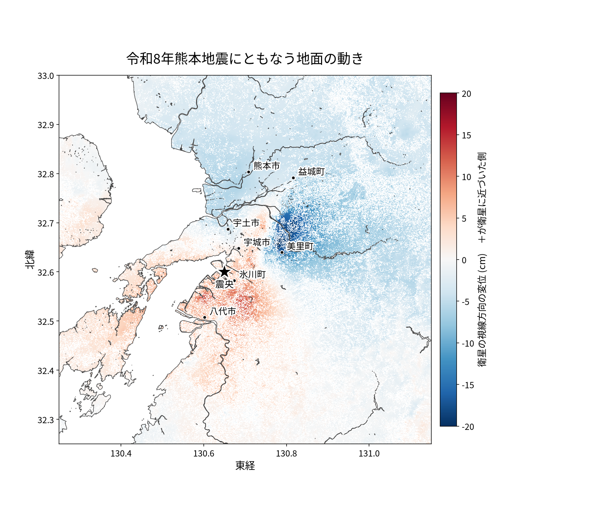
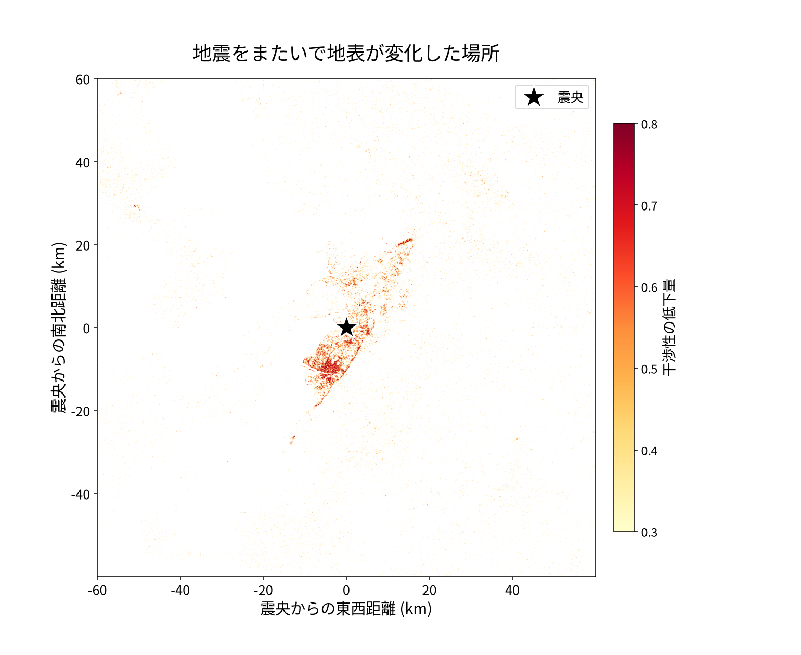

# 2026 Kumamoto earthquake: co-seismic deformation and a coherence-change damage proxy

> ⚠️ **Research record, not a forecast.** This document is part of a personal research log. It is not an earthquake prediction, forecast, warning, advisory, or operational product of any kind, and it issues no alerts. The figures in it are exploratory retrospective metrics computed on public data and have not been validated for operational use. Do not rely on it for safety, evacuation, business, or any other disaster-response decision. For official information in Japan, use the Japan Meteorological Agency (https://www.jma.go.jp/en/) and your local government. Provided as-is, without warranty of any kind; the author accepts no liability for any loss or damage arising from its use.
>
> ⚠️ **免責事項: 本文書は研究記録であり、予報ではありません**
>
> 地震の予知・予測・予報・警報その他の運用情報ではなく、いかなる警報も発信しません。記載の数値は公開データを用いた探索段階の事後的な研究指標であり、実運用に向けた検証は行っていません。安全確保・避難・事業判断その他の防災上の判断には使用しないでください。日本の公式情報は気象庁（https://www.jma.go.jp/）および各自治体の発表をご確認ください。現状のまま無保証で提供され、利用により生じたいかなる損害についても作者は責任を負いません。

> **This is an unreviewed personal analysis.** It has not been peer-reviewed and has not been
> confirmed against any official product. Processing or interpretation errors could make the numbers
> and maps here differ from reality.
>
> **For damage assessment or evacuation decisions, use the official releases** from GSI, JMA and the
> municipalities. Do not use this as a basis for those decisions. Where this disagrees with an
> official product, assume the official one is right. Corrections are welcome.

Sentinel-1 InSAR for the M7.1 Kumamoto earthquake of 2026-07-28 16:27 JST (JMA intensity 7 at Uki
City and Hikawa Town). Everything here comes from fully open Copernicus data processed on ASF HyP3;
no restricted product is used, so the outputs can be redistributed.

Two results, produced independently, agree on the same NE–SW structure:

1. **Line-of-sight displacement** spans **-21.7 cm to +15.0 cm**, with the sign reversing across the
   epicentre — negative (away from the satellite) to the NE, positive (toward it) to the SW.
2. **Coherence loss** concentrates in a **~45 km long, ~10 km wide NE–SW band** through the
   epicentre, and is flat everywhere else.

That axis matches the strike of the Futagawa–Hinagu fault zone.

## Data

Descending path 163 was the only track with a post-event acquisition at processing time; both
ascending tracks (156, 54) had none. All three scenes are Sentinel-1D IW SLC on a 12-day repeat,
so the co-seismic and reference pairs share an identical geometry.

| Role | Granule | Acquired (UTC) |
|---|---|---|
| Reference pair, first | `S1D_IW_SLC__1SDV_20260704T211627_20260704T211654_003529_00641D_023B` | 2026-07-04 21:16 |
| Shared | `S1D_IW_SLC__1SDV_20260716T211628_20260716T211655_003704_006A0F_6D30` | 2026-07-16 21:16 |
| Co-seismic, second | `S1D_IW_SLC__1SDV_20260728T211629_20260728T211656_003879_00700D_0231` | 2026-07-28 21:16 |

The post-event scene was acquired **about 14 hours after the earthquake**.

## Method

Two `INSAR_GAMMA` jobs on ASF HyP3, `looks=10x2` (40 m posting), water mask applied. The reference
pair (07-04 -> 07-16) and the co-seismic pair (07-16 -> 07-28) use **identical processing**, because
the damage proxy is a difference of their coherences and any parameter change would contaminate it.

Damage proxy: `dcoh = coherence(reference pair) - coherence(co-seismic pair)`, evaluated only where
the reference coherence is at least 0.3. The reference pair is what makes this interpretable — it
removes surfaces that are always decorrelated (vegetation, water) rather than newly disturbed.

## Results

### Displacement

| Quantity | Value |
|---|---|
| LOS range | -21.7 cm .. +15.0 cm |
| Area with abs(LOS) > 5 cm | 1,789 km2 |
| Area with abs(LOS) > 10 cm | 90 km2 |
| Peak away-from-satellite | -21.7 cm at 32.6665N, 130.7796E |
| Peak toward-satellite | +15.0 cm at 32.5495N, 130.6018E |
| Scene std (incl. atmosphere) | 2.7 cm |

The 15–22 cm peaks sit well above the 2.7 cm scene-wide spread, so they are not atmospheric noise.

### Coherence change, stratified by distance from the epicentre

A scene-wide statistic hides this signal completely: the **median dcoh over the whole scene is
-0.024**, i.e. coherence did not drop on average. The far field dominates by area. Stratifying is
what exposes the signal, and the far field then serves as the measured noise floor.

| Distance | mean dcoh | median | fraction > 0.3 |
|---|---|---|---|
| 0–10 km | +0.259 | +0.242 | **40.3 %** |
| 10–20 km | +0.146 | +0.121 | 22.0 % |
| 20–30 km | +0.042 | +0.021 | 7.6 % |
| 30–50 km | -0.007 | -0.016 | 4.7 % |
| 50–80 km | -0.014 | -0.017 | 4.4 % |
| 80–120 km | -0.044 | -0.047 | 3.2 % |
| 120–200 km | -0.060 | -0.056 | 2.6 % |

Noise floor (>30 km): 2.6–4.7 % of pixels exceed 0.3. Within 10 km: 40.3 %, about ten times that.

Both figures are drawn in geographic coordinates with the coastline taken from the HyP3 water mask.
Municipality markers use office coordinates from the GSI address-search API
(`msearch.gsi.go.jp/address-search/AddressSearch`).

The sign reverses across the epicentre: away from the satellite to the NE (Misato, Mashiki), toward
it to the SW (Hikawa, Yatsushiro).

Aggregated to 1 km cells, each showing the percentage of usable pixels whose coherence dropped by
more than 0.3; cells with fewer than 80 usable pixels are left blank. Per-pixel values are too
sparse to read as a map, and the cell percentage is directly comparable to the 3–5 % noise floor
measured in the far field. Of 5,561 cells with enough data, 289 exceed 30 % and 146 exceed 50 %.
The affected cells trace Mashiki -> Uto -> Uki -> Hikawa -> Yatsushiro, with the densest values over
built-up Yatsushiro.

## What this is not

- **Coherence loss is not a building-collapse map.** Close to a rupture, coherence is also destroyed
  by displacement gradients too steep for the phase to be tracked. Physical surface disruption and
  steep deformation are not separable from this product alone.
- **Coverage is partial.** Requiring reference coherence >= 0.3 leaves **19.6 %** of the grid.
  Summer vegetation in Kyushu decorrelates broadly, so the usable pixels skew toward built-up and
  bare surfaces.
- **One look direction.** Descending only, so vertical and east–west motion cannot be separated.
  Adding an ascending post-event pair (path 156 or 54) would allow that decomposition.
- The epicentre used for stratification is a rounded 32.60N, 130.65E, not a relocated hypocentre.

### How the numbers could be wrong

- **Phase unwrapping errors shift displacement by whole wavelengths.** The 21.7 cm figure rests on
  the unwrapped phase; a single unwrapping mistake changes it. No independent check was run.
- **No atmospheric correction.** Differing water-vapour distributions between the two acquisitions
  produce centimetres of apparent displacement. The 2.7 cm scene-wide spread includes this.
- **No ground-truth comparison.** GNSS or levelling data would validate the amplitudes; none was used.
- **Processing parameters are close to the defaults.** Changing the phase filter or the looks changes
  the absolute coherence values, so the stratification table is specific to this configuration
  rather than a universal constant.

## Reproduce

Point `INSAR_DIR` at the directory holding the two unzipped HyP3 products (default `insar`).

`submit_hyp3.sh` submits the two jobs; `proxy.py` builds the damage proxy and prints the summary
statistics; `strat.py` produces the distance table; `figs.py` renders the figures. The HyP3 product
download URLs expire roughly two weeks after processing, so the jobs may need resubmitting.

The 40 m damage-proxy GeoTIFF (EPSG:32652, deflate, tiled) is attached to the release rather than
committed, to keep the repository light.

## Attribution

- Contains modified Copernicus Sentinel data 2026, processed by ESA.
- Processed with ASF HyP3, a service of the Alaska Satellite Facility, part of NASA's Earth
  Observing System Data and Information System (EOSDIS).
- Earthquake parameters: Japan Meteorological Agency.
