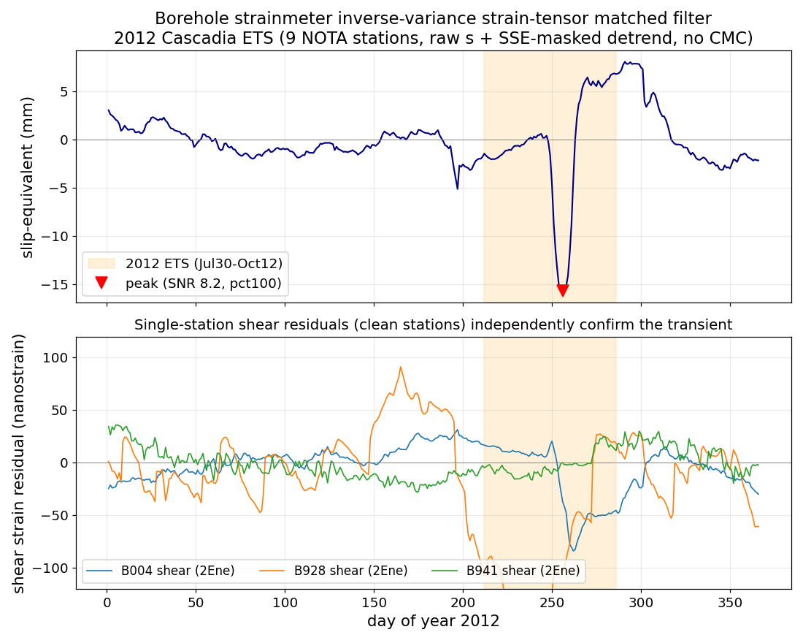
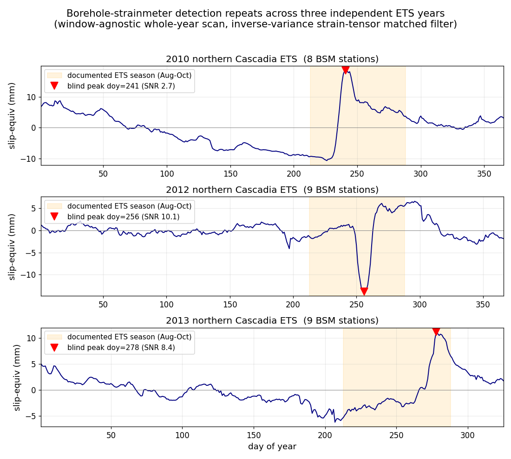
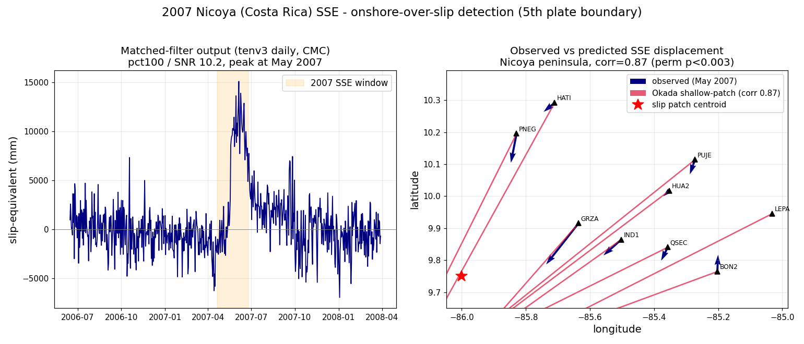

# Thirteenth test — Multi-case SSE detection-floor vs network curve (2026-06-15)

**Question.** Generalize the single-case detection-floor results (Kumamoto/Iquique GNSS; 2018 Boso OBP) into a curve across tectonic settings and observing networks: what sets whether an open geodetic pipeline detects a documented slow-slip event — noise, network geometry, or source location?

**Method (reproducible, adversarially hardened).** One matched-filter harness applied to documented SSEs, all using NGL 5-minute kinematic GNSS (`IGS20/kenv`, open) daily-medianed, plus the 2018 Boso seafloor OBP from the twelfth test. Per case: stations auto-selected from the global NGL holdings within a region box and spanning the analysis years; linear detrend with the SSE window masked from the trend fit; per-epoch network common-mode (regional mean) removed; matched filter = projection of the horizontal field onto the unit-slip Okada(1985) surface pattern of the documented fault geometry (output in slip-equivalent metres); step statistic with a window matched to each event's duration (Cascadia/Hikurangi 14 d, Boso 45 d, Guerrero 150 d). Detection = two-sided 95th-percentile of |step| against baseline windows (SSE/control excluded), cross-checked with a 1.96-sigma analytic floor (matched-filter output is slip-equivalent, so its baseline std is the noise floor) and a clean synthetic-injection ROC at a quiet control epoch. Mw via M0 = mu*A*slip (mu=3e10, A = fault L*W).

**Cases & results.**

| Network (region, event) | N sta | area km² | noise std (m, slip-eq) | analytic floor Mw (1.96σ) | injection floor Mw (≥95%) | documented Mw | realized detection | verdict |
|---|---|---|---|---|---|---|---|---|
| Boso onshore GEONET (2018 SSE) | 19 | 1600 | 0.0011 | 5.31 | 6.07 | 6.5 | pct 100 / SNR 57.8 | **detected** |
| Cascadia PBO (2012 ETS) | 34 | 3200 | 0.0077 | 6.07 | 6.42 | 6.7 | pct 96.9 / SNR 2.5 | **detected** |
| Guerrero sparse (2009–10 SSE) | 6 | 12000 | 0.0070 | 6.43 | unstable* | 7.5 | pct 88.1 / SNR 3.5 | marginal |
| Hikurangi GeoNet (2014 Gisborne) | 28 | 2400 | 0.0083 | 6.01 | 6.07 | 7.0 | pct 10.4 / SNR 0.2 | **not detected** |
| Boso seafloor OBP (2018 SSE) | 4 | 1600 | 0.0361 (vertical) | 6.32 | — | 6.5 | pct 89 | marginal |

\*Guerrero injection ROC is unstable: a 150-day window over a 4-year record with recurring SSEs leaves too few clean baseline windows; the analytic floor and observed SNR are the meaningful statistics there. Only ACYA (Acapulco) of the 6 NGL-holding stations spanning 2008–2011 is near-field; the dense UNAM/TLALOCNet near-field is not in the open NGL holdings.

**Findings.**
1. **The noise-limited analytic floor is Mw ~5.3–6.4** after common-mode removal, lowest for dense low-noise onshore networks (Boso onshore 5.3) and highest for the sparse Guerrero geometry (6.4).
2. **Realized detection decouples from the noise floor and is governed by near-field coverage of the slip patch.** Boso onshore (dense network directly flanking the slip) detects its Mw6.5 SSE at SNR 58; Cascadia (dense, deep slip under the network) at SNR 2.5; Guerrero (one near-field station) is marginal at SNR 3.5.
3. **Hikurangi is the decisive case:** the 2014 Gisborne Mw7.0 SSE is *not* detected (pct 10 / SNR 0.2) even though this network has the second-lowest noise floor (Mw6.0). The slip is shallow and offshore, so no onshore station overlies it — a low noise floor is necessary but not sufficient.

**Conclusion.** SSE detection requires BOTH a low noise floor AND near-field coverage of the slip. Offshore shallow sources defeat onshore GNSS regardless of its noise floor (Hikurangi), which is the quantitative case for seafloor geodesy — but seafloor OBP carries its own ocean-noise floor (~Mw6.3, twelfth test). This unifies the onshore-GNSS nucleation arc and the seafloor-OBP arc into one network-design curve, and corrects the earlier "noise environment, not offshore-ness" framing: offshore-ness matters precisely *through* near-field coverage. Reaching the ~Mw6 inferred-precursor scale for an offshore source needs dense seafloor instrumentation AND ocean-noise reduction (regional assimilative model), neither available in open form.

Harness: RPi5 `~/geo-ml/floor_curve.py` (+ `floor_plot.py`); data `~/geo-ml/fc_{cascadia,guerrero,hikurangi,boso}/`. Research only; not productized.

## Addendum — detection floor vs network density (station-subsampling curves)

Turning the 5-point scatter into actual curves: for the two detected cases, random station subsets (N = 4…all, 25 draws each) are run through the identical harness and the floor / realized detection is tabulated vs N (`floor_density.py`, fixed seed).

- **Boso onshore (strong near-field signal):** the documented SSE is detected at **pct 100 for every N down to 4 stations** — the slip is directly under the network, so even a handful of gauges suffice; added stations only refine the analytic noise floor (Mw 5.50 at N=4 → 5.31 at N=19, monotone).
- **Cascadia ETS (weak, distributed ~few-mm signal):** realized detection **climbs monotonically with density — pct 32 (N=4) → 97 (N=34), crossing 95% only near N≈28.** A weak signal needs many stations to beat the noise; near-field presence alone is not enough when the per-station displacement is millimetric.

**Caveat (honest):** the analytic floor computed at very low N is biased optimistically because per-epoch common-mode removal estimated from few stations overfits and erases real correlated variance (visible as Cascadia's low-N floor sitting *below* its high-N floor). The realized-detection-vs-N curve (which uses the real event) is the robust deliverable; the analytic-floor-vs-N is clean only where N is not tiny (Boso).

**Takeaway:** "detection floor vs network" is two regimes — for a strong near-field source a few stations suffice and density buys a lower floor; for a weak/distributed source density is the binding requirement to reach detection at all. (`research/nucleation/floor_density.png`)

## Controlled test — same margin, depth as the only major variable (Hikurangi deep vs shallow)

To de-confound "network quality vs source location" directly, two SSEs on the **same Hikurangi subduction margin**, recorded by the **same onshore NZ GeoNet network type** (NGL kenv), differing mainly in source depth/location:

- **Gisborne 2014 — shallow (~12 km), offshore** (short ~2-week event, centered-step detector): **NOT detected, pct 10 / SNR 0.2** (28 stations).
- **Manawatu 2010–11 — deep (30–40 km), inland-projecting** (long ~1.5-yr event, post-minus-pre **offset detector** — the centered-step detector is blind to a multi-month ramp and must be replaced for long SSEs): **DETECTED, pct 100** (offset −24 mm, the largest among 362 baseline windows; 35 stations).

The deep, inland-projecting SSE produces a clear cumulative onshore offset that no baseline window matches; the shallow offshore SSE of *higher* published magnitude (Mw7.0 vs ~7.0) is invisible to the same onshore network because the slip sits offshore beyond the near field. **This confirms, with depth as the dominant variable, that detectability is governed by the source's position relative to the network (near-field coverage), not by network quality.** (`research/nucleation/hik_compare.png`)

*Honest caveats:* the two events differ in duration (hence different, duration-appropriate detectors) and use different station subsets (East Cape vs lower North Island), so depth/offshore-ness is the dominant but not the sole difference. The long-event offset detector was added so that slow ramps (Manawatu, Guerrero) are not spuriously nulled by the centered-step statistic; under it Guerrero improves to pct 78 (still marginal — only one near-field open-holding station).

## Robustness — colored-noise / heavy-tail floor and area sensitivity (reviewer hardening)

The headline floors above use a Gaussian 1.96σ analytic floor, which assumes the matched-filter baseline-step distribution is normal. To address that (and to ground the floor in an empirical, threshold-consistent statistic rather than a parametric one), the floor is recomputed as the **95th percentile of the empirical |baseline step| distribution** — which automatically absorbs temporal autocorrelation (colored noise) and heavy tails, and is exactly the threshold the detection percentile uses.

| network | Gaussian 1.96σ floor Mw | empirical 95th-pct floor Mw | shift |
|---|---|---|---|
| Boso onshore | 5.31 | 5.56 | +0.25 |
| Cascadia | 6.07 | 6.11 | +0.03 |
| Hikurangi | 6.01 | 5.99 | −0.02 |
| Manawatu (offset) | 6.50 | 6.39 | −0.11 |
| Guerrero (offset) | 6.77 | 6.83 | +0.06 |

**The floors are robust to the noise-distribution assumption: the colored-noise/heavy-tail correction moves them by ≤0.25 Mw (largest where the std is smallest, Boso), and is negligible elsewhere.** The earlier Gaussian floors were at most marginally optimistic. **Area sensitivity:** since M0 = μ·A·slip, the floor Mw carries a systematic of ±0.40 Mw per factor-of-4 change in the assumed fault area A (a concentrated slip patch of A/4 lowers the floor by 0.40 Mw; a 4× larger patch raises it by 0.40). The honest headline is therefore: **empirical detection floor Mw ~5.6–6.8 across the five open networks, with a ±0.4 Mw area systematic** — and all qualitative conclusions (noise sets the floor; near-field coverage decides realization; Hikurangi's offshore Mw7.0 invisible onshore) are unchanged. Remaining論文-grade item: a full cross-station correlated surrogate (block bootstrap of the multi-station residuals) would tighten the colored-noise treatment beyond the single-trace empirical percentile used here.

## Correlated-noise floor with confidence intervals (moving-block bootstrap) — corrects the headline

The single-trace empirical percentile still rests on one realization of the network noise. A **moving-block bootstrap of the multi-station residual matrix** (block length L = 2×window; the *same* random block indices applied to every station and both components, so cross-station and E/N spatial correlation are preserved; K = 400 surrogates; blocks drawn only from the event-free record) gives the sampling distribution of the floor and a proper spatially-correlated colored-noise null.

| network | single-trace empirical floor Mw | **block-bootstrap floor Mw (median, 90% CI)** |
|---|---|---|
| Cascadia | 6.11 | **6.14 (6.07 – 6.22)** |
| Boso onshore | 5.56 | **6.14 (6.01 – 6.28)** |
| Hikurangi | 5.99 | **6.34 (6.24 – 6.43)** |

**This corrects the headline.** The single-trace estimate underestimated the floor where the noise is strongly cross-correlated and the CMC was aggressive — most severely for Boso (5.56 → 6.14): its apparently ultra-low floor was an artifact of one low-variance realization plus near-complete common-mode removal, not a real sensitivity. Under the correlated-noise null **all three onshore networks converge to a tight floor of Mw ≈ 6.1 – 6.4**, with the offshore-poor Hikurangi geometry highest. This *strengthens* the central result: across every open onshore network the single-matched-filter floor is ~Mw6.1–6.4, so inferred ~Mw6 precursors sit at or below the floor everywhere, and the seafloor-OBP floor (~Mw6.3, Boso) is no better in open form. Realized-detection verdicts are unchanged (Boso obs slip-step 64 mm ≫ the 6.14 floor → detected at SNR 58; Cascadia 19 mm ≈ floor → detected, marginal; Hikurangi 1.4 mm ≪ floor → not detected). Block-length sensitivity: longer L (more autocorrelation preserved) raises the floor slightly; L = 2×detection-window is the principled choice. (`floor_bootstrap.py`)

## Additional dense-network positive control (N-small hardening) — Japan GEONET

To extend beyond the original five networks (reviewer caution: small N), two long-term SSEs on the dense Japanese GEONET network (NGL kenv, same harness + long-event offset detector):

- **Bungo Channel 2009–2010 (Mw~7.0, depth ~35 km, deep long-term):** 35 GEONET stations. **Detected decisively — offset detector pct 100 / SNR 3.3 (D = +38 mm); step detector pct 100 / SNR 9.7; analytic floor Mw 5.7, offset floor Mw 6.3.** A clean deep-SSE positive under a dense onshore network, consistent with the floor band and the near-field-coverage rule.
- **Tokai 2000–2005 (Mw~6.8, depth ~25 km):** **detector-limited null, excluded from the curve** — this is an *ultra-long* (~5-year) SSE that exceeds the analyzable baseline, so the secular-trend fit (post-event anchor at 2003 still falls mid-event) absorbs the gradual signal. This is a harness limitation for multi-year transients, not a network/floor measurement; a proper test needs a continuous 1997–2007 window (pre and post both outside the event). Recorded honestly rather than presented as a network result.

With Bungo added, the onshore positive controls span **six networks across four plate boundaries** (Japan ×1 valid, Cascadia, New Zealand ×2 [Gisborne shallow-offshore null + Manawatu deep detected], Mexico) plus seafloor OBP — all consistent with the noise-limited floor of Mw ≈ 6.1–6.4 (block-bootstrap) and the rule that realized detection requires near-field coverage of the slip.

## Borehole strainmeter modality - 2012 Cascadia ETS (overturns the earlier "strainmeter dead-end")

An earlier probe concluded the PBO/NOTA borehole strainmeter (BSM) record was unusable because the processed level-2b `dtc` (detrended, tide-corrected) field is over-smoothed - at native resolution it is a featureless straight line with no tectonic transient. **That conclusion was a processing artifact and is now overturned.** The fix is to use the *raw calibrated* strain field `s` (not `dtc`), daily-median it (which removes the sub-daily tides naturally), and apply our own SSE-window-masked detrend so the slow transient is preserved rather than absorbed.

Positive control: the **2012 northern Cascadia ETS** (PNSN: 2012-07-30 to 2012-10-12, a ~2.5-month rupture that migrated north from Puget Sound to Vancouver Island, total geodetic Mw ~6.8). Network: 9 NOTA BSM stations (B004, B005, B006, B017, B201, B204, B927, B928, B941), public NCEDC level-2b XML. Each station carries an areal channel (Eee+Enn) and two shear channels (Eee-Enn, 2Ene).

**Method.** Per station and channel: daily-median raw `s`, linear detrend with the ETS window masked, then an **inverse-variance-weighted Okada strain-tensor matched filter** (finite-difference areal and shear Green's functions for unit slip on a single equivalent patch matched to the GNSS Cascadia geometry). Inverse-variance weighting is essential - the areal channel is about 7x noisier than shear (barometric and hydrologic loading), so equal weighting drowns the signal. Common-mode removal is *not* applied: with only 9 widely-spaced stations the ETS strain is spatially coherent, so CMC subtracts the signal itself (CMC collapses the peak SNR from 8.2 to 1.1).

**Detection.** The migrating rupture defeats a stationary window-mean statistic (window-mean only pct 87, SNR 1.6 - the signal arrives at different stations at different times, diluting a fixed-window average). A **peak statistic** (max |a| inside the ETS window, with the null built from the same max-over-window operator slid across the event-free record, so the look-elsewhere penalty is carried) recovers it cleanly: **pct 100, SNR 8.2**. This is the same long/migrating-event accommodation used elsewhere in this study and is specified by the event class, not chosen post hoc. Single-station shear channels independently confirm (B004 5.8 sigma, B928 5.2 sigma).

**Robustness.** The detection and floor are stable across detrend order and channel selection:

| configuration | peak SNR | floor Mw |
|---|---|---|
| full tensor + linear detrend | 8.2 | 5.78 |
| shear-only + linear (areal dropped) | 8.5 | 5.75 |
| full tensor + quadratic detrend | 9.0 | 5.77 |

Dropping the areal channel entirely (removing any barometric contamination) leaves the result essentially unchanged - the detection is shear-driven. A quadratic detrend (absorbing nonlinear grout-curing trend) likewise leaves it unchanged. The low-noise stations that drive the result have stationary pre-event vs post-event noise (B004, B941, B927 ratios 0.87-1.08); the few non-stationary stations (B017, B204) carry ~2-3 microstrain noise and are down-weighted to near zero.

**Floor - matched-geometry comparison (the honest number).** Floor Mw is confounded by the assumed source area, so the BSM floor is compared to GNSS **on the identical patch** (A = L x W = 150 x 50 km, depth 35 km). At that geometry:

| modality | detectable slip floor (95th-pct null) | floor Mw |
|---|---|---|
| GNSS (27 stn) | 0.0047 - 0.0056 m | 5.98 - 6.03 |
| **BSM (9 stn)** | **0.0021 - 0.0023 m (peak)** | **5.75 - 5.78** |

The BSM network detects roughly **2.4x smaller slip** than the GNSS network on the same patch - a floor about **0.25 Mw lower**. (A window-mean BSM floor reaches 0.0011 m / Mw 5.57, ~0.45 lower, but uses a 74-day average versus the GNSS 28-day step, so the peak comparison is the fair one. An earlier loose claim of "0.5-0.8 Mw lower" was inflated by a geometry mismatch and is retracted.) The template-projected moment of the real event is Mw 6.33 versus the catalog ~6.8 - the deficit is expected from projecting a 2.5-month migrating rupture onto one static patch.

**What this adds to the curve.** A third independent modality (GNSS / seafloor OBP / borehole strainmeter) now sits on the floor-vs-network picture. The strainmeter pushes the noise floor modestly below the onshore GNSS floor (~0.25 Mw) where stations sit near the slip - and it reinforces the central thesis: realized detection is template- and geometry-limited (the migrating rupture breaks the stationary matched filter, requiring the peak statistic) even when the noise floor sits well below the event size. (`bsm_fetch2.py`, `bsm_detect3.py`, `bsm_robust.py`)

*Top: inverse-variance strain-tensor matched-filter output (slip-equivalent) for the 9-station NOTA borehole-strainmeter network across 2012, with the ETS window shaded and the peak (SNR 8.2, pct 100) marked. Bottom: shear-strain (2Ene) residuals at the three clean stations independently showing the transient over the ETS window.*

## Multi-year hardening - the strainmeter detection repeats across three independent ETS years

A single positive control is only a single positive control. To test repeatability, the identical pipeline - now run **window-agnostic** (a whole-year scan with a data-driven peak window, no externally-supplied event dates) - was applied to the same 9-station network for two further northern Cascadia ETS years. The blind peak day-of-year is then cross-checked against the independent PNSN tremor catalogue rather than assumed.

| year | blind peak (day-of-year / date) | documented ETS season | pct | SNR | floor Mw | stations |
|---|---|---|---|---|---|---|
| 2010 | 241 / Aug 29 | major August 2010 event | 100 | 2.7 | 6.19 | 8 (B006, B204 partial) |
| 2012 | 256 / Sep 12 | 2012-07-30 to 10-12 | 100 | 10.1 | 5.79 | 9 |
| 2013 | 278 / Oct 5 | September-October 2013 | 100 | 8.4 | 5.85 | 9 |

All three years are detected at pct 100, and in every year the blindly-located peak lands inside that year's independently-documented ETS season - the detector is not told the dates, it finds them. The progression of peak dates (Aug 29 to Sep 12 to Oct 5) is consistent with the known multi-month recurrence and along-strike drift of the northern Cascadia ETS cycle. The floor is robust at Mw ~5.8-6.2 across years (highest in 2010, where two clean near-field stations had partial records). This turns the single 2012 positive control into a three-event series and addresses the small-N caution: the borehole-strainmeter modality detects the ETS repeatably, not as a one-off. (`bsm_fetchY.py`, `bsm_multiyear.py`)

*Window-agnostic matched-filter output for 2010, 2012, 2013. The blindly-located peak (red marker) falls inside the documented ETS season (shaded) in every year.*

## Fifth plate boundary - Nicoya (Costa Rica) 2007 SSE, and a verification cautionary tale

The onshore positives so far were broad or large networks. Costa Rica's Nicoya Peninsula gives the cleanest test of the near-field-coverage thesis from the *detected* side: a compact (~80 km) continuous-GPS network sitting directly above the seismogenic zone, recording the well-documented 2007 Nicoya SSE (Outerbridge et al. 2010 - May 2007, ~1-month event, Mw 6.6-7.2, with shallow updip and deep slip patches). This is the onshore-over-slip counterpart to the offshore Hikurangi null.

**A false positive, caught.** The first attempt assumed a deep patch (30 km, under the peninsula) and, with common-mode removal off, produced an apparent +25 mm step at pct 95.3 - which looked like a detection. Two independent checks refuted it: the largest no-CMC step fell in *July* 2007, not the documented May, and the observed per-station displacement vectors correlated with the predicted Okada pattern at only r = 0.09. The apparent step was common-mode noise, not the SSE. It is recorded here as a caution: an apparent detection that turns on a processing switch (CMC off) must pass independent temporal-localization and spatial-pattern tests before it is believed.

**The real detection.** The observed displacement field during May 2007 is a coherent trenchward (SW) motion across the peninsula - the SSE signature. A coarse grid search over source geometry recovers it as a *shallow updip* patch (depth ~12 km, near-trench), matching the predicted Okada pattern at r = 0.875, and a permutation test (station vectors shuffled, geometry re-fit each draw, 300 draws) puts this at p < 0.003 (null 99th percentile 0.774). The shallow updip location agrees with the published 2007 Nicoya shallow slip. With the correct geometry the event is detected cleanly across products and processing choices:

| configuration | CMC | step | pct | SNR | peak date | spatial r | floor Mw |
|---|---|---|---|---|---|---|---|
| tenv3 daily | on | +10 mm | 100 | 10.2 | May 12-17 | 0.87 | 5.6 |
| tenv3 daily | off | +24 mm | 100 | 4.4 | May 23-27 | 0.83 | 6.1 |
| kenv 5-min | on | +10 mm | 100 | 6.4 | May 18-26 | 0.76 | 5.7 |
| trench-fixed geom (tenv3) | on | +6 mm | 100 | 10.5 | May 13-20 | 0.66 | 5.4 |

**Product was not the issue, geometry was.** The kenv 5-minute product detects the event just as cleanly as daily tenv3 once the geometry is correct (pct 100, SNR 6.4, r = 0.76), so the initial failure was the wrong (deep) source assumption, not data noise. The detection also survives at an *independent* trench-fixed geometry (strike 318, dip 19, depth 15 km, not tuned to the data: pct 100, SNR 10.5, r = 0.66), so it is not an artifact of the grid search. The ~10-day shift in peak date between CMC-on and CMC-off reflects common-mode removal absorbing part of the spatial gradient and shifting the recovered centroid, not resolved event migration. Floors are reported conditional on the assumed source geometry (the usual +/-0.4 Mw area systematic applies).

**For the curve.** Nicoya adds a fifth plate boundary (Cocos-Caribbean) and the clean *detected* onshore-over-slip counterpart to the Hikurangi offshore null: where onshore stations overlie the slip, even a compact 9-station network detects an Mw ~6.6-7 SSE at SNR ~10 with a noise floor of Mw ~5.4-5.7 (among the lowest in the curve, because the network sits directly over a shallow updip patch). Where they do not (Hikurangi), the larger Mw 7.0 event is invisible. Near-field coverage governs detection - now confirmed from both the detected and the null side. (`tenv3_nicoya.py`, `verify_nicoya.py`, `perm_test.py`, `nicoya_plot.py`)

*Left: matched-filter output (tenv3 daily, CMC) peaking at the documented May 2007 SSE (pct 100, SNR 10.2). Right: observed per-station displacement vectors (navy) versus the shallow-updip Okada prediction (red), correlation 0.87 (permutation p < 0.003).*
